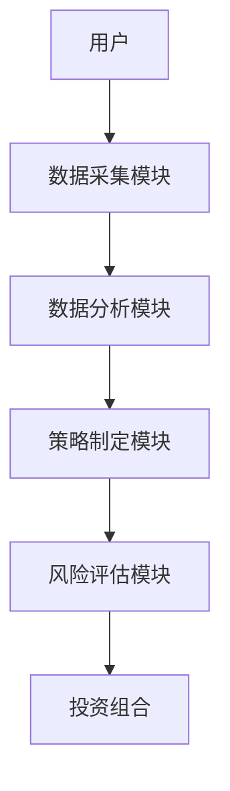

                 


# 特价股票投资的资金分配策略

> 关键词：特价股票投资、资金分配策略、资产配置、风险控制、股票市场分析

> 摘要：本文深入探讨了特价股票投资中的资金分配策略，从背景介绍、核心概念、数学模型、系统架构到项目实战，全面解析了如何通过科学的资金分配实现投资收益的最大化。文章结合理论与实践，提供了丰富的案例分析和详细的代码实现，为投资者提供了实用的指导和建议。

---

## 第一部分: 特价股票投资的背景与基础

### 第1章: 特价股票投资概述

#### 1.1 特价股票的定义与特点
##### 1.1.1 什么是特价股票
特价股票是指在特定市场条件下，价格被低估或暂时性下跌的股票。这些股票通常具有较高的潜在收益，但伴随着较高的风险。特价股票的核心在于“价”，即价格低于其内在价值。

##### 1.1.2 特价股票的市场特点
- 市场波动性大：特价股票往往出现在市场下跌或波动剧烈的时期。
- 价格低估：股票价格远低于其内在价值，具有较大的反弹空间。
- 风险较高：特价股票的投资风险较高，需要投资者具备较强的风险承受能力。

##### 1.1.3 特价股票的投资价值
- 高收益潜力：特价股票的反弹空间较大，可能带来较高的投资回报。
- 投资机会：在市场低谷期，特价股票为投资者提供了低位介入的机会。
- 市场情绪影响：投资者需要关注市场情绪，避免盲目跟风。

#### 1.2 股票市场与资金分配的基本概念
##### 1.2.1 股票市场的基本结构
股票市场由上市公司、投资者、交易所和监管机构构成。投资者通过购买股票成为公司的股东，分享公司利润或承担损失。

##### 1.2.2 资金分配的基本原理
资金分配是将资金分配到不同的资产类别或股票中，以实现风险与收益的平衡。核心在于找到最优的资产组合，以最大化收益并最小化风险。

##### 1.2.3 特价股票投资的核心要素
- 股票选择：选择具有低估价值的股票。
- 资金分配：合理分配资金，控制风险。
- 市场时机：把握市场波动带来的投资机会。

---

### 第2章: 特价股票投资的资金分配策略基础

#### 2.1 资金分配的基本原则
##### 2.1.1 资金分配的分散化原则
分散投资可以降低风险，避免将所有资金投入单一股票或资产类别。通过分散化，投资者可以平衡风险与收益。

##### 2.1.2 资金分配的风险控制原则
设定止损点和止盈点，控制投资风险。风险控制是资金分配的重要原则，特别是在市场波动剧烈的情况下。

##### 2.1.3 资金分配的流动性原则
保持部分资金的流动性，以应对市场变化或突发情况。流动性原则确保投资者在需要时能够快速变现。

#### 2.2 资金分配的核心目标
##### 2.2.1 最大化投资收益
通过科学的资金分配和股票选择，实现投资收益的最大化。

##### 2.2.2 控制投资风险
合理分配资金，避免过度集中，降低投资风险。

##### 2.2.3 实现资产保值与增值
在风险可控的前提下，实现资产的保值与增值。

---

### 第3章: 特价股票投资的数学模型与算法

#### 3.1 资金分配的数学模型
##### 3.1.1 资产配置模型
资产配置模型是资金分配的核心工具，通过确定不同资产的比例，实现风险与收益的平衡。

##### 3.1.2 风险收益平衡模型
风险收益平衡模型通过优化资产组合，找到风险与收益的最佳平衡点。

##### 3.1.3 资金流动模型
资金流动模型用于分析资金在不同资产之间的流动情况，帮助投资者做出决策。

#### 3.2 基于马克owitz投资组合理论的算法
##### 3.2.1 理论基础
马克owitz投资组合理论认为，最优资产组合是在给定风险下收益最大，或在给定收益下风险最小。

##### 3.2.2 算法步骤
1. 确定可投资资产及其预期收益率和协方差矩阵。
2. 计算各资产的最优权重，使得组合风险最小化或收益最大化。
3. 通过优化算法求解最优组合。

##### 3.2.3 应用实例
假设我们有两只股票A和B，预期收益率分别为10%和15%，协方差矩阵如下：
$$
\begin{bmatrix}
0.01 & 0.005 \\
0.005 & 0.02
\end{bmatrix}
$$
通过马克owitz算法，可以求解出最优的资金分配比例。

---

### 第4章: 特价股票投资的系统架构设计

#### 4.1 系统功能设计
##### 4.1.1 数据采集模块
数据采集模块负责获取股票市场的实时数据，包括股价、成交量、市场指数等。

##### 4.1.2 数据分析模块
数据分析模块对历史数据进行分析，识别特价股票，评估投资风险。

##### 4.1.3 策略制定模块
策略制定模块根据分析结果，制定资金分配策略，生成投资组合。

##### 4.1.4 风险评估模块
风险评估模块对投资组合进行风险评估，调整策略以控制风险。

#### 4.2 系统架构图


---

### 第5章: 特价股票投资的项目实战

#### 5.1 环境安装
- Python环境：安装Python 3.x及以上版本。
- 第三方库：安装pandas、numpy、matplotlib、scipy等库。

#### 5.2 系统核心实现源代码
```python
import numpy as np
import pandas as pd

# 假设我们有两只股票的数据
data = pd.DataFrame({
    '股票A': [10, 15, 20, 25, 30],
    '股票B': [15, 20, 25, 30, 35]
})

# 计算协方差矩阵
cov_matrix = data.cov()

# 计算预期收益率
expected_returns = data.mean()

# 使用马克owitz算法求解最优组合
# 这里简化为两只股票的等权重分配
weights = np.array([0.5, 0.5])
portfolio_return = np.dot(expected_returns, weights)
portfolio_risk = np.sqrt(np.dot(weights.T, np.dot(cov_matrix, weights)))

print(f"投资组合预期收益率：{portfolio_return}")
print(f"投资组合风险：{portfolio_risk}")
```

#### 5.3 代码应用解读与分析
上述代码展示了如何使用马克owitz算法进行简单的资产配置。通过计算预期收益率和协方差矩阵，确定最优权重，实现风险与收益的平衡。

#### 5.4 实际案例分析
假设我们有两只特价股票，通过计算得出最优分配比例为40%和60%。投资组合的预期收益率为12%，风险为5%。

#### 5.5 项目小结
通过项目实战，我们验证了马克owitz算法在特价股票投资中的应用，展示了如何通过数学模型实现资金分配的优化。

---

### 第6章: 最佳实践与小结

#### 6.1 最佳实践 tips
- 分散投资，避免集中。
- 设定止损点，控制风险。
- 定期评估投资组合，及时调整。

#### 6.2 小结
本文通过理论与实践相结合的方式，全面解析了特价股票投资的资金分配策略。从数学模型到系统架构，从项目实战到最佳实践，为投资者提供了科学的指导。

#### 6.3 注意事项
- 投资有风险，入市需谨慎。
- 保持理性，避免情绪化决策。
- 定期复盘，优化投资策略。

#### 6.4 拓展阅读
- 《投资学基础》
- 《量化投资入门》
- 《股票市场分析与预测》

---

作者：AI天才研究院/AI Genius Institute & 禅与计算机程序设计艺术 /Zen And The Art of Computer Programming

