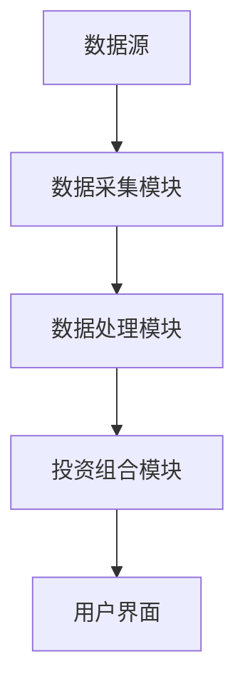

                 


# 特价股票投资策略在数字新兴经济体中的适用性探讨

> 关键词：特价股票，数字新兴经济体，投资策略，数字经济，股票分析

> 摘要：本文探讨了特价股票投资策略在数字新兴经济体中的适用性，从背景、核心概念、算法原理、系统架构、项目实战到最佳实践，详细分析了其在数字经济发展背景下的应用潜力、实施方法及实际案例。

---

# 第一部分: 特价股票投资策略的背景与概念

## 第1章: 特价股票投资策略概述

### 1.1 特价股票的定义与特征

#### 1.1.1 特价股票的定义
特价股票是指价格低于市场平均水平的股票，通常具有较高的性价比。这类股票可能处于低估状态，适合长期投资者。

#### 1.1.2 特价股票的核心特征
- 低市盈率（P/E）：市盈率低于行业平均水平。
- 低市净率（P/B）：市净率低于行业平均水平。
- 高股息率：通常提供较高的股息回报。

#### 1.1.3 特价股票与其他股票类型的区别
| 类型       | 特价股票             | 高增长股票           | 蓝筹股              |
|------------|----------------------|----------------------|---------------------|
| 定义       | 价格低于市场平均水平 | 高增长潜力            | 稳定的大公司        |
| 风险       | 较低                 | 较高                 | 较低                |
| 收益       | 稳定                 | 高                   | 稳定                |

### 1.2 数字新兴经济体的定义与特点

#### 1.2.1 数字新兴经济体的定义
数字新兴经济体是指那些依赖数字技术驱动经济增长的新兴经济体，如印度、东南亚国家等。

#### 1.2.2 数字新兴经济体的核心特征
- 数字经济占比高。
- 科技创新能力强。
- 人口年轻，互联网普及率高。

#### 1.2.3 数字新兴经济体与传统经济体的对比
| 经济类型     | 数字新兴经济体         | 传统经济体           |
|--------------|-----------------------|----------------------|
| 主导产业     | 信息技术、电子商务     | 制造业、农业          |
| 增长动力     | 数字技术创新           | 工业化                |
| 人口结构     | 年轻化                 | 较老龄化             |

## 第2章: 特价股票投资策略在数字新兴经济体中的背景

### 2.1 数字经济发展的现状与趋势

#### 2.1.1 数字经济的全球发展趋势
- 数字经济占GDP比重持续上升。
- 数字技术推动产业升级。

#### 2.1.2 数字新兴经济体的崛起
- 互联网普及推动新兴市场发展。
- 科技创新企业增多。

#### 2.1.3 数字经济对股票市场的深远影响
- 带来更多投资机会。
- 提高市场波动性。

### 2.2 特价股票投资策略的背景分析

#### 2.2.1 特价股票投资策略的起源
价值投资理念的延伸，寻找被市场低估的股票。

#### 2.2.2 数字经济背景下特价股票投资策略的演变
从传统行业转向科技行业。

#### 2.2.3 特价股票投资策略在新兴经济体中的应用潜力
新兴市场中科技股可能被低估，提供投资机会。

---

# 第二部分: 特价股票投资策略的核心概念与原理

## 第3章: 特价股票投资策略的核心概念

### 3.1 特价股票投资策略的原理

#### 3.1.1 投资策略的基本原理
寻找被低估的股票，长期持有，等待价值回归。

#### 3.1.2 特价股票投资策略的独特性
注重估值指标，如市盈率、市净率。

#### 3.1.3 数字新兴经济体中特价股票投资策略的适用性
新兴市场中科技股可能被低估，适合价值投资。

### 3.2 特价股票与数字新兴经济体的关联

#### 3.2.1 特价股票在数字新兴经济体中的表现
科技股可能被低估，提供投资机会。

#### 3.2.2 数字新兴经济体对特价股票投资策略的影响
科技股波动大，但潜力高。

#### 3.2.3 特价股票投资策略在数字新兴经济体中的潜在风险
市场波动大，政策风险高。

---

## 第4章: 特价股票投资策略的核心要素

### 4.1 特价股票选择的标准

#### 4.1.1 市盈率（P/E）分析
公式：P/E = 市场价 / 每股收益

#### 4.1.2 市净率（P/B）分析
公式：P/B = 市场价 / 每股净资产

#### 4.1.3 股息率分析
公式：股息率 = 每股股息 / 市场价

### 4.2 数字新兴经济体中特价股票的筛选

#### 4.2.1 选择具有成长潜力的公司
关注科技行业。

#### 4.2.2 关注低估值指标
市盈率、市净率低于行业平均。

#### 4.2.3 风险控制
分散投资，避免过度集中。

---

# 第三部分: 特价股票投资策略的算法与系统设计

## 第5章: 特价股票投资策略的算法原理

### 5.1 算法流程

1. 数据采集：获取目标市场的股票数据。
2. 计算估值指标：P/E、P/B、股息率。
3. 筛选低估值股票。
4. 生成投资组合。
5. 风险评估。

### 5.2 算法实现

```python
def calculate_pe(stock_price, earnings_per_share):
    return stock_price / earnings_per_share

def calculate_pb(stock_price, book_value_per_share):
    return stock_price / book_value_per_share

def select_cheap_stocks(stocks):
    cheap_stocks = []
    for stock in stocks:
        pe = calculate_pe(stock.price, stock.earnings)
        pb = calculate_pb(stock.price, stock.book_value)
        if pe < 15 and pb < 2:
            cheap_stocks.append(stock)
    return cheap_stocks
```

### 5.3 数学模型

- 估值模型：使用P/E和P/B双重筛选。
- 风险模型：考虑市场波动和行业风险。

---

## 第6章: 特价股票投资策略的系统架构

### 6.1 系统功能设计

#### 6.1.1 数据采集模块
从多个数据源获取股票信息。

#### 6.1.2 数据处理模块
计算估值指标，筛选低估值股票。

#### 6.1.3 投资组合模块
生成投资组合，提供风险评估。

### 6.2 系统架构设计



### 6.3 接口设计

- 数据接口：API获取实时数据。
- 用户界面：可视化筛选结果。

---

# 第四部分: 特价股票投资策略的项目实战

## 第7章: 项目实战

### 7.1 实战环境

#### 7.1.1 环境安装
安装Python和必要的库（pandas、numpy）。

### 7.2 核心代码实现

```python
import pandas as pd

def main():
    # 获取数据
    data = pd.read_csv('stock_data.csv')
    # 计算P/E和P/B
    data['PE'] = data['Price'] / data['Earnings']
    data['PB'] = data['Price'] / data['Book Value']
    # 筛选低估值股票
    cheap_stocks = data[(data['PE'] < 15) & (data['PB'] < 2)]
    print(cheap_stocks)

if __name__ == "__main__":
    main()
```

### 7.3 实战分析

#### 7.3.1 案例分析
分析印度科技股，筛选出符合条件的股票。

#### 7.3.2 结果解读
输出筛选结果，生成投资组合报告。

---

## 第8章: 总结与展望

### 8.1 总结

- 特价股票投资策略在数字新兴经济体中有较大潜力。
- 数字经济背景下，科技股的投资机会增加。

### 8.2 展望

- 结合人工智能优化筛选模型。
- 进一步研究新兴市场中的投资策略。

---

# 作者信息

作者：AI天才研究院/AI Genius Institute & 禅与计算机程序设计艺术 /Zen And The Art of Computer Programming

