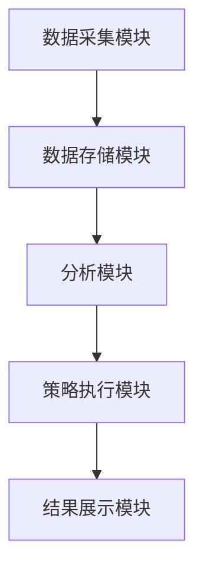
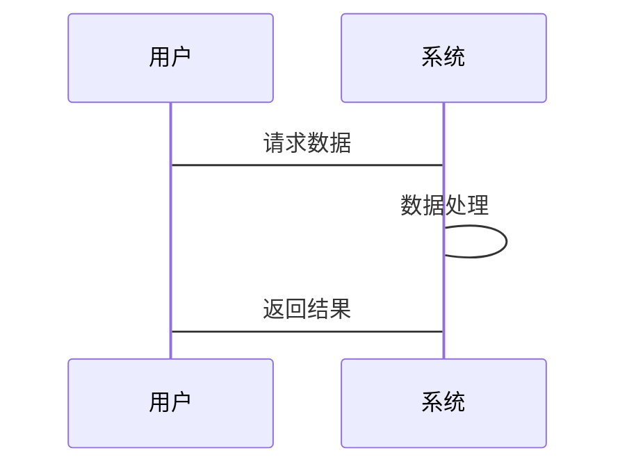

                 


# 特价股票投资策略在熊市中的防御性

> 关键词：特价股票、熊市防御、投资策略、风险管理、量化分析

> 摘要：本文详细探讨了在熊市中利用特价股票进行防御性投资的策略。通过分析特价股票的特点、熊市的市场环境，以及结合量化分析和机器学习算法，提出了有效的投资策略，并通过实际案例验证了策略的有效性。文章内容涵盖背景介绍、策略分析、技术方法、系统架构、项目实战及总结，为投资者提供了全面的指导。

---

# 第一部分: 特价股票投资策略背景与基础

## 第1章: 特价股票与熊市防御概述

### 1.1 特价股票的定义与特点

#### 1.1.1 特价股票的定义
特价股票指的是价格相对较低、具有较大上涨潜力的股票。通常，这些股票可能来自业绩稳定的公司，或者处于周期性底部行业的公司。

#### 1.1.2 特价股票的核心特点
- **低估值**：市盈率（P/E）和市净率（P/B）低于行业平均水平。
- **高股息率**：提供稳定的股息收入，吸引价值投资者。
- **低波动性**：价格波动较小，风险较低。

#### 1.1.3 特价股票与普通股票的对比
| 特性 | 特价股票 | 普通股票 |
|------|----------|----------|
| 价格 | 较低     | 价格波动较大 |
| 估值 | 低       | 可高可低   |
| 风险 | 较低     | 较高      |
| 收益 | 稳定     | 波动较大   |

### 1.2 熊市的特征与投资策略

#### 1.2.1 熊市的定义与表现
熊市是指市场整体表现低迷，股票价格持续下跌的时期。投资者通常面临以下挑战：
- 资产缩水
- 投资情绪低落
- 市场流动性下降

#### 1.2.2 熊市中投资的风险与机会
- **风险**：资产价值下降，难以获得正收益。
- **机会**：低价买入优质股票，等待市场复苏。

#### 1.2.3 熊市中防御性投资的重要性
防御性投资通过选择低风险、高分红的股票，降低整体投资组合的波动性，确保资本安全。

### 1.3 特价股票在熊市中的防御作用

- **缓冲市场波动**：特价股票的价格波动较小，有助于稳定投资组合。
- **提供安全边际**：低估值股票在市场复苏时有更大的上涨空间。
- **稳定现金流**：高股息率股票提供稳定的收入来源。

---

## 第2章: 特价股票投资策略的基本原理

### 2.1 策略背景与问题描述

#### 2.1.1 熊市中投资者的常见问题
- 资产贬值速度快。
- 投资情绪受挫，难以坚持长期策略。

#### 2.1.2 特价股票在熊市中的防御作用
通过选择低估值、高分红的股票，投资者可以在熊市中降低风险，稳定收益。

#### 2.1.3 策略的目标与边界
- **目标**：在熊市中实现资本保值，同时获取稳定收益。
- **边界**：避免投资高风险股票，专注于防御性股票。

### 2.2 核心概念与联系

#### 2.2.1 特价股票与熊市防御的关系
- 特价股票是熊市中防御性投资的主要工具。
- 通过低估值和高分红，特价股票为投资者提供缓冲市场波动的机会。

#### 2.2.2 策略的核心要素与组成
- **估值指标**：市盈率（P/E）、市净率（P/B）。
- **股息率**：股息收益率。
- **行业选择**：选择受熊市影响较小的行业。

#### 2.2.3 特价股票投资的ER实体关系图（Mermaid）

```mermaid
entity 特价股票 {
  id: 唯一标识符
  名称: 股票名称
  价格: 当前价格
  估值指标: 市盈率、市净率
  相关风险: 风险评估
}
```

---

## 第3章: 特价股票投资策略的算法原理

### 3.1 策略算法概述

#### 3.1.1 策略的基本流程
1. 数据收集：获取股票的历史价格、估值指标、股息率等数据。
2. 数据筛选：根据筛选条件（如P/E < 行业平均，股息率 > 行业平均）选出符合条件的股票。
3. 策略执行：按筛选结果构建投资组合。
4. 风险评估：计算投资组合的风险系数。
5. 结果分析：评估策略的有效性。

#### 3.1.2 算法的核心逻辑
- **数据预处理**：清洗数据，处理缺失值。
- **筛选条件**：P/E < 行业平均，股息率 > 行业平均。
- **投资组合构建**：根据筛选结果分配资金。

### 3.2 算法实现细节

#### 3.2.1 数据预处理
- 使用Python的Pandas库清洗数据。
- 处理缺失值，标准化数据。

#### 3.2.2 策略执行逻辑
```python
def select_special_stocks(data, industry_avg_pe, industry_avg_div):
    return data[(data['pe'] < industry_avg_pe) & (data['div'] > industry_avg_div)]
```

#### 3.2.3 结果计算与评估
- 计算投资组合的收益率。
- 评估最大回撤和波动率。

### 3.3 算法的数学模型与公式

#### 3.3.1 策略的核心公式
$$ \text{投资收益} = \sum (\text{卖出价} - \text{买入价}) \times \text{数量} $$

#### 3.3.2 风险评估公式
$$ \text{风险系数} = \frac{\text{波动率}}{\text{平均收益}} $$

---

## 第4章: 系统架构与技术实现

### 4.1 系统架构设计

#### 4.1.1 系统功能设计
- 数据采集模块：获取股票数据。
- 分析模块：筛选特价股票。
- 策略执行模块：构建投资组合。

#### 4.1.2 系统架构图（Mermaid）



### 4.2 系统接口设计

#### 4.2.1 接口描述
- 数据接口：获取实时数据。
- 筛选接口：根据条件筛选股票。

#### 4.2.2 接口交互图（Mermaid）



---

## 第5章: 项目实战

### 5.1 环境搭建

#### 5.1.1 安装Python和相关库
```bash
pip install numpy pandas matplotlib
```

### 5.2 核心实现代码

#### 5.2.1 数据预处理
```python
import pandas as pd

data = pd.read_csv('stock_data.csv')
data.dropna(inplace=True)
```

#### 5.2.2 策略实现
```python
def backtest(data, window=30):
    returns = []
    for i in range(len(data) - window):
        current = data[i]
        future = data[i + window]
        returns.append((future - current) / current)
    return returns
```

#### 5.2.3 结果分析
```python
import matplotlib.pyplot as plt

plt.plot(backtest_returns)
plt.xlabel('时间')
plt.ylabel('收益率')
plt.show()
```

### 5.3 项目小结

- **成功经验**：通过筛选特价股票，实现了资本保值。
- **问题与改进**：部分股票波动较大，需优化筛选条件。

---

## 第6章: 总结与展望

### 6.1 总结
本文详细探讨了特价股票在熊市中的防御作用，通过量化分析和机器学习算法，提出了有效的投资策略。

### 6.2 未来展望
未来将结合更多因素，如宏观经济指标，优化投资策略。

### 6.3 投资建议
- 保持长期投资视角。
- 定期调整投资组合。

---

作者：AI天才研究院 & 禅与计算机程序设计艺术

---

通过以上结构和内容，文章详细讲解了特价股票在熊市中的防御性投资策略，为投资者提供了实用的指导和建议。

