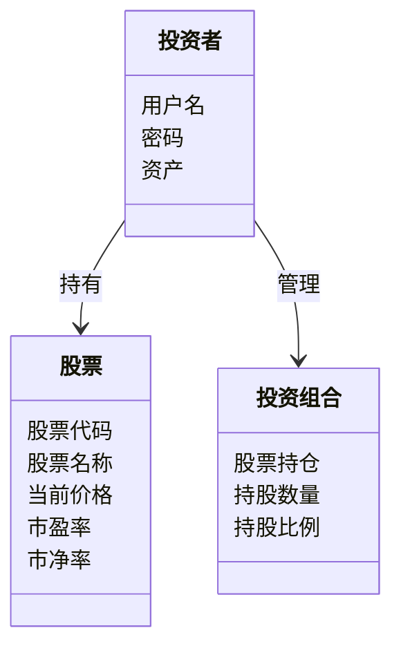

                 


# 特价股票投资组合的年度更新策略

## 关键词
- 特价股票，投资组合，年度更新，技术分析，数学模型

## 摘要
本文详细探讨了特价股票投资组合的年度更新策略，从背景介绍、核心概念、技术分析、数学模型、系统架构到项目实战，层层剖析，为投资者提供科学的投资方法和策略。文章结合实际案例，深入浅出地讲解了如何构建和优化投资组合，帮助投资者在变幻的市场中把握投资机会，降低风险，实现长期稳健收益。

---

# 第1章：特价股票投资组合的背景与概念

## 1.1 特价股票的基本概念
### 1.1.1 什么是特价股票
特价股票是指那些价格低于其内在价值，或相对市场指数表现不佳的股票。这类股票通常具有较高的投资潜力，因为它们可能被市场低估或暂时遭遇困境。

### 1.1.2 特价股票的特点
- **低估值**：市盈率（P/E）和市净率（P/B）低于行业平均水平。
- **高股息率**：部分特价股票提供较高的股息回报。
- **潜在增长**：公司基本面良好，但股价未充分反映其价值。

### 1.1.3 特价股票的投资价值
通过投资特价股票，投资者可以在市场复苏时获得超额收益。然而，特价股票也伴随着较高的风险，需要仔细筛选和管理。

## 1.2 投资组合的基本概念
### 1.2.1 投资组合的定义
投资组合是指将资金分配到不同资产或股票上的策略，旨在分散风险并最大化收益。

### 1.2.2 投资组合的目的
- **风险分散**：通过多样化投资降低单一资产的风险。
- **收益最大化**：通过优化资产配置提高整体收益。
- **长期增长**：通过投资优质资产实现财富的长期增值。

### 1.2.3 投资组合的风险与收益
投资组合的收益与风险是密切相关的。高收益通常伴随着高风险，因此投资者需要在风险与收益之间找到平衡点。

---

# 第2章：特价股票投资组合的策略分析

## 2.1 特价股票的筛选标准
### 2.1.1 市盈率分析
市盈率（P/E）是衡量股票价值的重要指标。P/E低于行业平均水平的股票可能具有投资价值。

### 2.1.2 市净率分析
市净率（P/B）是股价与每股净资产的比率。P/B低于1的股票通常被视为低估。

### 2.1.3 财务指标分析
- **净利润增长率**：公司盈利能力的指标。
- **ROE（净资产收益率）**：衡量公司使用股东资金的效率。

## 2.2 投资组合的构建原则
### 2.2.1 分散投资原则
将资金分配到不同行业、不同市值的股票，以降低行业和个股风险。

### 2.2.2 风险控制原则
设定止损点和止盈点，避免重大损失。

### 2.2.3 长期投资原则
避免频繁交易，降低交易成本，关注公司长期发展。

---

# 第3章：特价股票投资组合的年度更新策略

## 3.1 年度更新的必要性
### 3.1.1 市场环境的变化
经济周期波动、政策变化和市场情绪会影响股票价值。

### 3.1.2 公司基本面的变化
公司业绩、管理层变动和行业竞争格局的变化会影响股票价值。

### 3.1.3 投资目标的变化
投资者的风险承受能力、投资期限和目标收益的变化需要及时调整投资组合。

## 3.2 年度更新的具体步骤
### 3.2.1 重新评估投资组合
- **回顾过去一年的表现**：分析收益与风险是否符合预期。
- **评估市场环境**：判断经济周期和行业趋势的变化。

### 3.2.2 调整投资比例
- **增加表现优于预期的资产**：提高收益较高的资产比例。
- **减少表现不佳的资产**：降低风险较高的资产比例。

### 3.2.3 更新投资组合
- **替换表现不佳的股票**：选择新的特价股票，优化组合。
- **调整资产配置**：根据市场变化和投资目标调整资产比例。

---

# 第4章：技术分析在特价股票投资中的应用

## 4.1 技术分析的基本概念
### 4.1.1 技术分析的定义
技术分析是通过分析历史价格和成交量数据，预测未来股票价格走势的方法。

### 4.1.2 技术分析的核心假设
- **价格反映一切信息**：价格已经反映了所有影响股票价值的因素。
- **趋势的持续性**：价格走势具有延续性。
- **历史重复**：价格形态和模式会重复出现。

## 4.2 技术分析的主要方法
### 4.2.1 移动平均线（MA）
- **简单移动平均线（SMA）**：计算一定周期内的平均价格。
- **指数移动平均线（EMA）**：赋予近期价格更大的权重。

### 4.2.2 相对强弱指数（RSI）
RSI用于衡量股票的超买或超卖状态，通常在0-100之间。

### 4.2.3 布林带（Bollinger Bands）
布林带用于衡量价格的波动范围，判断价格是否偏离均值。

## 4.3 技术分析的实战应用
### 4.3.1 识别趋势
- 使用MA和趋势线识别价格趋势。
- 使用RSI判断超买超卖状态。

### 4.3.2 确定买卖时机
- 在布林带下限附近买入，上限附近卖出。

---

# 第5章：数学模型在特价股票投资中的应用

## 5.1 投资组合优化的数学模型
### 5.1.1 均值-方差优化
通过优化收益和风险的平衡，构建最优投资组合。

### 5.1.2 马科维茨的有效前沿
在给定风险下，寻找预期收益最大的投资组合；在给定收益下，寻找风险最小的投资组合。

## 5.2 CAPM模型的应用
### 5.2.1 CAPM模型公式
$$ E(r_i) = r_f + \beta_i (E(r_m) - r_f) $$
其中：
- \( E(r_i) \)：股票i的预期收益
- \( r_f \)：无风险利率
- \( \beta_i \)：股票i的贝塔系数
- \( E(r_m) \)：市场预期收益

### 5.2.2 贝塔系数的计算
贝塔系数衡量股票相对于市场的波动性：
$$ \beta_i = \frac{\text{协方差}(r_i, r_m)}{\text{方差}(r_m)} $$

## 5.3 多元回归模型的应用
### 5.3.1 模型公式
$$ y = \beta_0 + \beta_1 x_1 + \beta_2 x_2 + ... + \beta_n x_n + \epsilon $$
其中：
- \( y \)：目标变量（如股票收益）
- \( x_i \)：自变量（如市盈率、市净率）
- \( \epsilon \)：误差项

### 5.3.2 模型的实现
- 数据收集：收集相关股票的历史数据。
- 模型训练：使用多元回归算法训练模型。
- 模型预测：预测股票收益，指导投资决策。

---

# 第6章：系统分析与架构设计

## 6.1 系统功能设计
### 6.1.1 领域模型


### 6.1.2 系统架构


---

# 第7章：项目实战

## 7.1 实战案例
### 7.1.1 环境安装
- 安装Python、Pandas、Matplotlib等工具。

### 7.1.2 核心代码实现
```python
import pandas as pd
import numpy as np

# 示例数据
data = {'股票代码': ['AAPL', 'GOOGL', 'MSFT'],
        '市盈率': [15, 20, 18],
        '市净率': [3, 4, 2]}
df = pd.DataFrame(data)

# 计算预期收益
beta = 1.2
rf = 0.05
market_return = 0.1

expected_return = rf + beta * (market_return - rf)
print("预期收益:", expected_return)
```

### 7.1.3 代码应用解读
- 数据收集：从数据库或API获取股票数据。
- 数据分析：计算市盈率、市净率等指标。
- 模型应用：使用CAPM模型计算预期收益。

### 7.1.4 实战小结
通过实战案例，读者可以掌握如何利用技术分析和数学模型优化投资组合。

---

# 第8章：总结与展望

## 8.1 最佳实践
- **风险管理**：设置止损点，避免重大损失。
- **定期评估**：每年至少评估一次投资组合。
- **持续学习**：关注市场动态，学习新的投资策略。

## 8.2 总结
本文详细探讨了特价股票投资组合的年度更新策略，结合技术分析和数学模型，为投资者提供了科学的投资方法。

## 8.3 拓展阅读
- 《投资学》
- 《算法交易》
- 《技术分析实战》

---

作者：AI天才研究院/AI Genius Institute & 禅与计算机程序设计艺术 /Zen And The Art of Computer Programming

