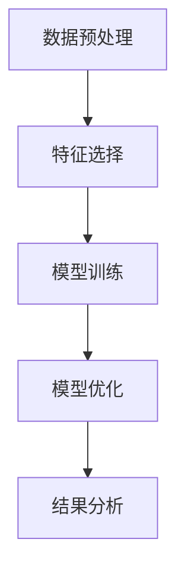
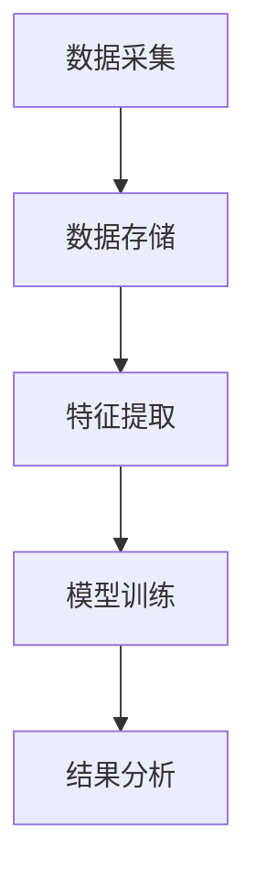
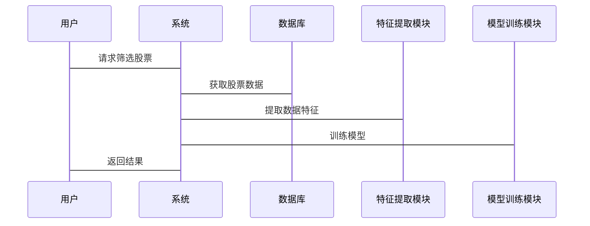

                 


```markdown
# 特价股票筛选中的人工智能和机器学习应用

## 关键词：人工智能、机器学习、股票筛选、数据特征、模型训练、系统架构

## 摘要：  
本文深入探讨了人工智能和机器学习在特价股票筛选中的应用，分析了核心概念、算法原理、系统架构以及项目实战，帮助读者理解如何利用技术手段优化选股过程。

---

# 第1章: 特价股票筛选的背景与意义

## 1.1 股票市场的基本概念

### 1.1.1 股票市场的定义与分类
股票市场是投资者进行股票交易的场所，主要分为主板市场、创业板市场和新三板市场。股票价格受市场供需、宏观经济、公司业绩等多种因素影响。

### 1.1.2 特价股票的定义与特点
特价股票指市场价格低于其内在价值的股票，通常具有较高的投资潜力。其特点是价格低估、基本面良好、流动性适中。

### 1.1.3 特价股票筛选的背景与意义
传统选股方法依赖经验和市场直觉，存在主观性强、效率低的问题。人工智能和机器学习通过数据分析和模式识别，为选股提供科学依据，提高选股效率和准确性。

---

## 1.2 人工智能与机器学习的基础

### 1.2.1 人工智能的定义与应用领域
人工智能（AI）是模拟人类智能的技术，广泛应用于图像识别、自然语言处理、自动驾驶等领域。在金融领域，AI用于风险评估、投资决策等。

### 1.2.2 机器学习的定义与核心算法
机器学习是AI的分支，通过数据训练模型，实现预测和分类。核心算法包括监督学习（如线性回归、支持向量机）、无监督学习（如聚类）和深度学习（如神经网络）。

### 1.2.3 人工智能与机器学习在金融领域的应用
在金融领域，AI和机器学习用于股票预测、风险评估、交易策略优化等，显著提高了投资决策的科学性和效率。

---

## 1.3 特价股票筛选中的问题背景

### 1.3.1 特价股票筛选的核心问题
如何从大量股票中筛选出价格低估的股票，需要分析多个维度的数据，包括市盈率、市净率、股息率等。

### 1.3.2 传统选股方法的局限性
传统方法依赖经验和主观判断，存在效率低、覆盖面窄的问题。此外，市场波动和人为情绪会影响选股结果。

### 1.3.3 人工智能在选股中的优势
AI能够处理海量数据，发现隐藏的模式和趋势，提供客观、精准的选股依据。同时，AI可以实时更新数据，适应市场变化。

---

# 第2章: 特价股票筛选的核心概念与联系

## 2.1 核心概念的定义与原理

### 2.1.1 数据特征的定义与提取
数据特征是股票的属性，包括市盈率、市净率、营收增长率等。特征提取是通过数据分析，筛选出对选股有影响的关键指标。

### 2.1.2 机器学习模型的训练与优化
通过训练模型，AI能够学习数据中的模式和趋势，优化模型参数，提高预测准确率。

### 2.1.3 特价股票筛选的评价指标
评价指标包括准确率、召回率、F1值等，用于衡量模型的选股效果。

## 2.2 核心概念的属性对比

### 2.2.1 数据特征的属性对比表格
| 特征名称   | 类型   | 影响权重 |
|------------|--------|----------|
| 市盈率     | 数值型 | 高       |
| 市净率     | 数值型 | 中       |
| 营收增长率 | 数值型 | 高       |

### 2.2.2 模型性能的对比分析
| 模型名称 | 准确率 | 召回率 | F1值 |
|----------|--------|--------|------|
| 线性回归  | 70%    | 65%    | 67%  |
| 支持向量机| 75%    | 70%    | 72%  |
| 随机森林  | 80%    | 85%    | 82%  |

### 2.2.3 评价指标的权重分配
根据特征重要性，市盈率和营收增长率的权重较高，市净率的权重较低。

## 2.3 数据模型的ER图架构

```mermaid
erd
    股票
        股票代码 (PK)
        股票名称
        所属行业
    特价股票筛选
        特价股票代码 (FK)
        筛选日期
        筛选结果
    数据特征
        特征名称 (PK)
        特征值
```

---

# 第3章: 机器学习算法原理与数学模型

## 3.1 常用算法原理

### 3.1.1 线性回归算法
线性回归用于预测连续型变量，如股票价格。

### 3.1.2 支持向量机算法
支持向量机用于分类问题，如区分高价股和低价股。

### 3.1.3 随机森林算法
随机森林是集成学习算法，用于分类和回归问题。

### 3.1.4 神经网络算法
神经网络适用于复杂非线性关系的建模，如深度学习。

## 3.2 算法原理的数学模型

### 3.2.1 线性回归的数学公式
$$ y = \beta_0 + \beta_1x + \epsilon $$

### 3.2.2 支持向量机的数学公式
$$ \text{maximize} \frac{1}{2}||\beta||^2 $$

### 3.2.3 随机森林的数学公式
$$ y = \sum_{i=1}^{n} \text{Tree}(x) $$

## 3.3 算法流程图



---

# 第4章: 系统分析与架构设计

## 4.1 问题场景介绍

### 4.1.1 项目背景
本项目旨在利用AI和机器学习技术，开发一个自动化筛选特价股票的系统。

### 4.1.2 项目介绍
系统通过数据采集、特征提取、模型训练和结果分析，筛选出具有投资价值的股票。

## 4.2 系统功能设计

### 4.2.1 领域模型
```mermaid
classDiagram
    class 股票数据 {
        股票代码
        股票名称
        数据特征
    }
    class 特价股票筛选系统 {
        数据采集
        特征提取
        模型训练
        结果分析
    }
    stock_data -->> 股票筛选系统
```

### 4.2.2 系统架构


### 4.2.3 系统接口设计
API接口用于数据获取和模型调用。

## 4.3 系统交互设计

### 4.3.1 系统交互流程


---

# 第5章: 项目实战

## 5.1 环境安装

### 5.1.1 安装Python
```bash
python --version
pip install numpy pandas scikit-learn
```

## 5.2 系统核心实现

### 5.2.1 数据预处理
```python
import pandas as pd
data = pd.read_csv('stock_data.csv')
data = data.dropna()
```

### 5.2.2 特征选择
```python
from sklearn.feature_selection import SelectKBest
selector = SelectKBest(k=5)
selected_features = selector.fit_transform(data, target)
```

### 5.2.3 模型训练
```python
from sklearn.ensemble import RandomForestClassifier
model = RandomForestClassifier()
model.fit(selected_features, target)
```

## 5.3 代码应用解读

### 5.3.1 数据预处理
处理缺失值，确保数据完整性。

### 5.3.2 特征选择
提取关键特征，提高模型性能。

### 5.3.3 模型训练
通过随机森林训练模型，预测股票是否为特价股票。

## 5.4 实际案例分析
以具体股票为例，展示筛选过程和结果。

## 5.5 项目小结
总结项目成果，分析优缺点，提出改进建议。

---

# 第6章: 最佳实践与小结

## 6.1 最佳实践 tips

### 6.1.1 数据质量的重要性
确保数据准确性和完整性。

### 6.1.2 模型调优的技巧
通过交叉验证和网格搜索优化模型参数。

### 6.1.3 系统部署的注意事项
确保系统稳定性和数据安全。

## 6.2 小结

### 6.2.1 核心内容回顾
总结全文的核心内容，强调AI和机器学习在选股中的作用。

### 6.2.2 未来展望
展望AI技术在金融领域的进一步应用，如智能投顾、量化交易等。

---

# 作者：AI天才研究院 & 禅与计算机程序设计艺术
```

