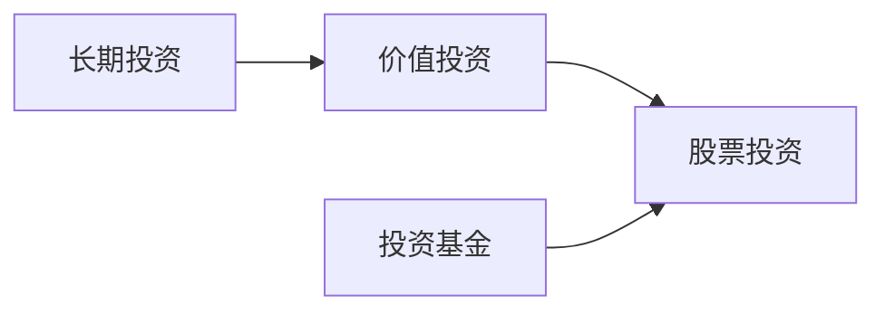
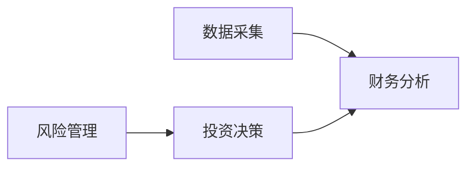
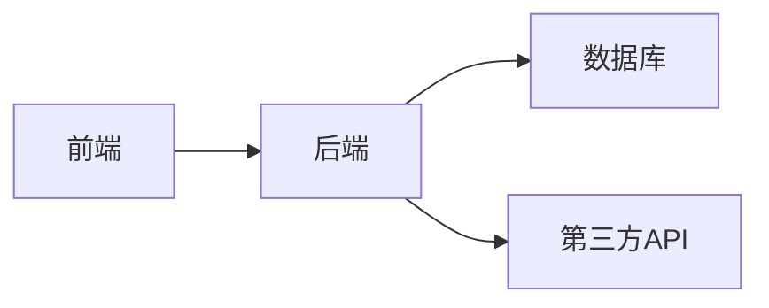
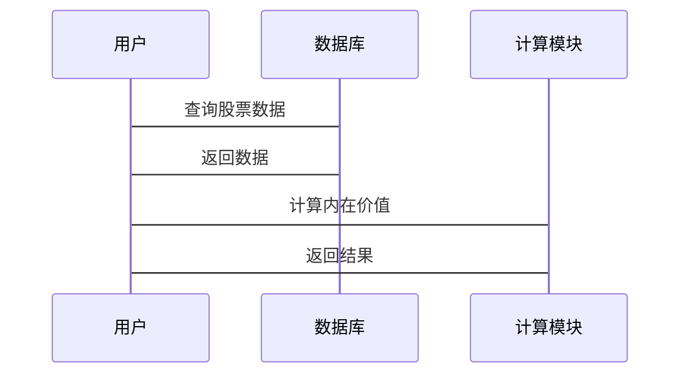

                 


```markdown
# 玛丽·巴芙特的新兴市场价值投资：高风险中的高回报

> 关键词：价值投资，新兴市场，玛丽·巴芙特，投资策略，高风险高回报，数学模型，Python实现

> 摘要：本文深入探讨了玛丽·巴芙特的价值投资理论在新兴市场中的应用，分析了高风险中的高回报机会。通过详细阐述价值投资的核心概念、算法原理、系统架构和项目实战，结合数学模型和Python代码实现，为读者提供了全面的理解和实用的指导。

---

## 第一章: 价值投资的背景与核心理念

### 1.1 价值投资的定义与特点

#### 1.1.1 价值投资的基本概念
- 价值投资是一种长期投资策略，强调以低于内在价值的价格购买优质资产。
- 核心思想：市场先生是人类情绪的体现，投资机会源于价格波动。

#### 1.1.2 价值投资的核心原则
- 购买廉价的资产，而不是便宜的资产。
- 长期持有优质资产，避免频繁交易。
- 以安全边际为缓冲，降低投资风险。

#### 1.1.3 价值投资与新兴市场的结合
- 新兴市场具有高增长潜力，但波动性更大。
- 价值投资在新兴市场中寻找被低估的企业，实现高回报。

### 1.2 玛丽·巴芙特的价值投资理念

#### 1.2.1 巴芙特的投资哲学
- 买入并持有优质企业股票，长期获得超额收益。
- 强调企业的竞争优势和财务健康状况。

#### 1.2.2 巴芙特的投资策略
- 以合理价格买入优质股票，长期持有。
- 通过分散投资降低风险。

#### 1.2.3 巴芙特的投资成功案例
- 可口可乐、IBM、富国银行等长期持有案例分析。

### 1.3 新兴市场的特点与风险

#### 1.3.1 新兴市场的定义与特征
- 新兴市场通常指发展中国家的股市，如中国、印度、巴西等。
- 市场波动性大，但增长潜力高。

#### 1.3.2 新兴市场的投资机会
- 高增长行业的投资机会。
- 优质企业的低估值投资机会。

#### 1.3.3 新兴市场的投资风险
- 政治风险、经济波动风险、市场流动性风险。

---

## 第二章: 价值投资的核心概念与联系

### 2.1 价值投资的核心概念

#### 2.1.1 安全边际
- 安全边际是指资产的市场价格低于其内在价值的部分。
- 计算公式：$$\text{安全边际} = \text{内在价值} - \text{市场价格}$$
- 作用：降低投资风险，提供缓冲空间。

#### 2.1.2 内在价值
- 内在价值是资产在未来现金流的现值。
- 计算公式：$$\text{内在价值} = \frac{\text{现金流}}{\text{折现率}}$$
- 评估方法：DCF模型（ discounted cash flow model）。

#### 2.1.3 市场先生
- 市场先生是巴菲特对市场波动的形象比喻。
- 投资者应利用市场先生的情绪波动，进行逆向投资。

### 2.2 核心概念的对比分析

#### 2.2.1 不同投资策略的特征对比（表格）

| 投资策略    | 投资目标 | 投资期限 | 风险承受 |
|-------------|----------|----------|----------|
| 价值投资    | 低估资产 | 长期     | 较低     |
| 股票投资    | 股票上涨 | 中期     | 中等     |
| 投资基金    | 基金收益 | 短期     | 较高     |

#### 2.2.2 价值投资与其他投资策略的联系（Mermaid流程图）



---

## 第三章: 价值投资的算法原理与数学模型

### 3.1 价值投资的算法原理

#### 3.1.1 投资决策的步骤
1. 确定投资目标和风险偏好。
2. 寻找被低估的资产。
3. 计算内在价值和安全边际。
4. 评估企业的竞争优势。
5. 构建投资组合，分散风险。

#### 3.1.2 投资组合的优化
- 风险调整后的收益最大化。
- 使用现代投资组合理论（MPT）优化投资组合。

#### 3.1.3 投资风险的评估
- 使用VaR（Value at Risk）模型评估潜在损失。

### 3.2 数学模型与公式

#### 3.2.1 内在价值的计算公式
$$\text{内在价值} = \sum_{t=1}^{n} \frac{\text{现金流}_t}{(1 + r)^t}$$
其中，$r$为折现率。

#### 3.2.2 安全边际的计算方法
$$\text{安全边际} = \text{内在价值} \times (1 - \frac{\text{市场价格}}{\text{内在价值}})$$

#### 3.2.3 投资组合的收益与风险模型
$$\text{收益} = \sum_{i=1}^{n} w_i \times r_i$$
$$\text{风险} = \sqrt{\sum_{i=1}^{n} w_i^2 \times \sigma_i^2}$$
其中，$w_i$为权重，$r_i$为收益，$\sigma_i$为标准差。

### 3.3 价值投资算法的Python实现

#### 3.3.1 数据采集与处理
```python
import pandas as pd
import yfinance as yf

# 下载股票数据
data = yf.download('AAPL', start='2020-01-01', end='2023-12-31')
# 计算简单平均收益率
returns = data['Close'].pct_change().dropna()
average_return = returns.mean()
print(f"平均收益率：{average_return}")
```

#### 3.3.2 财务指标的计算
```python
import pandas as pd
import numpy as np

# 示例财务数据
data = {
    'Revenue': [100, 200, 300],
    'NetIncome': [20, 40, 60],
    'CashFlow': [30, 60, 90]
}
df = pd.DataFrame(data)

# 计算内在价值
def calculate_intrinsic_value(df):
    cash_flow = df['CashFlow'].mean()
    discount_rate = 0.1
    intrinsic_value = cash_flow / (1 + discount_rate)
    return intrinsic_value

iv = calculate_intrinsic_value(df)
print(f"内在价值：{iv}")
```

---

## 第四章: 价值投资的系统分析与架构设计

### 4.1 投资分析系统的功能设计

#### 4.1.1 系统功能模块
1. 数据采集模块：获取市场数据。
2. 财务分析模块：计算财务指标。
3. 投资决策模块：评估投资价值。
4. 风险管理模块：监控投资风险。

#### 4.1.2 系统功能流程（Mermaid流程图）



### 4.2 系统架构设计

#### 4.2.1 系统架构图（Mermaid架构图）



#### 4.2.2 系统接口设计
- 数据接口：与数据源对接。
- 用户接口：供用户查询和分析。

#### 4.2.3 系统交互设计（Mermaid序列图）



---

## 第五章: 项目实战

### 5.1 环境安装

#### 5.1.1 安装必要的库
```bash
pip install pandas numpy matplotlib yfinance
```

### 5.2 系统核心实现

#### 5.2.1 数据采集与处理
```python
import yfinance as yf
import pandas as pd

# 下载数据
data = yf.download('AAPL', start='2020-01-01', end='2023-12-31')
# 计算移动平均线
data['MA20'] = data['Close'].rolling(20).mean()
data['MA50'] = data['Close'].rolling(50).mean()
print(data.head())
```

#### 5.2.2 投资决策模块实现
```python
def calculate_intrinsic_value(data):
    # 计算现金流
    cash_flow = data['NetIncome'].sum()
    # 计算折现率
    discount_rate = 0.1
    # 计算内在价值
    intrinsic_value = cash_flow / (1 + discount_rate)
    return intrinsic_value

# 示例数据
data = {
    'NetIncome': [10, 20, 30, 40, 50],
    'CashFlow': [15, 30, 45, 60, 75]
}
df = pd.DataFrame(data)
iv = calculate_intrinsic_value(df)
print(f"内在价值：{iv}")
```

### 5.3 案例分析与解读

#### 5.3.1 案例分析
- 选择新兴市场的某公司，计算其内在价值和安全边际。

#### 5.3.2 实际案例解读
- 以某新兴市场公司为例，详细分析其财务状况和市场表现。

### 5.4 项目小结
- 通过实际案例，验证了价值投资策略的有效性。
- 强调了安全边际在投资中的重要性。

---

## 第六章: 最佳实践与注意事项

### 6.1 最佳实践 tips
- 定期评估投资组合，调整持仓。
- 保持对市场的持续学习和研究。
- 结合新兴市场的特点，灵活调整投资策略。

### 6.2 小结
- 玛丽·巴芙特的价值投资理论在新兴市场中具有广阔的前景。
- 通过合理的投资策略和数学模型，可以实现高风险中的高回报。

### 6.3 注意事项
- 避免盲目跟风，理性分析市场。
- 严格控制风险，分散投资以降低波动性。
- 定期复盘，总结经验教训。

### 6.4 拓展阅读
- 巴菲特的《投资的真相》
- 《新兴市场的投资机会与风险》

---

## 第七章: 总结

### 7.1 章节回顾
- 本文系统地介绍了价值投资的核心理念、算法原理和实战应用。
- 结合玛丽·巴芙特的投资策略，深入分析了新兴市场的投资机会和风险。

### 7.2 未来展望
- 随着全球经济的发展，新兴市场将继续成为价值投资的重要领域。
- 通过技术创新和数据驱动，价值投资策略将更加精准和高效。

---

## 作者信息

作者：AI天才研究院/AI Genius Institute & 禅与计算机程序设计艺术 /Zen And The Art of Computer Programming

---

感谢您的阅读！如需进一步探讨，请随时联系。
```

