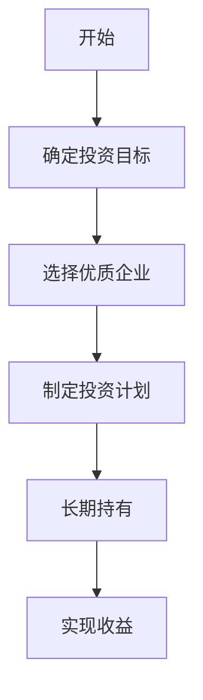
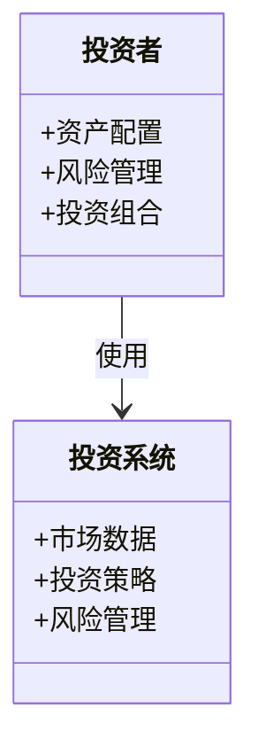

                 


# 玛丽·巴芙特的耐心资本：长期价值投资的力量

## 关键词：
耐心资本、长期投资、价值投资、风险管理、玛丽·巴芙特、投资策略、投资系统

## 摘要：
本文深入探讨了玛丽·巴芙特提出的“耐心资本”概念及其在长期价值投资中的力量。通过分析耐心资本的核心理念、数学模型、系统架构和项目实战，本文为读者提供了从理论到实践的全面指导。文章还结合实际案例，总结了最佳投资实践和风险管理策略，帮助读者在复杂多变的市场中实现稳健投资。

---

## 第一部分：耐心资本与长期价值投资的背景

## 第1章：耐心资本的定义与核心理念

### 1.1 耐心资本的定义

#### 1.1.1 耐心资本的起源与发展
耐心资本（Patient Capital）是一种投资理念，强调投资者在面对市场波动时保持冷静和长期持有的心态。这一概念起源于20世纪中期，随着价值投资理论的兴起而逐渐被广泛认可。耐心资本的核心在于不被短期市场波动所干扰，而是专注于企业的长期价值。

#### 1.1.2 耐心资本的核心特征
- **长期视角**：耐心资本要求投资者以长远的眼光看待投资，注重企业的内在价值而非短期收益。
- **风险承受能力**：耐心资本能够容忍短期的市场波动，因为它们相信长期的价值会显现。
- **价值导向**：耐心资本注重企业的基本面分析，寻找那些具有持续增长潜力的企业。

#### 1.1.3 耐心资本与传统投资的区别
| 特征                | 耐心资本              | 传统投资              |
|---------------------|----------------------|-----------------------|
| 投资期限            | 长期（数年甚至数十年） | 短期（几天到几个月）    |
| 投资目标            | 企业内在价值          | 市场价格波动          |
| 风险承受能力        | 高                  | 低或中等              |
| 交易频率            | 低                  | 高                   |

---

### 1.2 长期价值投资的背景

#### 1.2.1 投资市场的基本特征
- 投资市场的波动性：股票价格受多种因素影响，包括宏观经济环境、行业趋势和企业基本面。
- 投资者的心理行为：投资者常常受到贪婪和恐惧的驱动，导致非理性决策。

#### 1.2.2 长期价值投资的兴起
长期价值投资的兴起源于对短期交易成本和市场波动的反思。通过长期持有优质资产，投资者可以规避短期波动带来的风险，同时享受企业成长的红利。

#### 1.2.3 耐心资本在长期投资中的作用
耐心资本通过降低交易频率和减少市场干扰，帮助投资者避免因短期波动而做出错误决策，从而实现长期收益最大化。

---

## 第2章：耐心资本的核心概念与联系

### 2.1 耐心资本的原理

#### 2.1.1 投资者心态与行为分析
投资者在面对市场波动时，常常会陷入贪婪和恐惧的循环。耐心资本要求投资者在市场下跌时保持冷静，在市场上涨时保持理性。

#### 2.1.2 耐心资本的数学模型
耐心资本的回报可以通过以下公式计算：

$$
\text{长期回报} = \text{复利增长} = (1 + r)^n - 1
$$

其中，\( r \) 是年化收益率，\( n \) 是投资年数。

#### 2.1.3 耐心资本与市场波动的关系
耐心资本通过长期持有优质资产，能够抵消市场短期波动的影响，从而实现稳健回报。

---

### 2.2 核心概念对比分析

#### 2.2.1 耐心资本与短期投资的对比
| 特征                | 耐心资本              | 短期投资              |
|---------------------|----------------------|-----------------------|
| 投资目标            | 企业内在价值          | 市场价格波动          |
| 投资期限            | 长期                 | 短期                 |
| 风险承受能力        | 高                  | 低                   |

---

## 第3章：耐心资本的数学模型与算法原理

### 3.1 耐心资本的数学模型

#### 3.1.1 投资回报的数学公式
耐心资本的长期回报可以通过复利公式计算：

$$
\text{复利回报} = (1 + r)^n - 1
$$

其中，\( r \) 是年化收益率，\( n \) 是投资年数。

#### 3.1.2 耐心资本的风险评估模型
风险评估可以通过标准差来衡量：

$$
\text{标准差} = \sqrt{\frac{1}{N} \sum_{i=1}^{N} (x_i - \mu)^2}
$$

其中，\( \mu \) 是平均回报，\( x_i \) 是每期的回报。

---

### 3.2 算法原理与流程图

#### 3.2.1 投资决策的算法流程


---

## 第4章：耐心资本的系统分析与架构设计

### 4.1 投资系统分析

#### 4.1.1 投资目标与策略分析
- **投资目标**：实现长期稳健收益。
- **策略分析**：选择具有竞争优势的企业，长期持有。

#### 4.1.2 投资组合管理的系统架构


---

## 第5章：耐心资本的项目实战

### 5.1 环境安装与配置

#### 5.1.1 投资分析工具的安装
- **工具选择**：使用Python和Pandas进行数据分析。

#### 5.1.2 数据库的搭建与配置
- **数据库选择**：使用MySQL存储历史数据。

#### 5.1.3 系统环境的优化
- **性能优化**：配置高效的计算环境。

---

### 5.2 核心代码实现

#### 5.2.1 投资回报计算的Python代码
```python
import pandas as pd

def calculate_patience_capital_returns(prices, initial_investment):
    returns = prices.pct_change().dropna()
    compounded_returns = (1 + returns).cumprod()
    final_value = initial_investment * compounded_returns[-1]
    return final_value
```

#### 5.2.2 风险评估的Python代码
```python
import numpy as np

def calculate_risk(prices):
    returns = prices.pct_change().dropna()
    mu = returns.mean()
    variance = np.var(returns)
    std_deviation = np.sqrt(variance)
    return std_deviation
```

---

## 第6章：耐心资本的最佳实践与小结

### 6.1 最佳实践Tips

#### 6.1.1 投资心态的调整建议
- **保持耐心**：避免因短期波动而改变投资策略。
- **持续学习**：不断更新投资知识和技能。

#### 6.1.2 风险管理的注意事项
- **分散投资**：降低单一资产的风险。
- **定期复盘**：评估投资组合的表现。

#### 6.1.3 长期投资的策略优化
- **选择优质企业**：关注企业的基本面和竞争优势。

---

### 6.2 项目总结与展望

#### 6.2.1 项目成果回顾
通过本文的分析和实战，我们深入理解了耐心资本的理论与实践，掌握了长期价值投资的核心方法。

#### 6.2.2 未来展望
未来，随着技术的进步和市场的变化，耐心资本的投资策略将更加多元化和智能化。

---

## 作者：AI天才研究院 & 禅与计算机程序设计艺术

