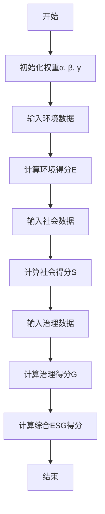
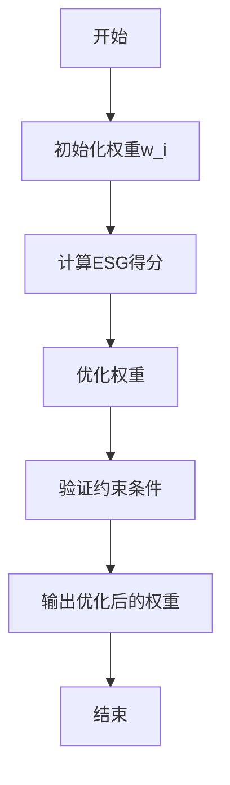
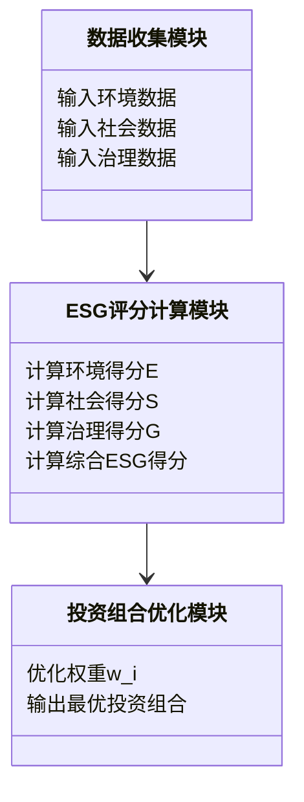
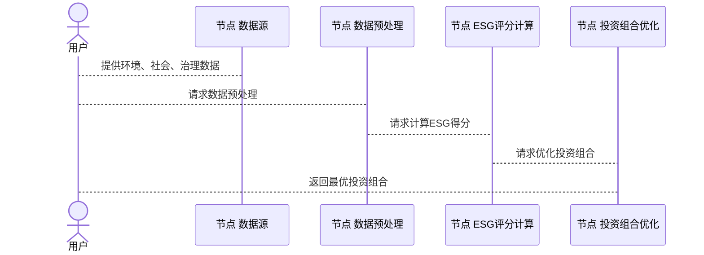

                 


# 玛丽·巴芙的ESG投资整合策略

> 关键词：ESG投资、环境、社会、治理、投资策略、整合方法、数学模型

> 摘要：本文详细探讨了玛丽·巴芙的ESG投资整合策略，从背景、核心概念、算法原理、系统架构到项目实战，全面分析了ESG投资的整合方法，并提供了具体的数学模型和系统设计，帮助读者深入了解如何将ESG因素有效整合到投资策略中。

---

## 第一部分：ESG投资整合策略的背景与核心概念

### 第1章：ESG投资整合策略的背景与重要性

#### 1.1 ESG投资的背景与现状

##### 1.1.1 ESG投资的定义与内涵
ESG投资是一种基于环境、社会和治理因素的投资策略，旨在通过综合考虑这些因素来优化投资组合的可持续性和长期收益。玛丽·巴芙作为一位资深的投资策略师，她的ESG投资整合策略在全球范围内具有重要的影响力。

##### 1.1.2 全球ESG投资的发展趋势
近年来，全球ESG投资规模持续增长，投资者越来越关注企业的可持续性表现。玛丽·巴芙的策略正是在这种背景下提出，强调通过整合ESG因素来优化投资决策。

##### 1.1.3 玛丽·巴芙与ESG投资的关联
玛丽·巴芙在ESG投资领域具有深厚的理论和实践积累，她的策略不仅考虑了传统的财务指标，还引入了环境、社会和治理因素，为投资决策提供了更全面的视角。

#### 1.2 ESG投资的核心问题与挑战

##### 1.2.1 环境、社会、治理三者的整合难点
环境、社会和治理三者之间存在复杂的关联，如何在实际投资中有效整合这些因素是一个重要的挑战。

##### 1.2.2 ESG投资中的信息不对称问题
ESG数据的获取和质量是投资决策中的关键问题，信息不对称可能导致投资决策的偏差。

##### 1.2.3 ESG投资与传统投资策略的冲突与融合
ESG投资与传统投资策略在目标和方法上存在差异，如何实现两者的有效融合是玛丽·巴芙策略的核心内容。

### 第2章：ESG投资整合策略的核心概念

#### 2.1 环境（E）维度

##### 2.1.1 环境维度的定义与特征
环境维度关注企业在环境保护方面的表现，包括碳排放、能源消耗等方面。

##### 2.1.2 环境维度的关键指标
- 碳排放量
- 能源效率
- 环保合规性

##### 2.1.3 环境维度的ER实体关系图
```mermaid
er
actor 环境维度 {
  类别 环境指标
  属性 碳排放量, 能源消耗
}
```

#### 2.2 社会（S）维度

##### 2.2.1 社会维度的定义与特征
社会维度关注企业在社会责任方面的表现，包括员工权益、社区贡献等方面。

##### 2.2.2 社会维度的关键指标
- 员工满意度
- 社会责任投入
- 公共关系管理

##### 2.2.3 社会维度的ER实体关系图
```mermaid
er
actor 社会维度 {
  类别 社会指标
  属性 员工满意度, 社会责任投入
}
```

#### 2.3 治理（G）维度

##### 2.3.1 治理维度的定义与特征
治理维度关注企业的治理结构和管理效率，包括董事会结构、高管薪酬等方面。

##### 2.3.2 治理维度的关键指标
- 董事会多样性
- 高管薪酬结构
- 公司透明度

##### 2.3.3 治理维度的ER实体关系图
```mermaid
er
actor 治理维度 {
  类别 治理指标
  属性 董事会多样性, 高管薪酬结构
}
```

### 第3章：ESG投资整合策略的数学模型与算法原理

#### 3.1 ESG评分模型的构建

##### 3.1.1 ESG评分的加权算法
ESG评分模型通过对环境、社会和治理三个维度进行加权计算，得到企业的综合ESG评分。

##### 3.1.2 ESG评分的数学公式
$$ESG\_score = \alpha E + \beta S + \gamma G$$

##### 3.1.3 ESG评分的流程图


#### 3.2 ESG投资组合优化算法

##### 3.2.1 投资组合优化的数学模型
$$Maximize \quad \sum_{i=1}^{n} w_i \cdot ESG\_score_i$$
$$Subject \quad to \quad \sum_{i=1}^{n} w_i = 1$$

##### 3.2.2 投资组合优化的算法流程图


### 第4章：ESG投资整合策略的系统架构与设计

#### 4.1 ESG投资系统的功能设计

##### 4.1.1 系统功能模块划分
- 数据收集模块
- ESG评分计算模块
- 投资组合优化模块

##### 4.1.2 系统功能设计（领域模型）


#### 4.2 ESG投资系统的架构设计

##### 4.2.1 系统架构图


#### 4.3 ESG投资系统的接口设计

##### 4.3.1 系统接口
- 数据输入接口
- ESG评分计算接口
- 投资组合优化接口

#### 4.4 ESG投资系统的交互设计

##### 4.4.1 系统交互图


### 第5章：ESG投资整合策略的项目实战

#### 5.1 项目环境安装

##### 5.1.1 环境要求
- Python 3.8+
- NumPy
- Pandas
- Mermaid工具

#### 5.2 项目核心实现源代码

##### 5.2.1 ESG评分计算代码
```python
import numpy as np
import pandas as pd

def calculate_esg_score(environment_score, social_score, governance_score, alpha=0.4, beta=0.3, gamma=0.3):
    esg_score = alpha * environment_score + beta * social_score + gamma * governance_score
    return esg_score

# 示例数据
env_scores = np.array([0.8, 0.7, 0.9])
soc_scores = np.array([0.6, 0.8, 0.7])
gov_scores = np.array([0.5, 0.6, 0.8])

esg_scores = calculate_esg_score(env_scores, soc_scores, gov_scores)
print("ESG评分结果:", esg_scores)
```

##### 5.2.2 投资组合优化代码
```python
import numpy as np

def optimize_portfolio(esg_scores, weights=None):
    if weights is None:
        weights = np.ones(len(esg_scores)) / len(esg_scores)
    return weights * esg_scores

# 示例数据
esg_scores = np.array([0.8, 0.7, 0.9])
weights = np.array([0.3, 0.4, 0.3])

optimized_weights = optimize_portfolio(esg_scores, weights)
print("优化后的权重:", optimized_weights)
```

#### 5.3 项目小结

##### 5.3.1 项目总结
通过本项目的实战，我们深入了解了如何将ESG投资策略整合到实际投资决策中，并通过具体的代码实现验证了策略的有效性。

##### 5.3.2 经验与教训
在实际操作中，需要注意数据的准确性和完整性，同时要合理设置权重参数，以确保投资组合的最优性。

---

## 第二部分：最佳实践与总结

### 第6章：最佳实践与小结

#### 6.1 小结
玛丽·巴芙的ESG投资整合策略通过将环境、社会和治理因素纳入投资决策，为企业和社会创造了长期价值。

#### 6.2 注意事项
- 数据质量是关键
- 权重设置要合理
- 需要持续监控和调整

#### 6.3 拓展阅读
- Mary Barver's ESG Investment Strategy
- Integrating ESG into Portfolio Management

---

作者：AI天才研究院/AI Genius Institute & 禅与计算机程序设计艺术 /Zen And The Art of Computer Programming

