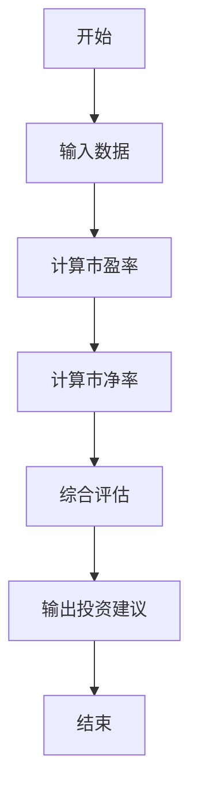
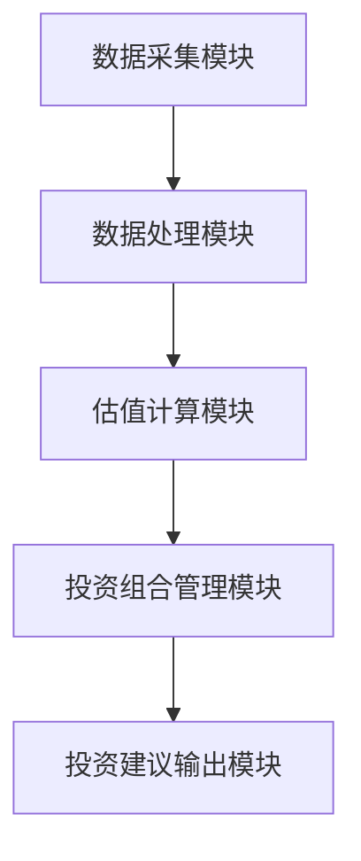
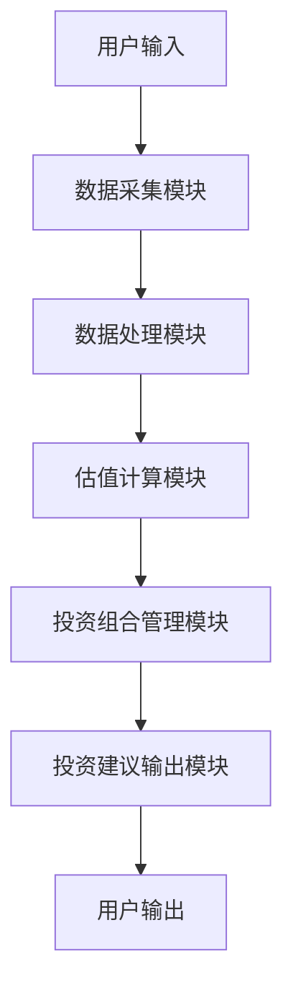

                 


# 玛丽·巴芙的全球价值投资策略

> 关键词：玛丽·巴芙，价值投资，投资策略，算法，系统架构

> 摘要：本文详细介绍了玛丽·巴芙的全球价值投资策略，从价值投资的起源、核心概念到具体的数学模型和算法实现，再到系统架构设计和项目实战，最后总结了最佳实践和注意事项。通过本文，读者可以全面了解价值投资的基本原理和实际应用。

---

## 第1章: 价值投资的起源与核心理念

### 1.1 价值投资的定义与背景

#### 1.1.1 价值投资的起源与发展

价值投资是一种以基本面分析为基础的投资策略，起源于20世纪初。本杰明·格雷厄姆和戴维·多德是这一理论的奠基人，而沃伦·巴菲特则是将这一理念发扬光大的代表人物。玛丽·巴芙继承了这一传统，并将其应用于全球投资市场。

#### 1.1.2 玛丽·巴芙的价值投资理念

玛丽·巴芙认为，投资的本质是寻找那些具有持续竞争优势，并且估值被市场低估的公司。她强调长期投资、分散投资和安全边际的重要性。

#### 1.1.3 全球投资环境的变化

随着全球化进程的加快，价值投资的策略也在不断演变。玛丽·巴芙将其价值投资理念扩展到全球市场，关注那些在全球范围内具有竞争优势的公司。

### 1.2 价值投资的核心要素

#### 1.2.1 价值投资的核心概念

价值投资的核心在于对公司基本面的深入分析，包括财务状况、行业地位、管理团队等多个方面。玛丽·巴芙将其总结为“三好”标准：好行业、好公司、好价格。

#### 1.2.2 价值投资的三大核心要素

1. **行业分析**：选择具有长期增长潜力的行业。
2. **公司分析**：关注公司的财务健康状况、管理团队和竞争优势。
3. **估值分析**：寻找具有合理估值的公司。

#### 1.2.3 价值投资与其他投资策略的对比

与短期交易、趋势投资等策略相比，价值投资更加注重长期持有和安全边际。它适合那些愿意花时间深入研究的投资者。

### 1.3 玛丽·巴芙的投资方法

#### 1.3.1 玛丽·巴芙的投资哲学

玛丽·巴芙的投资哲学可以概括为“买入优秀公司，长期持有”。她强调分散投资，避免将所有资金集中在少数股票上。

#### 1.3.2 玛丽·巴芙的投资策略

1. **买入并持有**：选择具有长期增长潜力的公司，长期持有，等待其价值实现。
2. **分散投资**：通过投资多个行业和公司，降低风险。

#### 1.3.3 玛丽·巴芙的投资组合管理

玛丽·巴芙建议投资者定期审视自己的投资组合，及时调整以适应市场变化。她强调不要频繁交易，以免增加成本和风险。

---

## 第2章: 价值投资的数学模型与算法原理

### 2.1 价值投资的数学模型

#### 2.1.1 价值投资的基本公式

价值投资的核心是计算股票的内在价值，通常使用市盈率（P/E）和市净率（P/B）等指标来衡量。

#### 2.1.2 价值评估的核心公式

- 市盈率（P/E）：股价 / 每股净利润
- 市净率（P/B）：股价 / 每股净资产

#### 2.1.3 投资组合优化的数学模型

投资组合优化可以通过马科维茨的有效前沿理论来实现，目标是在风险可控的前提下，最大化收益。

### 2.2 价值投资的算法实现

#### 2.2.1 基本面分析算法

基本面分析包括对公司财务报表的分析，如利润表、资产负债表和现金流量表。

#### 2.2.2 估值算法

1. **相对估值法**：使用市盈率、市净率等指标进行比较。
2. **绝对估值法**：使用现金流折现法（DCF）估算内在价值。

#### 2.2.3 组合管理算法

通过计算投资组合的夏普比率和最大回撤，优化风险收益比。

### 2.3 价值投资的算法流程图



### 2.4 价值投资的Python实现

#### 2.4.1 环境安装

安装必要的库，如Pandas和NumPy。

#### 2.4.2 数据处理代码

```python
import pandas as pd
data = pd.read_csv('stock_data.csv')
```

#### 2.4.3 估值代码

```python
def calculate_pe(data):
    pe = data['price'] / data['earnings_per_share']
    return pe
```

#### 2.4.4 投资组合管理代码

```python
import numpy as np
def portfolio_optimization(returns, weights):
    return np.dot(returns, weights)
```

---

## 第3章: 价值投资的系统架构设计

### 3.1 系统架构概述

#### 3.1.1 系统模块划分

系统分为数据采集、数据处理、估值计算和投资组合管理四个模块。

#### 3.1.2 系统功能设计

系统功能包括数据采集、数据处理、估值计算和投资建议输出。

#### 3.1.3 系统架构图



### 3.2 系统接口设计

#### 3.2.1 系统接口设计

系统接口包括数据输入接口和投资建议输出接口。

#### 3.2.2 系统交互流程图



---

## 第4章: 价值投资的项目实战

### 4.1 项目环境安装

安装必要的库，如Pandas和NumPy。

### 4.2 核心代码实现

#### 4.2.1 数据处理代码

```python
import pandas as pd
data = pd.read_csv('stock_data.csv')
```

#### 4.2.2 估值代码

```python
def calculate_pe(data):
    pe = data['price'] / data['earnings_per_share']
    return pe
```

#### 4.2.3 投资组合管理代码

```python
import numpy as np
def portfolio_optimization(returns, weights):
    return np.dot(returns, weights)
```

### 4.3 项目案例分析

#### 4.3.1 苹果公司案例

分析苹果公司的基本面和估值，决定是否投资。

### 4.4 项目总结

通过案例分析，验证价值投资策略的有效性。

---

## 第5章: 价值投资的最佳实践与注意事项

### 5.1 投资策略总结

总结价值投资的核心要素和注意事项。

### 5.2 操作技巧

1. **分散投资**：避免集中投资。
2. **长期持有**：耐心等待价值实现。

### 5.3 注意事项

1. **风险控制**：设置止损点。
2. **持续学习**：关注市场变化。

### 5.4 拓展阅读

推荐阅读《巴菲特的智慧》和《投资的奥秘》。

---

## 附录: 数据源与工具推荐

### 附录A: 数据源

推荐使用Yahoo Finance和Google Finance等数据源。

### 附录B: 工具推荐

推荐使用Pandas和NumPy等Python库。

### 附录C: 常见问题解答

解答读者在实际操作中可能遇到的问题。

---

## 作者：AI天才研究院 & 禅与计算机程序设计艺术

---

这篇文章详细介绍了玛丽·巴芙的全球价值投资策略，从理论到实践，从算法到系统架构，全面解析了价值投资的精髓。通过本文，读者可以深入理解价值投资的核心理念，并将其应用于实际投资中。

