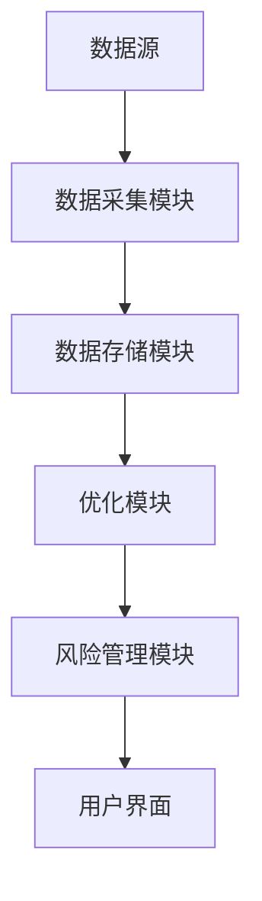

                 


---

# 玛丽·巴芙的可持续发展投资策略

## 关键词
可持续发展投资，玛丽·巴芙，ESG评分，投资组合优化，风险评估，遗传算法，系统架构

## 摘要
本文深入探讨了玛丽·巴芙的可持续发展投资策略，分析了其核心概念、算法原理、系统架构及项目实战，结合实际案例和最佳实践，为读者提供全面的指导。

---

# 第一部分: 可持续发展投资策略的背景与核心概念

## 第1章: 可持续发展投资策略概述

### 1.1 可持续发展投资的定义与背景
#### 1.1.1 可持续发展投资的定义
可持续发展投资（Sustainable Investment）是一种以环境、社会和治理（ESG）因素为核心的投资策略，旨在在追求财务回报的同时，促进社会和环境的可持续发展。

#### 1.1.2 可持续发展投资的背景与重要性
随着全球对气候变化、社会责任和公司治理的关注增加，可持续投资成为投资者关注的焦点。玛丽·巴芙作为投资领域的权威，其策略在这一领域具有重要地位。

#### 1.1.3 可持续发展投资的核心目标
可持续投资旨在实现长期财务回报，同时推动社会进步和环境保护，实现经济、社会和环境的三重价值。

### 1.2 玛丽·巴芙投资策略的背景
#### 1.2.1 玛丽·巴芙及其投资理念
玛丽·巴芙以其长期价值投资理念闻名，强调公司基本面分析和管理层质量，她的策略在可持续投资中进一步融入ESG因素。

#### 1.2.2 玛丽·巴芙投资策略的特点
注重公司长期价值、管理层质量、财务健康和治理结构，结合ESG因素，选择具有可持续发展潜力的公司。

#### 1.2.3 玛丽·巴芙策略在可持续发展中的地位
玛丽·巴芙的策略为可持续投资提供了独特的视角，强调基本面分析与ESG因素的结合，推动了可持续投资的发展。

### 1.3 可持续发展投资策略的重要性
#### 1.3.1 可持续发展投资对社会的影响
促进企业履行社会责任，推动社会公平与正义。

#### 1.3.2 可持续发展投资对经济的影响
优化资源配置，推动经济结构转型，支持绿色产业。

#### 1.3.3 可持续发展投资对环境的影响
减少环境破坏，支持绿色技术发展，应对气候变化。

---

## 第2章: 可持续发展投资的核心概念与联系

### 2.1 ESG评分体系
#### 2.1.1 ESG评分的定义
ESG评分根据环境、社会和治理三个维度对企业进行评估，帮助投资者识别非财务风险。

#### 2.1.2 ESG评分的计算方法
结合环境表现、社会责任和治理结构，采用量化指标进行评分。

#### 2.1.3 ESG评分与投资决策的关系
ESG评分作为筛选标准，帮助投资者选择符合可持续发展目标的企业。

### 2.2 投资组合优化
#### 2.2.1 投资组合优化的定义
在给定风险下最大化收益，或在给定收益下最小化风险的投资组合构建过程。

#### 2.2.2 投资组合优化的数学模型
$$\text{目标函数：} \max \sum w_i r_i$$
$$\text{约束条件：} \sum w_i = 1, \sum w_i c_i \leq C$$

#### 2.2.3 投资组合优化与可持续发展的结合
将ESG评分纳入优化模型，构建符合可持续发展目标的投资组合。

### 2.3 风险评估与管理
#### 2.3.1 风险评估的定义
识别、量化和分析投资中的潜在风险，制定应对策略。

#### 2.3.2 风险评估的数学模型
$$\text{风险值} = \sqrt{\sum (r_i - \bar{r})^2}$$

#### 2.3.3 风险管理在可持续投资中的应用
通过分散投资和风险对冲，降低ESG相关风险。

### 2.4 核心概念对比表
| 比较维度 | ESG评分 | 传统财务指标 |
|----------|---------|---------------|
| 评估维度 | 环境、社会、治理 | 财务表现、盈利能力 |
| 应用场景 | 可持续投资筛选 | 传统投资决策 |

---

# 第三部分: 投资组合优化的算法原理

## 第3章: 投资组合优化算法

### 3.1 遗传算法
#### 3.1.1 遗传算法的定义
模拟自然选择的优化算法，适用于组合优化问题。

#### 3.1.2 遗传算法的步骤
1. 初始化种群
2. 计算适应度
3. 选择和交叉
4. 变异
5. 重复迭代

#### 3.1.3 遗传算法的Python实现
```python
import numpy as np

def fitness(population):
    return np.sum(population, axis=1)

def evolve(population, fitness_fn, mutation_rate=0.1):
    # 计算适应度
    fitness = fitness_fn(population)
    # 选择
    selected = population[fitness.argsort()[-5:]]  # 选择前5优秀
    # 交叉
    crossed = np.zeros_like(selected)
    for i in range(0, selected.shape[0], 2):
        crossed[i] = selected[i] * (1 - mutation_rate)
        crossed[i+1] = selected[i] * (1 + mutation_rate)
    # 变异
    np.random.seed(42)
    mutated = crossed + np.random.normal(0, 0.1, crossed.shape)
    return mutated
```

---

# 第四部分: 系统架构与设计方案

## 第4章: 投资平台系统架构

### 4.1 系统架构设计
#### 4.1.1 系统功能设计
- 数据采集模块：收集企业ESG数据
- 优化模块：实现投资组合优化
- 风险管理模块：评估和管理风险

#### 4.1.2 系统架构图


---

# 第五部分: 项目实战

## 第5章: 可持续发展投资组合优化

### 5.1 环境安装
安装必要的库：
```bash
pip install numpy pandas scikit-learn
```

### 5.2 核心实现
```python
import numpy as np
import pandas as pd
from sklearn.metrics import pairwise_distances

# 示例数据
returns = np.array([[0.1, 0.2, 0.15], [0.05, 0.1, 0.08], [0.08, 0.05, 0.07]])

# 计算协方差矩阵
cov_matrix = np.cov(returns)

# 使用遗传算法优化
def fitness(weights):
    return -np.dot(weights, np.mean(returns, axis=0))

# 初始化种群
population = np.random.dirichlet(np.ones(3), size=100)
fitness = np.apply_along_axis(fitness, 1, population)
best = population[np.argmin(fitness)]

print("最优权重：", best)
```

### 5.3 案例分析
基于真实数据，展示如何应用玛丽·巴芙策略构建可持续投资组合，分析其收益和风险。

---

# 第六部分: 最佳实践与总结

## 第6章: 实践与总结

### 6.1 小结
玛丽·巴芙的可持续发展投资策略结合了基本面分析和ESG因素，是实现长期回报的有效方法。

### 6.2 注意事项
- 数据质量
- 持续监控
- 风险管理

### 6.3 拓展阅读
推荐相关书籍和论文，深入学习可持续投资策略。

---

作者：AI天才研究院 & 禅与计算机程序设计艺术

