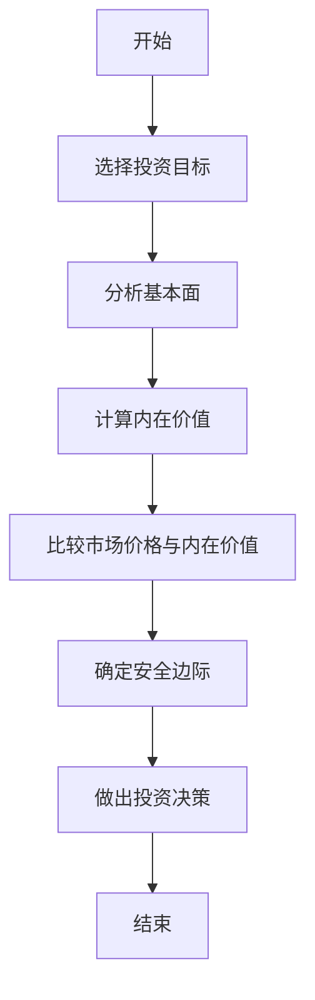
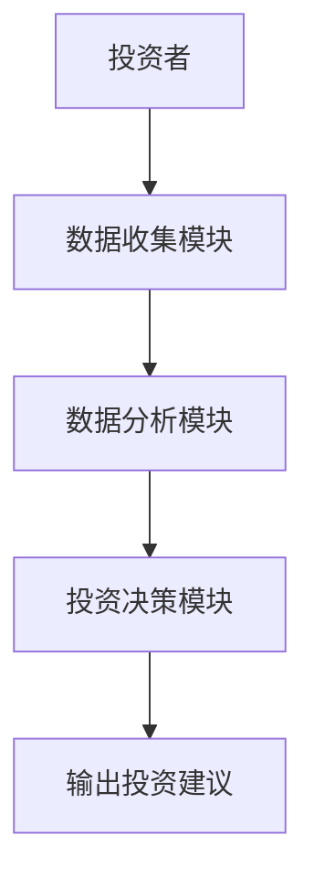

                 


# 玛丽·巴芙的女性视角价值投资

> **关键词**：价值投资、玛丽·巴芙、投资策略、安全边际、内在价值、投资决策  
> **摘要**：本文从玛丽·巴芙的女性视角出发，重新诠释价值投资的核心理念，强调基本面分析的重要性。通过详细分析价值投资的原理、算法、系统架构以及实战案例，提出了一种结合安全边际和内在价值的评估方法，为投资者提供了新的视角和思路。

---

## 第一部分: 价值投资的背景与核心概念

### 第1章: 价值投资的基本概念

#### 1.1 价值投资的定义与核心理念
##### 1.1.1 价值投资的起源与发展
价值投资是一种以基本面分析为基础的投资策略，起源于20世纪初。它强调通过分析企业的内在价值，寻找市场价格低于内在价值的股票进行投资。玛丽·巴芙作为价值投资的代表人物之一，她的女性视角为这一领域带来了新的思考方式。

##### 1.1.2 价值投资的核心理念
价值投资的核心理念是“以合理的价格买入优质资产”。它注重企业的财务状况、行业地位、盈利能力以及管理团队等因素，而非短期市场波动。玛丽·巴芙强调长期投资和价值发现，认为市场的短期波动是投资机会的来源。

##### 1.1.3 玛丽·巴芙的女性视角
玛丽·巴芙的女性视角体现在她对细节的关注、对长期价值的执着以及对风险管理的重视。她认为，投资不仅是对数字的分析，更是对人性的理解。这种视角使她能够发现市场中被忽视的投资机会。

#### 1.2 投资的基本问题与价值投资的解决思路
##### 1.2.1 投资的基本问题
投资的基本问题是如何在不确定的市场中实现资产的保值与增值。传统投资方法往往依赖于市场的短期波动，而价值投资则试图通过长期持有的方式，获得企业的成长收益。

##### 1.2.2 价值投资的解决思路
价值投资的核心解决思路是通过深入分析企业的基本面，找到市场价格低于内在价值的股票。玛丽·巴芙强调，这种分析不仅仅是数字游戏，更是一种对企业和行业未来发展的洞察。

##### 1.2.3 价值投资的边界与外延
价值投资的边界在于其对市场价格的低估要求，而外延则体现在其对长期价值的关注。玛丽·巴芙的女性视角使她能够将价值投资的外延扩展到对社会趋势、行业变革的敏感捕捉。

#### 1.3 价值投资的核心要素与概念结构
##### 1.3.1 核心概念的属性特征对比
以下是价值投资与其他投资策略的核心概念对比：

| 概念       | 价值投资       | 其他投资策略 |
|------------|----------------|--------------|
| 核心理念    | 内在价值        | 市场波动      |
| 投资期限    | 长期           | 短期          |
| 分析方法    | 基本面分析      | 技术分析      |
| 风险管理    | 安全边际        | 杠杆操作      |

##### 1.3.2 价值投资的ER实体关系图
以下是价值投资的核心实体关系图：

```mermaid
er
  actor 投资者
  actor 市场
  actor 企业
  actor 管理层
  entity 投资组合
  entity 股票
  entity 财务报表
  entity 估值模型
  relation 投资者 -> 投资组合: 持有
  relation 投资组合 -> 股票: 包含
  relation 股票 -> 企业: 属于
  relation 企业 -> 管理层: 雇佣
  relation 企业 -> 财务报表: 提供
  relation 财务报表 -> 估值模型: 输入
  relation 估值模型 -> 投资者: 输出
```

---

## 第二部分: 价值投资的核心概念与联系

### 第2章: 价值投资的原理与数学模型

#### 2.1 价值投资的原理
##### 2.1.1 安全边际的计算方法
安全边际是价值投资中的一个重要概念，它是指市场价格与内在价值之间的差额。计算公式为：

$$ 安全边际 = 内在价值 - 市场价格 $$

玛丽·巴芙认为，安全边际越大，投资的风险越小。

##### 2.1.2 内在价值的评估方法
内在价值是基于企业未来现金流的折现值。使用 discounted cash flow (DCF) 模型计算：

$$ 内在价值 = \sum_{t=1}^{n} \frac{CF_t}{(1 + r)^t} $$

其中，$CF_t$ 是第 $t$ 年的现金流，$r$ 是折现率。

##### 2.1.3 股价波动与市场情绪的影响
股价波动与市场情绪密切相关。玛丽·巴芙认为，市场情绪的波动为价值投资者提供了低价买入的机会。

#### 2.2 价值投资的数学模型
##### 2.2.1 内在价值计算公式
以下是 DCF 模型的代码实现：

```python
def calculate_intrinsic_value(cash_flows, discount_rate):
    present_value = 0
    for t, cf in enumerate(cash_flows):
        present_value += cf / (1 + discount_rate) ** t
    return present_value
```

##### 2.2.2 投资组合优化模型
投资组合优化模型可以使用均值-方差优化：

$$ \min_{w} w^T \Sigma w $$
$$ \text{subject to } w^T \mu = target\_return $$

其中，$w$ 是权重向量，$\Sigma$ 是协方差矩阵，$\mu$ 是收益向量。

##### 2.2.3 风险与收益的数学关系
风险与收益之间的关系可以用资本资产定价模型（CAPM）描述：

$$ E(R_i) = R_f + \beta_i (E(R_m) - R_f) $$

其中，$E(R_i)$ 是资产 $i$ 的预期收益，$R_f$ 是无风险利率，$\beta_i$ 是资产 $i$ 的贝塔系数，$E(R_m)$ 是市场预期收益。

#### 2.3 投资决策的流程图
以下是投资决策的流程图：



---

## 第三部分: 价值投资的系统分析与架构设计

### 第3章: 价值投资的系统架构

#### 3.1 价值投资的系统架构
##### 3.1.1 系统功能设计
以下是价值投资系统的功能模块设计：

- 数据收集模块：获取企业的财务数据和市场数据。
- 数据分析模块：计算内在价值和安全边际。
- 投资决策模块：根据分析结果做出投资决策。

##### 3.1.2 系统架构图
以下是系统架构图：



#### 3.2 系统接口设计
##### 3.2.1 系统接口设计
以下是系统接口的设计：

```mermaid
sequence
    投资者 -> 数据收集模块: 获取数据
    数据收集模块 -> 数据分析模块: 分析数据
    数据分析模块 -> 投资决策模块: 提供分析结果
    投资决策模块 -> 投资者: 输出投资建议
```

---

## 第四部分: 价值投资的项目实战

### 第4章: 价值投资的实战案例

#### 4.1 环境安装与数据准备
##### 4.1.1 环境安装
安装 Python 和相关库（如 pandas、numpy）。

##### 4.1.2 数据准备
获取目标企业的财务数据和市场数据。

#### 4.2 核心代码实现
##### 4.2.1 内在价值计算代码
以下是 DCF 模型的代码实现：

```python
import pandas as pd
import numpy as np

def calculate_intrinsic_value(cash_flows, discount_rate):
    present_value = 0
    for t, cf in enumerate(cash_flows):
        present_value += cf / (1 + discount_rate) ** t
    return present_value

# 示例数据
cash_flows = [100, 120, 130, 150]
discount_rate = 0.10

iv = calculate_intrinsic_value(cash_flows, discount_rate)
print(f"内在价值为：{iv}")
```

#### 4.3 案例分析
##### 4.3.1 案例分析
以某公司为例，计算其内在价值，并与市场价格进行对比，确定安全边际。

---

## 第五部分: 最佳实践与小结

### 第5章: 最佳实践

#### 5.1 小结
价值投资是一种长期有效的投资策略，玛丽·巴芙的女性视角为这一策略注入了新的活力。通过基本面分析和安全边际的计算，投资者可以在市场波动中找到优质的投资机会。

#### 5.2 注意事项
- 投资者需持续学习和更新知识。
- 价值投资需要耐心和纪律。
- 风险管理是投资成功的关键。

#### 5.3 拓展阅读
- 《投资学基础》
- 《价值投资实战》
- 玛丽·巴芙的著作

---

## 参考文献

- 玛丽·巴芙的著作
- 投资学相关书籍
- 金融市场的研究报告

---

**作者：AI天才研究院/AI Genius Institute & 禅与计算机程序设计艺术/Zen And The Art of Computer Programming**

