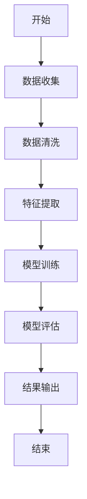

                 


# 玛丽·巴芙的性别多元化投资策略

> 关键词：性别多元化投资，玛丽·巴芙，投资策略，性别平等，投资模型

> 摘要：本文深入分析了玛丽·巴芙在性别多元化投资领域的创新策略，探讨了性别多元化投资的核心概念、算法原理、系统架构及实际应用。通过详细阐述性别多元化投资的背景、原理、方法及实践案例，本文为投资领域提供了新的视角和策略。

---

## 第一部分: 性别多元化投资策略的背景与核心概念

### 第1章: 性别多元化投资策略的背景与问题背景

#### 1.1 性别多元化投资的背景介绍
- **1.1.1 投资领域中的性别多样性问题**  
  投资领域长期存在性别失衡现象，女性在投资决策中的参与度较低，导致市场机会的流失和投资组合的多样性不足。

- **1.1.2 玛丽·巴芙的性别多元化投资理念**  
  玛丽·巴芙提出，通过关注女性领导的企业和性别平等的公司，可以实现更高的投资回报和更广泛的社会价值。

- **1.1.3 性别多元化投资的社会意义与经济价值**  
  性别多元化投资不仅有助于促进性别平等，还能通过多元化投资组合降低风险，提高长期收益。

#### 1.2 投资领域中的性别差异现状
- **1.2.1 全球投资领域的性别失衡现状**  
  全球范围内，女性在投资领域中的参与度不足，特别是在高层管理岗位和董事会中，女性比例显著低于男性。

- **1.2.2 美国、欧洲等主要投资市场的性别差异分析**  
  以美国为例，女性在私募股权和风险投资领域的参与度不足30%，而在欧洲，这一比例更低。

- **1.2.3 亚洲市场的性别多元化投资趋势**  
  亚洲市场逐渐意识到性别多元化的重要性，越来越多的投资机构开始关注女性领导的企业。

#### 1.3 性别多元化投资的目标与边界
- **1.3.1 性别多元化投资的核心目标**  
  通过投资于性别平等的公司，实现长期收益和性别平等的双重目标。

- **1.3.2 性别多元化投资的边界与外延**  
  性别多元化投资的边界包括但不限于投资标的的选择、性别平等的评估标准等。

- **1.3.3 性别多元化投资与其他投资策略的关系**  
  性别多元化投资是传统投资策略的一种补充，它通过引入性别维度，丰富了投资组合的选择。

#### 1.4 本章小结
本章通过分析性别多元化投资的背景、现状及目标，为后续章节的深入讨论奠定了基础。

---

### 第2章: 性别多元化投资的核心概念与联系

#### 2.1 性别多元化投资的核心概念
- **2.1.1 性别多元化投资的定义与内涵**  
  性别多元化投资是指在投资决策中，优先考虑女性领导的企业或性别平等表现优异的公司。

- **2.1.2 性别多元化投资的关键要素**  
  包括性别平等指标、投资组合构建、风险控制等。

- **2.1.3 性别多元化投资的实现路径**  
  通过数据收集、模型构建和投资组合优化实现。

#### 2.2 性别多元化投资的核心原理
- **2.2.1 性别多元化投资的理论基础**  
  基于多元化投资组合理论，性别多元化投资通过引入性别维度，进一步降低风险。

- **2.2.2 性别多元化投资的逻辑框架**  
  从数据收集、分析、评估到投资决策的全过程。

- **2.2.3 性别多元化投资的数学模型**  
  使用多元回归模型分析性别平等与投资回报的关系。

#### 2.3 性别多元化投资与传统投资的对比
- **2.3.1 投资目标的对比**  
  传统投资注重财务回报，而性别多元化投资注重财务回报和社会价值的双重目标。

- **2.3.2 投资策略的对比**  
  传统投资策略基于财务指标，而性别多元化投资策略引入性别维度。

- **2.3.3 投资效果的对比**  
  研究表明，性别多元化投资在长期回报上具有优势。

#### 2.4 性别多元化投资的ER实体关系图
```mermaid
er
actor(投资者) -->
company(公司) -->
gender_diversity_indicator(性别多样性指标)
```

#### 2.5 本章小结
本章通过定义和对比，明确了性别多元化投资的核心概念及其与传统投资的区别。

---

### 第3章: 性别多元化投资的算法原理与数学模型

#### 3.1 性别多元化投资的评估模型
- **3.1.1 性别多元化指数的计算方法**  
  通过量化性别平等指标（如董事会中女性比例、高管中女性比例等），计算性别多元化指数。

- **3.1.2 性别多元化投资的评分标准**  
  根据性别多元化指数对目标公司进行评分。

- **3.1.3 性别多元化投资的决策树**  
  通过决策树模型优化投资决策。

#### 3.2 性别多元化投资的数学模型
- **3.2.1 性别多元化投资的回归模型**  
  使用多元回归模型分析性别平等与投资回报的关系。

- **3.2.2 性别多元化投资的分类模型**  
  使用逻辑回归模型对性别平等表现优异的公司进行分类。

- **3.2.3 性别多元化投资的聚类分析**  
  通过聚类分析识别性别平等表现相似的公司群。

#### 3.3 性别多元化投资的算法流程图


#### 3.4 性别多元化投资的Python代码实现
```python
import pandas as pd
from sklearn.linear_model import LinearRegression
from sklearn.metrics import r2_score

# 数据收集
data = pd.read_csv('gender_diversity_data.csv')

# 特征提取
X = data[['female_executives', 'female_board_members']]
y = data['return']

# 模型训练
model = LinearRegression()
model.fit(X, y)

# 模型评估
y_pred = model.predict(X)
r2 = r2_score(y, y_pred)
print(f'R² Score: {r2}')
```

#### 3.5 本章小结
本章通过数学模型和算法流程图，详细介绍了性别多元化投资的评估和决策过程。

---

## 第二部分: 性别多元化投资的系统分析与架构设计

### 第4章: 性别多元化投资系统的架构设计

#### 4.1 系统功能设计
- **4.1.1 数据收集模块**  
  收集性别平等指标和投资回报数据。

- **4.1.2 数据分析模块**  
  使用机器学习算法对数据进行分析和建模。

- **4.1.3 投资决策模块**  
  根据分析结果生成投资建议。

#### 4.2 系统架构设计


#### 4.3 系统交互设计
```mermaid
sequenceDiagram
    actor 投资者 -> 中间件: 发送请求
    中间件 -> 后端: 转发请求
    后端 -> 数据库: 查询数据
    数据库 -> 后端: 返回数据
    后端 -> 中间件: 返回数据
    中间件 -> 投资者: 返回结果
```

#### 4.4 本章小结
本章通过系统架构设计，展示了性别多元化投资平台的技术实现方案。

---

## 第三部分: 性别多元化投资的项目实战

### 第5章: 项目实战与案例分析

#### 5.1 项目环境搭建
- 安装Python和相关库（如pandas、scikit-learn）。

#### 5.2 系统核心实现
- 数据收集与清洗、特征提取、模型训练与评估。

#### 5.3 案例分析
- 使用玛丽·巴芙的策略，分析某女性领导企业的投资回报。

#### 5.4 经验总结与优化
- 总结项目中的经验和教训，优化投资模型。

#### 5.5 本章小结
本章通过实际案例，展示了性别多元化投资策略的应用。

---

## 第四部分: 性别多元化投资的最佳实践

### 第6章: 性别多元化投资的最佳实践与注意事项

#### 6.1 投资策略的优化建议
- 定期更新性别平等指标，优化投资组合。

#### 6.2 投资过程中的注意事项
- 数据来源的可靠性、模型的局限性等。

#### 6.3 性别多元化投资的未来趋势
- 技术与商业的结合，人工智能在性别多元化投资中的应用。

#### 6.4 本章小结
本章总结了性别多元化投资的最佳实践和未来发展方向。

---

## 作者

作者：AI天才研究院/AI Genius Institute & 禅与计算机程序设计艺术 /Zen And The Art of Computer Programming

---

以上是《玛丽·巴芙的性别多元化投资策略》的技术博客文章的完整目录和内容概要，每章内容都可以进一步扩展和详细阐述。

