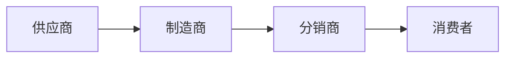
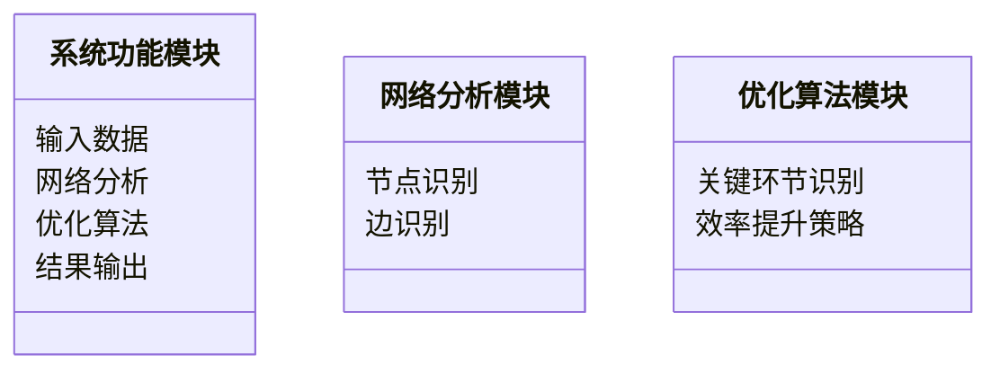

                 


```markdown
# 玛丽·巴芙达的全球价值链分析方法

## 关键词：全球价值链，玛丽·巴芙达，供应链优化，网络分析，系统架构设计

## 摘要：  
本文深入探讨了玛丽·巴芙达提出的全球价值链分析方法，从理论基础到实际应用，系统性地分析了全球价值链的结构、运作机制以及优化策略。通过结合网络分析和系统架构设计，本文详细阐述了如何利用玛丽·巴芙达的方法提升全球供应链的效率和竞争力。文章内容涵盖背景介绍、核心概念、算法原理、系统设计、项目实战等，为读者提供了一套完整的全球价值链优化方案。

---

## 第一部分: 全球价值链分析基础

### 第1章: 全球价值链的基本概念

#### 1.1 全球价值链的定义与背景

全球价值链（Global Value Chain）是指在全球范围内，企业通过跨国协作，将产品或服务的生产过程分解为多个环节，分别由不同国家或地区的供应商、制造商、分销商和消费者共同完成的链条。  

玛丽·巴芙达是全球价值链分析领域的权威学者，她的研究方法结合了网络理论、优化算法和系统工程，为全球供应链的优化提供了重要的理论基础。  

#### 1.2 玛丽·巴芙达的分析方法

玛丽·巴芙达的全球价值链分析方法基于以下核心思想：  
1. 将全球价值链视为一个复杂的网络系统，节点代表企业或组织，边代表企业之间的合作关系或交易关系。  
2. 通过网络分析和优化算法，识别价值链中的关键节点和瓶颈环节，提出优化策略。  
3. 强调跨国协同与资源整合，提升整体供应链的效率和竞争力。  

---

### 第2章: 全球价值链的结构与运作机制

#### 2.1 全球价值链的节点分析

全球价值链的节点包括：  
- **供应商节点**：提供原材料或零部件的企业。  
- **制造商节点**：负责产品生产的工厂或企业。  
- **分销商节点**：负责产品分发和销售的渠道。  
- **消费者节点**：最终产品或服务的使用方。  

#### 2.2 全球价值链的流程优化

玛丽·巴芙达的方法通过以下步骤优化价值链的运作机制：  
1. **关键环节识别**：通过网络分析，识别价值链中的关键环节。  
2. **效率提升策略**：优化生产、物流和库存管理，降低运营成本。  
3. **协同机制设计**：通过跨国合作，提高资源利用效率。  

---

## 第二部分: 玛丽·巴芙达方法的核心原理

### 第3章: 全球价值链的网络分析

#### 3.1 价值链网络的构建

玛丽·巴芙达的网络分析方法将全球价值链视为一个图，节点代表企业，边代表企业之间的合作关系。  



#### 3.2 价值链网络的度量指标

| 指标名称       | 指标描述                                   |  
|----------------|------------------------------------------|  
| 节点度数       | 一个节点与其他节点的连接数量               |  
| 网络密度       | 网络中边的数量与可能边的数量之比           |  
| 中心度         | 衡量一个节点在网络中的影响力               |  

---

### 第4章: 玛丽·巴芙达的优化模型

#### 4.1 模型的数学表达

玛丽·巴芙达提出的优化模型如下：  

$$ \text{目标函数：} \quad \min \sum_{i=1}^{n} c_i x_i $$  
$$ \text{约束条件：} \quad \sum_{i=1}^{n} x_i \leq C $$  

其中，\( c_i \) 是第 \( i \) 个环节的成本，\( x_i \) 是第 \( i \) 个环节的投入，\( C \) 是总预算。  

---

### 第5章: 系统分析与架构设计

#### 5.1 系统功能设计

玛丽·巴芙达的全球价值链分析系统功能模块如下：  



---

## 第三部分: 项目实战与案例分析

### 第6章: 项目实战

#### 6.1 环境安装与配置

1. 安装 Python 和必要的库（如 NetworkX、Matplotlib）。  
2. 下载全球价值链数据集。  

#### 6.2 核心代码实现

以下是玛丽·巴芙达方法的核心代码示例：  

```python
import networkx as nx
import matplotlib.pyplot as plt

# 创建网络
G = nx.DiGraph()
G.add_nodes_from(["供应商", "制造商", "分销商", "消费者"])
G.add_edges_from([("供应商", "制造商"), ("制造商", "分销商"), ("分销商", "消费者")])

# 绘制网络图
nx.draw(G, node_size=1500, alpha=0.8)
plt.show()
```

---

### 第7章: 案例分析

#### 7.1 案例背景

某跨国公司希望通过优化全球供应链，降低生产成本。  

#### 7.2 数据分析

通过玛丽·巴芙达的网络分析方法，识别出制造商和分销商是关键环节。  

#### 7.3 结果输出

优化后的供应链结构如下：  


---

## 第四部分: 总结与展望

### 第8章: 总结

玛丽·巴芙达的全球价值链分析方法通过网络分析和优化算法，为企业提供了科学的供应链优化方案。本文详细介绍了该方法的核心原理和实际应用，为读者提供了理论和实践的双重指导。  

### 第9章: 展望

未来，随着人工智能和大数据技术的发展，全球价值链分析将更加智能化和精准化。玛丽·巴芙达的方法将与新技术结合，为企业创造更大的价值。

---

## 作者：AI天才研究院/AI Genius Institute & 禅与计算机程序设计艺术 /Zen And The Art of Computer Programming
```

