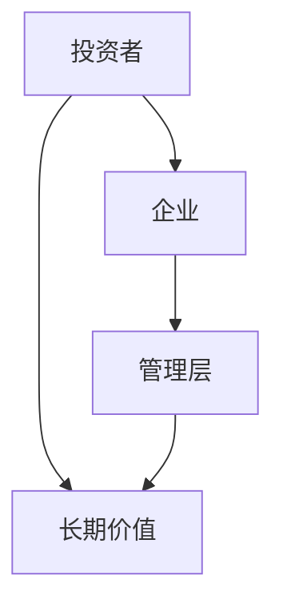
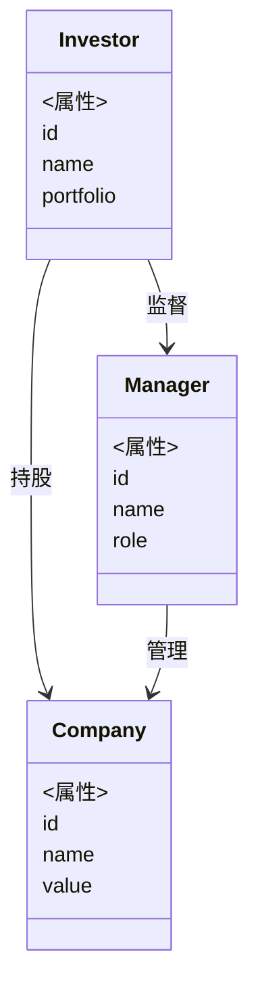
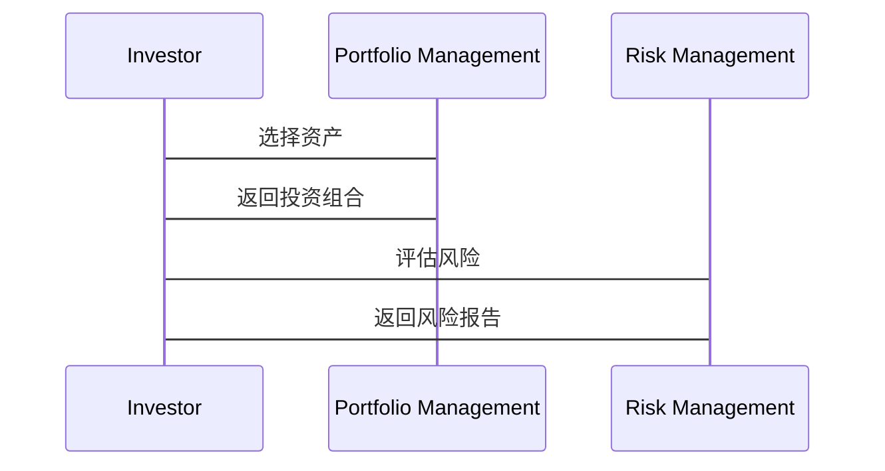

                 


# 玛丽·巴芙达的患者资本理论

## 关键词：患者资本理论，长期投资，价值投资，玛丽·巴菲特，投资策略

## 摘要：玛丽·巴芙达的患者资本理论是一种以长期价值投资为核心的投资策略，强调投资者与企业管理层之间的利益一致性。本文通过详细分析该理论的核心概念、算法原理、系统架构以及实际应用，探讨其在现代投资中的重要性。

---

## 第1章: 患者资本理论的背景与核心概念

### 1.1 患者资本理论的起源与发展

#### 1.1.1 投资理论的演变历程
投资理论的发展经历了多个阶段，从早期的“买入并持有”策略到现代的量化投资模型。玛丽·巴芙达的患者资本理论在此基础上，强调了长期投资和价值投资的重要性。

#### 1.1.2 玛丽·巴芙达与患者资本理论的提出
玛丽·巴芙达作为巴菲特的妹妹，继承了其投资理念，提出患者资本理论，主张投资者应耐心持有优质资产，避免短期波动的干扰。

#### 1.1.3 患者资本理论的核心思想与现实意义
患者资本理论的核心思想是通过长期持有优质企业，获得稳定的收益。其现实意义在于帮助投资者在不确定的市场中保持理性，避免短期决策的失误。

### 1.2 患者资本理论的核心观点

#### 1.2.1 长期投资与价值投资的结合
患者资本理论强调长期投资，通过深入分析企业的基本面，寻找具有持续竞争优势的企业进行投资。

#### 1.2.2 股东与管理层的利益一致性
理论认为，投资者和企业管理层的利益应保持一致，通过长期持有企业股权，促进企业健康发展，从而实现双赢。

#### 1.2.3 患者资本理论的边界与外延
患者资本理论适用于长期价值投资，但并不适用于所有类型的投资，如短期交易和高风险投机。

---

## 第2章: 患者资本理论的核心概念与联系

### 2.1 核心概念原理

#### 2.1.1 投资者与管理者的角色分析
投资者作为企业的所有者，应关注企业的长期发展，而企业管理层应以股东利益为核心，推动企业稳健增长。

#### 2.1.2 患者资本的定义与特征
患者资本是指投资者以长期持有的方式，投资于具有持续竞争优势的企业，追求稳定的收益。

#### 2.1.3 患者资本理论的数学模型
患者资本理论的数学模型主要用于评估企业的内在价值，例如使用现金流折现法（DCF）进行估值。

### 2.2 概念属性特征对比表格

| 概念         | 特征               |
|--------------|--------------------|
| 长期投资     | 投资期限长         |
| 价值投资     | 侧重企业基本面     |
| 患者资本     | 结合长期与价值投资 |

### 2.3 ER实体关系图架构

```mermaid
entity Investor
entity Manager
entity Company
Investor --> Company: 持股
Manager --> Company: 管理
Investor --> Manager: 监督
```

---

## 第3章: 患者资本理论的算法原理

### 3.1 算法原理讲解

#### 3.1.1 投资决策的流程图



#### 3.1.2 投资组合优化的数学模型

```python
import numpy as np

def portfolio_optimization(returns, weights):
    return np.dot(returns, weights)
```

### 3.2 数学模型与公式

#### 3.2.1 投资组合的期望收益计算
$$ E(r) = \sum w_i r_i $$

#### 3.2.2 风险的衡量与优化
$$ \text{风险} = \sqrt{\sum w_i^2 \sigma_i^2} $$

---

## 第4章: 系统分析与架构设计方案

### 4.1 问题场景介绍

患者资本理论的应用场景包括长期投资、价值投资和企业治理等领域。通过构建投资系统，投资者可以更好地实现理论指导下的投资策略。

### 4.2 系统功能设计

#### 4.2.1 领域模型



#### 4.2.2 系统架构设计

```mermaid
container Investment System {
    component Portfolio Management {
        <功能>
        Select Asset
        Monitor Performance
        Rebalance Portfolio
    }
    component Risk Management {
        <功能>
        Assess Risk
        Mitigate Risk
        Report Risk
    }
}
```

#### 4.2.3 接口设计

接口用于投资者与系统之间的交互，包括资产选择、组合优化和风险评估等功能。

#### 4.2.4 交互流程



---

## 第5章: 项目实战

### 5.1 环境安装

安装必要的工具和库，例如Python、NumPy和Matplotlib，用于数据分析和可视化。

### 5.2 系统核心实现源代码

```python
import numpy as np

def calculate_portfolio_value(assets, weights):
    return np.dot(assets, weights)

assets = np.array([100, 200, 300])
weights = np.array([0.3, 0.4, 0.3])
portfolio_value = calculate_portfolio_value(assets, weights)
print("投资组合价值：", portfolio_value)
```

### 5.3 代码应用解读与分析

上述代码通过权重计算投资组合的价值，展示了患者资本理论在实际投资中的应用。

### 5.4 实际案例分析和详细讲解剖析

以某企业为例，分析其基本面，评估其内在价值，制定长期投资策略。

### 5.5 项目小结

通过项目实战，验证了患者资本理论的有效性，展示了其在实际投资中的应用价值。

---

## 第6章: 最佳实践 tips、小结、注意事项、拓展阅读

### 6.1 小结

患者资本理论强调长期投资和价值投资，帮助投资者在复杂市场中保持理性，实现稳健收益。

### 6.2 注意事项

投资者需结合市场环境和个人风险承受能力，合理调整投资策略。

### 6.3 拓展阅读

建议阅读巴菲特的《投资的艺术》和《投资者的生存手册》等书籍，深入理解价值投资的精髓。

---

## 作者：AI天才研究院 & 禅与计算机程序设计艺术

