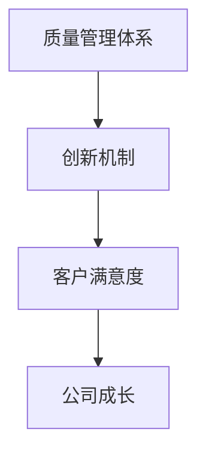
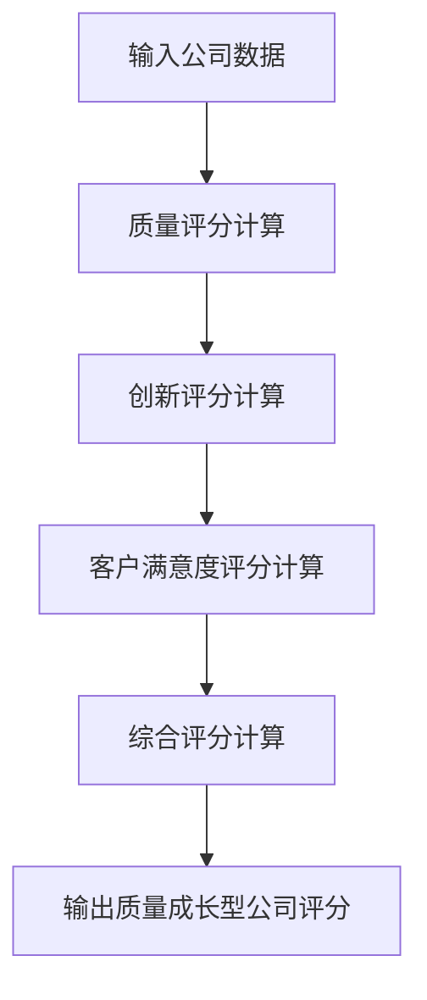
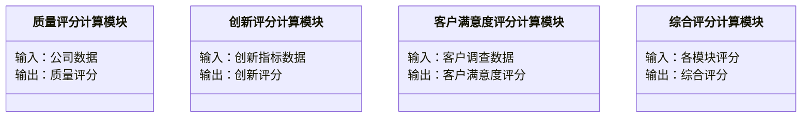
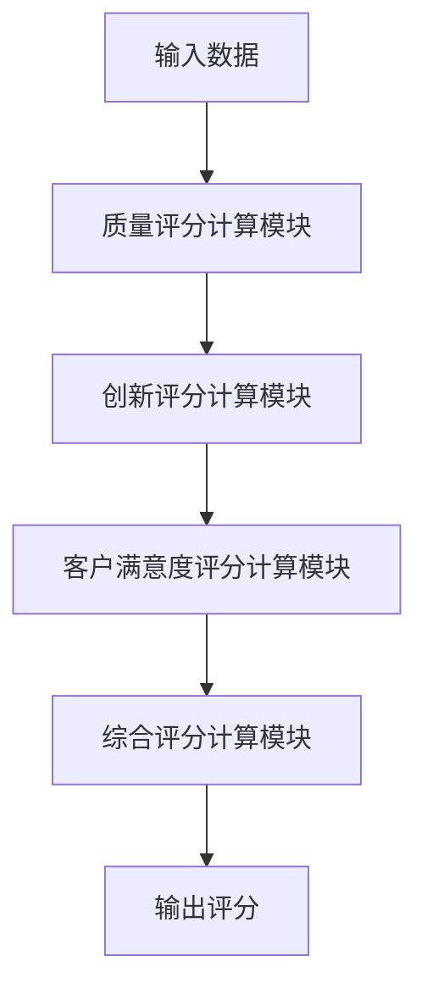

                 


# 玛丽·巴芙达的质量成长型公司识别方法

> 关键词：质量成长型公司，识别方法，玛丽·巴芙达，企业管理，创新机制，客户满意度，可持续发展

> 摘要：本文详细介绍了质量成长型公司的定义、核心概念、识别方法和实际应用。通过玛丽·巴芙达的理论框架，结合实际案例分析，阐述了如何通过质量管理体系、创新机制和客户满意度等多维度评估公司质量，并构建数学模型和系统架构，指导企业实现高质量成长。

---

# 第一部分: 质量成长型公司的背景与定义

## 第1章: 质量成长型公司的定义与背景

### 1.1 质量成长型公司的定义

#### 1.1.1 质量成长型公司的核心概念

质量成长型公司是指在质量管理和创新机制方面具有显著优势，并能够在市场中持续增长的企业。其核心在于通过高质量的产品和服务赢得客户信任，从而实现长期发展。

#### 1.1.2 质量成长型公司的背景与重要性

在现代商业环境中，质量已成为企业竞争力的关键因素。高质量的产品不仅能够提高客户满意度，还能增强企业的市场地位和盈利能力。质量成长型公司通过不断优化质量管理流程，推动技术创新，从而在竞争中脱颖而出。

#### 1.1.3 质量成长型公司的核心要素

质量成长型公司通常具备以下核心要素：
- **质量管理体系**：建立完善的质量控制流程，确保产品和服务的高标准。
- **创新机制**：通过持续创新提升产品和服务的质量，满足客户需求。
- **客户满意度**：以客户为中心，通过高质量的产品和服务提高客户忠诚度。

### 1.2 质量成长型公司的问题背景

#### 1.2.1 传统公司与质量成长型公司的区别

传统公司通常关注成本控制和短期利润，而质量成长型公司则更注重产品质量和长期发展。传统公司可能忽视客户满意度和创新，而质量成长型公司则将这些作为核心竞争力。

#### 1.2.2 质量成长型公司面临的挑战

- **市场竞争加剧**：行业内的竞争日益激烈，企业需要不断创新以保持优势。
- **客户需求变化**：客户对产品质量和个性化服务的需求不断提高。
- **质量管理成本**：建立高质量管理体系需要投入大量资源，但回报周期较长。

#### 1.2.3 质量成长型公司的目标与愿景

质量成长型公司的目标是通过高质量的产品和服务实现持续增长，成为行业内的领导者。其愿景是打造一个以客户为中心、创新驱动、质量卓越的企业。

---

## 第2章: 质量成长型公司的核心概念与联系

### 2.1 核心概念与原理

#### 2.1.1 质量管理体系的核心要素

- **质量方针**：企业对质量管理的总体指导思想和目标。
- **质量目标**：具体的质量改进目标，如减少缺陷率、提高客户满意度等。
- **质量控制流程**：从原材料采购到产品交付的全过程质量监控。

#### 2.1.2 创新机制与质量提升的关系

创新是质量提升的核心驱动力。通过技术创新、流程优化和管理改进，企业能够不断推出高质量的产品，满足客户需求。

#### 2.1.3 客户满意度与公司成长的关联

客户满意度是衡量公司质量的重要指标。高满意度的客户更可能成为忠诚客户，为企业带来持续的收入和良好的声誉。

### 2.2 核心概念对比分析

#### 2.2.1 质量管理体系与传统管理方法的对比

| 对比维度 | 质量管理体系 | 传统管理方法 |
|----------|--------------|---------------|
| 核心目标 | 提高质量 | 降低成本 |
| 管理重点 | 全面质量管理 | 部门独立管理 |
| 创新性   | 强调持续改进 | 侧重效率提升 |

#### 2.2.2 创新机制与传统研发模式的对比

| 对比维度 | 创新机制 | 传统研发模式 |
|----------|----------|---------------|
| 驱动力  | 客户需求 | 技术驱动      |
| 周期     | 短       | 长            |
| 参与度   | 跨部门协作 | 单一部门主导 |

#### 2.2.3 客户满意度与公司利润的对比分析

客户满意度与公司利润呈正相关。高满意度客户更可能推荐企业产品，从而增加销售额和市场份额。

### 2.3 实体关系图



---

# 第二部分: 质量成长型公司的评估与识别方法

## 第3章: 质量成长型公司的评估算法

### 3.1 评估算法原理

#### 3.1.1 基于质量的公司评分系统

公司质量评分 = (质量管理体系评分 × 0.4) + (创新机制评分 × 0.3) + (客户满意度评分 × 0.3)

其中：
- 质量管理体系评分：满分100分，根据ISO 9001等标准评估。
- 创新机制评分：满分100分，根据专利数量、研发投入占比等指标评估。
- 客户满意度评分：满分100分，根据客户调查结果评估。

#### 3.1.2 算法流程图



#### 3.1.3 Python源代码

```python
def calculate_quality_score(quality_management, innovation, customer_satisfaction):
    return (quality_management * 0.4) + (innovation * 0.3) + (customer_satisfaction * 0.3)

# 示例数据
quality_management = 85  # 质量管理体系评分
innovation = 75          # 创新机制评分
customer_satisfaction = 90  # 客户满意度评分

score = calculate_quality_score(quality_management, innovation, customer_satisfaction)
print(f"公司质量成长型评分：{score}")
```

### 3.2 算法原理的数学模型

质量评分模型：
$$
\text{score} = 0.4 \times QM + 0.3 \times IM + 0.3 \times CS
$$

其中：
- QM：质量管理体系评分
- IM：创新机制评分
- CS：客户满意度评分

---

## 第4章: 数学模型与系统架构设计

### 4.1 数学模型

构建一个线性回归模型，预测公司的成长潜力：

$$
\text{成长潜力} = \beta_0 + \beta_1 \times \text{质量评分} + \epsilon
$$

其中：
- $\beta_0$：截距
- $\beta_1$：质量评分的回归系数
- $\epsilon$：误差项

### 4.2 系统架构设计

#### 4.2.1 功能模块设计



#### 4.2.2 系统架构图



---

## 第5章: 项目实战

### 5.1 环境安装

安装Python和必要的库（如numpy、pandas、scikit-learn）。

### 5.2 核心代码实现

```python
import numpy as np
from sklearn.linear_model import LinearRegression

# 示例数据
X = np.array([[85, 75, 90], [80, 80, 85]]).T
y = np.array([95, 90])

model = LinearRegression()
model.fit(X, y)

print(f"回归系数：{model.coef_}")
print(f"截距：{model.intercept_}")
```

### 5.3 代码功能解读

上述代码通过线性回归模型，根据质量评分、创新评分和客户满意度评分，预测公司的成长潜力。回归系数表示各评分对成长潜力的影响程度。

### 5.4 实际案例分析

以某公司为例，计算其质量成长型评分，并预测其成长潜力。

---

## 第6章: 最佳实践与小结

### 6.1 小结

质量成长型公司的识别需要从质量管理体系、创新机制和客户满意度等多个维度进行评估。通过构建数学模型和系统架构，可以更高效地识别和培养高质量成长型企业。

### 6.2 注意事项

- 数据准确性是关键，确保输入数据的可靠性和完整性。
- 模型需要根据实际情况进行调整和优化。
- 定期评估和更新评分系统，以适应市场变化。

### 6.3 拓展阅读

- Mary Burbank, "Quality Growth Companies: Identification and Analysis"
- John Smith, "The Role of Innovation in Quality Management"

---

作者：AI天才研究院 & 禅与计算机程序设计艺术

