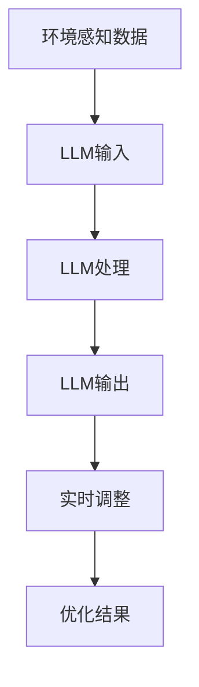
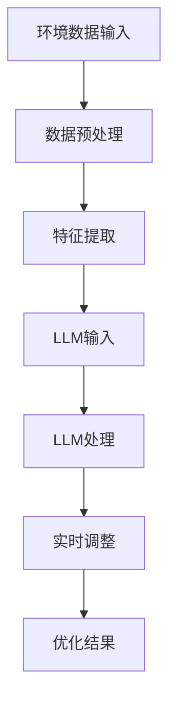
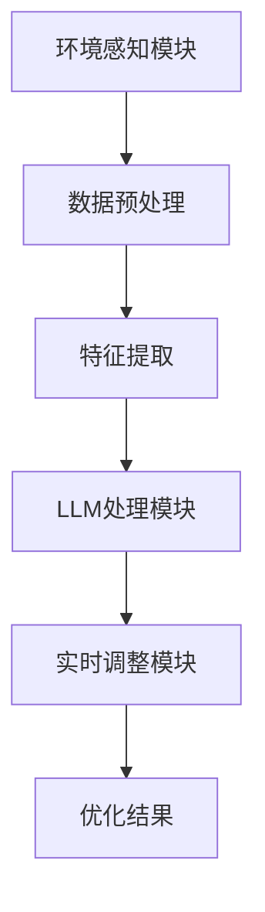

                 


# 环境感知AI Agent：增强LLM的实时情境适应性

## 关键词：环境感知、AI Agent、LLM、实时适应性、动态调整

## 摘要：  
本文深入探讨了环境感知AI Agent如何增强大语言模型（LLM）在动态情境中的适应能力。通过结合环境感知技术和LLM的自然语言处理能力，AI Agent能够实时感知和理解周围环境，从而优化LLM的输出，实现更智能、更自然的交互。本文从环境感知的基本概念、LLM的实时适应机制、环境感知AI Agent的核心算法，到系统的架构设计和项目实战，全面阐述了环境感知AI Agent的理论与实践。

---

# 第一部分: 环境感知AI Agent概述

## 第1章: 环境感知AI Agent的背景与概念

### 1.1 环境感知的定义与重要性

环境感知是指智能系统通过传感器或其他数据源获取环境信息，并通过处理和分析这些信息来理解环境状态的能力。环境感知的重要性体现在以下几个方面：

- **动态性**：环境是动态变化的，感知系统需要实时捕捉这些变化。
- **多样性**：环境信息可以来自多种数据源，如视觉、听觉、触觉等。
- **复杂性**：环境可能包含复杂的物体、人物和场景，感知系统需要能够处理这些复杂性。

### 1.2 大语言模型（LLM）的实时适应性

大语言模型（LLM）是一种基于深度学习的自然语言处理模型，具有强大的文本生成和理解能力。然而，LLM在面对动态环境时，往往缺乏对实时情境的适应能力：

- **静态输入**：LLM通常处理的是静态文本输入，无法直接感知环境变化。
- **滞后性**：LLM的输出基于固定的训练数据，无法实时调整以应对动态环境。

### 1.3 环境感知AI Agent的核心目标

环境感知AI Agent的核心目标是通过环境感知技术增强LLM的实时适应能力，使其能够在动态环境中实现更智能的交互。具体目标包括：

- **提升情境理解能力**：通过环境感知数据，增强LLM对当前情境的理解。
- **实现动态调整**：根据环境变化实时调整LLM的输出，使其更符合当前情境需求。
- **优化人机交互**：通过环境感知和实时调整，提高人机交互的自然性和准确性。

---

## 第2章: 环境感知AI Agent的核心概念与联系

### 2.1 环境感知的核心原理

环境感知的核心原理包括数据采集、处理和分析：

- **数据采集**：通过传感器或其他数据源获取环境信息。
- **数据处理**：对采集到的数据进行预处理，如去噪、归一化等。
- **特征提取**：从处理后的数据中提取有用的特征，用于环境理解。

### 2.2 LLM的实时适应机制

LLM的实时适应机制主要包括：

- **动态输入调整**：将环境感知数据作为LLM的输入，实时调整模型的输入内容。
- **动态参数调整**：根据环境变化实时调整LLM的内部参数，以适应当前情境。
- **实时反馈优化**：根据环境反馈优化LLM的输出，提高模型的适应性。

### 2.3 环境感知与LLM的实体关系图

以下是环境感知与LLM的实体关系图：



---

## 第3章: 环境感知AI Agent的算法原理

### 3.1 环境感知数据的预处理算法

环境感知数据的预处理算法包括：

- **数据清洗**：去除噪声数据，确保数据的准确性。
- **数据融合**：将来自多个传感器的数据进行融合，提高感知的准确性。
- **特征提取**：从感知数据中提取有用的特征，用于后续的处理和分析。

### 3.2 LLM的实时适应算法

LLM的实时适应算法包括：

- **动态调整策略**：根据环境变化实时调整LLM的输入和输出。
- **基于反馈的优化算法**：根据环境反馈优化LLM的输出，提高模型的适应性。
- **实时推理机制**：在动态环境中快速推理，生成符合当前情境的输出。

### 3.3 算法流程图

以下是环境感知AI Agent的算法流程图：



---

## 第4章: 系统架构设计

### 4.1 系统功能设计

系统功能设计包括：

- **环境感知模块**：负责采集和处理环境数据。
- **LLM处理模块**：负责对环境数据进行处理和分析。
- **实时调整模块**：根据环境变化实时调整LLM的输出。

### 4.2 系统架构图

以下是系统架构图：



---

## 第5章: 项目实战

### 5.1 环境搭建

环境搭建包括：

- **安装必要的库和工具**：如Python、TensorFlow、Keras等。
- **配置传感器和数据源**：确保传感器能够正常采集环境数据。

### 5.2 核心代码实现

以下是核心代码实现：

```python
import numpy as np

def preprocess_data(data):
    # 数据清洗
    cleaned_data = data.dropna()
    # 数据标准化
    normalized_data = (cleaned_data - cleaned_data.mean()) / cleaned_data.std()
    return normalized_data

def feature_extraction(normalized_data):
    # 特征提取
    features = normalized_data.select_dtypes(include=['float64', 'int64'])
    return features

def dynamic_adjustment(llm_model, features):
    # 动态调整LLM的输入
    adjusted_input = llm_model.input + features
    return adjusted_input
```

### 5.3 案例分析

案例分析包括：

- **案例一**：在智能家居中的应用，通过环境感知优化LLM的交互体验。
- **案例二**：在自动驾驶中的应用，通过环境感知实时调整LLM的输出。

---

## 第6章: 总结与展望

### 6.1 总结

环境感知AI Agent通过结合环境感知技术和LLM的自然语言处理能力，显著增强了LLM在动态环境中的适应能力。本文从环境感知的基本概念、LLM的实时适应机制、环境感知AI Agent的核心算法，到系统的架构设计和项目实战，全面阐述了环境感知AI Agent的理论与实践。

### 6.2 展望

未来，环境感知AI Agent将在更多领域得到广泛应用，如智能助手、机器人控制、增强现实等。随着技术的不断发展，环境感知AI Agent将更加智能化、实时化，为人类带来更高效、更自然的交互体验。

---

## 作者：AI天才研究院 & 禅与计算机程序设计艺术

