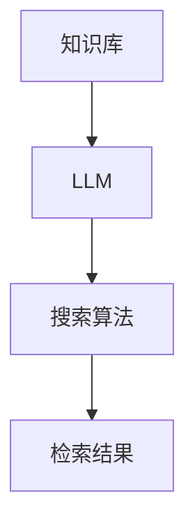
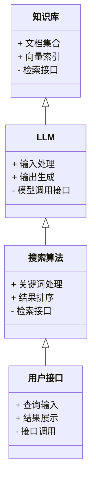
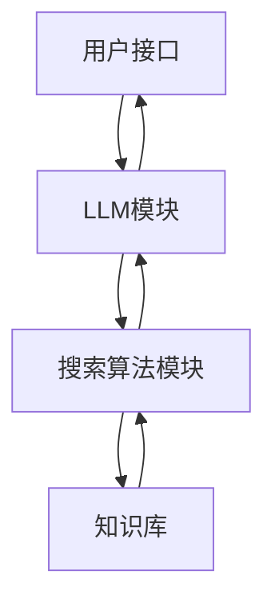
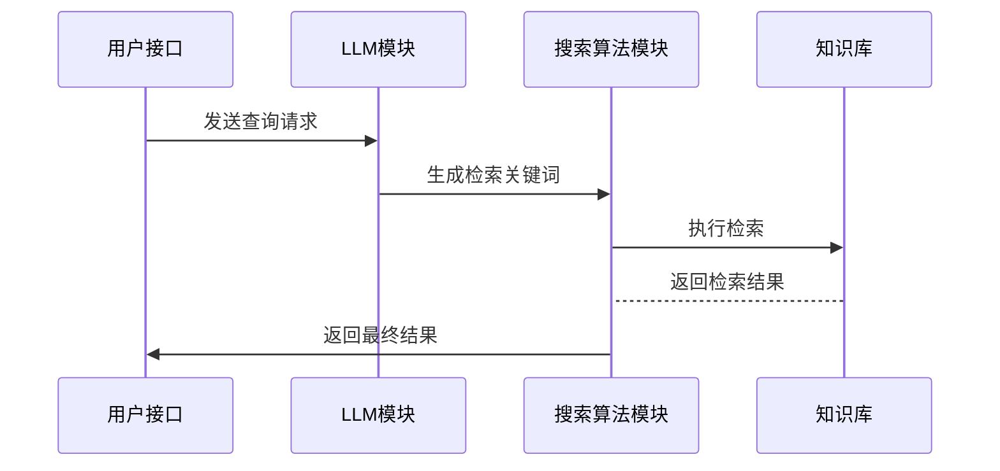

                 


# 知识检索增强AI Agent：结合LLM与高效搜索算法

> 关键词：知识检索，增强AI Agent，LLM，高效搜索算法，自然语言处理，人工智能，向量数据库，BM25算法

> 摘要：本文详细探讨了知识检索增强AI Agent的构建方法，结合大语言模型（LLM）与高效搜索算法，通过系统分析与架构设计，展示了如何实现高效、准确的知识检索。文章从基础概念、算法原理、系统架构到项目实战，全面解析了这一技术的核心要素，并提供了详细的代码实现和案例分析。

---

# 第一部分：知识检索增强AI Agent的背景与基础

## 第1章：知识检索增强AI Agent的背景与概念

### 1.1 问题背景与问题描述

#### 1.1.1 知识检索的传统挑战
传统知识检索系统依赖于关键词匹配，存在以下问题：
- **语义理解不足**：无法准确理解用户的意图，容易返回不相关的结果。
- **检索效率低下**：面对海量数据，传统检索算法效率有限，尤其在实时应用中表现不佳。
- **信息孤岛问题**：数据分散在不同的系统中，难以实现跨系统的高效检索。

#### 1.1.2 大语言模型（LLM）的引入
大语言模型（如GPT-3, ChatGPT）的引入，为知识检索带来了新的可能性：
- **语义理解能力**：LLM能够理解上下文和用户意图，生成更相关的检索结果。
- **动态调整能力**：LLM可以根据检索结果的反馈，动态调整检索策略。

#### 1.1.3 高效搜索算法的重要性
高效搜索算法（如BM25、向量数据库）在知识检索中的作用：
- **提升检索速度**：通过优化索引结构，减少检索时间。
- **提高准确性**：通过算法优化，提升检索结果的相关性。

### 1.2 知识检索增强AI Agent的定义与目标

#### 1.2.1 定义
知识检索增强AI Agent是一种结合了大语言模型和高效搜索算法的智能系统，能够根据用户需求，快速、准确地检索和返回相关知识。

#### 1.2.2 核心目标与应用场景
- **核心目标**：实现高效、准确的知识检索，提升用户体验。
- **应用场景**：智能客服、信息检索系统、教育辅助工具等。

### 1.3 核心概念与联系

#### 1.3.1 核心概念原理
- **LLM**：基于Transformer架构，通过自监督学习掌握语言规律。
- **高效搜索算法**：通过优化索引结构，提升检索效率。

#### 1.3.2 属性特征对比表
| 核心概念 | 属性 | 特征 |
|----------|------|------|
| LLM      | 模型 | 巨量参数，自监督学习 |
| 搜索算法 | 算法 | 基于关键词匹配，支持向量检索 |

#### 1.3.3 ER实体关系图


## 第2章：LLM与高效搜索算法的结合

### 2.1 LLM的基本原理

#### 2.1.1 变压器模型简介
Transformer模型由编码器和解码器组成，通过自注意力机制捕捉上下文信息。

#### 2.1.2 注意力机制
注意力机制公式：
$$
\text{Attention}(Q,K,V) = \text{softmax}\left(\frac{QK^T}{\sqrt{d_k}}\right)V
$$

#### 2.1.3 解码器结构
解码器通过自注意力机制生成输出序列。

### 2.2 高效搜索算法的核心原理

#### 2.2.1 向量数据库
向量数据库将文本转化为向量，通过向量相似度进行检索。

#### 2.2.2 BM25算法
BM25公式：
$$
\text{score}(t, d) = \frac{\text{log}(f(t,d)) \times \text{idf}(t)}{\text{K} + \text{f}(t,d) - 1}
$$

#### 2.2.3 倒排索引
倒排索引将关键词映射到相关文档，提升检索效率。

### 2.3 LLM与搜索算法的结合方式

#### 2.3.1 端到端结合
LLM直接生成检索关键词，搜索算法返回结果。

#### 2.3.2 分阶段优化
LLM生成初步结果，搜索算法优化排序。

#### 2.3.3 动态调整策略
根据用户反馈动态调整检索参数。

---

# 第二部分：知识检索增强AI Agent的算法原理

## 第3章：知识检索增强AI Agent的算法原理

### 3.1 知识检索的流程

#### 3.1.1 输入处理
解析用户查询，提取关键词和意图。

#### 3.1.2 搜索与生成
LLM生成检索关键词，搜索算法返回结果。

#### 3.1.3 结果优化
根据用户反馈优化检索结果。

### 3.2 LLM与搜索算法的协同工作

#### 3.2.1 LLM驱动搜索
LLM生成检索关键词，驱动搜索过程。

#### 3.2.2 搜索结果优化
搜索算法优化结果排序，提升相关性。

### 3.3 算法优化策略

#### 3.3.1 并行处理
并行处理多个查询，提升效率。

#### 3.3.2 分布式架构
分布式架构支持大规模数据处理。

---

# 第三部分：系统分析与架构设计

## 第4章：系统分析与架构设计方案

### 4.1 系统组成模块

#### 4.1.1 知识库模块
存储结构化和非结构化数据，支持快速检索。

#### 4.1.2 LLM模块
负责语义理解和生成检索关键词。

#### 4.1.3 搜索算法模块
实现高效检索和结果排序。

#### 4.1.4 用户接口模块
提供用户交互界面，接收查询请求。

### 4.2 系统架构设计

#### 4.2.1 领域模型
领域模型Mermaid图：


#### 4.2.2 系统架构
系统架构Mermaid图：


#### 4.2.3 系统交互
系统交互Mermaid序列图：


---

# 第四部分：项目实战

## 第5章：项目实战：构建知识检索增强AI Agent

### 5.1 环境安装

#### 5.1.1 安装依赖
安装必要的库，如：
```
pip install transformers faiss-cpu numpy
```

### 5.2 系统核心实现

#### 5.2.1 知识库构建
使用向量数据库构建知识库：
```python
import numpy as np
from sentence_transformers import SentenceTransformer

model = SentenceTransformer('all-mpnet-base-v2')
embeddings = model.encode(documents)
```

#### 5.2.2 LLM集成
集成LLM进行语义理解：
```python
from transformers import AutoModelForCausalLM, AutoTokenizer

tokenizer = AutoTokenizer.from_pretrained('gpt2')
model = AutoModelForCausalLM.from_pretrained('gpt2')
```

#### 5.2.3 搜索算法实现
实现BM25算法：
```python
def compute_score(query, document, k=1.5):
    f = document.count(query)
    idf = np.log((len(documents) + 1) / (f + 1))
    return k * f * idf
```

### 5.3 代码应用解读与分析

#### 5.3.1 知识库构建
将文档转换为向量，存储在向量数据库中，支持快速检索。

#### 5.3.2 LLM调用
通过LLM生成检索关键词，优化搜索过程。

### 5.4 实际案例分析

#### 5.4.1 案例介绍
以智能客服系统为例，展示知识检索增强AI Agent的应用。

#### 5.4.2 系统优化
根据用户反馈优化检索策略，提升准确率。

### 5.5 项目小结

---

# 第五部分：最佳实践与扩展

## 第6章：最佳实践与扩展

### 6.1 最佳实践

#### 6.1.1 优化搜索算法
选择合适的搜索算法，优化检索速度和准确性。

#### 6.1.2 结合上下文理解
利用LLM的语义理解能力，提升检索相关性。

#### 6.1.3 测试与部署
进行全面的测试，确保系统稳定性和性能。

### 6.2 小结

#### 6.2.1 系统优势
结合LLM和高效搜索算法，实现高效、准确的知识检索。

#### 6.2.2 注意事项
注意数据隐私和模型训练的成本。

### 6.3 拓展阅读

#### 6.3.1 推荐文献
推荐相关文献，供读者深入研究。

#### 6.3.2 相关技术
介绍相关技术，如多模态检索、实时检索等。

---

# 结语

知识检索增强AI Agent结合了LLM和高效搜索算法，通过系统分析与架构设计，实现了高效、准确的知识检索。未来，随着技术的进步，知识检索增强AI Agent将在更多领域得到广泛应用。

---

作者：AI天才研究院/AI Genius Institute & 禅与计算机程序设计艺术 /Zen And The Art of Computer Programming

