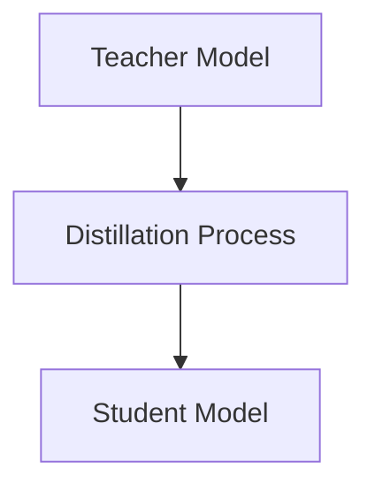

                 


# 知识蒸馏技术在AI Agent轻量化中的创新应用

> 关键词：知识蒸馏，AI Agent，轻量化，机器学习，深度学习，系统架构

> 摘要：  
> 知识蒸馏技术是一种有效的模型压缩方法，通过将大型模型的知识迁移到小型模型中，实现模型的轻量化。本文从知识蒸馏的基本概念出发，深入探讨其在AI Agent中的创新应用，分析其算法原理、系统架构设计、项目实战案例以及最佳实践。通过理论与实践相结合的方式，为AI Agent的轻量化提供系统化的解决方案。

---

## 第1章: 知识蒸馏技术概述

### 1.1 知识蒸馏技术的背景与问题背景
#### 1.1.1 从传统AI到AI Agent的演进
- AI技术的演进历程：从规则驱动到数据驱动
- AI Agent的定义与特点：自主性、反应性、目标导向
- 轻量化AI Agent的必要性：资源受限场景下的需求

#### 1.1.2 知识蒸馏技术的定义与问题描述
- 知识蒸馏的定义：将复杂模型的知识迁移到简单模型的过程
- 知识蒸馏的目标：减少模型复杂性，提高部署效率
- 知识蒸馏的边界：适用于连续性任务，不适用于完全离散任务

#### 1.1.3 知识蒸馏技术的核心目标与边界
- 核心目标：实现模型的压缩与轻量化
- 边界：不适用于需要完全重新训练的任务

#### 1.1.4 知识蒸馏技术的概念结构与核心要素
- 核心要素：教师模型、学生模型、蒸馏过程
- 概念结构：教师模型提供指导，学生模型学习知识

---

## 第2章: 知识蒸馏技术的核心概念与联系

### 2.1 知识蒸馏技术的核心概念
#### 2.1.1 教师模型与学生模型的关系
- 教师模型：知识的来源，通常是一个复杂且训练良好的大模型
- 学生模型：知识的接收者，通常是一个小型模型

#### 2.1.2 知识蒸馏技术的原理与特征
- 原理：通过软标签迁移，将教师模型的隐层特征传递给学生模型
- 特征：模型压缩、知识迁移、性能保留

#### 2.1.3 知识蒸馏技术的对比分析
- 对比对象：模型剪枝、模型量化
- 对比结果：知识蒸馏在保持性能的同时，压缩比更高

### 2.2 知识蒸馏技术的属性特征对比
#### 2.2.1 不同蒸馏方法的特征对比
- 软蒸馏：使用概率分布进行知识迁移
- 硬蒸馏：直接使用类别标签进行迁移
- 混合蒸馏：结合软标签和硬标签

#### 2.2.2 知识蒸馏技术的优缺点分析
- 优点：压缩比高、性能损失小
- 缺点：依赖教师模型的性能，蒸馏过程可能引入额外计算成本

### 2.3 知识蒸馏技术的ER实体关系图
- 实体：教师模型、学生模型、蒸馏过程
- 关系：教师模型提供特征，学生模型接收特征，蒸馏过程连接两者

---

## 第3章: 知识蒸馏技术的算法原理

### 3.1 知识蒸馏技术的算法流程
#### 3.1.1 教师模型的输出与学生模型的输入
- 教师模型输出：概率分布、特征向量
- 学生模型输入：特征向量、原始输入数据

#### 3.1.2 知识蒸馏的损失函数计算
- 综合损失函数：分类损失 + 蒸馏损失

#### 3.1.3 知识蒸馏的优化过程
- 学生模型优化：通过蒸馏损失函数进行反向传播和参数更新

### 3.2 知识蒸馏技术的数学模型与公式
#### 3.2.1 知识蒸馏的损失函数公式
$$ L = \alpha L_{cls} + (1-\alpha) L_{dist} $$
其中，$\alpha$ 是蒸馏损失的权重系数。

#### 3.2.2 知识蒸馏的KL散度公式
$$ KL(P||Q) = \sum P_i \log \frac{P_i}{Q_i} $$
其中，$P$ 是教师模型的输出概率分布，$Q$ 是学生模型的输出概率分布。

### 3.3 知识蒸馏技术的算法实现
#### 3.3.1 教师模型的构建与训练
- 使用预训练的大模型，如BERT、ResNet等
- 确保教师模型在目标任务上表现优异

#### 3.3.2 学生模型的构建与训练
- 选择轻量级模型，如MobileNet、TinyBERT
- 在教师模型的指导下进行蒸馏训练

#### 3.3.3 知识蒸馏的实现步骤
1. 预训练教师模型
2. 初始化学生模型
3. 计算蒸馏损失
4. 优化学生模型参数

---

## 第4章: 知识蒸馏技术的系统分析与架构设计

### 4.1 系统分析
#### 4.1.1 知识蒸馏技术的应用场景
- 移动端AI应用
- 边缘计算
- 嵌入式系统

#### 4.1.2 知识蒸馏技术的系统功能需求
- 教师模型与学生模型的交互
- 蒸馏过程的自动化
- 模型压缩与优化

#### 4.1.3 知识蒸馏技术的系统性能指标
- 压缩比
- 推理速度
- 准确率损失

### 4.2 系统架构设计
#### 4.2.1 系统功能模块划分
- 教师模型模块
- 学生模型模块
- 蒸馏过程控制模块

#### 4.2.2 系统架构的Mermaid图


#### 4.2.3 系统接口设计
- 输入接口：教师模型的特征向量
- 输出接口：学生模型的预测结果

#### 4.2.4 系统交互流程
1. 教师模型输出特征
2. 学生模型接收特征
3. 蒸馏过程计算损失
4. 优化学生模型参数

---

## 第5章: 项目实战

### 5.1 环境安装
- 安装Python、TensorFlow或PyTorch
- 安装必要的深度学习库

### 5.2 核心代码实现
```python
import torch
import torch.nn as nn
import torch.optim as optim

class TeacherModel(nn.Module):
    def __init__(self):
        super(TeacherModel, self).__init__()
        self.net = nn.Sequential(
            nn.Conv2d(3, 64, 3),
            nn.ReLU(),
            nn.Conv2d(64, 128, 3),
            nn.ReLU(),
            nn.AdaptiveAvgPool2d(1),
            nn.Flatten(),
            nn.Linear(128, 10)
        )

    def forward(self, x):
        return self.net(x)

class StudentModel(nn.Module):
    def __init__(self):
        super(StudentModel, self).__init__()
        self.net = nn.Sequential(
            nn.Conv2d(3, 32, 3),
            nn.ReLU(),
            nn.Conv2d(32, 64, 3),
            nn.ReLU(),
            nn.AdaptiveAvgPool2d(1),
            nn.Flatten(),
            nn.Linear(64, 10)
        )

    def forward(self, x):
        return self.net(x)

def distillation_loss(output_student, output_teacher, alpha=0.5):
    loss_cls = nn.CrossEntropyLoss()(output_student, labels)
    loss_dist = nn.KLDivLoss(reduction='batchmean')(torch.log_softmax(output_student, dim=1), torch.softmax(output_teacher, dim=1))
    return alpha * loss_cls + (1 - alpha) * loss_dist
```

### 5.3 案例分析
- 数据集选择：CIFAR-10
- 训练过程：使用知识蒸馏技术训练学生模型
- 结果分析：学生模型在轻量化的同时保持高准确率

### 5.4 项目总结
- 项目实现的关键点
- 项目中的问题与解决方案
- 项目成果与意义

---

## 第6章: 最佳实践与小结

### 6.1 全书总结
- 知识蒸馏技术的核心思想
- 技术在AI Agent轻量化中的应用价值

### 6.2 最佳实践 tips
- 合理选择教师模型和学生模型
- 调整蒸馏损失的权重系数
- 优化蒸馏过程中的超参数

### 6.3 注意事项
- 模型压缩可能导致性能损失
- 蒸馏过程需要教师模型的支持
- 确保数据质量和多样性

### 6.4 拓展阅读
- 推荐相关书籍和论文
- 提供进一步学习的方向

---

## 附录: 术语表与参考文献

### 附录A: 术语表
- 知识蒸馏：将复杂模型的知识迁移到简单模型的过程
- 教师模型：提供知识的复杂模型
- 学生模型：接收知识的简单模型
- 蒸馏损失：衡量学生模型与教师模型差异的损失函数

### 附录B: 工具推荐
- 深度学习框架：TensorFlow、PyTorch
- 模型压缩工具：TensorFlow Lite、ONNX

### 附录C: 参考文献
- 论文推荐：Hinton等人的知识蒸馏经典论文
- 书籍推荐：《Deep Learning》、《机器学习实战》

---

作者：AI天才研究院/AI Genius Institute & 禅与计算机程序设计艺术 /Zen And The Art of Computer Programming

