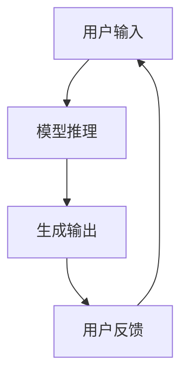

                 


```markdown
# 社交媒体 AI Agent：LLM 辅助内容管理与互动

---

## 关键词：
- 社交媒体 AI Agent
- 大语言模型（LLM）
- 内容管理
- 人机交互
- 社会化媒体分析

---

## 摘要：
本文探讨了如何利用大语言模型（LLM）构建社交媒体 AI Agent，以实现内容管理和用户互动的智能化。文章从背景、概念、技术原理到实际应用，全面分析了LLM在社交媒体中的潜力与实现方式，结合具体案例和系统架构设计，展示了如何通过AI Agent提升社交媒体的用户体验和运营效率。

---

## 第1章：社交媒体 AI Agent 的背景与概念

### 1.1 社交媒体的演进历程
- 1.1.1 从Web 1.0到Web 2.0的演变
  - Web 1.0：静态网页，信息单向传播。
  - Web 2.0：互动式社交媒体，用户生成内容。
- 1.1.2 社交媒体的崛起与影响
  - 平台如Facebook、Twitter、Instagram的兴起。
  - 社交媒体对信息传播、社交关系和文化的影响。
- 1.1.3 当前社交媒体的主要特点与挑战
  - 大量非结构化数据的生成。
  - 信息过载、假新闻、隐私问题。

### 1.2 AI Agent 的概念与作用
- 1.2.1 AI Agent 的定义与核心特征
  - 定义：AI Agent 是能够感知环境并执行任务的智能体。
  - 特征：自主性、反应性、目标导向。
- 1.2.2 AI Agent 在社交媒体中的应用场景
  - 内容推荐、用户行为分析、情感分析。
- 1.2.3 AI Agent 如何提升用户体验与效率
  - 提供个性化内容，优化用户互动。

### 1.3 LLM 在社交媒体 AI Agent 中的角色
- 1.3.1 LLM 的定义与技术优势
  - 大语言模型：基于Transformer的预训练模型，具备强大的语言理解和生成能力。
- 1.3.2 LLM 如何辅助内容管理与互动
  - 内容生成、审核、个性化推荐。
- 1.3.3 LLM 在社交媒体中的未来潜力
  - 更智能的对话生成，实时情感分析。

---

## 第2章：社交媒体 AI Agent 的核心概念与技术原理

### 2.1 社交媒体 AI Agent 的工作原理
- 2.1.1 数据输入与处理流程
  - 用户输入或系统采集的文本数据。
  - 数据预处理：清洗、分词、向量化。
- 2.1.2 模型推理与输出机制
  - 模型根据输入生成响应。
  - 响应的后处理与验证。
- 2.1.3 人机交互的实现方式
  - 基于API的交互、实时对话系统。

### 2.2 LLM 在社交媒体中的应用特点
- 2.2.1 大语言模型的文本生成能力
  - GPT系列模型的文本生成优势。
- 2.2.2 大语言模型的语义理解能力
  - 基于上下文的理解，准确捕捉用户意图。
- 2.2.3 大语言模型的可扩展性与适应性
  - 通过微调适应不同社交媒体平台的需求。

### 2.3 社交媒体 AI Agent 的系统架构
- 2.3.1 系统模块划分
  - 数据采集模块、模型推理模块、用户交互模块。
- 2.3.2 模块之间的交互关系
  - 数据流与控制流的流程。
- 2.3.3 系统的灵活性与可维护性
  - 模块化设计，便于扩展与维护。

---

## 第3章：LLM 在社交媒体内容管理中的应用

### 3.1 内容生成
- 3.1.1 自动发布内容
  - 基于话题生成相关文章。
- 3.1.2 内容优化与润色
  - 提供改进建议，提升内容质量。
- 3.1.3 多语言支持
  - 跨语言内容生成与翻译。

### 3.2 内容审核
- 3.2.1 自动检测违规内容
  - 识别色情、暴力、仇恨言论。
- 3.2.2 垂直领域内容审核
  - 金融、医疗领域的专业内容审核。
- 3.2.3 内容审核的挑战
  - 模型的误判率，数据隐私问题。

### 3.3 内容推荐
- 3.3.1 基于用户行为的推荐
  - 用户兴趣分析，个性化推荐。
- 3.3.2 基于内容相似性的推荐
  - 基于文本相似度的推荐。
- 3.3.3 实时推荐机制
  - 趋势话题实时推荐。

---

## 第4章：基于LLM的社交媒体 AI Agent 实现

### 4.1 项目实战：构建一个简单的社交媒体AI Agent

#### 4.1.1 环境搭建
- 安装必要的库：Python、TensorFlow、Hugging Face库。
- 配置GPU支持（如NVIDIA GPU）。

#### 4.1.2 数据准备
- 收集社交媒体数据：用户评论、帖子内容。
- 数据清洗与预处理：去除噪音，分词。

#### 4.1.3 模型选择与训练
- 使用预训练的LLM（如GPT-2）。
- 微调模型以适应社交媒体场景。

#### 4.1.4 系统实现
- 接收用户输入，调用模型生成响应。
- 实现API接口，供其他系统调用。

#### 4.1.5 测试与优化
- 测试模型的准确率与响应时间。
- 根据反馈优化模型参数。

---

## 第5章：系统架构设计与优化

### 5.1 系统架构设计
- 5.1.1 模块划分
  - 数据采集模块、模型推理模块、用户交互模块。
- 5.1.2 实体关系图
  ```mermaid
  graph TD
    A[用户] --> B[输入模块]
    B --> C[模型推理模块]
    C --> D[输出模块]
    D --> A
  ```

- 5.1.3 接口设计
  - RESTful API设计，定义输入输出格式。

### 5.2 算法原理与优化
- 5.2.1 算法流程图
  ```mermaid
  graph TD
    Start --> InputProcessing
    InputProcessing --> ModelInference
    ModelInference --> OutputProcessing
    OutputProcessing --> End
  ```

- 5.2.2 数学模型
  - 模型训练的损失函数：
    $$ \text{Loss} = \text{CrossEntropy}(y_{\text{pred}}, y_{\text{true}}) $$

---

## 第6章：未来趋势与挑战

### 6.1 未来发展趋势
- 更强的生成能力：多模态模型的应用。
- 更智能的交互：基于上下文的记忆机制。

### 6.2 当前挑战
- 模型的可解释性：提升透明度。
- 数据隐私问题：确保数据安全。

---

## 结语

社交媒体AI Agent的未来发展潜力巨大，LLM的引入将彻底改变内容管理与用户互动的方式。通过技术创新与实践，我们可以打造更加智能、高效的社交媒体体验。

---

## 作者信息

作者：AI天才研究院/AI Genius Institute  
联系邮箱：contact@aicourse.org  
文章地址：[点击此处查看](#)  
```

---

**附录：代码示例与数学公式**

```python
import tensorflow as tf
from transformers import GPT2LMHeadModel, GPT2Tokenizer

# 加载预训练模型
model_name = "gpt2"
tokenizer = GPT2Tokenizer.from_pretrained(model_name)
model = GPT2LMHeadModel.from_pretrained(model_name)

# 定义生成函数
def generate_response(prompt):
    inputs = tokenizer(prompt, return_tensors="tf")
    outputs = model.generate(**inputs, max_length=50)
    response = tokenizer.decode(outputs[0], skip_special_tokens=True)
    return response

# 示例
prompt = "请写一篇关于社交媒体AI Agent的文章。"
response = generate_response(prompt)
print(response)
```

```latex
$$
\text{生成概率} = \frac{1}{|\text{V}|} \sum_{i=1}^{|\text{V}|} p_i
$$
其中，$p_i$ 是第 $i$ 个词的概率。
```



---

**END OF ARTICLE**

