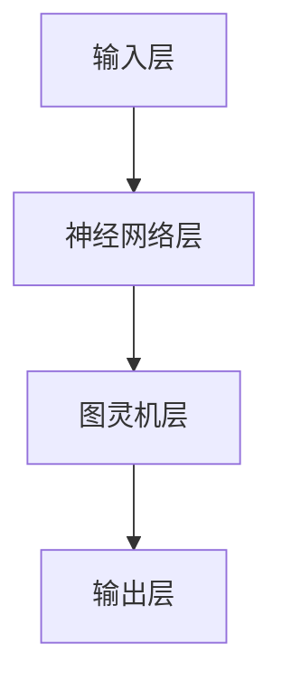

                 


# 神经图灵机：增强AI Agent的算法学习能力

---

## 关键词：神经图灵机，AI Agent，增强学习，算法学习能力，智能系统，AI架构

---

## 摘要：  
神经图灵机是一种结合了神经网络和图灵机概念的新型AI架构，旨在增强AI Agent的学习能力。本文从背景、核心概念、算法原理、系统架构、项目实战等多方面详细阐述神经图灵机的理论与实践，帮助读者理解其在智能系统中的应用价值，并通过实际案例展示其在AI Agent中的潜力。

---

## 第一部分：神经图灵机概述

### 第1章：神经图灵机的核心概念

#### 1.1 神经图灵机的定义与背景
神经图灵机（Neural Turing Machine, NTM）是一种结合了神经网络和图灵机概念的计算模型。它通过神经网络模拟数据处理，同时借助图灵机的控制结构实现复杂的计算任务。NTM的核心思想是将神经网络的感知能力与图灵机的逻辑推理能力相结合，从而提升AI Agent的学习和执行能力。

#### 1.2 神经图灵机的基本原理
NTM由神经网络组件和图灵机组件两部分组成：
- **神经网络组件**：负责处理输入数据，提取特征，生成中间表示。
- **图灵机组件**：负责根据中间表示生成输出，并通过状态和操作控制整个模型的行为。

#### 1.3 神经图灵机与传统AI模型的对比
| 对比维度 | 神经图灵机（NTM） | 传统神经网络 | 图灵机 |
|----------|-------------------|---------------|--------|
| 结构复杂性 | 高 | 中 | 低 |
| 表达能力 | 强 | 弱 | 中 |
| 学习能力 | 高 | 中 | 低 |
| 可解释性 | 中 | 低 | 高 |

---

### 第2章：神经图灵机的算法学习能力

#### 2.1 神经图灵机的学习机制
NTM通过以下步骤实现增强学习：
1. **输入处理**：将输入数据传递给神经网络组件，生成中间表示。
2. **状态更新**：根据中间表示，图灵机组件更新内部状态。
3. **目标生成**：结合当前状态，生成输出目标。
4. **反馈机制**：通过强化学习或监督学习的方式，调整模型参数。

#### 2.2 神经图灵机的增强学习策略
- **强化学习**：通过奖励机制，优化模型的决策过程。
- **监督学习**：通过标注数据，指导模型的学习方向。
- **联合优化**：将强化学习和监督学习结合，提升模型的泛化能力。

#### 2.3 神经图灵机的训练方法
- **端到端训练**：直接在输入和输出之间建立端到端的映射关系。
- **分阶段训练**：先训练神经网络组件，再训练图灵机组件。

---

## 第二部分：神经图灵机的核心概念与原理

### 第3章：神经图灵机的核心概念与原理

#### 3.1 神经图灵机的基本结构
- **输入层**：接收外部输入数据。
- **神经网络层**：处理输入数据，生成中间表示。
- **图灵机层**：根据中间表示，生成输出目标。
- **输出层**：输出最终结果。

#### 3.2 神经图灵机的工作原理
1. **输入处理**：神经网络组件对输入数据进行处理，生成中间表示。
2. **状态更新**：图灵机组件根据中间表示，更新内部状态。
3. **目标生成**：结合当前状态，生成输出目标。
4. **反馈机制**：通过反馈机制，优化模型参数。

#### 3.3 神经图灵机的核心算法
- **前向传播**：神经网络组件和图灵机组件协同工作，生成输出目标。
- **反向传播**：通过反向传播算法，优化模型参数。

---

## 第三部分：神经图灵机的数学模型与公式

### 第4章：神经图灵机的数学模型与公式

#### 4.1 神经网络的数学表示
- **输入层**：$x_i$，其中 $i$ 表示输入特征。
- **隐藏层**：$h_j = \sigma(\sum_{i=1}^{n} w_{ji}x_i + b_j)$，其中 $\sigma$ 表示激活函数。
- **输出层**：$y_k = \sigma(\sum_{j=1}^{m} w_{kj}h_j + b_k)$。

#### 4.2 图灵机的数学表示
- **状态**：$s_t = f(s_{t-1}, a_t)$，其中 $s_{t-1}$ 表示前一状态，$a_t$ 表示动作。
- **动作**：$a_t = \arg\max_i Q(s_t, i)$，其中 $Q$ 表示Q值函数。

---

## 第四部分：神经图灵机的系统架构与设计

### 第5章：神经图灵机的系统架构与设计

#### 5.1 问题场景分析
- **问题描述**：如何通过神经图灵机实现AI Agent的增强学习能力。
- **解决方案**：结合神经网络和图灵机，设计高效的算法学习架构。

#### 5.2 系统功能设计
- **输入处理**：接收外部输入数据。
- **中间表示生成**：通过神经网络生成中间表示。
- **状态更新**：根据中间表示，更新内部状态。
- **目标生成**：结合当前状态，生成输出目标。

#### 5.3 系统架构图


---

## 第五部分：神经图灵机的项目实战

### 第6章：神经图灵机的项目实战

#### 6.1 环境安装
- **安装Python**：确保安装Python 3.x。
- **安装依赖库**：安装TensorFlow、Keras等深度学习库。

#### 6.2 核心代码实现
```python
import tensorflow as tf
from tensorflow.keras import layers

# 定义神经网络组件
def neural_network(input_shape):
    model = tf.keras.Sequential()
    model.add(layers.Dense(64, activation='relu', input_shape=input_shape))
    model.add(layers.Dense(32, activation='relu'))
    return model

# 定义图灵机组件
def turing_machine(state_shape):
    model = tf.keras.Sequential()
    model.add(layers.Dense(64, activation='relu', input_shape=state_shape))
    model.add(layers.Dense(32, activation='relu'))
    return model
```

#### 6.3 代码解读与分析
- **神经网络组件**：负责处理输入数据，生成中间表示。
- **图灵机组件**：根据中间表示，生成输出目标。

#### 6.4 实际案例分析
- **案例描述**：如何通过神经图灵机实现一个简单的AI Agent。
- **案例实现**：通过Python代码实现神经图灵机的模型训练和预测。

#### 6.5 项目小结
通过实际项目，读者可以掌握神经图灵机的基本实现方法，并理解其在实际应用中的优势。

---

## 第六部分：神经图灵机的高级话题与未来展望

### 第7章：神经图灵机的高级话题

#### 7.1 神经图灵机的优化策略
- **模型优化**：通过剪枝、蒸馏等技术优化模型性能。
- **算法优化**：通过改进算法结构，提升模型的学习能力。

#### 7.2 神经图灵机的多模态应用
- **多模态数据处理**：结合图像、文本等多种数据源，提升模型的感知能力。
- **多任务学习**：通过多任务学习，提升模型的泛化能力。

#### 7.3 神经图灵机的分布式训练
- **分布式训练**：通过分布式计算技术，提升模型的训练效率。
- **并行计算**：通过并行计算技术，加速模型的训练过程。

#### 7.4 神经图灵机的实时性优化
- **实时性优化**：通过优化算法结构，提升模型的实时响应能力。
- **低延迟设计**：通过低延迟设计，提升模型的实时性。

#### 7.5 神经图灵机的伦理与安全
- **伦理问题**：如何确保神经图灵机的使用符合伦理规范。
- **安全问题**：如何防止神经图灵机被滥用，确保其安全可靠。

### 第8章：神经图灵机的未来展望

#### 8.1 神经图灵机的研究热点
- **模型压缩**：如何通过模型压缩技术，提升模型的部署效率。
- **模型解释性**：如何提高神经图灵机的可解释性，增强其可信度。

#### 8.2 神经图灵机的技术挑战
- **计算效率**：如何通过技术创新，提升神经图灵机的计算效率。
- **数据隐私**：如何在保护数据隐私的前提下，提升神经图灵机的学习能力。

#### 8.3 神经图灵机的应用前景
- **智能系统**：神经图灵机在智能系统中的广泛应用前景。
- **AI Agent**：神经图灵机在AI Agent中的潜在应用。

---

## 第七部分：总结与致谢

### 第9章：总结与致谢

#### 9.1 本文总结
本文详细阐述了神经图灵机的核心概念、算法原理、系统架构以及实际应用。通过理论与实践的结合，帮助读者理解神经图灵机的潜力与价值。

#### 9.2 致谢
感谢读者的耐心阅读，感谢所有参与本文撰写与审阅的人员。希望本文能够为神经图灵机的研究与应用提供有价值的参考。

---

## 作者：AI天才研究院/AI Genius Institute & 禅与计算机程序设计艺术 /Zen And The Art of Computer Programming

---

**注：以上目录结构为示例，具体内容需要根据实际需求进行补充和完善。**

