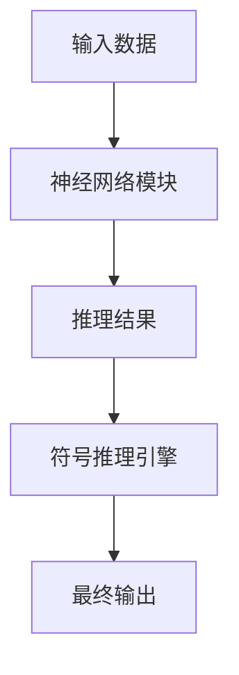

                 


# 神经符号融合：增强AI Agent的推理能力

## 关键词：
神经符号融合，AI Agent，符号推理，神经网络，知识图谱，增强推理，通用人工智能（AGI）

## 摘要：
神经符号融合是一种结合符号推理和神经网络技术的方法，旨在增强AI Agent的推理能力。传统AI在复杂推理任务中表现不足，而神经符号融合通过将符号规则嵌入神经网络，利用符号推理的逻辑优势和神经网络的非线性特征学习能力，有效提升了AI Agent的理解和推理能力。本文从背景、核心概念、算法原理、系统架构到项目实战，全面解析神经符号融合的原理与应用，帮助读者理解并掌握这一前沿技术。

---

## 第一部分：背景与核心概念

### 第1章：神经符号融合的背景与问题背景

#### 1.1 神经符号融合的背景

1.1.1 传统AI的局限性  
传统AI主要依赖符号推理和规则引擎，但在处理复杂、模糊和动态变化的问题时表现出局限性。符号推理虽然在逻辑推理方面强大，但难以处理非结构化数据和复杂场景。

1.1.2 神经网络与符号推理的结合  
神经网络在处理图像、自然语言等复杂数据方面表现出色，但缺乏逻辑推理能力。符号推理虽然逻辑强大，但难以处理复杂数据。神经符号融合将两者结合，优势互补。

1.1.3 神经符号融合  
神经符号融合是一种结合神经网络和符号推理的技术，旨在提升AI Agent的推理能力，解决传统AI在复杂任务中的局限性。

#### 1.2 问题背景与问题描述

传统AI在推理能力上的不足主要体现在：  
1. 符号推理缺乏对复杂数据的处理能力。  
2. 神经网络缺乏逻辑推理能力。  
神经符号融合通过结合两者，提升AI Agent在复杂任务中的表现。

#### 1.3 神经符号融合的核心目标  
通过结合符号推理和神经网络，增强AI Agent的理解和推理能力，使其在复杂场景中表现出色。

#### 1.4 问题解决  
神经符号融合通过将符号规则嵌入神经网络，利用符号推理的逻辑优势和神经网络的特征学习能力，提升AI Agent的推理能力。

#### 1.5 约束条件与外延  
神经符号融合的应用场景包括问答系统、智能对话、知识图谱推理等，其核心是将符号推理与神经网络结合。

#### 1.6 核心概念结构与组成

| 核心概念 | 属性 |
|----------|------|
| 符号推理 | 逻辑规则、一阶逻辑、框架表示 |
| 神经网络 | CNN、RNN、Transformer |
| 神经符号融合 | 结合符号规则与神经网络 |

---

## 第二部分：核心概念与联系

### 第2章：符号表示与神经符号模型

#### 2.1 符号表示的核心概念

- 符号表示的类型：
  - 一阶逻辑：通过谓词和个体进行逻辑推理。
  - 框架表示：使用槽位和填充方式表示知识。
- 符号表示的特点：
  - 精确性高，逻辑性强。
  - 但难以处理非结构化数据。

#### 2.2 神经符号模型的构建

- 神经符号模型的基本结构：
  - 知识表示层：符号化表示知识。
  - 神经网络层：处理输入数据。
  - 推理层：符号推理引擎。

- 实现流程：
  1. 输入数据处理。
  2. 神经网络提取特征。
  3. 符号推理引擎进行推理。

#### 2.3 符号推理与神经网络的对比分析

| 特性 | 符号推理 | 神经网络 |
|------|----------|----------|
| 优势 | 逻辑性、精确性 | 复杂数据处理、特征学习 |
| 劣势 | 难处理非结构化数据 | 缺乏逻辑推理 |

---

## 第三部分：算法原理与数学模型

### 第3章：神经符号融合的算法原理

#### 3.1 算法原理概述

- 神经符号融合的核心是将符号规则嵌入神经网络，形成一个混合模型。

- 常见的神经符号融合算法：
  - Rule-based Neural Networks。
  - Neural Logic Programming。

#### 3.2 神经符号融合算法的流程

1. 数据预处理：结构化符号知识。
2. 神经网络学习：提取特征。
3. 符号推理：基于符号规则进行推理。

#### 3.3 算法实现代码示例

```python
import tensorflow as tf
from tensorflow.keras import layers

# 定义符号规则：如果A，则B
def symbolic_rule(A):
    return A >= 0.5

# 神经符号融合模型
class NeuralSymbolicModel(tf.keras.Model):
    def __init__(self):
        super(NeuralSymbolicModel, self).__init__()
        self.dense1 = layers.Dense(64, activation='relu')
        self.dense2 = layers.Dense(1, activation='sigmoid')
    
    def call(self, inputs):
        x = self.dense1(inputs)
        x = self.dense2(x)
        x = tf.where(symbolic_rule(x), x, 0.0)
        return x
```

#### 3.4 神经符号融合的数学模型

神经符号融合模型将符号规则嵌入神经网络，形成一个混合模型。例如：

$$
\text{输出} = f(x) \times g(x)
$$

其中，\( f(x) \) 是神经网络的输出，\( g(x) \) 是符号规则的判断结果。

---

## 第四部分：系统分析与架构设计

### 第4章：系统架构与接口设计

#### 4.1 系统功能设计

- 系统架构设计：
  - 知识库模块：存储符号知识。
  - 推理引擎：符号推理引擎。
  - 神经网络模块：处理输入数据。

- 系统功能流程：
  1. 输入数据处理。
  2. 神经网络提取特征。
  3. 符号推理引擎进行推理。
  4. 输出结果。

#### 4.2 系统架构图



---

## 第五部分：项目实战

### 第5章：项目实战与案例分析

#### 5.1 项目环境安装

- 安装TensorFlow、Keras、Mermaid等工具。

#### 5.2 系统核心实现

```python
import tensorflow as tf
from tensorflow.keras import layers

class NeuralSymbolicModel(tf.keras.Model):
    def __init__(self):
        super(NeuralSymbolicModel, self).__init__()
        self.dense1 = layers.Dense(64, activation='relu')
        self.dense2 = layers.Dense(1, activation='sigmoid')
    
    def call(self, inputs):
        x = self.dense1(inputs)
        x = self.dense2(x)
        x = tf.where(x >= 0.5, x, 0.0)
        return x
```

#### 5.3 代码应用解读

- 代码实现神经符号融合模型，将符号规则嵌入神经网络，提升模型的推理能力。

#### 5.4 案例分析

- 案例：构建问答系统，结合符号推理和神经网络，提升回答准确性。

---

## 第六部分：总结与展望

### 第6章：总结与最佳实践

#### 6.1 总结

神经符号融合结合了符号推理和神经网络的优势，提升了AI Agent的推理能力。

#### 6.2 最佳实践

- 在实际应用中，根据具体任务选择合适的符号表示和神经网络架构。
- 确保符号规则的准确性和可解释性。
- 定期更新知识库和模型，以应对变化。

---

## 作者信息

作者：AI天才研究院/AI Genius Institute & 禅与计算机程序设计艺术 /Zen And The Art of Computer Programming

---

本文系统介绍了神经符号融合的背景、核心概念、算法原理、系统架构和项目实战，帮助读者全面理解并掌握这一技术。

