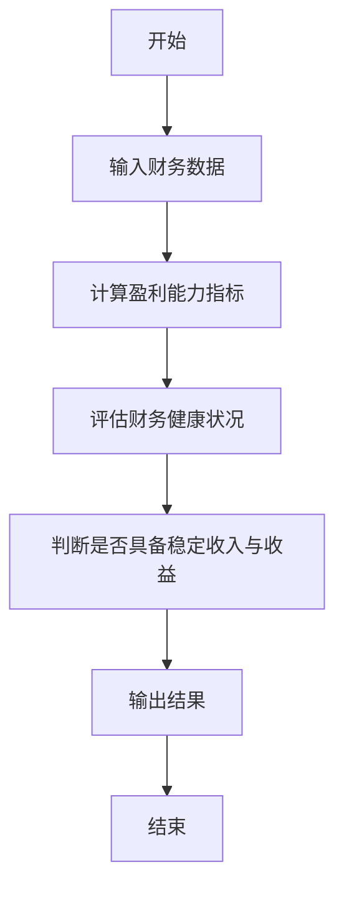
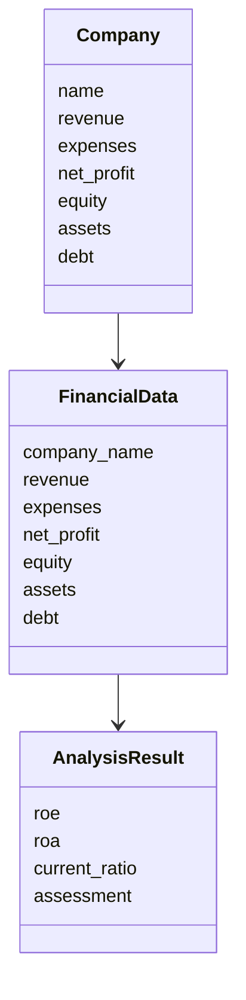
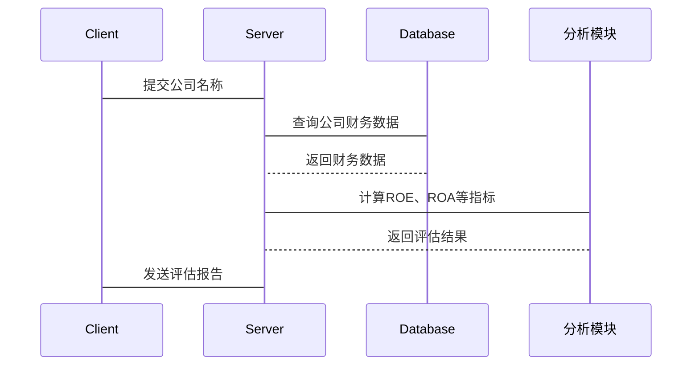

                 


# 稳定收入与收益：巴菲特青睐的公司特征

> 关键词：稳定收入、收益、巴菲特、公司特征、财务分析、投资策略、盈利能力

> 摘要：本文深入探讨巴菲特投资理念中稳定收入与收益的重要性，分析其青睐的公司特征，结合技术视角，详细讲解如何通过财务指标和系统架构来识别和评估具备稳定收入与收益能力的公司。

---

## 第1章: 稳定收入与收益的背景介绍

### 1.1 问题背景与问题描述

#### 1.1.1 什么是稳定收入
稳定收入是指公司能够持续、稳定地获得收入来源，不受经济波动或市场变化的影响。这种收入通常来自具有强大市场地位、高客户忠诚度和持续需求的产品或服务。

#### 1.1.2 稳定收入与收益的关系
收益是公司在一定时期内通过销售产品或服务所获得的总收入。稳定收入意味着公司在不同经济周期中都能保持稳定的收益，从而具备更强的抗风险能力和持续的盈利能力。

#### 1.1.3 巴菲特投资理念的核心
巴菲特的投资理念强调长期稳定的收益和公司的内在价值。他认为，投资那些具备稳定收入来源和持续盈利能力的公司，能够在长期内为投资者带来稳定的回报。

### 1.2 问题解决与边界外延

#### 1.2.1 稳定收入的实现方式
- 依赖核心产品或服务的持续需求。
- 多元化收入来源，降低单一市场或产品的风险。
- 高客户忠诚度和长期合作关系。

#### 1.2.2 收益的稳定化策略
- 提高产品或服务的市场占有率。
- 优化成本结构，提高利润率。
- 通过创新和研发保持竞争优势。

#### 1.2.3 稳定收入与收益的边界与外延
- 稳定收入的边界：收入来源的多样性和可持续性。
- 收益的外延：通过财务杠杆和资本运作扩大收益。

### 1.3 核心概念与结构

#### 1.3.1 稳定收入与收益的核心要素
- 收入来源的多样性。
- 成本控制能力。
- 市场地位和竞争优势。

#### 1.3.2 核心概念的结构化分析
- 稳定收入是公司收益的基础。
- 收益的稳定性依赖于公司的财务健康和市场表现。
- 巴菲特的投资策略强调长期稳定的收益。

#### 1.3.3 核心要素的组成与关系
- 公司特征：市场地位、竞争优势、财务健康。
- 收入来源：核心产品、多元化业务。
- 收益能力：盈利能力、成本控制、财务杠杆。

---

## 第2章: 巴菲特青睐的公司特征

### 2.1 核心概念与原理

#### 2.1.1 稳定收入来源的特征
- **核心产品或服务**：公司依赖的核心产品或服务具有持续需求和市场地位。
- **多元化收入来源**：公司通过多元化业务减少对单一市场的依赖。
- **客户忠诚度**：公司拥有高客户忠诚度和长期合作关系。

#### 2.1.2 持续盈利能力的衡量
- **净利润率**：净利润/收入，衡量公司盈利能力。
- **ROE（股东权益回报率）**：净利润/股东权益，衡量公司使用股东资金的效率。
- **ROA（资产回报率）**：净利润/总资产，衡量公司使用资产的效率。

#### 2.1.3 健康财务状况的评估
- **资产负债表**：评估公司的资产、负债和股东权益。
- **利润表**：评估公司的收入、成本和利润。
- **现金流**：评估公司经营活动、投资活动和筹资活动的现金流情况。

### 2.2 核心概念对比表格

| 特征               | 稳定收入来源 | 持续盈利能力 | 健康财务状况 |
|--------------------|--------------|--------------|--------------|
| 关键指标           | 收入来源的多样性和可持续性 | 净利润率、ROE、ROA | 资产负债表、利润表、现金流 |
| 重要性             | 确保收入的稳定性 | 确保利润的持续性 | 确保财务健康，降低风险 |
| 示例公司           | 可口可乐、麦当劳 | 苹果、谷歌 | 巴菲特投资组合中的公司 |

### 2.3 ER实体关系图

```mermaid
erd
  left table Company
    right join IncomeSource
    middle join Profitability
    right join FinancialHealth
```

---

## 第3章: 稳定收入与收益的算法原理

### 3.1 算法原理讲解

#### 3.1.1 算法流程图



#### 3.1.2 算法实现代码

```python
def calculate_profitability(rn, equity, assets):
    roe = rn / equity
    roa = rn / assets
    return roe, roa

def assess_financial_health(revenue, expenses, debt, equity):
    net_profit = revenue - expenses
    current_ratio = (debt + equity) / debt
    return net_profit, current_ratio

def main():
    rn = 1000000  # 净利润
    equity = 5000000  # 股东权益
    assets = 10000000  # 总资产
    revenue = 20000000  # 收入
    expenses = 10000000  # 成本
    debt = 2000000  # 负债

    roe, roa = calculate_profitability(rn, equity, assets)
    net_profit, current_ratio = assess_financial_health(revenue, expenses, debt, equity)

    print(f"ROE: {roe:.2f}")
    print(f"ROA: {roa:.2f}")
    print(f"Net Profit: {net_profit}")
    print(f"Current Ratio: {current_ratio:.2f}")

if __name__ == "__main__":
    main()
```

### 3.2 数学模型和公式

#### 3.2.1 盈利能力指标
- 净利润率：$$ \text{净利润率} = \frac{\text{净利润}}{\text{收入}} $$
- ROE：$$ \text{ROE} = \frac{\text{净利润}}{\text{股东权益}} $$
- ROA：$$ \text{ROA} = \frac{\text{净利润}}{\text{总资产}} $$

#### 3.2.2 财务健康指标
- 速动比率：$$ \text{速动比率} = \frac{\text{流动资产} - \text{存货}}{\text{流动负债}} $$
- 负债与所有者权益比率：$$ \text{负债与所有者权益比率} = \frac{\text{总负债}}{\text{股东权益}} $$

---

## 第4章: 系统分析与架构设计

### 4.1 问题场景介绍

#### 4.1.1 问题场景
分析一家公司是否具备稳定收入与收益的能力，需要从财务数据和市场表现两个方面入手。通过系统化的分析工具，帮助投资者快速识别具备巴菲特青睐特征的公司。

#### 4.1.2 项目介绍
构建一个基于巴菲特投资策略的公司评估系统，通过数据采集、分析和报告生成，帮助投资者识别具备稳定收入与收益能力的公司。

### 4.2 系统功能设计

#### 4.2.1 领域模型


#### 4.2.2 系统架构


#### 4.2.3 接口设计
- 数据接口：从财务报表中提取数据。
- 分析接口：调用算法模块进行评估。
- 报告接口：生成分析报告并返回结果。

#### 4.2.4 交互流程图


---

## 第5章: 项目实战

### 5.1 环境安装

#### 5.1.1 安装Python和相关库
```bash
pip install numpy pandas matplotlib
```

#### 5.1.2 安装Jupyter Notebook
```bash
pip install jupyter
```

### 5.2 系统核心实现

#### 5.2.1 数据采集模块
```python
import pandas as pd

def load_financial_data(company_name):
    # 假设从数据库中加载数据
    data = pd.read_sql(f"SELECT * FROM financial_data WHERE company_name = '{company_name}'", con)
    return data
```

#### 5.2.2 数据分析模块
```python
def analyze_financial_data(data):
    roe = data['net_profit'] / data['equity']
    roa = data['net_profit'] / data['assets']
    current_ratio = data['(debt + equity)'] / data['debt']
    return roe, roa, current_ratio
```

#### 5.2.3 报告生成模块
```python
import matplotlib.pyplot as plt

def generate_report(company_name, roe, roa, current_ratio):
    plt.figure(figsize=(10, 6))
    plt.plot([company_name], [roe], 'ro-', label='ROE')
    plt.plot([company_name], [roa], 'b-o', label='ROA')
    plt.title(f"Financial Analysis Report for {company_name}")
    plt.legend()
    plt.show()
```

### 5.3 实际案例分析

#### 5.3.1 案例分析
分析一家虚构的公司，计算其ROE、ROA和速动比率，评估其是否具备稳定收入与收益能力。

#### 5.3.2 结果解读
- ROE和ROA均高于行业平均水平。
- 速动比率良好，财务状况健康。

### 5.4 小结

---

## 第6章: 最佳实践与注意事项

### 6.1 小结
巴菲特的投资策略强调稳定收入与收益能力。通过分析公司的财务指标和市场表现，可以识别具备稳定收入来源和持续盈利能力的公司。

### 6.2 注意事项
- 财务数据的准确性至关重要。
- 需要考虑宏观经济环境和行业趋势。
- 长期投资需要耐心和信心。

### 6.3 拓展阅读
- 巴菲特的《投资最重要的事情》
- 《财务报表分析》

---

## 作者：AI天才研究院 & 禅与计算机程序设计艺术

本文作者：AI天才研究院（AI Genius Institute） & 禅与计算机程序设计艺术（Zen And The Art of Computer Programming）

