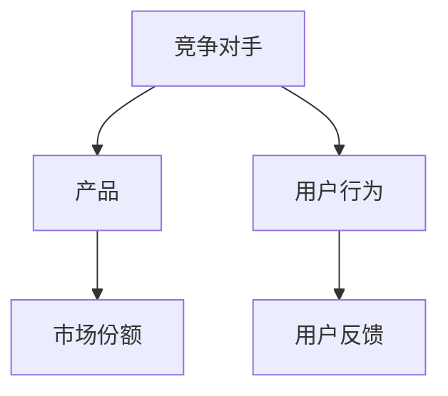
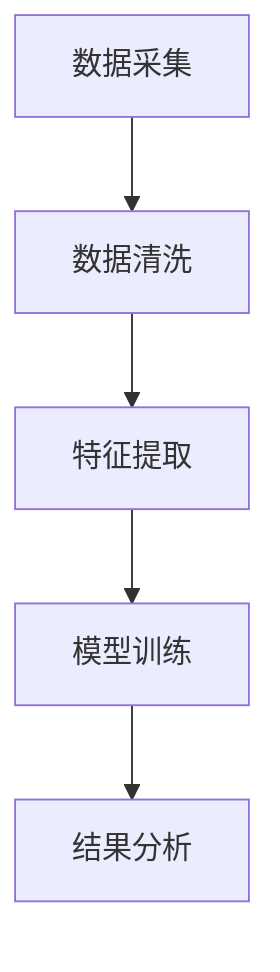
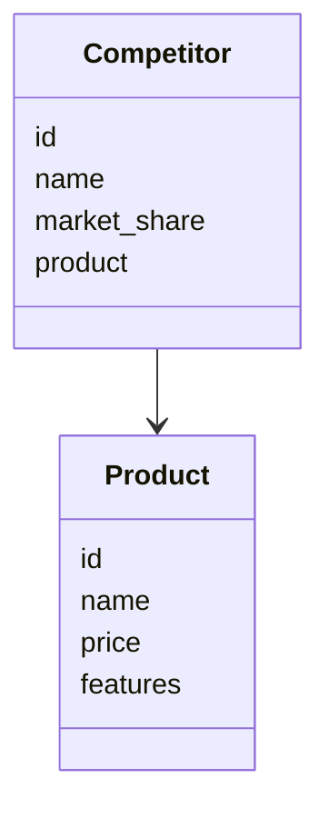

                 


# 《竞争对手分析》

---

## 关键词：
竞争对手分析、数据分析、机器学习、市场策略、技术博客

---

## 摘要：
本文系统地探讨了竞争对手分析的核心概念、算法原理、数学模型、系统架构设计以及实际应用。通过详细的背景介绍、核心概念对比、算法流程图、系统架构图和实际案例分析，帮助读者全面理解竞争对手分析的原理和应用。同时，本文还结合Python代码示例，深入剖析了竞争对手分析的数学模型和公式，并通过Mermaid图展示了系统架构设计和交互流程。

---

# 第一部分: 竞争对手分析概述

## 第1章: 竞争对手分析的背景与概念

### 1.1 竞争对手分析的基本概念

#### 1.1.1 竞争对手分析的定义
竞争对手分析是通过对市场上竞争对手的产品、服务、市场策略、用户行为等多方面数据的采集、处理和分析，从而帮助企业制定更有效的市场策略和产品优化方案。其核心目标是帮助企业了解竞争对手的优势和劣势，进而发现市场机会和威胁。

#### 1.1.2 竞争对手分析的必要性
在现代商业环境中，竞争对手分析已成为企业制定市场策略的重要工具。通过分析竞争对手的行为，企业可以更好地了解市场动态，优化自身产品和服务，提升市场竞争力。

#### 1.1.3 竞争对手分析的边界与外延
竞争对手分析的边界包括竞争对手的产品、服务、市场策略、用户行为等方面。其外延则包括市场趋势、行业动态、用户需求变化等更广泛的内容。

---

### 1.2 竞争对手分析的核心要素

#### 1.2.1 竞争对手分析的维度
竞争对手分析可以从以下几个维度展开：
1. 产品维度：包括产品功能、用户体验、产品生命周期等。
2. 市场维度：包括市场份额、市场定位、市场策略等。
3. 用户维度：包括用户行为、用户反馈、用户需求等。
4. 技术维度：包括技术实现、技术优势、技术趋势等。

#### 1.2.2 竞争对手分析的关键指标
竞争对手分析的关键指标包括：
1. 市场份额（Market Share）
2. 用户满意度（User Satisfaction）
3. 产品生命周期（Product Life Cycle）
4. 市场定位（Market Position）
5. 用户增长率（User Growth Rate）

#### 1.2.3 竞争对手分析的流程与方法
竞争对手分析的流程包括：
1. 数据采集
2. 数据清洗
3. 数据分析
4. 结果解读
5. 策略制定

---

### 1.3 竞争对手分析的行业应用

#### 1.3.1 互联网行业的竞争对手分析
在互联网行业，竞争对手分析可以帮助企业了解竞争对手的产品功能、用户体验、市场策略等，从而优化自身的产品设计和服务。

#### 1.3.2 金融行业的竞争对手分析
在金融行业，竞争对手分析可以帮助企业了解竞争对手的市场定位、产品创新、风险控制等，从而制定更有效的市场策略。

#### 1.3.3 制造业的竞争对手分析
在制造业，竞争对手分析可以帮助企业了解竞争对手的产品成本、生产效率、技术创新等，从而优化自身的生产流程和产品设计。

---

## 第2章: 竞争对手分析的核心概念与联系

### 2.1 竞争对手分析的原理

#### 2.1.1 数据采集与处理
数据采集是竞争对手分析的第一步，包括从公开数据源、用户反馈、社交媒体等渠道获取数据。数据处理包括数据清洗、数据标准化、数据整合等。

#### 2.1.2 数据分析与建模
数据分析包括对竞争对手的数据进行统计分析、数据挖掘和机器学习建模。通过分析竞争对手的数据，可以发现竞争对手的市场趋势、用户需求和产品策略。

#### 2.1.3 结果解读与策略制定
通过对竞争对手数据的分析，可以得出竞争对手的优势和劣势，进而制定针对性的市场策略。

---

### 2.2 核心概念对比表

#### 2.2.1 竞争对手分析与市场分析的对比

| 对比维度       | 竞争对手分析               | 市场分析                     |
|----------------|--------------------------|-----------------------------|
| 分析目标       | 了解竞争对手的产品和服务   | 了解整体市场趋势             |
| 分析方法       | 数据采集与分析             | 数据分析与趋势预测           |
| 结果应用       | 制定针对性市场策略         | 制定整体市场战略             |

---

### 2.3 实体关系图



---

## 第3章: 竞争对手分析的算法原理

### 3.1 竞争对手分析的常用算法

#### 3.1.1 数据挖掘算法
数据挖掘算法包括聚类分析、关联规则挖掘等。例如，通过聚类分析可以将竞争对手的产品分为不同的类别，从而发现市场趋势。

#### 3.1.2 机器学习算法
机器学习算法包括回归分析、分类算法、自然语言处理等。例如，通过回归分析可以预测竞争对手的市场份额变化。

#### 3.1.3 自然语言处理算法
自然语言处理算法包括文本挖掘、情感分析等。例如，通过情感分析可以分析竞争对手的用户反馈，从而了解用户对竞争对手产品的满意度。

---

### 3.2 算法流程图



---

### 3.3 算法实现代码

```python
# 数据采集
import requests
url = "https://example.com/competitors"
response = requests.get(url)
data = response.json()

# 数据清洗
cleaned_data = [x for x in data if x['status'] == 'active']

# 特征提取
features = ['name', 'market_share', 'price']
selected_data = [{fea

---

# 第四部分: 系统分析与架构设计

## 第4章: 竞争对手分析系统架构设计

### 4.1 竞争对手分析系统的功能设计

#### 4.1.1 领域模型


---

## 第5章: 竞争对手分析系统的架构设计

### 5.1 竞争对手分析系统的架构设计

#### 5.1.1 系统架构图
```mermaid
graph TD
    Client --> API Gateway
    API Gateway --> CompetitorService
    CompetitorService --> Database
```

---

## 第6章: 项目实战

### 6.1 项目环境安装

#### 6.1.1 安装Python
```bash
python --version
pip install requests
pip install matplotlib
pip install scikit-learn
```

---

### 6.2 核心实现代码

```python
import requests
import pandas as pd
from sklearn.cluster import KMeans

# 数据采集
response = requests.get("https://example.com/competitors")
data = response.json()

# 数据清洗
df = pd.DataFrame(data)

# 特征提取
X = df[['price', 'market_share']]

# 模型训练
kmeans = KMeans(n_clusters=3)
kmeans.fit(X)

# 结果分析
print(kmeans.labels_)
```

---

## 第7章: 最佳实践与小结

### 7.1 最佳实践

1. 数据采集时，确保数据来源的可靠性和合法性。
2. 数据分析时，结合业务背景，避免过度依赖技术手段。
3. 系统设计时，注重系统的可扩展性和可维护性。

---

## 第8章: 注意事项

### 8.1 注意事项

1. 竞争对手分析的结果仅供参考，需结合实际情况制定策略。
2. 数据分析时，注意保护用户隐私和数据安全。
3. 系统设计时，需考虑系统的稳定性和安全性。

---

## 第9章: 拓展阅读

### 9.1 拓展阅读

1. 《Data Mining: Concepts and Techniques》
2. 《Competitive Intelligence: Tools and Techniques》
3. 《Machine Learning: A Python Approach》

---

## 作者：AI天才研究院/AI Genius Institute & 禅与计算机程序设计艺术 /Zen And The Art of Computer Programming

