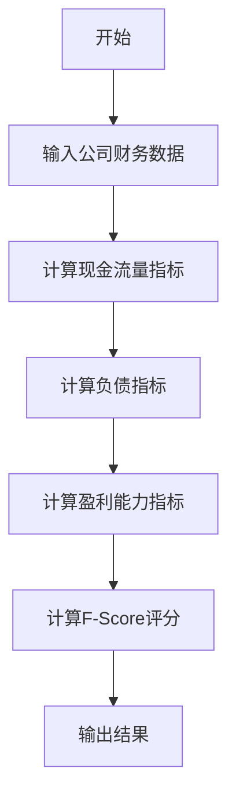
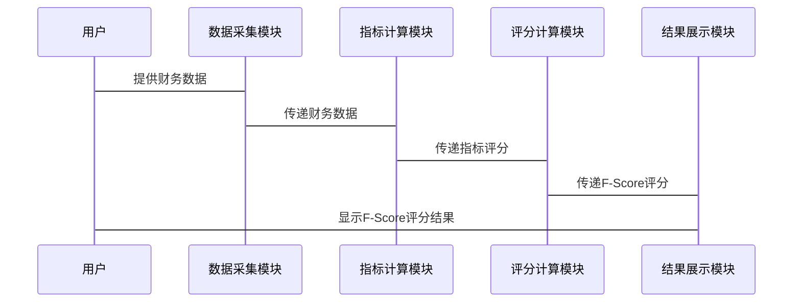

                 


# 约瑟夫·皮奥特罗斯基的F-Score选股模型

## 关键词：F-Score, 选股模型, 财务指标, 投资分析, 股票投资

## 摘要：  
F-Score是一种基于财务指标的选股模型，主要用于识别财务健康、具有投资价值的公司。本文深入分析了F-Score的核心概念、算法原理、系统架构设计以及实际项目应用，详细解释了F-Score的评分标准和计算流程，并通过Python代码示例展示了如何实现F-Score模型。文章还探讨了F-Score在投资实践中的优势与局限性，并展望了未来的发展方向。

---

# 第1章: F-Score选股模型概述

## 1.1 F-Score的起源与发展

### 1.1.1 传统选股模型的局限性  
传统选股模型（如市盈率、市净率等）主要依赖于市场估值指标，但这些指标无法全面反映公司的财务健康状况。许多公司可能因为财务造假或管理不善而面临风险，而传统模型往往无法提前预警这些风险。

### 1.1.2 F-Score的提出与核心思想  
F-Score由约瑟夫·皮奥特罗斯基在1990年代提出，是一种基于财务指标的选股模型。其核心思想是通过分析公司财务报表中的关键指标，评估公司的财务健康状况，从而筛选出具有投资价值的公司。

### 1.1.3 F-Score在投资实践中的应用  
F-Score广泛应用于投资实践中，特别是在价值投资领域。通过F-Score模型，投资者可以识别出财务健康、估值合理的公司，从而降低投资风险。

---

## 1.2 F-Score的核心概念与特点

### 1.2.1 F-Score的基本定义  
F-Score是一种基于财务指标的选股模型，通过对公司财务报表中的关键指标进行评分，最终得出一个综合评分，评分越高表示公司财务健康状况越好。

### 1.2.2 F-Score的核心指标与评分标准  
F-Score的核心指标包括现金流量、负债和盈利能力三个维度。每个维度都有具体的评分标准，评分结果通过权重计算得出最终得分。

### 1.2.3 F-Score与传统选股模型的区别  
与传统选股模型相比，F-Score更加注重公司的财务健康状况，而非单纯的市场估值。F-Score通过综合分析公司财务指标，能够更准确地识别出具有投资价值的公司。

---

## 1.3 F-Score的理论基础与数学模型

### 1.3.1 F-Score的评分标准（表格形式）  
| 指标 | 评分标准 | 权重 |
|------|----------|------|
| 现金流量 | 现金净流入 > 0 | 50% |
| 负债 | 负债率 < 50% | 30% |
| 盈利能力 | 净利润率 > 5% | 20% |

### 1.3.2 F-Score的评分流程（mermaid流程图）  


---

# 第2章: F-Score的核心概念与原理

## 2.1 F-Score的核心指标分析

### 2.1.1 现金流量评分标准  
现金流量是F-Score模型中最重要的指标之一。如果公司现金净流入为正，则表示公司财务健康，评分得满分。

### 2.1.2 负债评分标准  
负债率是公司负债与资产的比率。如果负债率低于50%，则表示公司财务杠杆合理，评分得满分。

### 2.1.3 盈利能力评分标准  
净利润率是公司净利润与收入的比率。如果净利润率高于5%，则表示公司盈利能力较强，评分得满分。

## 2.2 F-Score的评分机制

### 2.2.1 F-Score的评分公式（数学公式）  
$$ F\text{-Score} = w_1 \cdot score_1 + w_2 \cdot score_2 + w_3 \cdot score_3 $$  
其中，$w_1$、$w_2$、$w_3$分别为现金流量、负债和盈利能力的权重，$score_1$、$score_2$、$score_3$分别为各指标的评分。

### 2.2.2 F-Score的评分权重分配  
F-Score的评分权重分配如下：  
- 现金流量：50%  
- 负债：30%  
- 盈利能力：20%  

### 2.2.3 F-Score的评分结果分类  
评分结果分为五类：  
- 9分以上：财务非常健康，投资价值高  
- 7-8分：财务健康，有一定投资价值  
- 5-6分：财务状况一般，需谨慎投资  
- 3-4分：财务状况较差，投资风险较高  
- 0-2分：财务状况不佳，不建议投资  

---

## 2.3 F-Score的评分标准对比（表格形式）

| 指标 | 评分标准 | 权重 | 示例公司A | 示例公司B |
|------|----------|------|----------|----------|
| 现金流量 | 现金净流入 > 0 | 50% | $500万 | $300万 |
| 负债 | 负债率 < 50% | 30% | 40% | 60% |
| 盈利能力 | 净利润率 > 5% | 20% | 6% | 3% |

---

# 第3章: F-Score的算法原理与实现

## 3.1 F-Score的算法流程

### 3.1.1 数据输入与预处理  
输入公司财务数据，包括现金流量、负债和盈利能力等指标。

### 3.1.2 核心指标计算  
根据F-Score的评分标准，计算各核心指标的评分。

### 3.1.3 评分标准应用  
根据评分标准，对各指标进行评分，并计算综合评分。

### 3.1.4 最终评分输出  
输出F-Score评分结果，并根据评分结果分类进行投资决策。

---

## 3.2 F-Score的Python实现

### 3.2.1 数据读取与处理（代码示例）  
```python
import pandas as pd

# 读取财务数据
df = pd.read_csv('financial_data.csv')
```

### 3.2.2 核心指标计算（代码示例）  
```python
# 计算现金流量评分
cash_flow_score = 1 if df['cash_flow'].values[0] > 0 else 0

# 计算负债评分
负债率 = df['负债'].values[0] / df['资产'].values[0]
负债_score = 1 if 负债率 < 0.5 else 0

# 计算盈利能力评分
net_profit_margin = df['净利润'].values[0] / df['收入'].values[0]
profitability_score = 1 if net_profit_margin > 0.05 else 0
```

### 3.2.3 F-Score评分计算（代码示例）  
```python
# 计算F-Score评分
F_Score = 0.5 * cash_flow_score + 0.3 * 负债_score + 0.2 * profitability_score
```

---

## 3.3 F-Score的数学模型与公式

### 3.3.1 F-Score的数学推导  
F-Score的计算公式如下：  
$$ F\text{-Score} = 0.5 \cdot score_{\text{cash}} + 0.3 \cdot score_{\text{负债}} + 0.2 \cdot score_{\text{profit}} $$  
其中，$score_{\text{cash}}$、$score_{\text{负债}}$、$score_{\text{profit}}$分别为现金流量、负债和盈利能力的评分，取值为0或1。

### 3.3.2 F-Score的优化与改进  
F-Score的优化方向包括引入更多财务指标、动态调整权重以及结合其他选股模型进行综合评估。

---

# 第4章: F-Score的系统分析与架构设计

## 4.1 系统功能设计

### 4.1.1 数据采集模块  
从财务数据源获取公司财务数据，包括现金流量、负债和盈利能力等指标。

### 4.1.2 指标计算模块  
根据F-Score的评分标准，计算各核心指标的评分。

### 4.1.3 评分计算模块  
根据评分标准，对各指标进行评分，并计算综合评分。

### 4.1.4 结果展示模块  
展示F-Score评分结果，并根据评分结果分类进行投资决策。

---

## 4.2 系统架构设计（mermaid架构图）


---

## 4.3 系统接口设计

### 4.3.1 数据接口  
从财务数据源获取公司财务数据，格式为CSV或JSON。

### 4.3.2 计算接口  
接收财务数据，计算各核心指标的评分，并返回F-Score评分结果。

### 4.3.3 展示接口  
展示F-Score评分结果，并根据评分结果分类进行投资决策。

---

## 4.4 系统交互设计（mermaid序列图）



---

# 第5章: F-Score的项目实战

## 5.1 环境安装与配置

### 5.1.1 Python环境安装  
安装Python和必要的库，如pandas、numpy等。

### 5.1.2 数据源获取  
获取公司财务数据，格式为CSV或JSON。

---

## 5.2 系统核心实现

### 5.2.1 数据读取与处理  
```python
import pandas as pd

# 读取财务数据
df = pd.read_csv('financial_data.csv')
```

### 5.2.2 核心指标计算  
```python
# 计算现金流量评分
cash_flow_score = 1 if df['cash_flow'].values[0] > 0 else 0

# 计算负债评分
负债率 = df['负债'].values[0] / df['资产'].values[0]
负债_score = 1 if 负债率 < 0.5 else 0

# 计算盈利能力评分
net_profit_margin = df['净利润'].values[0] / df['收入'].values[0]
profitability_score = 1 if net_profit_margin > 0.05 else 0
```

### 5.2.3 F-Score评分计算  
```python
# 计算F-Score评分
F_Score = 0.5 * cash_flow_score + 0.3 * 负债_score + 0.2 * profitability_score
```

---

## 5.3 实际案例分析

### 5.3.1 案例背景  
以某公司为例，分析其财务数据，计算F-Score评分。

### 5.3.2 数据解读与分析  
通过F-Score评分，识别公司财务健康状况，评估其投资价值。

### 5.3.3 投资决策建议  
根据F-Score评分结果，提出投资建议。

---

## 5.4 项目总结

### 5.4.1 项目成果  
通过F-Score模型，成功识别出财务健康、具有投资价值的公司。

### 5.4.2 项目经验  
在项目实施过程中，需要注意数据的准确性和模型的可解释性。

### 5.4.3 项目展望  
未来可以进一步优化F-Score模型，引入更多财务指标和动态权重。

---

# 第6章: 总结与展望

## 6.1 F-Score的核心优势与局限性

### 6.1.1 核心优势  
F-Score通过综合分析公司财务指标，能够有效识别财务健康、具有投资价值的公司。

### 6.1.2 局限性  
F-Score模型过于依赖财务数据，忽略了市场风险和宏观经济因素。

---

## 6.2 F-Score的未来发展

### 6.2.1 模型优化与改进  
未来可以进一步优化F-Score模型，引入更多财务指标和动态权重。

### 6.2.2 技术应用与推广  
F-Score模型可以应用于更多领域，如私募股权、风险投资等。

---

## 6.3 F-Score的最佳实践 Tips

### 6.3.1 数据准确性  
确保输入数据的准确性和完整性。

### 6.3.2 模型解释性  
关注模型的可解释性，避免过于复杂的计算。

### 6.3.3 结合其他指标  
将F-Score与其它选股模型结合，进行综合评估。

---

## 作者：AI天才研究院/AI Genius Institute & 禅与计算机程序设计艺术/Zen And The Art of Computer Programming

---

通过本文，读者可以深入了解F-Score选股模型的核心概念、算法原理和实际应用。F-Score模型作为一种有效的选股工具，能够帮助投资者识别财务健康、具有投资价值的公司，降低投资风险。

