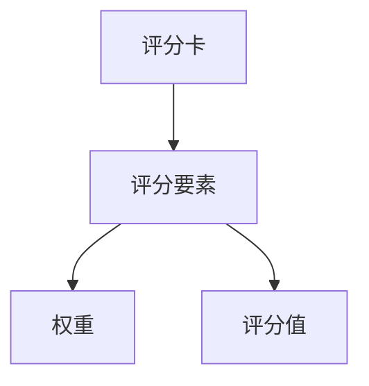

                 


# 约瑟夫·皮奥特罗斯基的价值投资评分卡：系统化选股方法

---

## 关键词  
- 价值投资  
- 投资评分卡  
- 约瑟夫·皮奥特罗斯基  
- 系统化选股  
- 股票分析  

---

## 摘要  
本文深入探讨了约瑟夫·皮奥特罗斯基的价值投资评分卡方法，这是一种系统化选股策略，旨在帮助投资者通过量化分析来评估股票的价值。文章从价值投资的基本原理出发，详细讲解了评分卡的核心概念、构建原理、数学模型、系统架构以及实际应用案例。通过本文，读者可以理解如何利用评分卡系统化地进行股票筛选，从而做出更明智的投资决策。

---

## 目录  

1. [价值投资与评分卡概述](#价值投资与评分卡概述)  
2. [价值投资评分卡的构建原理](#价值投资评分卡的构建原理)  
3. [价值投资评分卡的算法原理](#价值投资评分卡的算法原理)  
4. [价值投资评分卡的系统分析与架构设计](#价值投资评分卡的系统分析与架构设计)  
5. [价值投资评分卡的项目实战](#价值投资评分卡的项目实战)  

---

## 第1章: 价值投资与评分卡概述  

### 1.1 价值投资的核心理念  

#### 1.1.1 价值投资的定义与特点  
价值投资是一种投资策略，强调购买价格低于其内在价值的股票。其核心在于寻找市场低估的公司，长期持有，等待其价值回归。  
- **定义**：价值投资关注企业的基本面，如盈利能力、财务健康状况和行业地位。  
- **特点**：  
  - 长期投资视角  
  - 低估值导向  
  - 高关注企业质量  

#### 1.1.2 价值投资的核心原则  
1. **安全边际**：购买价格远低于内在价值，以降低风险。  
2. **长期视角**：关注企业的长期盈利能力，而非短期波动。  
3. **基本面分析**：通过财务报表等数据评估企业的价值。  

#### 1.1.3 价值投资在现代投资中的地位  
价值投资是投资策略的重要组成部分，尤其在市场波动较大时，其稳健性更加凸显。  

---

### 1.2 投资评分卡的概念与作用  

#### 1.2.1 投资评分卡的定义  
投资评分卡是一种量化工具，用于系统化评估股票的投资价值，通过多维度指标对股票进行评分，帮助投资者做出决策。  

#### 1.2.2 投资评分卡的核心作用  
1. **量化评估**：将复杂的股票分析过程转化为可量化的评分。  
2. **简化决策**：通过评分快速筛选出优质股票。  
3. **动态调整**：根据市场变化动态更新评分，适应市场波动。  

#### 1.2.3 投资评分卡的优势与局限性  
- **优势**：  
  - 系统化、客观化评估  
  - 节省时间和精力  
- **局限性**：  
  - 无法完全预测市场波动  
  - 需要持续更新和优化  

---

### 1.3 约瑟夫·皮奥特罗斯基的价值投资方法  

#### 1.3.1 约瑟夫·皮奥特罗斯基的生平简介  
约瑟夫·皮奥特罗斯基是价值投资领域的知名投资者，以其独特的评分卡方法闻名。  

#### 1.3.2 皮奥特罗斯基价值投资方法的核心思想  
皮奥特罗斯基强调通过量化分析，筛选出具备长期增长潜力且估值合理的股票。  

#### 1.3.3 皮奥特罗斯基评分卡的演变历程  
评分卡从最初的简单指标逐步发展为复杂的多维度评估体系，结合了财务数据、行业分析和市场趋势。  

---

### 1.4 本章小结  
本章介绍了价值投资的核心理念、投资评分卡的概念及其作用，以及约瑟夫·皮奥特罗斯基的价值投资方法。评分卡作为一种系统化工具，为投资者提供了科学的选股依据。  

---

## 第2章: 价值投资评分卡的构建原理  

### 2.1 评分卡的核心概念与要素  

#### 2.1.1 评分卡的构成要素  
1. **财务指标**：如市盈率、市净率、ROE等。  
2. **行业地位**：如市场占有率、竞争能力。  
3. **成长潜力**：如收入增长率、利润增长率。  
4. **风险管理**：如资产负债率、流动性比率。  
5. **管理层能力**：如管理团队的稳定性与经验。  

#### 2.1.2 各要素的定义与作用  
- **财务指标**：评估企业的盈利能力和估值水平。  
- **行业地位**：判断企业在行业中的竞争优势。  
- **成长潜力**：预测企业的未来增长能力。  
- **风险管理**：评估企业的财务健康状况。  
- **管理层能力**：影响企业的长期发展。  

#### 2.1.3 各要素之间的关系  
各要素相互关联，共同决定企业的整体价值。  

---

### 2.2 评分卡的数学模型与公式  

#### 2.2.1 评分卡的数学模型  
$$总分 = \sum (权重_i \times 评分_i)$$  
其中，$权重_i$ 是各要素的权重，$评分_i$ 是各要素的评分。  

#### 2.2.2 各要素的权重分配  
权重根据要素的重要性分配，例如：  
- 财务指标：权重40%  
- 行业地位：权重20%  
- 成长潜力：权重20%  
- 风险管理：权重10%  
- 管理层能力：权重10%  

#### 2.2.3 总分计算公式  
总分为各要素评分与权重的乘积之和，范围通常在0到100之间。  

---

### 2.3 评分卡的实体关系图  



---

### 2.4 本章小结  
本章详细讲解了评分卡的核心概念与构成要素，并通过数学模型和实体关系图展示了评分卡的构建原理。  

---

## 第3章: 价值投资评分卡的算法原理  

### 3.1 评分卡的算法流程  

#### 3.1.1 数据收集与处理  
1. 收集股票的财务数据、行业数据等。  
2. 数据清洗与标准化处理。  

#### 3.1.2 要素评分计算  
根据各要素的权重和评分标准，计算每个要素的评分。  

#### 3.1.3 总分计算与排序  
计算总分，并根据总分对股票进行排序。  

---

### 3.2 评分卡的算法实现  

#### 3.2.1 数据预处理  
- 数据清洗：处理缺失值、异常值。  
- 数据标准化：统一数据格式。  

#### 3.2.2 要素评分计算  
根据预处理后的数据，计算各要素的评分。  

#### 3.2.3 总分计算与排序  
将各要素评分与权重相乘求和，得到总分，并按总分排序。  

---

### 3.3 评分卡的算法优化  

#### 3.3.1 权重调整方法  
根据市场变化动态调整各要素的权重。  

#### 3.3.2 数据清洗与异常处理  
通过异常检测算法识别并处理异常数据。  

#### 3.3.3 算法的可扩展性优化  
引入并行计算，提高算法处理大数据的能力。  

---

### 3.4 本章小结  
本章详细讲解了评分卡的算法流程，包括数据预处理、评分计算和排序，并探讨了算法优化的方法。  

---

## 第4章: 价值投资评分卡的系统分析与架构设计  

### 4.1 评分卡系统的功能需求  

#### 4.1.1 数据采集模块  
- 功能：从数据库或API获取股票数据。  
- 输入：股票代码、时间范围。  
- 输出：财务数据、行业数据等。  

#### 4.1.2 评分计算模块  
- 功能：根据算法计算各要素评分和总分。  
- 输入：预处理后的数据。  
- 输出：评分结果。  

#### 4.1.3 结果展示模块  
- 功能：将评分结果以可视化形式展示。  
- 输入：评分结果。  
- 输出：图表、报表等。  

---

### 4.2 评分卡系统的架构设计  

#### 4.2.1 系统架构图  


---

### 4.3 评分卡系统的接口设计  

#### 4.3.1 数据接口  
- 数据输入接口：接收股票数据。  
- 数据输出接口：输出评分结果。  

#### 4.3.2 计算接口  
- 计算输入接口：接收预处理数据。  
- 计算输出接口：输出评分结果。  

#### 4.3.3 展示接口  
- 展示输入接口：接收评分结果。  
- 展示输出接口：输出可视化报表。  

---

### 4.4 评分卡系统的交互流程  

#### 4.4.1 用户输入  
用户输入股票代码和时间范围。  

#### 4.4.2 系统处理  
系统处理数据并计算评分。  

#### 4.4.3 结果输出  
系统展示评分结果，用户可查看并做出投资决策。  

---

### 4.5 本章小结  
本章通过系统架构图和交互流程图，详细讲解了评分卡系统的功能需求、架构设计和接口设计。  

---

## 第5章: 价值投资评分卡的项目实战  

### 5.1 项目环境与工具安装  

#### 5.1.1 环境配置  
- 操作系统：Windows/Mac/Linux  
- Python版本：3.6以上  
- 开发工具：VS Code/Jupyter Notebook  

#### 5.1.2 工具安装  
- 安装Python库：pandas、numpy、scikit-learn  
- 安装可视化工具：Matplotlib/Seaborn  

#### 5.1.3 数据源获取  
- 数据来源：Yahoo Finance/Alpha Vantage  

---

### 5.2 评分卡系统核心代码实现  

#### 5.2.1 数据预处理代码  

```python
import pandas as pd

# 读取数据
df = pd.read_csv('stock_data.csv')

# 数据清洗
df.dropna(inplace=True)
df = df[~df[' revenue'].str.contains('nan')]
```

---

#### 5.2.2 要素评分计算代码  

```python
# 定义评分函数
def calculate_score(value, min_val, max_val):
    return (value - min_val) / (max_val - min_val) * 10

# 计算各要素评分
df['profit_score'] = df['net_profit'].apply(lambda x: calculate_score(x, df['net_profit'].min(), df['net_profit'].max()))
```

---

#### 5.2.3 总分计算代码  

```python
# 定义总分计算函数
def calculate_total_score(row, weights):
    return sum(row[i] * weights[i] for i in range(len(weights)))

# 计算总分
weights = [0.4, 0.2, 0.2, 0.1, 0.1]
df['total_score'] = df[['profit_score', 'market_share', 'growth_potential', 'risk_management', 'management_capability']].apply(lambda x: calculate_total_score(x, weights))
```

---

### 5.3 代码应用与解读  

#### 5.3.1 代码结构分析  
代码分为数据预处理、评分计算和总分计算三个部分。  

#### 5.3.2 代码功能解读  
- 数据预处理：清洗和标准化数据。  
- 要素评分计算：根据权重计算各要素的评分。  
- 总分计算：根据总分对股票进行排序。  

---

### 5.4 实际案例分析  

#### 5.4.1 案例背景介绍  
假设我们有10只股票的数据，包括财务指标、行业地位等。  

#### 5.4.2 数据分析与处理  
使用代码对数据进行清洗和预处理。  

#### 5.4.3 评分计算与结果展示  
计算各要素评分和总分，按总分排序，筛选出评分最高的前3只股票。  

---

### 5.5 本章小结  
本章通过实际案例展示了评分卡系统的应用，从数据预处理到评分计算，再到结果展示，详细讲解了代码实现和实际效果。  

---

## 总结  

约瑟夫·皮奥特罗斯基的价值投资评分卡是一种系统化、科学化的选股方法，通过量化分析帮助企业识别具备长期投资价值的股票。本文从理论到实践，全面讲解了评分卡的构建原理、算法优化和系统设计，并通过实际案例展示了其应用效果。  

---

## 最佳实践 Tips  

1. **持续优化**：根据市场变化动态调整权重和评分标准。  
2. **结合定性分析**：评分卡结果应结合行业趋势和管理层情况等定性因素。  
3. **风险管理**：设置止损点，控制投资风险。  

---

## 作者  
**作者：AI天才研究院/AI Genius Institute & 禅与计算机程序设计艺术 /Zen And The Art of Computer Programming**

---

希望这篇文章能满足您的要求！如果需要进一步修改或补充，请随时告知。

