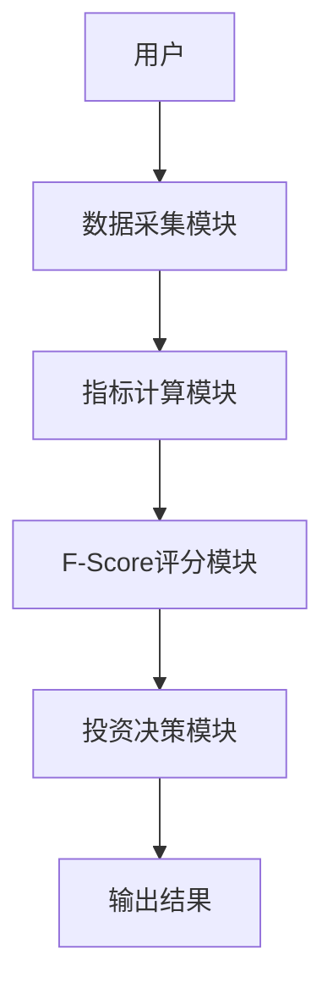

                 


# 约瑟夫·皮奥特罗斯基的基本面量化价值投资：F-Score应用

> 关键词：价值投资，F-Score，基本面分析，量化投资，企业估值

> 摘要：本文深入探讨了约瑟夫·皮奥特罗斯基的基本面量化价值投资方法，重点分析了F-Score评分系统的核心原理、应用场景及其在投资决策中的实际应用。通过理论与实践相结合的方式，详细解读了F-Score如何帮助投资者识别优质企业，评估企业价值，并制定科学的投资策略。

---

# 第一部分: 约瑟夫·皮奥特罗斯基的基本面量化价值投资基础

## # 第1章: 价值投资与F-Score概述

### ## 1.1 价值投资的基本概念
#### ### 1.1.1 价值投资的定义与核心理念
价值投资是一种以基本面分析为基础的投资策略，强调通过分析企业的财务状况、行业地位、盈利能力等基本面因素，寻找被市场低估的投资标的。其核心理念是“买入低于内在价值的资产”，并长期持有，等待其价值回归。

#### ### 1.1.2 价值投资的基本原则
1. **安全边际**：买入价格低于企业内在价值，确保足够的安全空间。
2. **长期视角**：关注企业的长期盈利能力，而非短期市场波动。
3. **深度研究**：通过细致的财务分析和行业研究，识别具有竞争优势的企业。

#### ### 1.1.3 价值投资与其它投资策略的对比
- **与趋势投资的对比**：趋势投资注重市场的短期趋势，而价值投资注重企业的长期基本面。
- **与成长投资的对比**：成长投资关注企业的高成长性，而价值投资关注企业的低估价值。

### ## 1.2 F-Score的基本概念
#### ### 1.2.1 F-Score的定义与起源
F-Score是由约瑟夫·皮奥特罗斯基提出的一种基本面量化分析工具，主要用于评估企业的财务健康状况和投资价值。它通过对企业财务数据的分析，生成一个评分系统，帮助投资者识别具有竞争优势的低估企业。

#### ### 1.2.2 F-Score的核心思想与应用场景
F-Score的核心思想是通过量化分析企业的财务健康状况，识别那些具有稳定盈利能力、良好现金流和合理估值的企业。其应用场景包括企业估值、投资决策、风险控制等。

#### ### 1.2.3 F-Score与其它基本面分析工具的对比
- **与Z-Score的对比**：Z-Score主要用于预测企业破产风险，而F-Score更注重企业估值和投资价值。
- **与Altman Z-Score的对比**：Altman Z-Score主要用于预测企业破产，而F-Score更注重企业基本面的全面评估。

### ## 1.3 本章小结
本章介绍了价值投资的基本概念和F-Score的核心思想，强调了F-Score在基本面量化分析中的独特地位。

---

# 第二部分: F-Score的核心概念与原理

## # 第2章: F-Score的理论基础

### ## 2.1 基本面分析的核心要素
#### ### 2.1.1 财务报表分析的基础知识
财务报表是基本面分析的核心工具，主要包括资产负债表、利润表和现金流量表。通过分析这些报表，可以评估企业的财务状况、盈利能力和发展潜力。

#### ### 2.1.2 资产负债表、利润表与现金流量表的核心指标
- **资产负债表**：关注企业的资产、负债和所有者权益。
- **利润表**：关注企业的收入、成本和利润。
- **现金流量表**：关注企业的现金流情况，包括经营活动、投资活动和筹资活动的现金流。

#### ### 2.1.3 市盈率、市净率等估值指标的计算与应用
- **市盈率（P/E）**：用于评估企业的估值，计算公式为：P/E = 市场价 / 每股收益。
- **市净率（P/B）**：用于评估企业的资产价值，计算公式为：P/B = 市场价 / 每股净资产。

### ## 2.2 F-Score的核心原理
#### ### 2.2.1 F-Score的九项指标分析
F-Score通过对企业财务数据的九项指标进行分析，生成一个综合评分系统。这些指标包括：
1. 资产回报率（ROA）
2. 资本回报率（ROE）
3. 销售增长率
4. 净利润增长率
5. 每股收益增长率
6. 股息支付率
7. 负债与所有者权益比率
8. 现金流与净收入比率
9. 营运资金与流动负债比率

#### ### 2.2.2 F-Score评分系统的设计逻辑
F-Score通过加权评分的方式，将九项指标进行综合评估，生成一个综合评分。评分越高，表示企业的财务健康状况越好，投资价值越高。

#### ### 2.2.3 F-Score在价值投资中的应用逻辑
F-Score通过量化分析企业的财务健康状况和投资价值，帮助投资者识别具有竞争优势的低估企业。

### ## 2.3 F-Score与企业财务健康状况的关系
#### ### 2.3.1 F-Score如何衡量企业的财务健康状况
F-Score通过九项指标的综合评估，衡量企业的财务健康状况，识别潜在的风险和机会。

#### ### 2.3.2 F-Score评分与企业破产风险的关联性
F-Score评分较高的企业，通常具有较低的破产风险；评分较低的企业，通常具有较高的破产风险。

#### ### 2.3.3 F-Score在企业估值中的作用
F-Score通过综合评估企业的财务健康状况和投资价值，帮助投资者确定企业的合理估值。

## # 第3章: F-Score的核心概念与联系

### ## 3.1 F-Score的核心概念原理
#### ### 3.1.1 F-Score的九项指标解析
- **资产回报率（ROA）**：衡量企业资产的盈利能力。
- **资本回报率（ROE）**：衡量企业资本的盈利能力。
- **销售增长率**：衡量企业的销售增长能力。
- **净利润增长率**：衡量企业的盈利能力增长能力。
- **每股收益增长率**：衡量企业的每股收益增长能力。
- **股息支付率**：衡量企业的股息支付能力。
- **负债与所有者权益比率**：衡量企业的债务风险。
- **现金流与净收入比率**：衡量企业的现金流健康状况。
- **营运资金与流动负债比率**：衡量企业的流动性风险。

#### ### 3.1.2 F-Score评分系统的数学模型
F-Score评分系统的数学模型如下：
$$
F\text{-Score} = \sum_{i=1}^{9} w_i \times score_i
$$
其中，$w_i$ 是第i项指标的权重，$score_i$ 是第i项指标的评分。

#### ### 3.1.3 F-Score与企业价值的关系
F-Score评分越高的企业，通常具有更高的投资价值和更低的财务风险。

### ## 3.2 F-Score与其它基本面分析工具的对比
#### ### 3.2.1 F-Score与Z-Score的对比
Z-Score主要用于预测企业破产风险，而F-Score更注重企业估值和投资价值。

#### ### 3.2.2 F-Score与Altman Z-Score的对比
Altman Z-Score主要用于预测企业破产风险，而F-Score更注重企业基本面的全面评估。

#### ### 3.2.3 F-Score与其它财务健康指标的对比
F-Score通过综合评估九项指标，提供更全面的财务健康状况评估。

### ## 3.3 F-Score的ER实体关系图
```mermaid
graph TD
    A[企业] --> B[财务数据]
    B --> C[资产回报率(ROA)]
    B --> D[资本回报率(ROE)]
    B --> E[销售增长率]
    B --> F[净利润增长率]
    B --> G[每股收益增长率]
    B --> H[股息支付率]
    B --> I[负债与所有者权益比率]
    B --> J[现金流与净收入比率]
    B --> K[营运资金与流动负债比率]
```

---

# 第三部分: F-Score在投资中的应用

## # 第4章: F-Score的应用场景与实战

### ## 4.1 F-Score的应用场景
#### ### 4.1.1 企业估值
F-Score通过综合评估企业的财务健康状况和投资价值，帮助投资者确定企业的合理估值。

#### ### 4.1.2 投资决策
F-Score帮助投资者识别具有竞争优势的低估企业，制定科学的投资策略。

#### ### 4.1.3 风险控制
F-Score通过评估企业的财务健康状况，帮助投资者控制投资风险。

### ## 4.2 F-Score的实战应用
#### ### 4.2.1 案例分析：某企业的F-Score评估
通过具体案例，展示如何使用F-Score对企业进行财务健康状况评估和投资价值分析。

#### ### 4.2.2 投资组合优化
通过F-Score评分，优化投资组合，降低风险，提高收益。

## # 第5章: F-Score的系统设计与实现

### ## 5.1 系统设计
#### ### 5.1.1 系统功能设计
- 数据采集模块：采集企业的财务数据。
- 指标计算模块：计算九项指标。
- F-Score评分模块：生成综合评分。
- 投资决策模块：基于F-Score评分制定投资策略。

#### ### 5.1.2 系统架构设计


#### ### 5.1.3 系统接口设计
- 数据接口：与财务数据库对接。
- 用户接口：提供F-Score评分查询和投资建议。

### ## 5.2 系统实现
#### ### 5.2.1 数据采集与处理
使用Python爬取企业财务数据，存储到数据库中。

#### ### 5.2.2 F-Score评分计算
编写Python代码，计算九项指标并生成综合评分。

#### ### 5.2.3 投资决策模块
基于F-Score评分，制定投资策略。

---

# 第四部分: 总结与展望

## # 第6章: 总结与展望

### ## 6.1 本章总结
总结F-Score的基本概念、核心原理和应用场景，强调其在基本面量化分析中的重要作用。

### ## 6.2 未来展望
展望F-Score的未来发展，探讨其在人工智能、大数据等技术结合下的潜力。

---

作者：AI天才研究院/AI Genius Institute & 禅与计算机程序设计艺术 /Zen And The Art of Computer Programming

