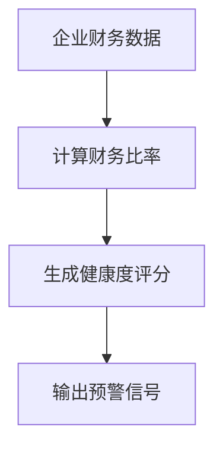
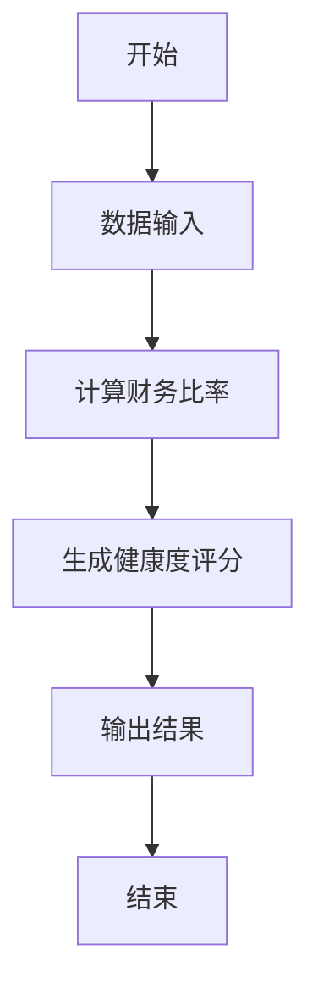
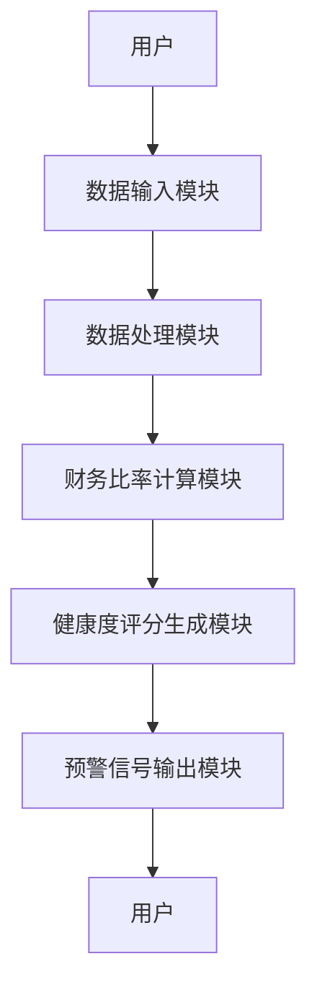
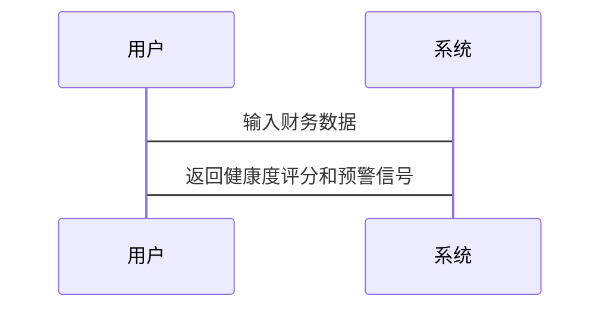

                 


# 约瑟夫·皮奥特罗斯基的财务健康度评估模型

> 关键词：约瑟夫·皮奥特罗斯基，财务健康度，评估模型，财务分析，预警信号

> 摘要：本文详细介绍了约瑟夫·皮奥特罗斯基的财务健康度评估模型，从模型的背景、核心概念、算法原理、系统架构到项目实战，全面阐述了该模型的理论基础和实际应用。通过本文，读者可以深入了解如何通过财务比率分析和预警信号来评估企业的财务健康状况，并为企业和投资者提供有效的决策支持。

---

# 第1章: 背景介绍

## 1.1 财务健康度评估的重要性

### 1.1.1 企业财务健康度的定义

企业的财务健康度是指企业在一定时期内，通过合理的财务管理和资源配置，确保企业能够持续经营、偿还债务、实现盈利和增长的能力。它是企业生存和发展的核心要素之一。

### 1.1.2 财务健康度对企业经营的影响

- **经营稳定性**：财务健康的企业能够维持正常的业务运营，避免因资金链断裂而倒闭。
- **融资能力**：健康的财务状况有助于企业获得更多的融资机会，降低融资成本。
- **投资决策**：投资者和债权人可以通过财务健康度评估来判断企业的投资价值和风险。

### 1.1.3 投资者与管理层对财务健康度的需求

- **投资者需求**：投资者需要了解企业的财务状况，以评估投资风险和收益潜力。
- **管理层需求**：企业管理层需要通过财务健康度评估，发现问题并及时调整经营策略。

## 1.2 约瑟夫·皮奥特罗斯基模型的提出背景

### 1.2.1 传统财务分析的局限性

传统的财务分析方法主要依赖于单一的财务比率分析，难以全面反映企业的财务健康状况。例如，流动比率只能反映企业的短期偿债能力，而不能说明企业的长期财务状况。

### 1.2.2 20世纪70年代的金融环境

20世纪70年代，全球经济动荡，企业破产率上升。传统的财务分析方法在预测企业财务危机方面显得力不从心，亟需一种更全面、更有效的财务健康度评估方法。

### 1.2.3 皮奥特罗斯基模型的初衷

约瑟夫·皮奥特罗斯基（Joseph Piotroski）提出了一种基于财务比率和预警信号的综合评估模型，旨在帮助企业识别财务危机的早期信号，从而为投资者和管理层提供更准确的决策支持。

## 1.3 问题背景与目标

### 1.3.1 财务危机预警的核心问题

- **早期识别**：如何在财务危机发生前，通过财务数据识别潜在的风险。
- **综合评估**：如何将多个财务指标综合起来，全面评估企业的财务健康状况。

### 1.3.2 皮奥特罗斯基模型解决的核心问题

- **单一指标的局限性**：通过综合多个财务指标，弥补单一指标分析的不足。
- **早期预警**：通过设定预警信号，提前发现企业财务状况的恶化。

### 1.3.3 模型的目标与边界

- **目标**：提供一个简单、有效的财务健康度评估工具，帮助企业和投资者识别财务风险。
- **边界**：模型主要基于财务数据，不考虑非财务因素（如市场环境、管理能力等）。

---

# 第2章: 核心概念与联系

## 2.1 财务健康度评估的核心概念

### 2.1.1 财务比率分析

财务比率是衡量企业财务状况的重要工具。常见的财务比率包括：

- **流动性比率**：如流动比率、速动比率，衡量企业的短期偿债能力。
- **杠杆比率**：如资产负债率，衡量企业的债务负担。
- **盈利能力比率**：如净利率，衡量企业的盈利能力。

### 2.1.2 财务预警信号

财务预警信号是企业在财务健康状况恶化时发出的早期信号。常见的预警信号包括：

- **流动比率下降**：表明企业短期偿债能力减弱。
- **净亏损增加**：表明企业盈利能力下降。
- **负债增加**：表明企业财务负担加重。

### 2.1.3 财务健康度评分系统

评分系统是将多个财务比率综合起来，通过加权评分的方式，给出企业的财务健康度评分。评分系统通常分为几个等级，如健康、警告、危险等。

## 2.2 核心概念的属性对比

### 2.2.1 财务比率的分类与特征

| 类型          | 示例比率           | 特征描述                                   |
|---------------|--------------------|--------------------------------------------|
| 流动性比率    | 流动比率、速动比率  | 衡量企业短期偿债能力                       |
| 杠杆比率      | 资产负债率          | 衡量企业债务负担                         |
| 盈利能力比率  | 净利率              | 衡量企业盈利能力                         |

### 2.2.2 预警信号的触发条件

| 预警信号         | 触发条件                     | 影响程度         |
|------------------|----------------------------|------------------|
| 流动比率下降     | 流动比率 < 1                | 中等            |
| 净亏损增加       | 净利润 < 上一年度净利润      | 高              |
| 负债增加         | 负债总额 > 上一年度负债总额  | 高              |

### 2.2.3 评分系统的量化标准

| 评分等级         | 分数范围 | 意义               |
|------------------|----------|--------------------|
| 健康              | 9-10     | 企业财务状况良好   |
| 警告              | 6-8      | 企业财务状况一般   |
| 危险              | 0-5      | 企业财务状况恶化   |

## 2.3 实体关系架构

### 2.3.1 企业财务数据的ER图

```mermaid
erd
    客户
    -------
    id: int PK
    名称: string
    行业: string
    地区: string
    财务数据
    -------
    id: int PK
    客户id: int FK
    年度: int
    资产: float
    负债: float
    净利润: float
    流动比率: float
    速动比率: float
    负债比率: float
    评分: int
```

### 2.3.2 模型输入与输出的关系



---

# 第3章: 算法原理讲解

## 3.1 模型的输入与输出

### 3.1.1 输入数据的定义

- **输入数据**：企业的财务数据，包括资产、负债、净利润、流动比率、速动比率等。
- **输入格式**：结构化的财务数据，通常以表格形式存储。

### 3.1.2 输出结果的解释

- **输出结果**：财务健康度评分（0-10分），其中0表示财务状况恶化，10表示财务状况健康。
- **输出格式**：评分结果，可能附带预警信号。

## 3.2 模型的评估过程

### 3.2.1 数据预处理

- **数据清洗**：处理缺失值、异常值。
- **数据标准化**：将数据转换为统一的格式。

### 3.2.2 财务比率计算

- **流动比率**：$\text{流动比率} = \frac{\text{流动资产}}{\text{流动负债}}$
- **速动比率**：$\text{速动比率} = \frac{\text{速动资产}}{\text{流动负债}}$

### 3.2.3 健康度评分生成

- **评分公式**：$\text{健康度评分} = \sum (\text{财务比率评分} \times \text{权重})$
- **权重设定**：根据经验或统计方法确定各财务比率的权重。

## 3.3 算法流程图



---

# 第4章: 数学模型与公式

## 4.1 财务比率计算公式

### 4.1.1 流动比率

$$ \text{流动比率} = \frac{\text{流动资产}}{\text{流动负债}} $$

### 4.1.2 速动比率

$$ \text{速动比率} = \frac{\text{速动资产}}{\text{流动负债}} $$

## 4.2 健康度评分模型

### 4.2.1 基本评分公式

$$ \text{健康度评分} = \sum (\text{财务比率评分} \times \text{权重}) $$

### 4.2.2 调整因子

$$ \text{调整因子} = 1 - \frac{\text{预警信号数量}}{\text{总预警信号数}} $$

---

# 第5章: 系统分析与架构设计

## 5.1 问题场景介绍

- **问题场景**：企业需要通过财务数据评估自身的财务健康状况，投资者需要通过财务数据评估企业的投资价值。

## 5.2 系统功能设计

- **数据输入**：用户输入企业的财务数据。
- **财务比率计算**：系统自动计算各项财务比率。
- **健康度评分生成**：系统根据财务比率生成健康度评分。
- **预警信号输出**：系统输出预警信号。

## 5.3 系统架构设计



## 5.4 系统交互设计



---

# 第6章: 项目实战

## 6.1 环境安装

- **Python环境**：安装Python 3.8以上版本。
- **依赖库**：安装pandas、numpy、scikit-learn。

## 6.2 核心实现源代码

```python
import pandas as pd
import numpy as np

def calculate_financial_ratios(financial_data):
    # 计算流动比率
    current_ratio = financial_data['流动资产'] / financial_data['流动负债']
    # 计算速动比率
    quick_ratio = financial_data['速动资产'] / financial_data['流动负债']
    # 计算健康度评分
    health_score = current_ratio * 0.4 + quick_ratio * 0.6
    return health_score

# 示例数据
data = {
    '流动资产': [100, 200, 300],
    '流动负债': [50, 100, 150],
    '速动资产': [40, 80, 120]
}
financial_data = pd.DataFrame(data)

# 计算健康度评分
health_scores = calculate_financial_ratios(financial_data)
print(health_scores)
```

---

# 第7章: 总结与展望

## 7.1 总结

约瑟夫·皮奥特罗斯基的财务健康度评估模型通过综合分析企业的财务比率和预警信号，提供了一种简单有效的财务健康度评估方法。该模型在实际应用中可以帮助企业和投资者更好地识别财务风险，做出更明智的决策。

## 7.2 最佳实践 tips

- **数据质量**：确保输入的财务数据准确、完整。
- **模型调优**：根据实际情况调整各财务比率的权重。
- **动态监控**：定期更新财务数据，动态监控企业的财务健康状况。

## 7.3 展望

未来，随着人工智能和大数据技术的发展，财务健康度评估模型将更加智能化和个性化。结合机器学习算法，可以进一步提高模型的预测精度和实用性。

---

作者：AI天才研究院/AI Genius Institute & 禅与计算机程序设计艺术/Zen And The Art of Computer Programming

