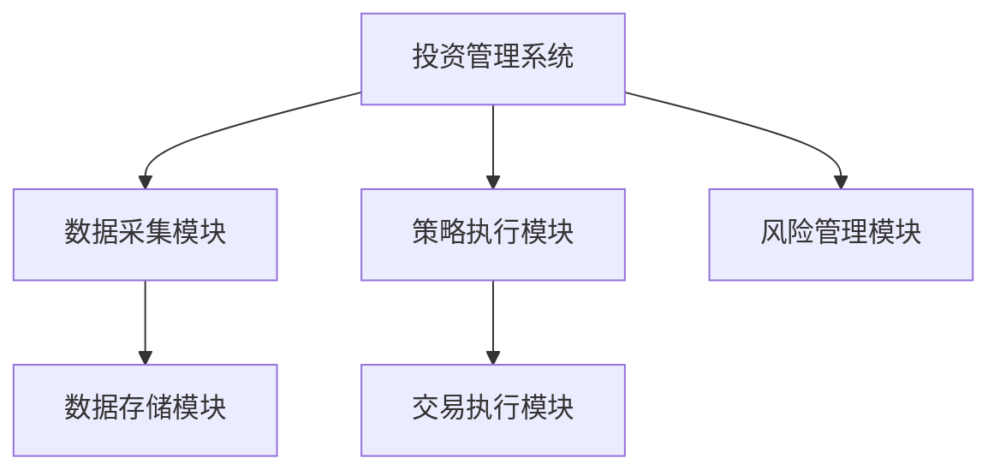
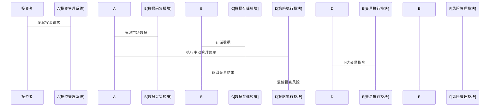

                 


# 约翰·伯格对主动管理的批评

> 关键词：主动管理、被动管理、约翰·伯格、投资策略、指数基金、投资成本、夏普比率

> 摘要：本文将分析约翰·伯格对主动管理的批评，探讨主动管理和被动管理的优缺点，详细阐述主动管理的算法原理、系统架构，以及通过项目实战展示被动管理的成本优势和长期效果。

---

## 第1章: 主动管理的基本概念

### 1.1 主动管理的定义与特点
主动管理是一种投资策略，旨在通过精选个股或择时操作，以超越市场指数的表现。其核心特点包括：

- **主动性**：投资经理主动选择投资标的，试图通过选股或择时获得超额收益。
- **高风险**：由于需要承担更多的市场风险和操作风险，主动管理的投资回报不稳定。
- **高成本**：主动管理通常需要支付更高的管理费用和交易成本。

### 1.2 约翰·伯格的背景与投资理念
约翰·伯格是指数基金的倡导者，他的投资理念强调长期投资、分散投资和低成本投资。

- **伯格的背景**：他是 Vanguard 集团的创始人之一，致力于推动低成本指数基金的发展。
- **伯格的投资哲学**：他主张通过被动投资来降低投资成本，分散投资风险，追求长期稳定的收益。

### 1.3 主动管理的优缺点分析
- **优点**：
  - 可能获得超额收益。
  - 适合短期市场波动较大的环境。
- **缺点**：
  - 成本较高，管理费用和交易费用侵蚀收益。
  - 投资结果不稳定，难以长期跑赢市场。

---

## 第2章: 被动管理的核心原理

### 2.1 被动管理的定义与特点
被动管理是一种投资策略，通过跟踪市场指数来获得与市场相似的收益。

- **被动性**：投资组合严格按照指数成分股配置，不主动调整。
- **低成本**：由于被动管理不需要频繁交易和主动选股，投资成本较低。
- **分散风险**：通过广泛分散投资，降低个股或行业波动带来的风险。

### 2.2 指数基金的投资策略
指数基金是被动管理的核心工具，其投资策略包括：

- **指数跟踪**：通过复制市场指数的成分股，保持与指数一致的风险和收益。
- **分散投资**：投资于指数中的所有成分股，避免单一资产的风险。
- **低成本运作**：通过规模效应和自动化交易降低管理费用。

### 2.3 被动管理的优缺点分析
- **优点**：
  - 成本低，长期收益稳定。
  - 风险分散，适合长期投资。
- **缺点**：
  - 无法获得超额收益。
  - 在市场剧烈波动时，可能面临短期损失。

---

## 第3章: 主动管理与被动管理的比较

### 3.1 主动管理与被动管理的对比
| 对比维度       | 主动管理                     | 被动管理                     |
|----------------|------------------------------|------------------------------|
| 投资目标         | 跑赢市场指数                 | 跟踪市场指数                 |
| 投资策略         | 主动选股、择时               | 被动跟踪指数                 |
| 投资成本         | 高，包含管理费和交易费       | 低，管理费和交易费较低       |
| 风险             | 高，集中投资风险             | 低，分散投资风险             |
| 收益             | 可能超额收益，但不稳定       | 稳定收益，接近市场指数收益    |

### 3.2 约翰·伯格对主动管理的批评
伯格认为，主动管理的成本过高，且长期来看难以跑赢市场指数。他的主要观点包括：

- **高成本侵蚀收益**：主动管理的高管理费用和交易费用会显著降低投资回报。
- **难以跑赢市场**：大多数主动管理基金无法长期跑赢市场指数，尤其是扣除费用后。
- **过度交易风险**：频繁的交易操作可能增加市场摩擦成本，影响收益。

### 3.3 被动管理的长期优势
伯格强调被动管理的长期优势，认为通过低成本、分散化投资，指数基金能够实现稳定的投资回报。

- **长期收益稳定**：被动管理的投资收益接近市场指数，长期来看具有较高的可预测性。
- **风险分散**：通过广泛投资于指数成分股，降低了单一资产的风险。

---

## 第4章: 主动管理的算法原理

### 4.1 主动管理的核心算法
主动管理通常依赖于技术分析和基本面分析。

- **技术分析**：通过分析历史价格数据，寻找买入和卖出信号。
- **基本面分析**：通过分析公司的财务数据和行业前景，筛选具有潜在增值能力的股票。

### 4.2 主动管理的数学模型
主动管理的数学模型包括：

- **夏普比率**：衡量投资组合的风险调整后收益。
  $$ \text{夏普比率} = \frac{R_p - R_f}{\sigma_p} $$
  其中，$R_p$ 是投资组合的收益，$R_f$ 是无风险利率，$\sigma_p$ 是投资组合的标准差。

- **CAPM 模型**：用于估计资产的预期收益。
  $$ E(R_i) = R_f + \beta_i (R_m - R_f) $$
  其中，$R_m$ 是市场预期收益，$\beta_i$ 是资产的贝塔系数。

### 4.3 算法实现
以下是一个简单的主动管理策略实现：

```python
import pandas as pd
import numpy as np

def calculate_sharpe_ratio(returns, risk_free_rate):
    excess_returns = returns - risk_free_rate
    sharpe_ratio = np.mean(excess_returns) / np.std(excess_returns)
    return sharpe_ratio

def active_management_strategy(prices, benchmark):
    # 计算主动管理的夏普比率
    returns = prices.pct_change()
    sharpe = calculate_sharpe_ratio(returns, 0.02)
    return sharpe
```

---

## 第5章: 系统分析与架构设计

### 5.1 投资管理系统架构
以下是投资管理系统的架构图：



### 5.2 系统功能设计
- **数据采集模块**：收集市场数据，包括股票价格、指数数据等。
- **策略执行模块**：根据主动管理策略生成买卖信号。
- **交易执行模块**：执行交易指令，调整投资组合。
- **风险管理模块**：监控投资组合的风险，控制最大回撤。

### 5.3 系统交互流程
以下是系统交互的序列图：



---

## 第6章: 项目实战——被动管理的实现

### 6.1 环境安装
安装 Python 和必要的库：

```bash
pip install pandas numpy matplotlib
```

### 6.2 核心代码实现
以下是被动管理的实现代码：

```python
import pandas as pd
import matplotlib.pyplot as plt

# 下载指数数据
prices = pd.read_csv('index_data.csv')

# 计算指数收益
returns = prices.pct_change()

# 绘制收益分布图
plt.hist(returns, bins=20)
plt.xlabel('Return')
plt.ylabel('Frequency')
plt.title('Distribution of Returns')
plt.show()
```

### 6.3 实际案例分析
以沪深 300 指数为例，分析被动管理的投资效果：

- **成本分析**：被动管理的管理费用低于主动管理，长期来看成本优势明显。
- **风险分析**：被动管理通过分散投资降低了风险，适合长期投资。

### 6.4 项目小结
通过被动管理，投资者可以以更低的成本获得稳定的收益，尤其适合长期投资。

---

## 第7章: 总结与展望

### 7.1 约翰·伯格观点总结
约翰·伯格认为，主动管理的成本过高，难以长期跑赢市场指数。被动管理通过低成本和分散投资，能够实现稳定的投资收益。

### 7.2 投资建议
- **长期投资者**：适合选择被动管理，尤其是指数基金。
- **短期投资者**：可以在市场波动较大时考虑主动管理，但需谨慎选择管理团队。

### 7.3 注意事项
- **市场环境**：主动管理在市场波动较大的环境中可能表现较好，但需承担更高的风险。
- **费用比较**：选择主动管理前，需仔细比较管理费用和交易费用。

### 7.4 拓展阅读
- 《The Intelligent Investor》——本杰明·格雷厄姆
- 《The Index Investors' Bible》——约翰·伯格

---

作者：AI天才研究院/AI Genius Institute & 禅与计算机程序设计艺术/Zen And The Art of Computer Programming

