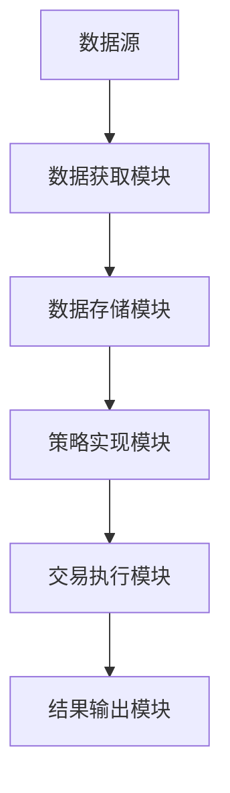

                 


# 约翰·伯格的ETF革命：新一代指数投资工具

## 关键词

- ETF，指数基金，指数投资，约翰·伯格，投资工具

## 摘要

本文深入探讨了交易所交易基金（ETF）作为一种革命性的投资工具，如何彻底改变现代投资 landscape。通过分析ETF的历史演变、运作机制、技术分析及实际应用，本文揭示了其在指数投资中的独特优势和创新之处。从约翰·伯格的开创性工作到当前复杂的系统架构，本文详细解读了ETF的数学模型、算法原理和系统设计，为读者提供了全面的理解和深入的分析。

---

# 第1章 ETF的定义与优势

## 1.1 ETF的基本概念

### 1.1.1 ETF的定义与特点

交易所交易基金（ETF）是一种在交易所上市交易的基金，兼具开放式基金和封闭式基金的特点。ETF的投资者可以通过股票交易账户购买和卖出，其价格在交易日内实时变动。ETF的核心在于其指数化投资策略，即通过追踪特定指数的表现来实现投资收益。

#### ETF的特点：
- **分散化投资**：通过追踪指数，ETF能够分散投资风险，避免单一资产的波动。
- **透明度高**：ETF的持仓信息公开，投资者可以实时了解其投资组合。
- **流动性高**：ETF可以在交易所随时买卖，具备较高的流动性。
- **成本低**：ETF的管理费用通常低于主动管理型基金。

### 1.1.2 ETF与传统投资的区别

与传统投资相比，ETF具有以下优势：
- **风险分散**：ETF通过追踪指数，避免了个别资产的重大损失。
- **交易灵活**：ETF的交易时间与股票一致，投资者可以根据市场情况随时调整仓位。
- **成本优势**：ETF的管理费用通常较低，长期来看复利效应显著。

### 1.1.3 ETF的优势与应用场景

ETF的优势在于其简单易用和低成本，适合长期投资者和被动投资策略。应用场景包括：
- **资产配置**：通过配置不同类型的ETF，投资者可以构建多样化的投资组合。
- **风险管理**：通过ETF的分散化特性，投资者可以有效降低投资风险。
- **短线交易**：ETF的高流动性使其成为短线交易的理想工具。

## 1.2 约翰·伯格的贡献

### 1.2.1 伯格的生平简介

约翰·伯格（John C. Bogle）是ETF领域的先驱，被誉为“指数基金之父”。他于1940年出生于美国宾夕法尼亚州，毕业于宾夕法尼亚大学。1975年，伯格创立了 Vanguard 集团，推出了一系列指数基金，为现代ETF的发展奠定了基础。

### 1.2.2 伯格对ETF的创新

伯格的创新主要体现在以下几个方面：
- **低成本指数基金**：伯格倡导通过指数化投资降低管理费用，提高投资收益。
- **透明化管理**：Vanguard基金的管理透明，公开持仓信息，增强了投资者的信任。
- **被动投资理念**：伯格强调被动投资的重要性，认为长期来看，指数基金的表现优于大部分主动管理型基金。

### 1.2.3 ETF对投资领域的影响

ETF的普及彻底改变了投资 landscape。它使普通投资者能够以较低的成本投资于广泛的市场指数，提高了投资的民主化。ETF的兴起也推动了金融市场的创新，催生了大量基于指数的投资工具和策略。

---

# 第2章 ETF的历史演变

## 2.1 ETF的起源

### 2.1.1 早期指数基金的发展

指数基金的概念可以追溯到20世纪30年代，但真正的发展始于20世纪70年代。1971年，美国经济学家约翰·马科维茨提出了现代投资组合理论，为指数基金的发展提供了理论基础。

### 2.1.2 ETF的诞生背景

1975年，约翰·伯格创立了Vanguard集团，并推出了第一只指数基金——Vanguard指数基金。这标志着ETF时代的开始。随着技术的进步和市场的成熟，ETF逐渐从 niche产品发展为主流投资工具。

## 2.2 ETF的快速发展

### 2.2.1 技术进步对ETF的影响

信息技术的进步使得ETF的交易和结算更加高效。电子交易平台的普及和算法交易的兴起，进一步推动了ETF市场的增长。

### 2.2.2 ETF市场的扩张

近年来，ETF市场呈现爆发式增长。根据统计，全球ETF的管理规模已超过数万亿美元，成为金融市场的支柱之一。

---

# 第3章 ETF的运作机制

## 3.1 指数构建与投资策略

### 3.1.1 指数构建原理

指数构建的核心在于选择合适的成分股，并确定其权重。常见的指数构建方法包括市值加权、等权重加权和因子加权。

#### 指数构建方法：
- **市值加权**：成分股的权重与其市值成正比。
- **等权重加权**：每只成分股的权重相等。
- **因子加权**：根据特定因子（如市值、流动性等）确定权重。

### 3.1.2 ETF的投资策略

#### 被动投资策略：
- 通过完全复制指数成分股，实现与指数同步的投资收益。

#### 主动投资策略：
- 通过精选成分股或调整权重，试图超越指数表现。

---

# 第4章 ETF的技术分析与数学模型

## 4.1 技术分析方法

### 4.1.1 趋势线与支撑阻力

趋势线和支撑阻力是技术分析中的重要工具。趋势线用于判断价格走势的方向，支撑阻力用于识别价格的支撑位和阻力位。

### 4.1.2 移动平均线与相对强弱指数

#### 移动平均线：
- 短期移动平均线（如10日线）用于判断短期趋势。
- 长期移动平均线（如50日线）用于判断长期趋势。

#### 相对强弱指数：
- RSI用于衡量资产的超买或超卖状态，通常取值范围为0-100。

## 4.2 数学模型与公式

### 4.2.1 CAPM模型

CAPM模型用于计算资产的预期收益：
$$ E(r) = R_f + \beta (R_m - R_f) $$

其中：
- \( E(r) \)：资产的预期收益率
- \( R_f \)：无风险利率
- \( \beta \)：资产的系统性风险系数
- \( R_m \)：市场预期收益率

### 4.2.2 夏普比率

夏普比率衡量的是投资组合的风险调整后收益：
$$ \text{夏普比率} = \frac{E(r - R_f)}{\sigma} $$

其中：
- \( E(r - R_f) \)：投资组合的超额收益
- \( \sigma \)：投资组合的收益率标准差

---

# 第5章 ETF的系统架构与实现

## 5.1 系统功能设计

### 5.1.1 数据获取模块

数据获取模块负责从数据源获取ETF的相关数据，包括价格、成交量等。

### 5.1.2 策略实现模块

策略实现模块根据设定的投资策略，生成买卖信号或调整仓位。

## 5.2 系统架构设计

### 5.2.1 系统架构图



### 5.2.2 系统接口设计

系统接口设计包括数据接口和交易接口，确保模块之间的高效通信。

---

# 第6章 ETF的实战案例

## 6.1 环境安装

### 6.1.1 安装Python环境

安装Python和必要的库，如Pandas、NumPy、Matplotlib等。

## 6.2 核心实现源代码

### 6.2.1 ETF数据获取代码

```python
import pandas as pd
import yfinance as yf

# 下载ETF数据
etf_ticker = 'SPY'
data = yf.download(etf_ticker, start='2020-01-01', end='2023-12-31')
print(data.head())
```

### 6.2.2 策略实现代码

```python
import pandas as pd
import numpy as np

# 计算移动平均线
data['SMA_20'] = data['Close'].rolling(20).mean()
data['SMA_50'] = data['Close'].rolling(50).mean()

# 生成交易信号
data['signal'] = 0
data['signal'] = np.where(data['SMA_20'] > data['SMA_50'], 1, 0)
```

## 6.3 实际案例分析

### 6.3.1 案例分析

以SPY ETF为例，分析其历史表现和交易策略。

## 6.4 项目小结

通过实际案例，验证了ETF投资策略的有效性，并展示了技术分析在实际投资中的应用。

---

# 第7章 ETF的投资革命与未来展望

## 7.1 ETF的投资革命

### 7.1.1 ETF的普及与影响

ETF的普及使得更多投资者能够以低成本投资于广泛市场指数，推动了金融市场的民主化。

### 7.1.2 ETF的技术创新

技术的进步，如大数据分析和人工智能，正在推动ETF投资的进一步创新。

## 7.2 未来展望

### 7.2.1 ETF的未来趋势

未来，ETF将继续受益于技术创新和市场发展，成为投资领域的重要工具。

## 7.3 最佳实践 tips

- **长期投资**：ETF适合长期投资，避免频繁交易。
- **分散投资**：通过配置不同类型的ETF，降低投资风险。
- **定期再平衡**：定期调整投资组合，保持目标配置。

---

# 小结

本文全面探讨了ETF作为新一代指数投资工具的革命性影响，从其定义、历史、运作机制到技术分析和实战案例，为读者提供了全面而深入的了解。通过分析约翰·伯格的贡献和ETF的系统架构，本文揭示了ETF在现代投资中的重要作用和未来发展趋势。

---

# 作者

作者：AI天才研究院/AI Genius Institute & 禅与计算机程序设计艺术 /Zen And The Art of Computer Programming

