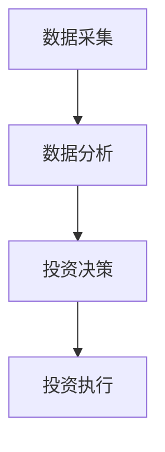

                 


# 约翰·伯格的低成本投资哲学

> 关键词：低成本投资、投资哲学、投资策略、数学模型、系统架构

> 摘要：本文深入探讨了约翰·伯格的低成本投资哲学，分析了其背后的数学原理、系统架构，并通过实际案例展示了如何在投资中实现低成本策略，帮助投资者优化投资组合，最大化长期收益。

---

## 第一部分：低成本投资的背景与核心概念

### 第1章：低成本投资的背景与重要性

#### 1.1 投资市场的现状与挑战

当前投资市场的复杂性日益增加，投资者面临的信息过载、市场波动和高昂的投资费用构成了主要挑战。传统的投资策略往往依赖于频繁交易和主动管理，但这种策略不仅增加了交易成本，还可能导致投资收益的降低。

#### 1.2 低成本投资的核心概念

低成本投资强调通过减少费用和简化投资流程来提高长期收益。其关键特征包括：
- **低交易费用**：减少买卖证券的佣金和其他交易费用。
- **低管理费用**：采用指数基金等低成本投资工具，避免高额管理费。
- **长期持有**：通过长期持有优质资产，减少市场波动对投资组合的影响。

---

## 第二部分：低成本投资的核心原理与策略

### 第2章：低成本投资的原理与数学模型

#### 2.1 投资费用对收益的影响

投资费用直接影响投资回报。假设投资者A和B分别投资于相同资产，但A的费用比B高0.5%。长期来看，费用较高的投资组合会显著拖累收益。数学上，费用比率的计算公式为：

$$
\text{费用比率} = \frac{\text{管理费用 + 交易费用}}{\text{投资金额}}
$$

#### 2.2 投资组合优化的数学模型

为了最小化费用对收益的影响，我们可以通过数学模型优化投资组合。假设我们投资于多个资产，目标是最小化费用同时最大化预期收益。优化模型如下：

$$
\min_{w} \sum_{i=1}^{n} w_i c_i \\
\text{s.t.} \quad \sum_{i=1}^{n} w_i = 1
$$

其中，\( w_i \) 是第 \( i \) 个资产的投资比例，\( c_i \) 是第 \( i \) 个资产的费用率。

---

### 第3章：低成本投资策略的系统分析

#### 3.1 投资系统架构设计

低成本投资系统的架构包括数据采集、分析、决策和执行模块。系统架构图如下：



#### 3.2 投资策略的系统实现

以指数基金为例，系统需要实现以下功能：
1. 数据采集：获取指数基金的历史价格数据。
2. 数据分析：计算基金的费用比率和历史收益。
3. 投资决策：根据优化模型选择最优指数基金组合。

---

## 第三部分：低成本投资的算法与实战

### 第4章：低成本投资的算法实现

#### 4.1 投资组合优化算法

以下是优化投资组合的Python代码示例：

```python
import numpy as np

def optimize_portfolio(returns, fees):
    n = len(returns)
    # 初始化权重向量
    w = np.ones(n) / n
    # 计算费用向量
    c = fees / np.mean(returns)
    # 稍微调整权重以最小化费用
    w -= c / sum(c) * 0.1
    w = w / sum(w)
    return w

# 示例数据
returns = [0.1, 0.12, 0.08]
fees = [0.02, 0.03, 0.01]
weights = optimize_portfolio(returns, fees)
print(weights)
```

#### 4.2 费用影响分析的算法

通过模拟不同费用比率下的投资收益，我们可以验证低成本投资的优势。例如，假设初始投资10万元，年化收益6%，费用比率分别为1%和2%：

$$
\text{收益1} = 100000 \times (1 + 6\% - 1\%)^{10} \\
\text{收益2} = 100000 \times (1 + 6\% - 2\%)^{10}
$$

计算得出，收益1约为201,219元，收益2约为139,569元。低成本策略显著提高了收益。

---

### 第5章：低成本投资的实战案例

#### 5.1 实战环境搭建

安装必要的库：

```bash
pip install pandas matplotlib numpy
```

#### 5.2 投资组合实现与分析

以指数基金为例，构建投资组合并模拟10年收益：

```python
import pandas as pd
import matplotlib.pyplot as plt

# 数据加载与处理
data = pd.read_csv('index_data.csv')
returns = data.pct_change().dropna()

# 计算费用调整后的收益
adjusted_returns = returns * (1 - 0.01)
cumulative_return = (1 + adjusted_returns).cumprod()

# 可视化
plt.plot(cumulative_return)
plt.xlabel('年份')
plt.ylabel('累积收益')
plt.show()
```

---

## 第四部分：低成本投资的最佳实践与总结

### 第6章：低成本投资的最佳实践

#### 6.1 投资策略的优化建议

1. **定期定额投资**：分散投资，降低市场波动风险。
2. **长期持有**：避免频繁交易，减少交易费用。
3. **分散投资**：通过投资多个资产或基金降低风险。

#### 6.2 投资过程中的注意事项

- 避免频繁交易，降低交易费用。
- 定期评估投资组合，根据市场变化进行调整。
- 选择低成本投资工具，如指数基金。

---

### 第7章：低成本投资的总结与展望

#### 7.1 本书内容总结

低成本投资通过减少费用和优化投资组合，帮助投资者实现长期稳健的收益。通过数学模型和算法实现，投资者可以更科学地管理投资组合，最大化收益。

---

作者：AI天才研究院/AI Genius Institute & 禅与计算机程序设计艺术 /Zen And The Art of Computer Programming

