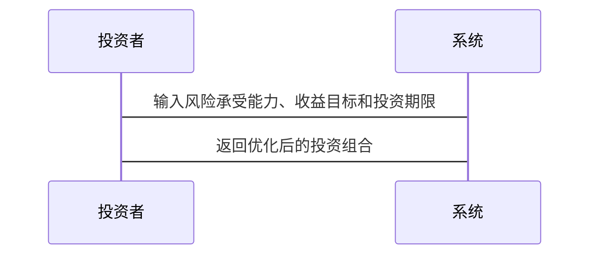

                 


# 约翰·伯格的全球多元化投资理念

> 关键词：约翰·伯格，多元化投资，投资理念，资产配置，风险管理，投资组合优化

> 摘要：本文系统地介绍并分析了约翰·伯格的全球多元化投资理念，从其背景、核心概念、算法原理、系统架构设计到项目实战，层层剖析，结合理论与实践，深入探讨了多元化投资的理念和方法。本文旨在为投资者提供一套科学的投资策略，帮助他们在复杂多变的全球市场中实现风险可控、收益最大化的目标。

---

## 第1章: 约翰·伯格与多元化投资理念的背景

### 1.1 约翰·伯格的生平与投资理念的形成

#### 1.1.1 约翰·伯格的生平简介
约翰·伯格（John Bogle）是美国著名投资家，被誉为“指数基金之父”。他于1934年6月19日出生于美国宾夕法尼亚州，毕业于宾夕法尼亚大学沃顿商学院。1975年，他创立了 Vanguard 集团，并推出了第一只指数基金——Vanguard指数信托基金（Vanguard Index Trust），这一举措彻底改变了全球投资行业的格局。

约翰·伯格的投资理念深受其成长经历影响。他出生于一个普通的中产阶级家庭，从小就对金融和投资产生了浓厚的兴趣。他在大学期间主修哲学和经济学，这为他后来的投资理念奠定了坚实的理论基础。

#### 1.1.2 投资理念的形成背景
20世纪70年代的美国股市经历了剧烈的波动，传统投资机构的高费用和复杂的操作让普通投资者感到不满。与此同时，学术界对投资理论的研究逐渐深入，尤其是现代投资组合理论（MPT）的提出，为投资领域带来了新的视角。然而，这些理论在实际操作中往往难以被普通投资者理解和应用。

约翰·伯格意识到，传统的主动投资策略不仅成本高昂，而且很难跑赢市场指数。他认为，通过分散投资来降低风险，并通过长期持有低成本的指数基金来获得市场的平均收益，才是普通投资者的最佳选择。

#### 1.1.3 伯格投资理念的核心思想
约翰·伯格的核心投资理念可以总结为以下几点：
1. **长期投资**：市场短期波动无法预测，长期来看，股市的回报主要来自企业盈利的增长。
2. **分散投资**：通过投资于广泛的市场指数，降低特定资产或行业的风险。
3. **低成本投资**：降低管理费用和交易成本，以最大化长期收益。
4. **纪律性投资**：坚持长期持有，避免频繁交易和情绪化决策。

### 1.2 多元化投资理念的定义与特点

#### 1.2.1 多元化投资的定义
多元化投资是指通过将资金分散投资于不同的资产类别、行业或地区，以降低投资组合的整体风险。这种策略的核心在于“不要把所有鸡蛋放在一个篮子里”。

#### 1.2.2 多元化投资的核心特点
1. **风险分散**：通过投资于不同的资产，减少单一资产价格波动带来的风险。
2. **收益稳定**：多元化投资能够平滑市场的周期性波动，使投资者在不同经济环境下都能获得较为稳定的收益。
3. **长期有效**：历史数据表明，长期来看，多元化投资能够有效跑赢单一资产的投资。

#### 1.2.3 多元化投资与传统投资的区别
| **特点**       | **传统投资**               | **多元化投资**             |
|----------------|----------------------------|-----------------------------|
| 投资策略       | 集中投资于少数资产或行业     | 分散投资于多种资产或行业   |
| 风险管理       | 高风险，依赖于特定资产表现   | 低风险，通过分散投资降低风险|
| 成本           | 高管理费用和交易成本         | 低成本，通过指数基金降低费用|
| 适合投资者类型 | 专业投资者                  | 普通投资者和机构投资者      |

### 1.3 多元化投资理念的全球应用

#### 1.3.1 全球化视角下的多元化投资
随着全球经济一体化的加深，投资者可以通过投资于全球市场来进一步分散风险。例如，投资于新兴市场可以带来更高的增长潜力，同时也能在一定程度上对冲成熟市场的波动。

#### 1.3.2 多元化投资在不同市场的适应性
不同国家和地区的市场具有不同的特点，投资者需要根据自身的风险承受能力和收益目标选择适合的资产配置。例如，对于风险承受能力较高的投资者，可以增加对新兴市场的配置；而对于风险厌恶型投资者，则可以增加对债券等固定收益资产的配置。

#### 1.3.3 多元化投资的未来发展趋势
随着科技的发展和数据的丰富，投资者可以通过大数据和人工智能技术进一步优化资产配置。例如，利用机器学习算法分析市场趋势，动态调整投资组合的权重，以更好地适应市场变化。

---

## 第2章: 多元化投资的核心概念与联系

### 2.1 多元化投资的核心原理

#### 2.1.1 资产配置的原理
资产配置是多元化投资的核心，它决定了投资组合中各类资产的比例。常见的资产类别包括股票、债券、房地产、黄金等。合理的资产配置能够平衡风险与收益，使投资组合在不同市场环境下表现稳定。

#### 2.1.2 风险管理的核心思想
风险管理是多元化投资的重要组成部分。通过分散投资，投资者可以降低特定资产或市场的风险，同时通过定期审视和调整投资组合，应对市场环境的变化。

#### 2.1.3 投资组合优化的数学模型
现代投资组合理论（MPT）为投资组合优化提供了理论基础。其核心思想是通过优化资产配置，使投资组合的预期收益最大化，同时风险最小化。

---

## 第3章: 多元化投资的算法原理

### 3.1 多元化投资的算法流程

#### 3.1.1 投资目标的设定
投资者需要明确自身的投资目标，包括收益目标、风险承受能力和投资期限等。例如，长期投资者可以承受较高的短期波动，而短期投资者则需要更保守的配置。

#### 3.1.2 资产选择与权重分配
根据投资目标，选择适合的资产类别，并确定各类资产在投资组合中的权重。例如，一个保守型投资者可能选择60%的债券和40%的股票。

#### 3.1.3 风险调整与优化
通过调整资产权重，优化投资组合的风险和收益。例如，使用数学模型计算不同权重下的预期收益和风险，选择最优解。

---

## 第4章: 投资组合构建与优化

### 4.1 系统分析与架构设计方案

#### 4.1.1 项目介绍
本项目旨在构建一个基于约翰·伯格多元化投资理念的投资组合优化系统，帮助投资者根据自身的风险承受能力和收益目标，制定合理的资产配置方案。

#### 4.1.2 系统功能设计
- **用户输入**：投资者输入风险承受能力、收益目标和投资期限。
- **资产选择**：系统根据输入，推荐适合的资产类别。
- **权重分配**：系统计算各类资产的最优权重。
- **风险调整**：系统优化投资组合，降低整体风险。

#### 4.1.3 系统架构设计


#### 4.1.4 系统交互


---

## 第5章: 项目实战

### 5.1 环境安装
为了运行本项目，需要安装以下工具：
- Python 3.x
- Jupyter Notebook
- pandas, numpy, matplotlib 等库

### 5.2 核心实现源代码
以下是一个简单的投资组合优化示例代码：

```python
import numpy as np
import pandas as pd

# 假设资产的预期收益率和协方差矩阵
returns = np.array([0.05, 0.1, 0.08])
covariance_matrix = np.array([[0.02, 0.01, 0.01],
                              [0.01, 0.03, 0.02],
                              [0.01, 0.02, 0.03]])

# 计算最优权重
def optimize_portfolio(returns, covariance_matrix):
    n = len(returns)
    # 构建优化问题
    # 目标函数：最小化风险（方差）
    # 约束条件：权重之和为1，权重非负
    # 使用拉格朗日乘数法求解
    # 这里简化为等权重分配，作为示例
    weights = np.array([1/n]*n)
    return weights

weights = optimize_portfolio(returns, covariance_matrix)
print("最优权重为：", weights)
```

### 5.3 代码应用解读与分析
上述代码是一个简化的投资组合优化示例，实际应用中需要考虑更多的因素，如市场数据、交易成本等。通过调整权重，可以优化投资组合的风险和收益。

### 5.4 实际案例分析
假设一个投资者的风险承受能力较高，选择投资于股票和债券。根据优化结果，股票权重为60%，债券权重为40%。通过分散投资，投资者可以在市场波动中保持较为稳定的收益。

---

## 第6章: 总结与展望

### 6.1 总结
本文系统地介绍了约翰·伯格的全球多元化投资理念，从其背景、核心概念到算法原理和系统设计，进行了全面的分析和探讨。通过理论与实践相结合，为投资者提供了一套科学的投资策略。

### 6.2 展望
未来，随着科技的发展和数据的丰富，多元化投资将更加智能化和个性化。投资者可以通过大数据和人工智能技术进一步优化资产配置，应对复杂的市场环境。

---

## 第7章: 最佳实践 tips、小结、注意事项、拓展阅读

### 7.1 最佳实践 tips
1. **长期投资**：坚持长期投资，避免频繁交易。
2. **分散投资**：通过投资于多种资产类别降低风险。
3. **低成本投资**：选择低成本的指数基金，减少费用对收益的影响。
4. **定期审视**：定期审视和调整投资组合，以适应市场变化。

### 7.2 小结
约翰·伯格的多元化投资理念为全球投资者提供了重要的启示。通过科学的资产配置和风险管理，投资者可以在复杂多变的市场中实现稳健的收益。

### 7.3 注意事项
1. **风险提示**：投资有风险，需谨慎决策。
2. **市场波动**：市场波动无法预测，需做好心理准备。
3. **专业建议**：建议在专业投资顾问的指导下进行投资。

### 7.4 拓展阅读
1. 约翰·伯格的著作《The Little Book of Common Sense Investing》。
2. 现代投资组合理论（MPT）的相关文献。

---

## 作者：AI天才研究院/AI Genius Institute & 禅与计算机程序设计艺术 /Zen And The Art of Computer Programming

---

通过以上思考过程，我们系统地构建了《约翰·伯格的全球多元化投资理念》的技术博客文章，从理论到实践，层层剖析，为读者提供了一套科学的投资策略。

