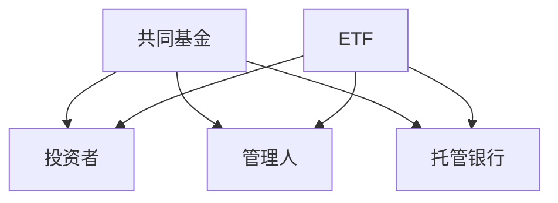
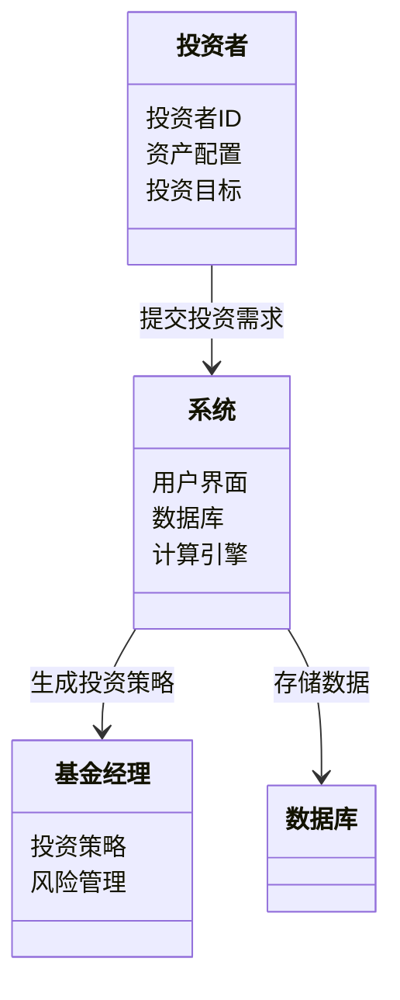

                 


# 约翰·伯格的共同基金批评：ETF和主动管理的未来

> 关键词：共同基金、ETF、主动管理、投资策略、金融创新、成本效益分析

> 摘要：本文深入分析了约翰·伯格对共同基金行业的批评，探讨了ETF（交易所交易基金）和主动管理型基金在未来投资中的角色与发展前景。通过对比共同基金与ETF的优劣，结合数学模型和系统架构设计，本文旨在为投资者提供科学的投资决策依据。

---

## 第一部分: 共同基金的背景与问题

### 第1章: 共同基金的问题与挑战

#### 1.1 共同基金的定义与特点
共同基金是一种集合投资工具，由多个投资者的资金共同组成，由专业管理人进行投资运作。其特点包括多样性、专业性和分散风险，但同时也存在高费用比率、低透明度和较高的管理成本等问题。

#### 1.2 共同基金行业的问题
- 高费用比率：共同基金的管理费用通常较高，且费用结构不透明，长期累积后显著影响投资者收益。
- 低透明度：投资者难以全面了解基金的投资组合和运作细节，导致信息不对称。
- 过高的管理成本：基金公司为了追求高收益，可能过度交易，增加交易成本和税务负担。

#### 1.3 共同基金与投资者收益的关系
- 共同基金的收益来源于投资组合的回报，但高费用和管理成本会侵蚀收益。
- 长期表现分析显示，大多数主动管理型共同基金难以跑赢市场指数，费用过高是主要原因。

### 第2章: ETF的兴起与优势

#### 2.1 ETF的定义与特点
ETF是一种在交易所上市交易的基金，具有透明度高、流动性好、成本低等优势。其运作机制基于指数复制，通过跟踪特定指数实现稳定收益。

#### 2.2 ETF与共同基金的对比
| 特性         | 共同基金                 | ETF                   |
|--------------|--------------------------|-----------------------|
| 费用         | 高，通常超过1%~2%        | 低，通常0.05%~0.5%     |
| 透明度       | 低，披露不及时            | 高，实时跟踪指数       |
| 投资策略     | 主动管理，追求超额收益    | 被动管理，跟踪指数      |
| 流动性       | 有限，大额交易可能影响价格 | 高，随时可交易           |

#### 2.3 ETF的市场规模与发展趋势
- ETF市场规模持续增长，尤其在美国市场占据重要地位。
- 技术进步推动ETF创新，涵盖更多资产类别和投资策略。
- ETF的普及降低了投资门槛，吸引了更多散户投资者。

### 第3章: 主动管理的现状与挑战

#### 3.1 主动管理的定义与特点
主动管理是指基金经理通过精选个股或主动调整投资组合，以超越市场指数的表现。其核心在于专业团队的研究能力和市场判断力。

#### 3.2 主动管理的优劣势
- 优势：可能实现超额收益，适合市场环境变化较大的情况。
- 劣势：管理费用高，长期表现不稳定，难以持续跑赢指数。

#### 3.3 主动管理的未来发展方向
- 提高透明度，增强投资者信任。
- 优化费用结构，降低管理成本。
- 结合技术手段，提升投资效率和准确性。

---

## 第二部分: 核心概念与联系

### 第4章: 共同基金与ETF的对比分析

#### 4.1 核心概念原理
- 共同基金通过集中投资和专业管理实现收益，但高费用和低透明度影响投资者利益。
- ETF通过被动跟踪指数实现稳定收益，成本低且透明度高，适合长期投资。

#### 4.2 实体关系图


---

## 第三部分: ETF和主动管理的策略分析

### 第5章: ETF的运作机制

#### 5.1 ETF的指数复制策略
- ETF通过复制指数成分股，实现与指数表现一致的投资回报。
- 使用数学模型计算复制误差，优化投资组合。

#### 5.2 ETF的数学模型
$$ 复制误差 = \frac{\sum w_i - \sum w_{index}}{} $$

### 第6章: 主动管理的投资策略

#### 6.1 主动管理的数学模型
$$ 夏普比率 = \frac{E[r_i - r_f]}{\sigma_i} $$

---

## 第四部分: 系统分析与架构设计

### 第7章: 投资管理系统架构

#### 7.1 功能模块设计


---

## 第五部分: 项目实战

### 第8章: 投资组合管理系统实现

#### 8.1 环境安装
- 安装Python和相关库（如Pandas、NumPy）。

#### 8.2 核心代码实现
```python
import pandas as pd
import numpy as np

# ETF指数数据
index_data = pd.read_csv('index.csv')

# 计算夏普比率
def sharpe_ratio(returns, risk_free_rate):
    excess_returns = returns - risk_free_rate
    return (excess_returns.mean() / excess_returns.std()) * np.sqrt(252)

# 应用夏普比率计算
sharpe_ratio(index_data['returns'], 0.01)
```

---

## 第六部分: 最佳实践与未来展望

### 第9章: 投资策略优化

#### 9.1 小结
- ETF在费用和透明度方面具有显著优势，适合长期投资。
- 主动管理需优化费用结构，借助技术提升效率。

#### 9.2 注意事项
- 投资者应根据自身风险承受能力和投资目标选择合适的投资工具。
- 定期评估投资组合表现，及时调整策略。

#### 9.3 拓展阅读
推荐阅读约翰·伯格的《投资的艺术》和《ETF投资指南》。

---

## 作者信息

作者：AI天才研究院/AI Genius Institute & 禅与计算机程序设计艺术 /Zen And The Art of Computer Programming

---

通过以上结构，文章全面分析了共同基金的问题、ETF的优势以及主动管理的未来发展方向，结合数学模型和系统架构设计，为投资者提供了科学的投资决策依据。

