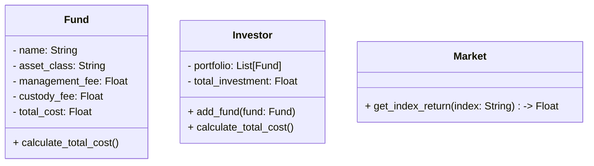
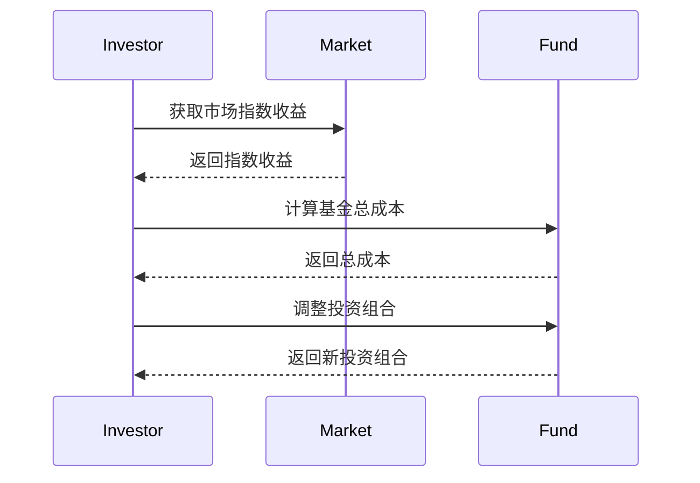

                 


# 约翰·伯格的共同基金批评：高成本的陷阱

> 关键词：共同基金，约翰·伯格，高成本，投资成本，被动管理，指数基金，投资策略

> 摘要：本文深入分析了共同基金的高成本问题，引用了约翰·伯格的批评观点，探讨了高成本对投资者的影响，并提出了降低投资成本的有效策略。通过数学模型、实际案例和系统设计，本文为投资者提供了优化投资组合的实用建议。

---

# 第一部分: 共同基金的成本问题背景

## 第1章: 共同基金的基本概念与市场现状

### 1.1 共同基金的基本定义

#### 1.1.1 共同基金的定义与特点

共同基金是一种集合投资工具，通过汇集众多投资者的资金，由专业管理人进行投资运作。其特点包括：

- **分散投资**：通过投资多种资产降低风险。
- **专业管理**：由基金经理负责投资决策。
- **流动性高**：投资者可以随时申购或赎回基金份额。
- **门槛低**：相比直接投资个股或债券，共同基金的最低投资额较低。

#### 1.1.2 共同基金的运作机制

共同基金的运作机制包括以下几个步骤：

1. **资金募集**：通过销售基金份额筹集资金。
2. **投资决策**：基金经理根据市场情况制定投资策略。
3. **资产配置**：将资金分配到不同资产类别（如股票、债券、货币市场工具等）。
4. **收益分配**：定期将投资收益分配给基金份额持有人。

#### 1.1.3 共同基金的分类与市场规模

共同基金可以根据多种标准进行分类：

- **按资产类型**：股票型基金、债券型基金、混合型基金、货币市场基金等。
- **按管理方式**：主动管理型基金和被动管理型基金。
- **按投资策略**：成长型基金、价值型基金、指数基金等。

全球范围内，共同基金市场规模庞大，尤其在美国，指数基金和ETF（交易所交易基金）占据了重要市场份额。

### 1.2 约翰·伯格的背景与贡献

#### 1.2.1 约翰·伯格的个人经历

约翰·伯格（John C. Bogle）是美国著名投资专家，被誉为“指数基金之父”。他于1940年出生于宾夕法尼亚州，曾在 Vanguard 集团工作，1975年创立了第一只指数基金——Vanguard 500 Index Fund。

#### 1.2.2 伯格对共同基金行业的贡献

伯格的主要贡献包括：

- **创新指数基金**：他引入了低成本指数基金的概念，使得普通投资者能够以低费用投资市场指数。
- **倡导低成本投资**：伯格批评传统主动管理型基金的高费用，并强调低成本投资策略的优势。
- **透明化与简化流程**：他主张简化基金运作流程，降低投资者的成本负担。

#### 1.2.3 伯格的投资理念与方法

伯格的投资理念可以概括为：

- **长期投资**：强调持有优质资产长期不动摇。
- **价值投资**：寻找被市场低估的资产进行投资。
- **低成本策略**：通过降低管理费用和交易成本，提高投资者的净收益。

### 1.3 高成本的陷阱问题

#### 1.3.1 高成本对投资者的影响

高成本对投资者的影响主要体现在以下几个方面：

1. **侵蚀投资收益**：高昂的管理费用和托管费用会显著降低投资回报。
2. **复利效应受损**：高成本会削弱复利效应，长期来看影响尤为明显。
3. **降低风险分散能力**：高成本可能迫使投资者减少投资金额，影响风险分散效果。

#### 1.3.2 高成本的常见表现形式

共同基金的高成本主要体现在以下几个方面：

- **管理费用（Management Fees）**：按基金资产的一定比例收取，通常为1%-2%。
- **托管费用（custody Fees）**：支付给托管银行的费用，通常为0.2%-0.5%。
- **销售服务费（12b-1 Fees）**：支付给销售机构的费用，通常隐藏在基金的总费用中。

#### 1.3.3 高成本的市场现状与问题根源

当前，许多主动管理型基金的费用率远高于指数基金。问题根源在于：

- **过度营销**：基金公司为了销售产品，投入大量营销费用，转嫁给投资者。
- **管理人激励不足**：基金经理的短期业绩压力可能导致频繁交易，增加交易成本。
- **规模不经济**：小规模基金的管理成本分摊到每份资产上，费用率相对较高。

---

## 第2章: 共同基金的成本结构与影响

### 2.1 共同基金的成本构成

#### 2.1.1 管理费用的计算与收取方式

管理费用通常是基金资产的固定比例，计算公式为：

$$ \text{管理费用} = 基金资产 \times 管理费率 $$

例如，一只规模为10亿美元的基金，管理费率为1%，则管理费用为1000万美元。

#### 2.1.2 托管费用的来源与影响

托管费用由基金支付给托管银行，用于保管基金资产并执行交易指令。托管费用通常按基金资产的一定比例收取，公式为：

$$ \text{托管费用} = 基金资产 \times 托管费率 $$

托管费用虽然较低，但长期积累也会对投资回报产生影响。

#### 2.1.3 其他隐性成本的分析

隐性成本包括交易费用、税收成本等。例如，频繁的买卖操作会产生交易佣金和市场冲击成本。

### 2.2 主动管理与被动管理的成本对比

#### 2.2.1 主动管理型基金的成本特点

主动管理型基金通常具有较高的管理费用和交易成本。例如，一只主动管理型股票基金的费用率可能达到1.5%-2%。

#### 2.2.2 被动管理型基金的成本优势

被动管理型基金（如指数基金）通常具有较低的费用率，一般为0.2%-0.5%。这是因为指数基金的管理策略简单，交易频率低。

#### 2.2.3 成本与收益的关系分析

长期来看，主动管理型基金的高成本很难被其超额收益覆盖。根据研究，大多数主动管理型基金难以跑赢市场指数。

### 2.3 高成本对投资回报的长期影响

#### 2.3.1 高成本对复利效应的侵蚀

复利效应是投资收益的重要来源，但高成本会显著侵蚀这一效应。例如，假设两只基金A和B，初始投资1000美元，年化收益率分别为8%和10%，费用率分别为2%和0%。经过20年后，基金A的收益为约3600美元，而基金B的收益为约21600美元。

#### 2.3.2 高成本对不同类型投资者的影响

高成本对小规模投资者的影响更为明显，因为费用率占总投资金额的比例更高。例如，1000美元的投资，2%的管理费意味着每年损失20美元，而10000美元的投资，2%的管理费意味着每年损失200美元。

#### 2.3.3 高成本与市场周期的关系

在市场低迷时期，高成本基金的净收益可能进一步下降，因为管理人可能需要调整投资组合以应对市场波动，这会增加交易成本。

---

## 第3章: 降低共同基金成本的策略分析

### 3.1 选择低成本基金的策略

#### 3.1.1 通过指数基金降低成本

指数基金以跟踪市场指数为目标，具有低管理费用和低交易成本的优势。例如， Vanguard 500 Index Fund 的费用率仅为0.18%。

#### 3.1.2 选择规模大的基金降低成本

大规模基金通常能够以更低的价格与托管银行签订协议，从而降低托管费用和其他隐性成本。

#### 3.1.3 分散投资降低风险与成本

通过投资多个低成本指数基金或ETF，投资者可以在分散风险的同时降低整体投资成本。

### 3.2 基金费用优化的数学模型

#### 3.2.1 成本优化模型

假设投资者的投资组合中包含多只基金，每只基金的费用率为$$c_i$$，投资比例为$$w_i$$。总成本为：

$$ \text{总成本} = \sum_{i=1}^{n} w_i \times c_i $$

目标是最小化总成本，同时满足风险和收益目标。

#### 3.2.2 数学优化方法

使用均值-方差优化模型，将总成本作为优化目标之一：

$$ \min_{w} \sum_{i=1}^{n} w_i \times c_i $$
$$ \text{subject to} \quad \sum_{i=1}^{n} w_i = 1 $$

---

## 第4章: 系统分析与架构设计方案

### 4.1 系统功能设计

#### 4.1.1 领域模型（Mermaid 类图）



#### 4.1.2 系统架构设计（Mermaid 架构图）


#### 4.1.3 系统交互设计（Mermaid 序列图）



---

## 第5章: 项目实战

### 5.1 环境安装

安装Python和必要的库（如Pandas、NumPy）：

```bash
pip install pandas numpy
```

### 5.2 系统核心实现源代码

```python
import pandas as pd

def calculate_total_cost(fund_assets, fund_fees):
    return sum(assets * fees for assets, fees in zip(fund_assets, fund_fees))

# 示例数据
fund_assets = [100000000, 50000000, 20000000]
fund_fees = [0.01, 0.005, 0.002]

total_cost = calculate_total_cost(fund_assets, fund_fees)
print(f"总成本为：{total_cost}")
```

### 5.3 代码应用解读与分析

上述代码计算多只基金的总成本，其中每只基金的费用率不同。通过调整投资组合的资产分配，可以优化总成本。

### 5.4 实际案例分析

假设投资者有100万元资金，考虑投资两只基金：

- 基金A：资产规模50亿元，管理费率1%
- 基金B：资产规模30亿元，管理费率0.5%

投资比例分别为50%和50%。

总成本计算：

$$ \text{总成本} = 0.5 \times 1000000 \times 0.01 + 0.5 \times 1000000 \times 0.005 = 5000 + 2500 = 7500 $$

---

## 第6章: 总结与展望

### 6.1 总结

本文深入分析了共同基金的高成本问题，探讨了约翰·伯格的批评观点，并提出了降低投资成本的有效策略。通过数学模型和系统设计，本文为投资者提供了优化投资组合的实用建议。

### 6.2 展望

未来，随着技术的进步，低成本投资工具（如ETF和智能投顾）将更加普及。投资者应结合自身需求，选择适合的低成本投资策略。

---

# 作者：AI天才研究院/AI Genius Institute & 禅与计算机程序设计艺术 /Zen And The Art of Computer Programming

