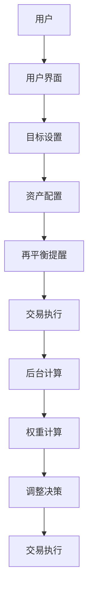

                 

# 约翰·伯格的再平衡策略：保持投资组合平衡

> 关键词：约翰·伯格，再平衡策略，投资组合，资产配置，动态调整，风险管理，投资策略

> 摘要：本文深入探讨了约翰·伯格的再平衡策略，分析了其在投资组合管理中的重要性、核心原理、数学模型以及实际应用案例。通过系统化的分析和实例演示，本文旨在帮助读者理解和掌握如何通过再平衡策略优化投资组合，实现长期稳健的投资回报。

---

## 第一部分: 投资组合再平衡的背景与基础

### 第1章: 投资组合的基础知识

#### 1.1 投资组合的基本概念

##### 1.1.1 什么是投资组合
投资组合是指将多种资产（如股票、债券、房地产等）按照一定比例组合在一起，以实现风险分散和收益最大化的一种投资方式。投资组合的核心在于通过多样化配置降低风险，同时追求更高的收益。

##### 1.1.2 投资组合的构成要素
- **资产类别**：股票、债券、现金、房地产等。
- **权重**：每种资产在投资组合中的比例。
- **风险与收益**：投资组合的总体风险和收益取决于各资产的风险收益特性及其权重。

##### 1.1.3 投资组合的目标与风险
- **目标**：实现资产的长期增值，同时控制风险。
- **风险**：投资组合的整体风险由各资产的风险及其权重决定，通常包括市场风险、流动性风险和通胀风险。

#### 1.2 投资组合的分类与特点

##### 1.2.1 按资产类别划分的投资组合
- **股票型投资组合**：以股票为主要资产，风险较高，收益潜力大。
- **债券型投资组合**：以债券为主要资产，风险较低，收益相对稳定。
- **混合型投资组合**：同时包含股票和债券，风险和收益介于两者之间。

##### 1.2.2 按风险等级划分的投资组合
- **高风险投资组合**：适合风险承受能力强的投资者，收益潜力大。
- **中风险投资组合**：适合大多数投资者，收益与风险相对平衡。
- **低风险投资组合**：适合风险承受能力弱的投资者，收益稳定。

##### 1.2.3 投资组合的流动性与收益性对比
流动性高的投资组合（如现金、货币市场基金）收益较低，而流动性低的投资组合（如房地产）收益较高但变现能力差。

#### 1.3 投资组合管理的重要性

##### 1.3.1 投资组合管理的基本原则
- **分散化原则**：通过多样化配置降低风险。
- **风险与收益匹配原则**：根据投资者的风险承受能力和收益目标进行配置。
- **长期投资原则**：避免频繁交易，降低交易成本和税务负担。

##### 1.3.2 投资组合管理的目标
- **最大化收益**：在可接受的风险范围内实现收益最大化。
- **风险控制**：通过合理的资产配置降低投资组合的整体风险。
- **税务优化**：合理配置资产以降低税务负担。

##### 1.3.3 投资组合管理的常见挑战
- **市场波动**：市场波动可能导致投资组合偏离预期配置。
- **通胀风险**：通胀可能侵蚀投资组合的购买力。
- **资产价格变化**：资产价格波动可能导致权重变化，影响整体风险收益。

#### 1.4 本章小结
本章介绍了投资组合的基本概念、分类与特点，以及投资组合管理的重要性和常见挑战。投资组合管理是实现长期稳健收益的关键，需要结合风险承受能力、收益目标和市场环境进行动态调整。

---

### 第2章: 再平衡策略的背景与重要性

#### 2.1 什么是再平衡策略

##### 2.1.1 再平衡的定义
再平衡是指定期或不定期地调整投资组合中各资产的权重，使其回归到预定的目标配置比例。通过再平衡，可以维持投资组合的风险收益特性不变。

##### 2.1.2 再平衡的必要性
- **市场波动**：市场波动可能导致某些资产的权重偏离目标配置。
- **资产价格变化**：不同资产的价格波动可能导致权重变化，影响整体风险收益。
- **目标变化**：投资者的风险承受能力和收益目标可能发生变化，需要通过再平衡进行调整。

##### 2.1.3 再平衡的常见应用场景
- **定期再平衡**：按固定时间间隔（如每年或每季度）进行调整。
- **不定期再平衡**：根据市场变化或投资者目标变化进行调整。
- **全部再平衡**：将投资组合完全重新配置到目标比例。
- **部分再平衡**：仅调整偏离目标的部分资产。

#### 2.2 约翰·伯格再平衡策略的特点

##### 2.2.1 约翰·伯格的投资理念
约翰·伯格是指数基金之父，强调长期投资和分散化配置。他认为，长期投资和定期再平衡是实现稳健收益的关键。

##### 2.2.2 约翰·伯格再平衡策略的核心思想
- **长期持有**：通过长期持有优质资产，避免频繁交易。
- **定期调整**：定期进行再平衡，维持目标配置比例。
- **低成本投资**：通过指数基金等低成本工具实现投资目标。

##### 2.2.3 约翰·伯格策略与传统再平衡策略的对比
| 对比维度 | 约翰·伯格策略 | 传统再平衡策略 |
|----------|----------------|----------------|
| 调整频率 | 定期调整，长期持有 | 更频繁的调整 |
| 调整方式 | 以目标比例为基础 | 更灵活的调整 |
| 成本控制 | 强调低成本投资 | 成本较高 |

#### 2.3 再平衡策略的核心目标

##### 2.3.1 维持投资组合的预期风险收益比例
通过再平衡，确保投资组合的风险收益特性与目标一致。

##### 2.3.2 应对市场波动的调整
市场波动可能导致某些资产的权重过高或过低，再平衡可以及时调整，降低风险。

##### 2.3.3 优化投资组合的表现
通过再平衡，可以避免某些资产权重过高带来的风险，同时捕捉其他资产的收益机会。

#### 2.4 本章小结
本章介绍了再平衡策略的背景、必要性和约翰·伯格策略的特点。再平衡是投资组合管理的重要工具，能够帮助投资者维持目标配置比例，应对市场波动，优化投资表现。

---

## 第三部分: 投资组合再平衡的数学模型与算法

### 第3章: 再平衡策略的数学模型

#### 3.1 投资组合权重的计算公式

##### 3.1.1 投资组合权重的定义
投资组合中某资产的权重为该资产的市场价值占总组合市场价值的比例。

$$ \text{权重} = \frac{\text{资产价值}}{\text{总组合价值}} $$

##### 3.1.2 目标权重与实际权重的对比
假设目标权重为 $w_i$，实际权重为 $w_i'$，当 $w_i \neq w_i'$ 时，需要进行再平衡调整。

##### 3.1.3 再平衡调整公式
调整后的资产价值为：

$$ \text{调整后价值} = \text{目标权重} \times \text{总组合价值} $$

#### 3.2 再平衡的实现步骤

##### 3.2.1 确定目标配置比例
根据投资者的风险承受能力和收益目标，确定各资产的目标权重。

##### 3.2.2 计算实际权重
根据当前市场价值计算各资产的实际权重。

##### 3.2.3 确定调整幅度
计算实际权重与目标权重的差异，确定需要调整的资产和调整金额。

##### 3.2.4 执行再平衡
通过买卖资产，将实际权重调整到目标权重。

#### 3.3 再平衡的数学模型

##### 3.3.1 投资组合调整前后的权重变化
假设投资组合初始价值为 $V_0$，目标权重为 $w_i$，实际权重为 $w_i'$。调整后，各资产的价值为：

$$ V_i = w_i \times V_0 $$

##### 3.3.2 资产调整的数学推导
假设某资产需要增加 $ΔV_i$，则：

$$ ΔV_i = V_i - V_i' $$

其中，$V_i'$ 是调整前的资产价值。

#### 3.4 再平衡的优化算法

##### 3.4.1 线性规划优化
通过线性规划模型优化投资组合权重，最小化调整成本。

##### 3.4.2 风险调整模型
考虑市场风险和流动性风险，优化再平衡策略。

---

## 第四部分: 投资组合再平衡的系统架构与实现

### 第4章: 系统架构设计

#### 4.1 系统功能设计

##### 4.1.1 用户界面
- **目标设置**：用户输入风险承受能力和收益目标。
- **资产配置**：根据目标生成初始投资组合。
- **再平衡提醒**：提醒用户何时需要进行再平衡调整。
- **交易执行**：用户执行再平衡交易。

##### 4.1.2 后台计算
- **权重计算**：根据市场数据计算实际权重。
- **调整决策**：判断是否需要再平衡。
- **交易执行**：根据决策执行交易。

#### 4.2 系统架构图

#### 4.3 系统交互流程

##### 4.3.1 用户登录
用户登录系统，进入用户界面。

##### 4.3.2 设置目标
用户输入风险承受能力和收益目标，系统生成初始投资组合。

##### 4.3.3 监测市场变化
系统实时监测市场变化，计算实际权重。

##### 4.3.4 再平衡提醒
当实际权重偏离目标权重时，系统提醒用户进行再平衡。

##### 4.3.5 执行交易
用户根据提醒执行再平衡交易，系统记录交易数据。

#### 4.4 系统接口设计

##### 4.4.1 数据接口
- **市场数据接口**：获取实时市场数据。
- **用户数据接口**：获取用户目标和历史交易数据。

##### 4.4.2 交易接口
- **买入接口**：执行买入交易。
- **卖出接口**：执行卖出交易。

##### 4.4.3 报告接口
- **绩效报告接口**：生成投资组合绩效报告。
- **风险报告接口**：生成风险评估报告。

---

## 第五部分: 投资组合再平衡的项目实战

### 第5章: 项目实战

#### 5.1 环境安装

##### 5.1.1 安装Python
安装Python 3.8及以上版本，推荐使用Anaconda发行版。

##### 5.1.2 安装依赖库
安装Pandas、NumPy、Matplotlib等数据处理库。

##### 5.1.3 安装金融数据接口
使用Yahoo Finance API获取实时市场数据。

#### 5.2 核心实现

##### 5.2.1 投资组合配置
定义目标权重和初始资金。

##### 5.2.2 数据获取
获取相关资产的历史数据。

##### 5.2.3 权重计算
计算实际权重，判断是否需要再平衡。

##### 5.2.4 再平衡执行
根据决策执行交易，调整资产权重。

##### 5.2.5 性能评估
计算投资组合的收益和风险指标。

#### 5.3 案例分析

##### 5.3.1 案例背景
假设投资者初始资金为100,000美元，目标配置为60%股票、30%债券、10%现金。

##### 5.3.2 市场变化
假设股票上涨30%，债券下跌10%，现金不变。

##### 5.3.3 权重计算
调整前：
- 股票价值：60,000美元
- 债券价值：30,000美元
- 现金：10,000美元
总价值：100,000美元

调整后目标：
- 股票：60,000美元（60%）
- 债券：30,000美元（30%）
- 现金：10,000美元（10%）

股票上涨后，股票价值变为60,000 × 1.3 = 78,000美元，总价值变为100,000 × 1.3 = 130,000美元。

实际权重：
- 股票：78,000 / 130,000 = 60%
- 债券：30,000 / 130,000 ≈ 23.08%
- 现金：10,000 / 130,000 ≈ 7.69%

需要调整债券和现金权重。

##### 5.3.4 再平衡执行
卖出债券和现金，买入股票，调整到目标权重。

##### 5.3.5 性能评估
比较再平衡前后的收益和风险指标，验证策略的有效性。

#### 5.4 本章小结
通过实际案例分析，展示了再平衡策略在投资组合管理中的应用。再平衡能够有效应对市场波动，维持目标配置比例，优化投资表现。

---

## 第六部分: 总结与展望

### 第6章: 总结与展望

#### 6.1 本章总结

##### 6.1.1 再平衡策略的核心思想
再平衡是投资组合管理的重要工具，能够维持目标配置比例，应对市场波动，优化投资表现。

##### 6.1.2 约翰·伯格策略的特点
长期持有、定期调整、低成本投资是约翰·伯格策略的核心思想。

##### 6.1.3 投资组合管理的关键点
分散化配置、风险控制、长期投资是投资组合管理的关键点。

#### 6.2 未来展望

##### 6.2.1 再平衡策略的智能化
利用人工智能技术实现智能化再平衡，根据市场变化和投资者目标动态调整。

##### 6.2.2 多资产配置的优化
探索更多资产类别，优化投资组合的风险收益特性。

##### 6.2.3 再平衡策略的全球化
在全球化背景下，探索跨国资产配置和再平衡策略。

#### 6.3 最佳实践 tips

##### 6.3.1 定期检查投资组合
定期检查投资组合的实际权重，确保与目标一致。

##### 6.3.2 避免频繁交易
频繁交易会增加交易成本和税务负担，影响投资收益。

##### 6.3.3 结合市场环境
根据市场环境和投资者目标动态调整再平衡策略。

#### 6.4 小结
再平衡策略是投资组合管理的重要工具，通过定期调整维持目标配置比例，优化投资表现。未来，随着技术进步和市场发展，再平衡策略将更加智能化和多样化。

---

## 作者：AI天才研究院/AI Genius Institute & 禅与计算机程序设计艺术 /Zen And The Art of Computer Programming

