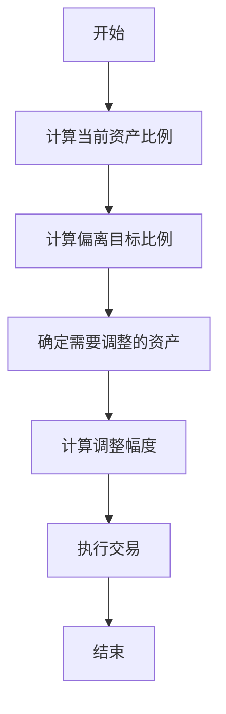
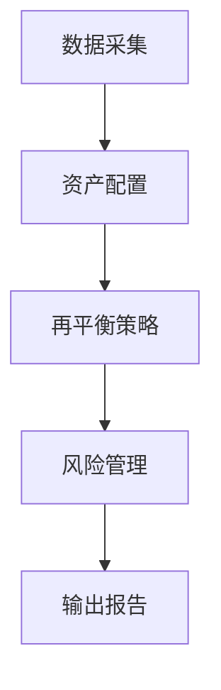
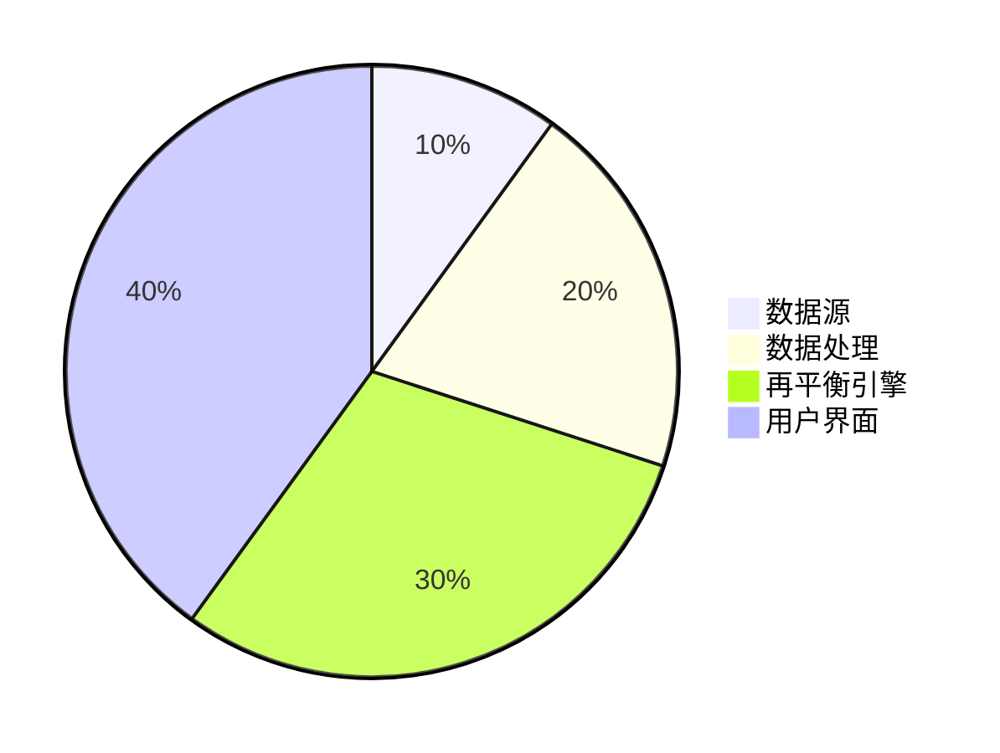
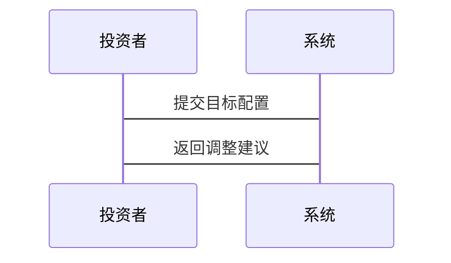

                 


# 约翰·伯格的再平衡策略：维持投资组合平衡

> 关键词：投资组合再平衡，约翰·伯格，资产配置，现代投资组合理论，动态再平衡，投资策略

> 摘要：本文详细探讨了约翰·伯格的再平衡策略在投资组合管理中的应用。从基本概念到理论基础，从策略选择到技术实现，再到系统架构设计和项目实战，全面分析了如何通过再平衡策略实现投资组合的优化与风险管理。文章结合数学模型、算法原理和系统设计，为读者提供了深刻的理解和实践指导。

---

## 第一章: 投资组合再平衡策略概述

### 1.1 投资组合再平衡的基本概念

#### 1.1.1 投资组合再平衡的定义

投资组合再平衡是指根据市场变化、资产价格波动或投资者风险偏好变化，定期调整投资组合的资产配置，以维持目标风险收益水平的过程。其核心目标是确保投资组合的实际风险收益与初始设定一致。

#### 1.1.2 再平衡策略的重要性

再平衡策略是投资组合管理中的关键步骤。通过定期调整资产配置，投资者可以应对市场波动、避免过度集中风险，并实现长期稳定的收益。

#### 1.1.3 再平衡策略的核心目标

- 维持目标资产配置比例
- 优化风险收益比
- 降低市场波动对投资组合的影响

### 1.2 投资组合再平衡的背景与现状

#### 1.2.1 投资组合管理的历史发展

投资组合管理从早期的简单资产配置发展到今天的多元化策略，经历了多个阶段。再平衡策略作为其中的重要环节，随着金融市场的发展不断完善。

#### 1.2.2 再平衡策略在现代投资中的地位

在现代投资管理中，再平衡策略是实现资产配置目标的关键手段。通过动态调整，投资者可以在不同市场环境下保持投资组合的稳定性。

#### 1.2.3 当前市场环境下的再平衡策略

当前市场波动加剧，再平衡策略的应用更加重要。投资者需要根据市场变化及时调整，以应对不确定性。

### 1.3 约翰·伯格的再平衡策略简介

#### 1.3.1 约翰·伯格的投资理念

约翰·伯格是指数基金的倡导者，强调长期投资和分散化。他的再平衡策略基于这一理念，主张通过定期调整维持目标资产配置。

#### 1.3.2 约翰·伯格再平衡策略的核心思想

- 长期投资，避免频繁交易
- 通过定期再平衡维持目标配置
- 采用低成本指数基金实现多元化

#### 1.3.3 约翰·伯格再平衡策略的实践案例

伯格通过长期持有指数基金，并定期再平衡，实现了稳定的超额收益。

### 1.4 本章小结

本章介绍了再平衡策略的基本概念、重要性及其在投资组合管理中的地位。通过约翰·伯格的案例，展示了再平衡策略的核心思想和实践价值。

---

## 第二章: 投资组合再平衡的理论基础

### 2.1 投资组合管理的基本原理

#### 2.1.1 投资组合管理的目标

投资组合管理的目标是通过科学的资产配置和有效的风险控制，实现收益最大化和风险最小化。

#### 2.1.2 投资组合的风险与收益

- 风险：波动性、流动性风险、市场风险
- 收益：预期收益、超额收益

#### 2.1.3 投资组合的有效前沿

有效前沿是指在给定风险水平下，能够提供最高预期收益的资产组合。

### 2.2 资产配置与再平衡的关系

#### 2.2.1 资产配置的定义与分类

资产配置是根据投资者的风险偏好和目标收益，将资金分配到不同资产类别（如股票、债券、现金等）的过程。

#### 2.2.2 再平衡策略在资产配置中的作用

再平衡策略是资产配置的重要环节，确保投资组合的实际配置与目标配置一致。

#### 2.2.3 动态资产配置与再平衡策略的区别

动态资产配置是根据市场变化主动调整资产比例，而再平衡策略是定期调整以维持目标配置。

### 2.3 现代投资组合理论与再平衡策略

#### 2.3.1 现代投资组合理论的核心思想

马科维茨的有效组合理论指出，通过分散化投资可以降低风险。

#### 2.3.2 马科维茨的有效组合理论

通过优化模型，选择最优资产组合，使风险最小化或收益最大化。

#### 2.3.3 现代投资组合理论与再平衡策略的结合

再平衡策略是现代投资组合理论的实际应用，通过定期调整维持最优资产配置。

### 2.4 本章小结

本章从理论角度分析了再平衡策略的背景和作用，为后续策略分析奠定了基础。

---

## 第三章: 投资组合再平衡策略的类型与选择

### 3.1 定期再平衡策略

#### 3.1.1 定期再平衡的定义与特点

定期再平衡是指根据预定的时间间隔（如季度、半年）进行调整。

#### 3.1.2 定期再平衡的实施频率

- 每月一次
- 每季度一次
- 每半年一次

#### 3.1.3 定期再平衡的优缺点分析

- 优点：简单易行，成本较低
- 缺点：可能错过市场上涨机会

### 3.2 动态再平衡策略

#### 3.2.1 动态再平衡的定义与特点

动态再平衡是根据市场变化或资产表现，随时调整资产配置。

#### 3.2.2 动态再平衡的触发条件

- 资产比例偏离目标
- 市场环境变化
- 风险偏好调整

#### 3.2.3 动态再平衡的优缺点分析

- 优点：灵活性高，适应性强
- 缺点：交易成本较高

### 3.3 指数基金与被动再平衡策略

#### 3.3.1 指数基金的定义与特点

指数基金通过跟踪指数实现被动投资，费用低、风险分散。

#### 3.3.2 被动再平衡策略的实施

定期调整指数基金比例，保持目标配置。

### 3.4 本章小结

本章分析了再平衡策略的主要类型，帮助投资者根据自身需求选择合适策略。

---

## 第四章: 投资组合再平衡策略的技术实现

### 4.1 数学模型与算法

#### 4.1.1 再平衡策略的数学模型

目标是通过调整资产比例，使投资组合的风险收益匹配目标。

$$
\min \sigma^2 \\
\text{s.t.} \\
\sum w_i = 1 \\
w_i \geq 0
$$

#### 4.1.2 现代投资组合理论的优化算法

使用拉格朗日乘数法求解优化问题。

### 4.2 算法实现

#### 4.2.1 再平衡算法的流程图



#### 4.2.2 再平衡策略的代码实现

```python
import numpy as np

def rebalance_portfolio(weights, current_weights, target_weights):
    # 计算偏离
    deviations = current_weights - target_weights
    # 计算调整幅度
    adjustments = np.where(deviations > 0, -deviations, -deviations)
    # 执行交易
    new_weights = current_weights + adjustments
    return new_weights
```

### 4.3 本章小结

本章通过数学模型和算法实现，详细讲解了再平衡策略的技术细节。

---

## 第五章: 投资组合再平衡策略的系统架构设计

### 5.1 系统功能设计

#### 5.1.1 系统功能模块

- 数据采集模块
- 资产配置模块
- 再平衡策略模块
- 风险管理模块

#### 5.1.2 系统功能流程



### 5.2 系统架构设计

#### 5.2.1 系统架构图



### 5.3 本章小结

本章通过系统架构设计，展示了再平衡策略在实际应用中的实现框架。

---

## 第六章: 投资组合再平衡策略的项目实战

### 6.1 项目环境安装

#### 6.1.1 安装Python环境

```bash
pip install numpy pandas matplotlib
```

### 6.2 项目核心实现

#### 6.2.1 再平衡策略的代码实现

```python
import pandas as pd

def rebalance(weights, target_weights):
    # 计算调整比例
    rebalanced_weights = weights.reindex(target_weights.index, axis=1)
    rebalanced_weights = rebalanced_weights / rebalanced_weights.sum()
    return rebalanced_weights
```

#### 6.2.2 系统交互设计



### 6.3 项目小结

本章通过项目实战，展示了再平衡策略的具体实现步骤和注意事项。

---

## 第七章: 总结与展望

### 7.1 本章总结

再平衡策略是投资组合管理中的关键环节。通过定期调整资产配置，投资者可以实现风险控制和收益优化。

### 7.2 未来展望

随着金融市场的发展，再平衡策略将更加智能化和个性化。人工智能和大数据技术的应用将推动再平衡策略的进一步优化。

### 7.3 最佳实践 Tips

- 定期审视投资组合，及时调整
- 选择适合的再平衡策略
- 保持长期投资心态

---

## 作者：AI天才研究院/AI Genius Institute & 禅与计算机程序设计艺术 /Zen And The Art of Computer Programming

