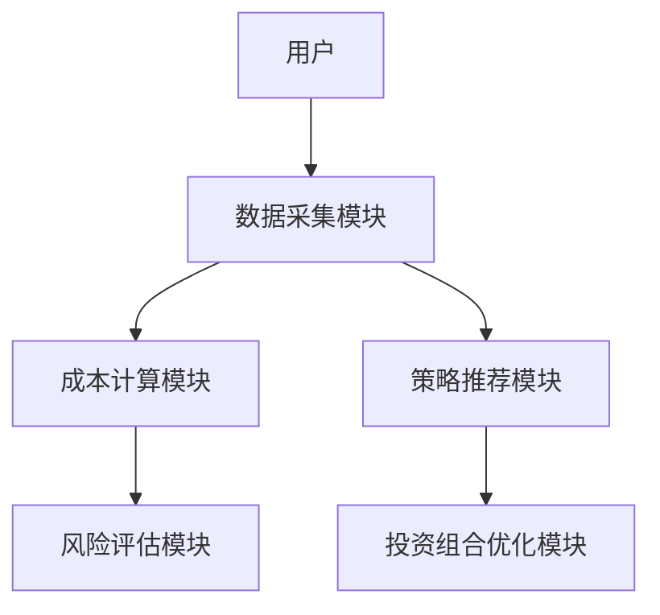

                 


# 约翰·伯格的成本意识投资策略

## 关键词
- 投资策略、成本意识、约翰·伯格、投资回报、风险管理

## 摘要
约翰·伯格的成本意识投资策略是一种以降低投资成本为核心的投资方法，强调通过选择低成本投资工具、避免频繁交易和长期持有优质资产来实现稳健的投资回报。本文从背景介绍、核心概念、算法原理、系统分析、项目实战和最佳实践等方面，详细阐述了成本意识投资的理论基础和实际应用，帮助投资者理解如何通过控制成本来优化投资组合。

---

## 第一部分：成本意识投资策略的背景与基础

### 第1章：成本意识投资概述

#### 1.1 投资的基本概念
- **1.1.1 投资的定义与分类**
  投资是指将资金投入到特定资产或项目中，以期在未来获得收益的行为。投资可以分为股票、债券、房地产等多种形式。
- **1.1.2 成本意识在投资中的重要性**
  投资成本包括显性成本（如交易费用、管理费用）和隐性成本（如时间成本、机会成本）。低成本投资策略能够显著提高投资回报率。
- **1.1.3 约翰·伯格的投资理念与方法**
  约翰·伯格是低成本投资的倡导者，他强调通过长期持有低成本指数基金来实现财富增长。

#### 1.2 成本意识投资的背景
- **1.2.1 现代投资环境的复杂性**
  当前市场环境复杂多变，投资者需要面对高波动性和高成本的双重挑战。
- **1.2.2 成本在投资决策中的作用**
  高成本投资策略往往会侵蚀投资回报，尤其是在长期投资中，成本的累积效应更加明显。
- **1.2.3 约翰·伯格的成本意识投资策略的提出**
  约翰·伯格提出的低成本投资策略，强调通过降低投资成本来优化投资回报。

---

## 第二部分：成本意识投资的核心概念与原理

### 第2章：投资成本的构成与影响

#### 2.1 投资成本的构成
- **2.1.1 显性成本**
  - 交易费用：每次交易产生的手续费。
  - 管理费用：基金或资产管理产品的管理费。
- **2.1.2 隐性成本**
  - 时间成本：由于频繁交易导致的时间浪费。
  - 机会成本：因投资决策错误而失去的其他投资机会。
- **2.1.3 其他相关成本**
  - 税收：资本利得税、股息税等。
  - 通货膨胀：通货膨胀对货币购买力的侵蚀。

#### 2.2 成本对投资回报的影响
- **2.2.1 高成本对投资收益的侵蚀**
  高成本投资策略会导致投资回报率下降，尤其是在长期投资中。
- **2.2.2 低成本投资的优势与风险**
  低成本投资策略的优势在于能够长期积累收益，但需要投资者具备长期持有的耐心。
- **2.2.3 成本与投资期限的关系**
  投资期限越长，低成本投资策略的优势越明显，因为成本的累积效应在长期中更为显著。

### 第3章：约翰·伯格的成本意识投资策略

#### 3.1 约翰·伯格的投资哲学
- **3.1.1 长期投资的重要性**
  长期投资能够平滑短期市场波动，降低投资成本。
- **3.1.2 分散投资的风险控制**
  通过分散投资降低单一资产的风险。
- **3.1.3 低成本投资的长期优势**
  低成本投资策略能够最大化长期投资回报。

#### 3.2 成本意识投资的具体策略
- **3.2.1 选择低成本投资工具**
  选择低成本指数基金或ETF（交易所交易基金）。
- **3.2.2 避免频繁交易**
  频繁交易不仅会增加交易费用，还会增加税收负担。
- **3.2.3 长期持有优质资产**
  长期持有优质资产能够避免短期波动的影响，降低投资成本。

---

## 第三部分：成本意识投资的数学模型与算法

### 第4章：投资成本的数学模型

#### 4.1 投资成本的计算公式
- **4.1.1 投资总成本的计算**
  $$\text{总成本} = \text{显性成本} + \text{隐性成本}$$
- **4.1.2 投资收益的计算**
  $$\text{净收益} = \text{投资收益} - \text{总成本}$$

#### 4.2 投资成本对收益的影响模型
- **4.2.1 简单线性模型**
  $$\text{净收益} = \text{投资收益} - \text{成本}$$
- **4.2.2 复杂模型**
  $$\text{净收益} = \text{投资收益} - \text{成本} \times \text{时间因素}$$

### 第5章：投资成本优化的算法

#### 5.1 成本最小化算法
- **5.1.1 确定投资成本的最小化目标**
  通过优化投资组合，最小化总成本。
- **5.1.2 使用线性规划模型优化投资成本**
  使用线性规划模型，优化投资组合的总成本。

#### 5.2 投资组合优化算法
- **5.2.1 Markowitz投资组合理论**
  使用均值-方差模型优化投资组合。
- **5.2.2 使用均值-方差模型优化投资组合**
  通过均值-方差模型，找到最优投资组合。

---

## 第四部分：系统分析与架构设计

### 第6章：成本意识投资系统的分析

#### 6.1 系统需求分析
- **6.1.1 系统目标**
  帮助投资者降低投资成本。
- **6.1.2 用户需求**
  - 个人投资者：希望降低投资成本，提高投资回报。
  - 机构投资者：希望优化投资组合，降低管理成本。
- **6.1.3 功能需求**
  - 成本计算：计算投资组合的总成本。
  - 策略推荐：推荐低成本投资工具。
  - 风险评估：评估投资组合的风险。

#### 6.2 系统架构设计
- **6.2.1 系统模块划分**
  - 数据采集模块：采集市场数据和投资组合数据。
  - 成本计算模块：计算投资组合的总成本。
  - 策略推荐模块：推荐低成本投资工具。
- **6.2.2 系统架构图（Mermaid）**



---

## 第五部分：项目实战与案例分析

### 第7章：成本意识投资策略的实战应用

#### 7.1 项目环境与工具安装
- **7.1.1 环境配置**
  - 操作系统：Windows 10
  - 编程语言：Python 3.8
  - 数据分析库：Pandas、NumPy
  - 可视化工具：Matplotlib
- **7.1.2 数据获取**
  - 数据源：Yahoo Finance
  - 数据类型：股票价格、指数基金价格

#### 7.2 核心代码实现
- **7.2.1 成本计算函数**
  ```python
  def calculate_total_cost(transactions, management_fee, tax):
      total_cost = 0
      for transaction in transactions:
          total_cost += transaction['fee'] + management_fee + tax
      return total_cost
  ```
- **7.2.2 投资组合优化算法实现**
  ```python
  def optimize_portfolio(prices, target_return):
      # 使用均值-方差模型优化投资组合
      # 输入：prices（资产价格矩阵），target_return（目标收益）
      # 输出：最优投资组合
      pass
  ```

#### 7.3 案例分析
- **7.3.1 某基金的投资成本分析**
  通过计算某基金的投资成本，验证低成本投资策略的有效性。
- **7.3.2 理论与实际的对比分析**
  对比理论模型和实际投资结果，分析成本意识投资策略的优缺点。

---

## 第六部分：最佳实践与总结

### 第8章：成本意识投资的最佳实践

#### 8.1 实践中的注意事项
- **8.1.1 避免频繁交易**
  频繁交易不仅会增加交易费用，还会增加税收负担。
- **8.1.2 选择低成本工具**
  选择低成本指数基金或ETF（交易所交易基金）。
- **8.1.3 长期投资的重要性**
  长期投资能够平滑短期市场波动，降低投资成本。

#### 8.2 总结与展望
- **8.2.1 成本意识投资的核心要点**
  成本意识投资策略的核心在于通过降低投资成本来提高投资回报。
- **8.2.2 未来投资策略的发展方向**
  随着市场环境的变化，成本意识投资策略需要不断优化和创新。

### 第9章：附录与拓展阅读

#### 9.1 附录
- 附录A：投资成本计算公式
- 附录B：均值-方差模型的具体实现

#### 9.2 拓展阅读
- 推荐书籍：《约翰·伯格的投资哲学》
- 推荐网站：Morningstar、Yahoo Finance

---

## 作者：AI天才研究院/AI Genius Institute & 禅与计算机程序设计艺术 /Zen And The Art of Computer Programming

