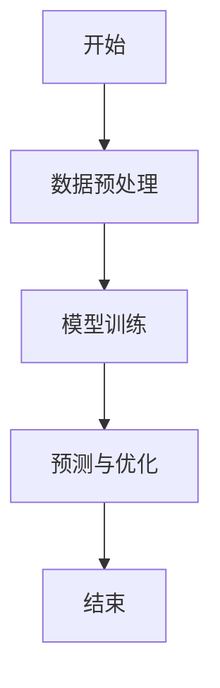
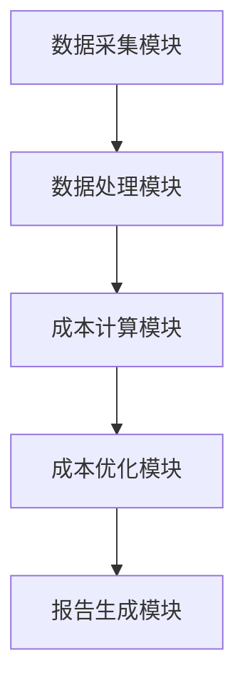
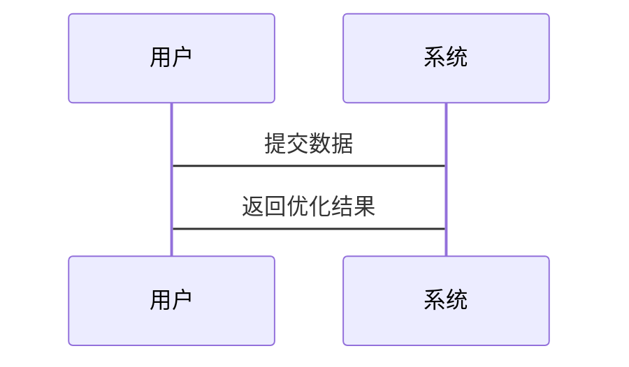

                 


# 约翰·伯格的成本控制投资理念

## 关键词：投资成本，成本控制，约翰·伯格，投资策略，成本优化

## 摘要：  
约翰·伯格是投资领域的重要人物，他提出的成本控制理念在投资决策中具有深远影响。本文将从成本控制的核心概念、算法原理、系统设计和实战应用四个方面，全面解析约翰·伯格的成本控制投资理念。通过详细的理论分析和实际案例，本文旨在帮助读者理解如何通过成本优化来提升投资收益。

---

# 第1章：成本控制投资理念概述

## 1.1 投资成本的概念与重要性

### 1.1.1 投资成本的基本定义  
投资成本是指在投资过程中产生的所有费用，包括显性成本（如交易佣金、管理费）和隐性成本（如时间成本、机会成本）。成本的高低直接影响投资的最终收益。

### 1.1.2 成本在投资决策中的作用  
在投资决策中，成本是衡量投资标的价值的重要因素。例如，在股票投资中，低佣金和低管理费可以显著提升净收益。

### 1.1.3 约翰·伯格的成本控制理念  
约翰·伯格强调长期投资和分散投资，通过降低交易频率和管理成本来优化投资组合的收益。

---

## 1.2 投资成本的构成与分类

### 1.2.1 显性成本与隐性成本  
显性成本是直接可见的费用，如交易佣金；隐性成本则难以量化，如时间成本和机会成本。

### 1.2.2 交易成本、管理成本与机会成本  
- 交易成本：每次交易产生的佣金和税费。  
- 管理成本：基金管理人的管理费和托管费。  
- 机会成本：由于资金投入某项投资而放弃其他投资机会的成本。

### 1.2.3 成本的动态变化与影响因素  
成本受市场波动、交易量和经济环境的影响，投资者需动态调整成本控制策略。

---

## 1.3 成本控制的核心目标与边界

### 1.3.1 成本控制的核心目标  
通过降低不必要的成本，最大化投资收益。例如，选择低成本指数基金可以显著降低管理费。

### 1.3.2 成本控制的边界与限制  
成本控制并非越低越好，需在收益和成本之间找到平衡点。例如，频繁交易会增加交易成本，但可能带来更高收益。

### 1.3.3 成本与收益的平衡点  
找到成本与收益的最佳平衡点，是实现长期投资收益最大化的关键。

---

# 第2章：成本控制的关键原理

## 2.1 成本与收益的权衡分析

### 2.1.1 成本-收益分析模型  
通过比较不同投资策略的成本和收益，选择最优方案。

### 2.1.2 边际成本与边际收益的平衡  
在投资决策中，边际成本等于边际收益时，投资达到最优状态。

### 2.1.3 成本控制的经济学原理  
根据经济学原理，成本控制需考虑规模效应和边际效应。

---

## 2.2 成本控制的核心要素

### 2.2.1 投资标的成本构成  
不同投资标的成本结构不同，需分别分析。

### 2.2.2 时间成本与机会成本  
长期投资的时间成本较低，但机会成本较高。

### 2.2.3 交易成本的最小化策略  
通过批量交易和长期持有，降低交易成本。

---

## 2.3 成本控制与投资策略的关系

### 2.3.1 成本驱动的投资策略  
低成本投资策略（如指数基金）适合长期稳健投资者。

### 2.3.2 成本在资产配置中的影响  
资产配置需综合考虑各类资产的成本和收益。

### 2.3.3 成本控制对长期收益的影响  
长期来看，低成本投资策略更有利于实现超额收益。

---

# 第3章：成本控制的算法与数学模型

## 3.1 成本预测与优化算法

### 3.1.1 线性回归模型的建立与应用  
使用线性回归模型预测投资成本的变化趋势。

### 3.1.2 时间序列分析模型  
利用ARIMA模型预测未来成本。

### 3.1.3 机器学习算法在成本预测中的应用  
通过神经网络模型预测复杂的投资成本变化。

---

## 3.2 成本优化的数学模型

### 3.2.1 线性规划模型  
构建线性规划模型，优化投资组合的成本。

### 3.2.2 动态规划模型  
通过动态规划找到最优投资路径。

### 3.2.3 非线性优化模型  
处理复杂的成本优化问题。

---

## 3.3 成本控制的算法实现

### 3.3.1 算法流程图（Mermaid）  


### 3.3.2 算法实现的Python代码示例  
```python
import pandas as pd
from sklearn.linear_model import LinearRegression

# 数据预处理
data = pd.read_csv('cost_data.csv')
X = data[['交易量', '市场波动率']]
y = data['成本']

# 模型训练
model = LinearRegression()
model.fit(X, y)

# 预测与优化
predicted_cost = model.predict(X)
```

### 3.3.3 算法的数学推导与解释  
线性回归模型的公式为：  
$$ y = \beta_0 + \beta_1 x_1 + \beta_2 x_2 + \epsilon $$  
其中，$y$ 是预测成本，$x_1$ 和 $x_2$ 是自变量。

---

# 第4章：系统分析与架构设计

## 4.1 系统功能模块设计

### 4.1.1 数据采集模块  
从数据库中采集投资成本数据。

### 4.1.2 成本计算模块  
计算各类投资标的成本。

### 4.1.3 成本优化模块  
优化投资组合的成本。

### 4.1.4 报告生成模块  
生成成本分析报告。

---

## 4.2 系统架构设计（Mermaid）



---

## 4.3 系统接口与交互设计

### 4.3.1 系统接口定义  
- 数据接口：提供数据输入和输出接口。  
- 优化接口：提供成本优化的API。

### 4.3.2 系统交互流程图（Mermaid）  



---

# 第5章：项目实战与案例分析

## 5.1 环境搭建与数据准备

### 5.1.1 开发环境的安装与配置  
安装Python、Pandas和Scikit-learn。

### 5.1.2 数据来源与数据预处理  
从CSV文件中读取成本数据，并进行清洗。

---

## 5.2 系统核心代码实现

### 5.2.1 成本预测模块代码  
```python
import pandas as pd
from sklearn.linear_model import LinearRegression

data = pd.read_csv('cost_data.csv')
X = data[['交易量', '市场波动率']]
y = data['成本']

model = LinearRegression()
model.fit(X, y)
```

### 5.2.2 成本优化模块代码  
```python
import numpy as np

def optimize_cost(weights, cost_matrix):
    return np.min(np.dot(weights, cost_matrix))
```

### 5.2.3 系统功能实现的详细解读  
通过代码实现成本预测和优化，提升投资组合的收益。

---

## 5.3 实际案例分析

### 5.3.1 案例背景介绍  
以某指数基金为例，分析成本控制对收益的影响。

### 5.3.2 案例分析与解读  
通过优化交易频率和降低管理费，提升投资收益。

---

## 5.4 项目小结

### 5.4.1 成本控制的核心要点  
- 选择低成本投资标的。  
- 降低交易频率和管理成本。

### 5.4.2 成本优化的实践经验  
通过长期投资和分散投资，实现成本控制。

---

# 第6章：最佳实践与总结

## 6.1 最佳实践 tips  
- 定期评估投资组合的成本。  
- 选择低成本投资工具。  
- 避免频繁交易。

## 6.2 小结  
约翰·伯格的成本控制理念强调长期投资和分散投资，通过降低成本提升投资收益。

## 6.3 注意事项  
- 成本控制需结合市场环境。  
- 避免过度优化成本。

## 6.4 拓展阅读  
推荐阅读《投资学》和《约翰·伯格的投资哲学》。

---

# 作者：AI天才研究院 & 禅与计算机程序设计艺术

---

通过以上章节的详细分析和实际案例，我们全面解读了约翰·伯格的成本控制投资理念，并展示了如何在实际投资中应用这些理念。希望本文能为投资者提供有价值的参考。

