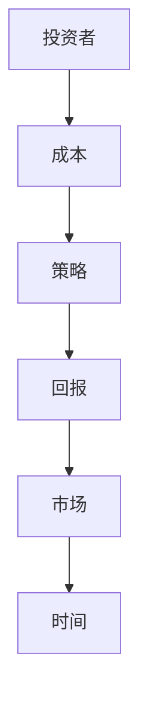
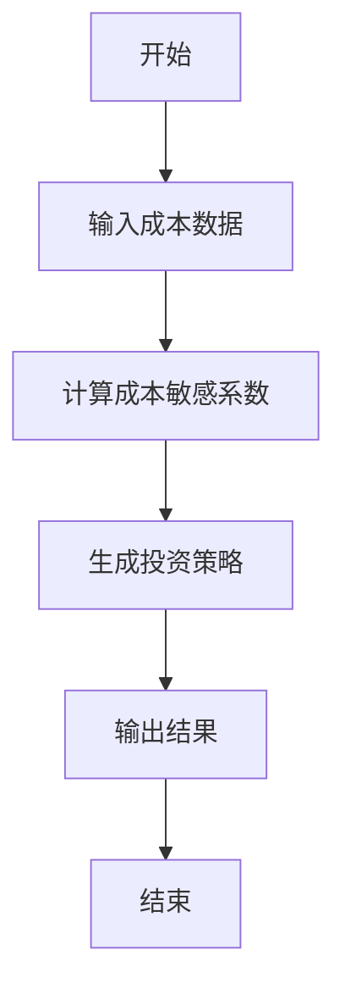

                 


# 约翰·伯格的成本敏感型投资：长期累积的力量

---

## 关键词：
- 成本敏感型投资
- 长期累积
- 投资策略
- 风险管理
- 约翰·伯格

---

## 摘要：
本文深入探讨了约翰·伯格的成本敏感型投资理论，分析其核心概念、算法原理、系统架构设计以及实际项目案例。通过对比传统投资策略，揭示成本敏感型投资的独特优势和长期累积的力量。文章结合数学模型和系统架构设计，详细阐述了成本敏感型投资的实现过程，并通过实际案例展示了其在投资实践中的应用价值。

---

# 第一部分: 成本敏感型投资的背景与核心概念

## 第1章: 成本敏感型投资的定义与背景

### 1.1 成本敏感型投资的定义
- **1.1.1 投资的基本概念**  
  投资是指将资金投入到特定资产或项目中，以期获得收益的行为。投资的核心目标是通过优化资源配置，实现财富的长期增长。

- **1.1.2 成本敏感型投资的核心定义**  
  成本敏感型投资是一种以成本为核心考量的投资策略，强调在投资决策中充分考虑各项成本因素，包括显性成本和隐性成本，以实现长期累积的回报最大化。

- **1.1.3 成本敏感型投资与传统投资的区别**  
  传统投资策略往往更关注收益和风险的直接关系，而成本敏感型投资则将成本作为影响投资决策的核心因素之一。

### 1.2 成本敏感型投资的背景
- **1.2.1 当前金融市场环境的变化**  
  随着金融市场日益复杂化，投资者需要更加精细化的策略来应对波动性和不确定性。

- **1.2.2 成本敏感型投资的兴起**  
  约翰·伯格的成本敏感型投资理论在近年来逐渐受到重视，特别是在量化投资领域，成本因素被认为是影响投资回报的关键变量。

- **1.2.3 约翰·伯格的理论贡献**  
  约翰·伯格通过深入研究成本对投资回报的影响，提出了成本敏感型投资的理论框架，为现代投资理论提供了新的视角。

---

## 第2章: 成本敏感型投资的核心要素

### 2.1 投资成本的构成
- **2.1.1 显性成本**  
  显性成本是指投资者在投资过程中可以直接观察和量化的成本，包括交易费用、管理费用等。

- **2.1.2 隐性成本**  
  隐性成本是指投资者在投资过程中无法直接观察到，但会对投资回报产生影响的成本，例如机会成本和时间成本。

- **2.1.3 时间成本**  
  时间成本是指由于资金的时间价值而导致的投资成本增加，通常通过贴现率来体现。

### 2.2 成本敏感型投资的核心属性
- **2.2.1 成本敏感性**  
  成本敏感型投资的核心属性是其对成本变化的高度敏感性，即成本的变化会对投资决策产生显著影响。

- **2.2.2 长期累积性**  
  成本敏感型投资强调通过长期累积的力量，逐步优化投资组合，实现收益的最大化。

- **2.2.3 风险控制**  
  成本敏感型投资通过严格控制成本，降低了投资组合的整体风险，从而提高了收益的稳定性。

---

## 第3章: 成本敏感型投资与传统投资的对比

### 3.1 核心概念对比
- **3.1.1 投资目标**  
  传统投资目标主要关注收益和风险的直接关系，而成本敏感型投资目标则将成本作为核心考量因素。

- **3.1.2 投资策略**  
  传统投资策略通常采用均值-方差优化，而成本敏感型投资策略则引入了成本敏感性系数，优化投资组合的成本效率。

- **3.1.3 风险管理**  
  传统风险管理方法主要关注波动性风险，而成本敏感型投资则通过控制成本来降低整体风险。

### 3.2 属性特征对比
- **3.2.1 成本敏感型投资的表格对比**  
  | 属性         | 成本敏感型投资             | 传统投资               |
  |--------------|---------------------------|-----------------------|
  | 核心考量     | 成本敏感性                 | 收益与风险             |
  | 风险控制     | 通过成本控制降低风险       | 通过波动性管理降低风险 |
  | 长期目标     | 长期累积回报               | 短期收益最大化         |

- **3.2.2 传统投资的表格对比**  
  | 属性         | 成本敏感型投资             | 传统投资               |
  |--------------|---------------------------|-----------------------|
  | 成本考量     | 成本是核心决策因素         | 成本是次要决策因素     |
  | 投资策略     | 成本敏感型优化             | 均值-方差优化           |
  | 风险管理     | 成本驱动的风险控制         | 波动性驱动的风险控制   |

### 3.3 实体关系图


---

## 第4章: 成本敏感型投资的数学模型与算法

### 4.1 成本敏感型投资的数学模型
- 成本敏感型投资的核心模型是基于成本敏感系数的优化模型：
  $$ C_s = \frac{\text{投资成本}}{\text{投资回报}} $$
  其中，$C_s$ 是成本敏感系数，$\text{投资成本}$ 是投资者在投资过程中产生的各项成本，$\text{投资回报}$ 是投资者获得的收益。

### 4.2 算法流程图


### 4.3 算法实现代码
```python
def calculate_cost_sensitive_coefficient(cost, return_on_investment):
    return cost / return_on_investment

def cost_sensitive_investment_strategy(cost_data, return_data):
    coefficients = []
    for cost, return_ in zip(cost_data, return_data):
        coeff = calculate_cost_sensitive_coefficient(cost, return_)
        coefficients.append(coeff)
    return coefficients

# 示例数据
cost_data = [100, 200, 300]
return_data = [150, 250, 350]

# 计算成本敏感系数
coefficients = cost_sensitive_investment_strategy(cost_data, return_data)
print("成本敏感系数:", coefficients)
```

---

## 第5章: 成本敏感型投资的系统架构设计

### 5.1 系统功能设计
- **领域模型**  
  通过类图展示系统的功能模块和交互关系：
  ```mermaid
  classDiagram
      class 投资者 {
          帐户资金
          投资组合
          成本数据
      }
      class 成本敏感型投资系统 {
          计算成本敏感系数
          生成投资策略
      }
      class 市场数据 {
          市场回报
          成本数据
      }
      投资者 --> 成本敏感型投资系统
      成本敏感型投资系统 --> 市场数据
  ```

### 5.2 系统架构设计
- **系统架构图**  
  ```mermaid
  graph TD
      C[成本敏感型投资系统] --> D[投资者]
      C --> M[市场数据]
      C --> S[投资策略生成器]
      S --> R[投资回报]
  ```

### 5.3 系统接口设计
- **接口描述**  
  - 输入接口：投资者的初始资金、市场数据、成本数据
  - 输出接口：投资策略、成本敏感系数、预期回报

---

## 第6章: 成本敏感型投资的项目实战

### 6.1 项目环境安装
- **Python环境**：安装Python 3.8及以上版本
- **依赖库**：安装 `numpy`, `pandas`, `scipy`

### 6.2 核心代码实现
```python
import numpy as np
import pandas as pd

def calculate_cost_sensitive_coefficient(cost, return_):
    return cost / return_

def cost_sensitive_investment_strategy(cost_data, return_data):
    coefficients = []
    for cost, return_ in zip(cost_data, return_data):
        coeff = calculate_cost_sensitive_coefficient(cost, return_)
        coefficients.append(coeff)
    return coefficients

# 示例数据
cost_data = np.array([100, 200, 300])
return_data = np.array([150, 250, 350])

# 计算成本敏感系数
coefficients = cost_sensitive_investment_strategy(cost_data, return_data)
print("成本敏感系数:", coefficients)

# 数据分析与可视化
df = pd.DataFrame({
    '成本': cost_data,
    '回报': return_data,
    '成本敏感系数': coefficients
})
print(df)
```

### 6.3 实际案例分析
- **案例背景**：假设一个投资者有100万元资金，希望在A股市场进行投资。
- **成本分析**：交易费用为0.1%，管理费用为1%。
- **投资策略**：通过成本敏感型投资策略，优化投资组合，降低整体成本，提高长期回报。

---

## 第7章: 总结与最佳实践

### 7.1 总结
- 成本敏感型投资通过将成本作为核心考量因素，优化投资决策，实现长期累积的力量。
- 约翰·伯格的理论为现代投资策略提供了新的视角，特别是在量化投资领域，成本敏感型投资具有重要的应用价值。

### 7.2 最佳实践
- **风险管理**：通过严格控制成本，降低投资组合的整体风险。
- **长期累积**：坚持长期投资，避免频繁交易，降低交易成本和时间成本。
- **持续优化**：定期评估和优化投资组合，确保成本敏感型投资策略的有效性。

### 7.3 小结
成本敏感型投资是一种以成本为核心考量的投资策略，通过长期累积的力量，实现收益的最大化。投资者在实际操作中，应结合市场环境和自身需求，灵活运用成本敏感型投资策略，优化投资组合，提高投资回报。

---

## 作者：
**AI天才研究院/AI Genius Institute**  
**禅与计算机程序设计艺术 / Zen And The Art of Computer Programming**

