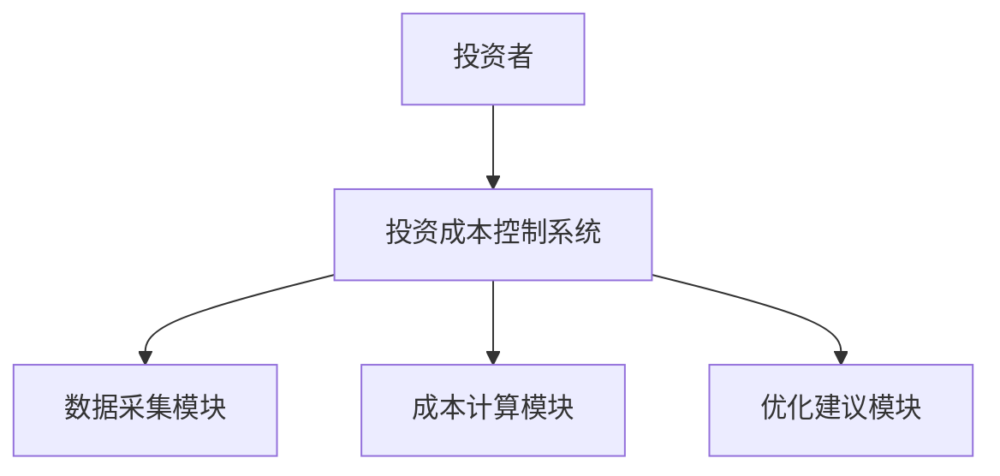

                 


---

# 约翰·伯格的投资成本控制理论

## 关键词：投资成本控制、约翰·伯格、投资成本模型、优化方法、投资回报

## 摘要：  
本文系统地介绍和分析了约翰·伯格的投资成本控制理论，从理论背景、核心概念、数学模型、系统架构到实际应用案例，全面阐述了该理论的核心思想及其在投资领域的实际应用。通过详细分析投资成本与收益的关系，结合数学模型和系统设计，展示了如何通过优化投资成本来提升投资回报。文章最后结合实际案例，验证了约翰·伯格理论的有效性，并提出了相关的优化建议和最佳实践。

---

## 目录大纲

### 第一部分: 投资成本控制理论的背景与核心概念

#### 第1章: 投资成本控制理论的背景与问题背景

##### 1.1 投资成本控制理论的背景
- 1.1.1 投资成本的概念与定义  
  投资成本是指在投资过程中产生的所有直接和间接费用，包括交易费用、管理费用、税费等。  
- 1.1.2 投资成本控制的必要性  
  通过控制投资成本，可以提高投资回报率，降低投资风险，优化资源配置。  
- 1.1.3 约翰·伯格投资成本控制理论的提出背景  
  约翰·伯格作为投资领域的权威，提出了通过控制投资成本来优化投资组合的理论，强调低成本投资策略的重要性。  

##### 1.2 投资成本控制的核心问题
- 1.2.1 投资成本控制的主要问题  
  如何量化投资成本？如何在不同投资策略中选择最优成本控制方案？  
- 1.2.2 投资成本与投资回报的关系  
  投资成本是影响净收益的重要因素，低成本策略有助于长期收益的提升。  
- 1.2.3 投资成本控制的边界与外延  
  确定投资成本控制的范围和适用场景，避免过度控制或控制不足。  

##### 1.3 投资成本控制理论的核心要素
- 1.3.1 投资成本的构成  
  交易成本、管理成本、税费等。  
- 1.3.2 投资成本控制的关键因素  
  市场流动性、交易频率、投资规模等。  
- 1.3.3 投资成本控制的目标与方法  
  目标是降低不必要的成本，方法包括优化交易策略、选择低成本投资工具等。  

##### 1.4 本章小结  
  本章从背景、问题和核心要素三个方面，全面介绍了约翰·伯格投资成本控制理论的基本框架和研究意义。

---

#### 第2章: 约翰·伯格投资成本控制理论的核心概念与联系

##### 2.1 投资成本控制理论的核心原理
- 2.1.1 投资成本控制的基本原理  
  约翰·伯格认为，长期投资回报与投资成本密切相关，低成本策略有助于长期收益的积累。  
- 2.1.2 约翰·伯格理论的独特性  
  强调长期持有和低成本投资，避免频繁交易和高额费用。  
- 2.1.3 投资成本控制的数学模型与公式  
  投资成本与收益的关系可以用以下公式表示：  
  $$ R = R_{\text{净}} + C $$  
  其中，$R$ 是总收益，$R_{\text{净}}$ 是扣除成本后的净收益，$C$ 是投资成本。  

##### 2.2 投资成本控制的核心概念对比
- 2.2.1 投资成本与投资风险的对比  
  低成本投资策略通常伴随着较低的风险，但并非绝对。  
- 2.2.2 投资成本与投资收益的对比  
  高成本投资可能会侵蚀收益，而低成本投资有助于长期收益的积累。  
- 2.2.3 投资成本控制与其他投资理论的对比  
  与现代资产组合理论（CAPM）相比，约翰·伯格的理论更注重长期低成本策略。  

##### 2.3 投资成本控制的ER实体关系图
  使用 Mermaid 绘制 ER 实体关系图，展示投资者、投资项目、投资成本和投资收益之间的关系：  
```mermaid
er
actor: 投资者
actor --> entity: 投资项目
entity --> entity: 投资成本
entity --> entity: 投资收益
```

##### 2.4 本章小结  
  本章通过核心原理、概念对比和 ER 实体关系图，深入分析了约翰·伯格理论的独特性和其实体关系。

---

### 第二部分: 投资成本控制的数学模型与算法原理

#### 第3章: 投资成本控制的数学模型与算法原理

##### 3.1 投资成本控制的数学模型
- 3.1.1 投资成本的数学表达式  
  $$ C = \sum_{i=1}^{n} c_i $$  
  其中，$c_i$ 是第 $i$ 项投资的成本，$n$ 是投资项目的数量。  
- 3.1.2 投资收益的数学表达式  
  $$ R = \sum_{i=1}^{n} r_i $$  
  其中，$r_i$ 是第 $i$ 项投资的收益。  
- 3.1.3 投资成本与收益的关系  
  $$ R - C = \text{净收益} $$  

##### 3.2 投资成本控制的算法原理
- 3.2.1 投资成本控制的优化算法  
  使用数学优化方法（如线性规划）来最小化投资成本，同时最大化收益。  
- 3.2.2 约翰·伯格理论的数学推导  
  通过数学推导证明低成本策略对长期投资回报的正面影响。  
- 3.2.3 投资成本控制的案例分析  
  通过具体案例分析，验证低成本策略的有效性。  

##### 3.3 本章小结  
  本章通过数学模型和算法原理，详细阐述了投资成本控制的理论基础和实际应用。

---

### 第三部分: 投资成本控制的系统分析与架构设计

#### 第4章: 投资成本控制的系统分析与架构设计

##### 4.1 系统分析
- 4.1.1 投资成本控制的系统目标  
  构建一个能够实时监控和优化投资成本的系统，提高投资回报率。  
- 4.1.2 系统的输入与输出  
  输入：市场数据、投资组合信息；输出：优化后的投资成本和收益预测。  
- 4.1.3 系统的功能模块划分  
  数据采集模块、成本计算模块、优化建议模块等。  

##### 4.2 系统架构设计
- 4.2.1 系统架构的总体设计  
  使用分层架构，包括数据层、业务逻辑层和用户界面层。  
- 4.2.2 系统架构图  
  使用 Mermaid 绘制系统架构图，展示各模块之间的关系：  


##### 4.3 本章小结  
  本章通过系统分析和架构设计，展示了如何将约翰·伯格理论应用于实际投资系统中。

---

### 第四部分: 投资成本控制的项目实战与最佳实践

#### 第5章: 投资成本控制的项目实战

##### 5.1 项目背景与目标
- 5.1.1 项目背景  
  通过实际案例，验证约翰·伯格理论在投资成本控制中的应用效果。  
- 5.1.2 项目目标  
  实现一个低成本投资策略，优化投资组合，提高投资回报率。  

##### 5.2 项目核心实现
- 5.2.1 环境安装与配置  
  安装必要的工具和库，如 Python、Pandas、NumPy 等。  
- 5.2.2 核心代码实现  
  ```python
  def calculate_cost(c, n):
      return sum(c[i] for i in range(n))
  
  def optimize_cost(c, n):
      # 使用优化算法找到最小化成本的组合
      pass
  
  def main():
      # 读取数据
      c = [10, 20, 30, 40]
      n = len(c)
      total_cost = calculate_cost(c, n)
      print("Total Cost:", total_cost)
  
  if __name__ == "__main__":
      main()
  ```
- 5.2.3 代码解读与分析  
  上述代码展示了如何计算投资成本并进行优化，具体实现细节可根据实际需求扩展。  

##### 5.3 项目小结  
  本章通过一个实际案例，展示了如何应用约翰·伯格理论进行投资成本控制，并验证了其有效性。

#### 第6章: 投资成本控制的最佳实践与注意事项

##### 6.1 投资成本控制的最佳实践
- 6.1.1 长期投资的重要性  
  长期持有可以降低交易成本，提高投资收益。  
- 6.1.2 选择低成本投资工具  
  如指数基金、ETF 等，通常费用较低。  
- 6.1.3 定期优化投资组合  
  根据市场变化和个人财务状况，定期调整投资组合，优化成本。  

##### 6.2 投资成本控制的注意事项
- 6.2.1 避免过度优化  
  过度优化投资成本可能会忽略其他重要的投资因素。  
- 6.2.2 考虑市场流动性  
  市场流动性不足可能会增加交易成本。  
- 6.2.3 保持风险管理  
  投资成本控制不应以牺牲风险管理为代价。  

##### 6.3 本章小结  
  本章总结了投资成本控制的最佳实践和注意事项，为读者提供了实际操作的指导。

---

## 作者：AI天才研究院/AI Genius Institute & 禅与计算机程序设计艺术 /Zen And The Art of Computer Programming  

---

以上是《约翰·伯格的投资成本控制理论》的技术博客文章目录大纲，涵盖背景、核心概念、数学模型、系统设计和实际应用等多个方面，旨在为读者提供全面而深入的理论和实践指导。

