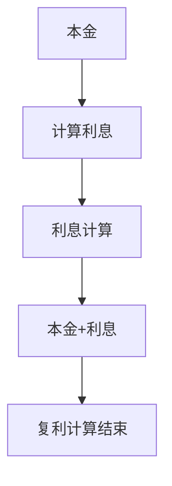
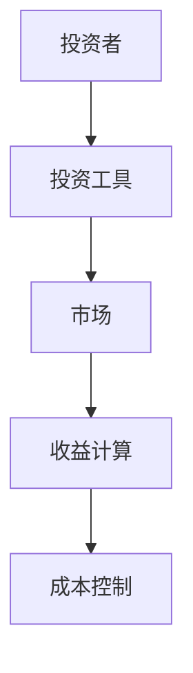

                 


# 约翰·伯格的投资成本控制：复利的力量

> 关键词：复利，投资成本，约翰·伯格，财富增长，指数投资

> 摘要：本文探讨了复利在投资中的强大作用，以及如何通过成本控制来优化复利效应。通过分析约翰·伯格的投资理念，我们揭示了复利的核心原理、数学模型及其在实际投资中的应用。本文还详细介绍了如何通过降低投资成本、选择合适的投资工具和长期持有策略，来最大化复利的效果，帮助投资者实现财富的指数增长。

---

# 第1章: 复利的基本概念与历史发展

## 1.1 复利的定义与特点

### 1.1.1 复利的定义
复利，又称“利滚利”，是指在一定时间段内，将本金和之前累计的利息一并作为新的本金，继续计算利息的过程。复利的核心在于将收益再投资，从而实现财富的指数增长。

### 1.1.2 复利的核心特点
复利具有以下特点：
- **时间的幂律效应**：复利的增长速度随着时间和本金的增加呈指数级增长。
- **成本的侵蚀效应**：投资成本会显著降低复利的效果，因此成本控制至关重要。
- **长期性**：复利的效果在长期内更加明显，适合长期投资。

### 1.1.3 复利与单利的对比
| 对比维度 | 单利 | 复利 |
|----------|------|------|
| 计算方式 | 仅计算本金的利息 | 计算本金及累计利息的利息 |
| 增长速度 | 线性增长 | 指数增长 |
| 应用场景 | 短期投资 | 长期投资 |

## 1.2 约翰·伯格的投资理念

### 1.2.1 约翰·伯格的生平简介
约翰·伯格（John C. Bogle）是美国著名投资家， Vanguard 集团的创始人。他以倡导低成本指数投资而闻名，强调长期投资和分散投资的重要性。

### 1.2.2 伯格的投资哲学
伯格的核心投资理念包括：
- **长期投资**：避免频繁交易，减少成本。
- **分散投资**：通过分散投资降低风险。
- **低成本投资**：选择管理费低、交易成本低的投资工具。

### 1.2.3 成本控制在投资中的重要性
伯格认为，投资成本是影响复利效果的重要因素。高昂的投资成本会显著侵蚀复利收益，因此降低成本是实现财富增长的关键。

## 1.3 复利在投资中的应用

### 1.3.1 复利的数学模型
复利的数学模型可以表示为：
$$ A = P \times (1 + r)^n $$
其中，\( A \) 为终值，\( P \) 为本金，\( r \) 为年利率，\( n \) 为投资年数。

### 1.3.2 复利的历史发展
复利的概念最早可以追溯到古希腊和古罗马时期，但其在投资领域的广泛应用始于20世纪。伯格的低成本投资理念进一步推动了复利在现代投资中的应用。

### 1.3.3 复利与财富增长的关系
复利通过时间的积累，将小量的投资收益转化为巨大的财富增长。伯格的实践证明，低成本投资策略能够最大化复利的效果。

---

# 第2章: 复利的数学模型与算法原理

## 2.1 复利的计算公式

### 2.1.1 复利的基本公式
复利的基本公式为：
$$ A = P \times (1 + r)^n $$

### 2.1.2 复利的年金公式
年金公式用于计算定期投资的终值：
$$ A = P \times \frac{(1 + r)^n - 1}{r} $$

## 2.2 复利的算法实现

### 2.2.1 复利计算的流程图


### 2.2.2 复利计算的Python代码
```python
def compound_interest(principal, rate, years):
    return principal * (1 + rate) ** years

# 示例计算
P = 1000
r = 0.05
n = 10
print(compound_interest(P, r, n))
```

## 2.3 复利的数学模型与公式推导

### 2.3.1 复利的指数增长模型
复利的指数增长模型可以表示为：
$$ A = P \times e^{rt} $$

### 2.3.2 复利的连续复利公式
连续复利的公式为：
$$ A = P \times e^{rt} $$

---

# 第3章: 投资成本控制与复利优化

## 3.1 投资成本的构成与影响

### 3.1.1 投资成本的构成
投资成本包括交易费用、管理费用、税费等。

### 3.1.2 成本对复利的影响
高昂的投资成本会显著侵蚀复利收益，降低投资回报。

### 3.1.3 成本控制的策略
选择低成本投资工具、减少交易频率、长期持有是降低成本的有效策略。

## 3.2 成本控制的策略

### 3.2.1 选择低成本投资工具
指数基金和ETF是低成本投资的典型代表。

### 3.2.2 减少交易频率
频繁交易会增加交易成本，降低复利效果。

### 3.2.3 长期持有与定投
长期持有和定期定额投资能够最大化复利的效果。

---

# 第4章: 系统分析与架构设计

## 4.1 系统功能设计

### 4.1.1 投资成本控制的系统分析
通过系统分析，我们可以更好地理解复利与成本控制之间的关系。

### 4.1.2 系统架构设计
使用Mermaid架构图展示系统的各个模块。

## 4.2 系统架构设计

### 4.2.1 系统架构图


---

# 第5章: 项目实战

## 5.1 环境安装

### 5.1.1 投资工具的选择
选择低成本的指数基金或ETF。

## 5.2 系统核心实现源代码

### 5.2.1 复利计算的Python代码
```python
def compound_interest(principal, rate, years):
    return principal * (1 + rate) ** years

# 示例计算
P = 1000
r = 0.05
n = 10
print(compound_interest(P, r, n))
```

## 5.3 实际案例分析

### 5.3.1 投资成本对复利的影响
通过实际案例分析，我们可以看到成本控制对复利效果的显著影响。

---

# 第6章: 最佳实践与小结

## 6.1 最佳实践 tips

### 6.1.1 选择低成本投资工具
指数基金和ETF是理想的选择。

### 6.1.2 长期持有与定投
避免频繁交易，坚持长期投资。

### 6.1.3 定期审视投资组合
确保投资组合的风险和收益匹配。

## 6.2 小结

### 6.2.1 复利的核心作用
复利是投资增长的核心动力。

### 6.2.2 成本控制的重要性
低成本策略能够最大化复利的效果。

---

作者：AI天才研究院/AI Genius Institute & 禅与计算机程序设计艺术 /Zen And The Art of Computer Programming

