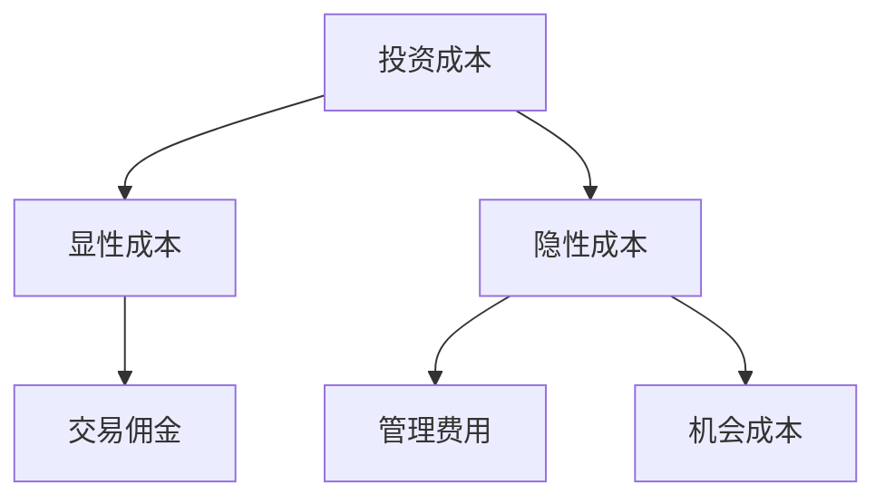

                 

# 约翰·伯格的投资成本控制：应对隐性费用上升的挑战

## 关键词：投资成本控制，隐性费用，约翰·伯格，风险管理，优化策略

## 摘要：  
本文深入探讨了投资成本控制的重要性，尤其是在隐性费用不断上升的背景下。通过分析约翰·伯格的投资理念和方法，结合实际案例，提出了应对隐性费用挑战的核心策略和工具。文章从理论到实践，系统地介绍了如何识别、量化和优化隐性费用，帮助投资者在复杂多变的市场环境中实现可持续的投资回报。

---

# 第一部分: 投资成本控制概述

## 第1章: 投资成本控制的背景与概念

### 1.1 投资成本控制的重要性

#### 1.1.1 投资成本的基本概念  
投资成本是指投资者在进行投资活动时所产生的一切费用，包括显性成本和隐性成本。显性成本是直接可量化的费用，如交易佣金、税费等；而隐性成本则是间接或难以量化的费用，如管理费用、机会成本、时间成本等。隐性成本往往被投资者忽视，但其对投资回报的影响不容小觑。

#### 1.1.2 投资成本控制的必要性  
在当前金融市场中，显性成本的透明化和可控性较高，而隐性成本的复杂性和隐蔽性使其成为投资成本控制的难点。随着市场波动加剧和竞争加剧，隐性成本的上升趋势对企业投资决策提出了更高的要求。如何有效控制隐性成本，已成为投资者提升投资效率和竞争力的关键。

#### 1.1.3 隐性费用的定义与特征  
隐性费用是指在投资过程中产生的间接费用，通常不直接反映在财务报表中。其特征包括隐蔽性、累积性、动态性和关联性。隐性费用的隐蔽性使其难以被及时发现，而其累积性和动态性则要求投资者具备前瞻性的管理能力。

---

### 1.2 约翰·伯格的投资理念

#### 1.2.1 约翰·伯格的生平简介  
约翰·伯格是全球知名的投资专家，以其独特的投资理念和实践成果闻名。他强调长期投资、分散投资和成本控制的重要性，主张通过降低隐性成本来提高投资组合的整体回报。

#### 1.2.2 伯格的投资成本控制理论  
伯格认为，隐性成本是投资成本控制的核心难点。他提出了“隐性成本最小化”理论，强调通过优化投资流程、分散投资组合和降低管理费用来实现隐性成本的有效控制。

#### 1.2.3 隐性费用对企业投资的影响  
隐性费用对企业投资的影响主要体现在以下几个方面：  
1. **降低投资回报**：隐性费用的累积效应会侵蚀投资收益。  
2. **增加决策难度**：隐性费用的隐蔽性和动态性增加了投资决策的复杂性。  
3. **影响风险管理**：隐性费用的波动性可能引发潜在风险，影响投资组合的稳定性。

---

### 1.3 当前投资环境中的隐性费用挑战

#### 1.3.1 隐性费用的分类与表现形式  
隐性费用可以分为以下几类：  
- **管理费用**：包括基金管理费、托管费等。  
- **机会成本**：由于资金被投资所占用而失去的其他投资机会的成本。  
- **时间成本**：由于投资决策延迟或资金周转不畅而产生的成本。  

#### 1.3.2 经济环境变化对隐性费用的影响  
经济波动、政策变化和市场结构的调整都会对隐性费用产生影响。例如，经济下行周期中，企业融资难度增加，隐性费用也随之上升。此外，金融市场的竞争加剧也会推高隐性费用。

#### 1.3.3 投资者如何应对隐性费用上升的挑战  
应对隐性费用上升的挑战，投资者需要采取以下策略：  
1. **优化投资流程**：通过自动化和信息化手段降低管理成本。  
2. **分散投资风险**：通过多元化投资降低隐性费用的影响。  
3. **加强成本监控**：定期评估隐性费用的变化，及时调整投资策略。

---

## 第2章: 投资成本控制的核心概念与框架

### 2.1 投资成本构成的系统分析

#### 2.1.1 显性成本与隐性成本的对比  
| 成本类型 | 显性成本 | 隐性成本 |
|----------|----------|----------|
| 定义     | 直接可量化的成本 | 间接、难以量化的成本 |
| 示例     | 交易佣金、税费 | 管理费用、机会成本 |
| 影响     | 短期影响显著 | 长期影响深远 |

#### 2.1.2 隐性成本的主要组成部分  
- 管理费用：包括基金管理费、托管费等。  
- 交易成本：包括买卖价差、交易佣金等。  
- 时间成本：由于资金被占用而失去的其他投资机会的成本。  

#### 2.1.3 投资成本的系统结构图  

---

### 2.2 隐性费用的识别与量化

#### 2.2.1 隐性费用的识别方法  
1. **成本分析法**：通过分析投资组合的总成本，识别隐性费用的来源。  
2. **流程分析法**：通过梳理投资流程，发现隐性费用的潜在环节。  
3. **对比分析法**：通过对比不同投资产品的隐性费用，选择最优方案。

#### 2.2.2 隐性费用的量化指标  
- 管理费用率：管理费用占投资组合总规模的比例。  
- 交易费用率：交易费用占投资组合总交易金额的比例。  
- 机会成本率：由于资金被占用而失去的其他投资机会的潜在收益。

#### 2.2.3 隐性费用与投资决策的关系  
隐性费用直接影响投资组合的净收益，因此在投资决策中需要综合考虑隐性费用的高低和变化趋势。

---

### 2.3 投资成本控制的框架体系

#### 2.3.1 投资成本控制的目标设定  
1. **降低隐性费用**：通过优化投资流程和分散投资组合，降低隐性费用的水平。  
2. **提高投资效率**：通过减少隐性费用，提高投资组合的整体回报率。  
3. **增强风险管理能力**：通过监控隐性费用的变化，增强投资组合的抗风险能力。

#### 2.3.2 投资成本控制的实施步骤  
1. **成本分析**：识别和量化隐性费用的主要来源。  
2. **制定目标**：设定隐性费用的控制目标。  
3. **优化策略**：通过分散投资、优化流程等方法实现隐性费用的降低。  
4. **监控与调整**：定期评估隐性费用的变化，及时调整投资策略。

#### 2.3.3 投资成本控制的反馈机制  
- 建立成本监控系统，定期评估隐性费用的变化。  
- 根据评估结果，调整投资策略和优化流程。  
- 定期与行业基准进行对比，确保隐性费用控制在合理范围内。

---

## 第3章: 投资成本控制的算法与数学模型

### 3.1 投资成本控制的数学模型

#### 3.1.1 成本-收益分析模型  
成本-收益分析模型用于评估投资项目的可行性和收益潜力。其公式为：  
$$ \text{净收益} = \text{总收益} - \text{总成本} $$  
其中，总成本包括显性成本和隐性成本。

#### 3.1.2 隐性成本的预测模型  
隐性成本的预测模型可以通过历史数据分析和趋势分析来建立。常用的模型包括线性回归模型和时间序列模型。  
例如，使用线性回归模型预测隐性费用的变化趋势：  
$$ \text{隐性费用} = a + bt $$  
其中，\( t \) 表示时间，\( a \) 和 \( b \) 是模型参数。

#### 3.1.3 投资组合优化模型  
投资组合优化模型用于在隐性费用和风险之间找到最佳平衡点。常用的模型包括均值-方差模型和风险中性模型。  
例如，均值-方差模型的目标是最小化投资组合的波动性，同时实现预期收益：  
$$ \min \sigma^2 \quad \text{subject to} \quad \mathbb{E}[R] = R_{\text{target}} $$  

---

### 3.2 成本-收益分析模型

#### 3.2.1 模型公式  
$$ \text{净收益} = \text{总收益} - \text{总成本} $$  
其中，总成本包括显性成本和隐性成本。

#### 3.2.2 案例分析  
假设某投资者进行股票投资，总收益为 $100,000，显性成本为 $2,000，隐性成本为 $3,000。则净收益为：  
$$ \text{净收益} = 100,000 - (2,000 + 3,000) = 95,000 $$  

---

### 3.3 隐性成本的预测模型

#### 3.3.1 线性回归模型  
$$ \text{隐性费用} = a + bt $$  
其中，\( t \) 表示时间，\( a \) 和 \( b \) 是模型参数。

#### 3.3.2 时间序列模型  
时间序列模型可以用于预测隐性费用的未来变化。例如，使用ARIMA模型预测隐性费用的波动性。

---

## 第4章: 投资成本控制的系统化管理与工具

### 4.1 系统化管理的实现步骤

#### 4.1.1 投资流程优化  
通过自动化和信息化手段优化投资流程，降低隐性费用。例如，使用智能投顾系统进行投资决策和风险管理。

#### 4.1.2 成本监控体系  
建立成本监控体系，实时跟踪隐性费用的变化。例如，使用大数据分析技术监控隐性费用的波动。

#### 4.1.3 绩效评估机制  
建立绩效评估机制，定期评估隐性费用的控制效果。例如，使用KPI指标评估隐性费用的变化。

---

### 4.2 成本分析工具

#### 4.2.1 成本-收益分析工具  
使用成本-收益分析工具进行投资决策。例如，使用Excel进行成本-收益分析。

#### 4.2.2 数据可视化工具  
使用数据可视化工具（如Tableau）进行隐性费用的可视化分析。

#### 4.2.3 风险管理工具  
使用风险管理工具（如风险评估软件）进行隐性费用的风险评估。

---

## 第5章: 项目实战与总结

### 5.1 项目实战

#### 5.1.1 项目背景与需求分析  
某企业计划进行股票投资，希望通过优化投资流程降低隐性费用。

#### 5.1.2 投资策略制定  
1. 选择分散投资策略，降低隐性费用。  
2. 使用智能投顾系统优化投资流程。

#### 5.1.3 实施与监控  
1. 实施投资流程优化，降低隐性费用。  
2. 定期监控隐性费用的变化，及时调整投资策略。

---

### 5.2 总结

#### 5.2.1 核心观点回顾  
1. 投资成本控制是提高投资回报的关键。  
2. 隐性费用是投资成本控制的核心难点。  
3. 通过系统化管理和优化策略，可以有效降低隐性费用。

#### 5.2.2 对读者的启示  
投资者需要关注隐性费用的变化，通过优化投资流程和分散投资组合，实现投资成本的有效控制。

#### 5.2.3 未来研究方向  
1. 隐性费用的动态预测模型。  
2. 人工智能技术在投资成本控制中的应用。

---

## 作者：AI天才研究院/AI Genius Institute & 禅与计算机程序设计艺术 /Zen And The Art of Computer Programming

