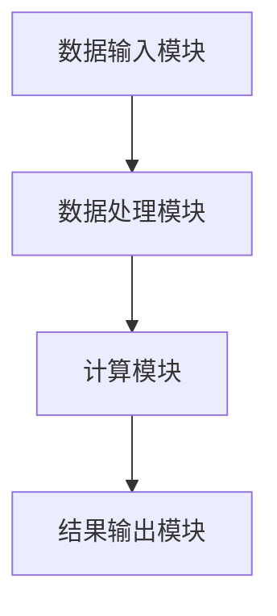

                 


# 约翰·伯格的投资成本计算方法

> 关键词：投资成本计算，约翰·伯格，投资成本模型，系统架构设计，项目实战

> 摘要：本文详细介绍了约翰·伯格的投资成本计算方法，从基本概念到数学模型，再到系统架构设计和项目实战，全面解析该方法的原理和应用。文章还结合实际案例，展示了该方法在投资决策中的实际应用，并提出了优化建议和最佳实践。

---

# 第1章: 投资成本的基本概念

## 1.1 投资成本的定义与分类

### 1.1.1 投资成本的定义
投资成本是指在投资过程中所涉及的所有费用和资源的总和。它包括了从初始投入的资金到后续维护和管理的所有支出。投资成本的计算对于评估投资项目的可行性和盈利能力至关重要。

### 1.1.2 投资成本的分类
投资成本可以分为以下几类：
- **初始成本**：指投资项目在启动阶段所需的一次性支出，如设备购置、场地租赁等。
- **运营成本**：指项目在运行过程中所产生的持续性支出，如人工成本、维护费用等。
- **机会成本**：指由于选择某一投资项目而放弃其他投资机会所造成的潜在损失。
- **风险成本**：指由于投资项目的不确定性而可能产生的额外成本。

### 1.1.3 投资成本的重要性
投资成本的计算直接关系到投资项目的盈利能力分析。准确的投资成本计算可以帮助投资者做出更明智的决策，避免资源浪费和财务风险。

---

## 1.2 约翰·伯格投资成本计算方法的背景

### 1.2.1 约翰·伯格的生平简介
约翰·伯格（John Bogle）是投资界的重要人物，他创立了 Vanguard 集团，并提出了指数基金的概念。他的投资理念强调长期稳健的投资策略和低成本运作。

### 1.2.2 投资成本计算方法的提出背景
在投资领域，成本是影响投资回报率的重要因素。传统的投资分析方法往往忽略了投资成本的复杂性和多样性，导致分析结果不够准确。约翰·伯格的投资成本计算方法旨在解决这一问题，提供一种更全面的成本评估方法。

### 1.2.3 方法的实际应用场景
该方法广泛应用于股票投资、房地产投资、项目投资等领域，帮助投资者更准确地评估投资项目的成本和收益。

---

## 1.3 投资成本计算的核心要素

### 1.3.1 投资成本的构成要素
投资成本的构成要素包括：
- 初始投资
- 融资成本
- 维护成本
- 人员成本
- 税费支出

### 1.3.2 关键变量的定义与选择
关键变量的选择是投资成本计算的核心。常见的关键变量包括：
- 投资金额
- 投资期限
- 利率
- 通货膨胀率

### 1.3.3 投资成本计算的边界条件
边界条件是指在计算过程中需要考虑的限制条件，如投资期限、市场波动范围等。明确的边界条件有助于提高计算的准确性和可操作性。

---

## 1.4 本章小结
本章介绍了投资成本的基本概念、约翰·伯格投资成本计算方法的背景以及核心要素。通过这些内容，读者可以对投资成本计算的重要性和基本框架有清晰的理解。

---

# 第2章: 投资成本计算的核心原理

## 2.1 投资成本计算的基本公式

### 2.1.1 投资成本计算的数学模型
投资成本计算的数学模型可以表示为：
$$ \text{总成本} = \text{初始成本} + \text{运营成本} + \text{风险成本} $$

### 2.1.2 核心公式的推导过程
通过分析投资成本的各个组成部分，我们可以推导出以下公式：
$$ \text{总成本} = C_0 + C_1 \times t + C_2 \times r $$
其中：
- \( C_0 \) 是初始成本
- \( C_1 \) 是单位时间的运营成本
- \( t \) 是时间
- \( C_2 \) 是风险成本系数
- \( r \) 是风险因素

### 2.1.3 公式中的变量解释
- 初始成本 \( C_0 \)：指投资项目启动时的一次性支出。
- 运营成本 \( C_1 \)：指项目在运行过程中产生的持续性支出。
- 风险成本系数 \( C_2 \)：反映投资项目的潜在风险对成本的影响。

---

## 2.2 投资成本计算的步骤与流程

### 2.2.1 数据收集与处理
1. 收集初始成本、运营成本和风险成本的相关数据。
2. 对数据进行清洗和归一化处理。

### 2.2.2 公式应用的逻辑流程
1. 确定各个成本的数值。
2. 将数值代入公式进行计算。
3. 对计算结果进行验证和调整。

### 2.2.3 结果验证与调整
- 通过对比实际数据和计算结果，验证公式的准确性。
- 根据验证结果调整公式中的参数。

---

## 2.3 投资成本计算的注意事项

### 2.3.1 数据准确性的重要性
准确的数据是投资成本计算的基础。任何数据误差都会影响最终结果。

### 2.3.2 边界条件的处理
在计算过程中，需要明确边界条件，避免超出合理范围的假设。

### 2.3.3 计算结果的解释
计算结果需要结合实际背景进行解释，才能为投资决策提供有效的参考。

---

## 2.4 本章小结
本章详细讲解了投资成本计算的基本公式和步骤，强调了数据准确性和边界条件的重要性。通过本章的学习，读者可以掌握投资成本计算的核心原理。

---

# 第3章: 投资成本计算的数学模型与公式

## 3.1 投资成本计算的数学模型

### 3.1.1 线性回归模型
线性回归模型可以用来预测投资成本的变化趋势：
$$ y = a + bx $$
其中：
- \( y \) 是投资成本
- \( a \) 是截距
- \( b \) 是斜率
- \( x \) 是时间

### 3.1.2 时间序列分析
时间序列分析可以用于分析投资成本的历史数据，预测未来的成本趋势：
$$ \text{未来成本} = \text{当前成本} \times (1 + \text{增长率}) $$

### 3.1.3 非线性模型的应用
对于复杂的投资成本问题，可以采用非线性模型进行分析：
$$ y = f(x) $$
其中 \( f(x) \) 是非线性函数。

---

## 3.2 核心公式的详细推导

### 3.2.1 投资成本计算的核心公式
$$ \text{总成本} = C_0 + C_1 \times t + C_2 \times r $$

### 3.2.2 公式的数学推导过程
通过分析投资成本的各个组成部分，我们可以推导出上述公式。初始成本 \( C_0 \) 是一次性的支出，运营成本 \( C_1 \times t \) 是随着时间推移的持续支出，风险成本 \( C_2 \times r \) 是风险因素对成本的影响。

---

## 3.3 投资成本计算的数学模型示例

### 3.3.1 示例1：简单线性模型
假设初始成本为 $1000，运营成本每年增加 $100，投资期限为5年。总成本计算如下：
$$ \text{总成本} = 1000 + 100 \times 5 = 1500 $$

### 3.3.2 示例2：复杂非线性模型
假设风险成本系数为0.05，风险因素为20%，投资成本计算如下：
$$ \text{总成本} = 1000 + 100 \times 5 + 0.05 \times 20 = 1510 $$

---

## 3.4 本章小结
本章通过数学模型和公式，详细讲解了投资成本计算的方法。通过示例分析，读者可以更好地理解公式的应用和实际意义。

---

# 第4章: 投资成本计算的系统架构设计

## 4.1 系统架构概述

### 4.1.1 系统功能模块划分
- 数据输入模块：接收初始成本、运营成本和风险成本等数据。
- 数据处理模块：对数据进行清洗和归一化处理。
- 计算模块：应用投资成本计算公式进行计算。
- 结果输出模块：展示计算结果并生成报告。

### 4.1.2 模块之间的关系
数据输入模块 -> 数据处理模块 -> 计算模块 -> 结果输出模块。

### 4.1.3 系统的整体架构图


---

## 4.2 数据流与信息处理流程

### 4.2.1 数据输入与处理
1. 用户输入初始成本、运营成本和风险成本。
2. 系统对输入数据进行清洗和归一化处理。

### 4.2.2 计算过程的流程化
1. 数据处理模块将数据传递给计算模块。
2. 计算模块应用公式进行计算。
3. 计算结果返回给结果输出模块。

### 4.2.3 结果输出与反馈
1. 结果输出模块展示计算结果。
2. 用户可以根据反馈进行调整。

---

## 4.3 系统架构的优化建议

### 4.3.1 模块化设计的优势
模块化设计使得系统易于维护和扩展。

### 4.3.2 系统扩展性设计
通过模块化设计，可以方便地添加新的功能模块。

### 4.3.3 系统性能优化
通过并行计算和缓存优化，可以提高系统的计算效率。

---

## 4.4 本章小结
本章详细描述了投资成本计算系统的架构设计，包括功能模块划分、数据流与信息处理流程以及系统优化建议。通过本章的学习，读者可以掌握系统设计的基本方法。

---

# 第5章: 投资成本计算的项目实战

## 5.1 项目背景与目标

### 5.1.1 项目背景介绍
本项目旨在通过约翰·伯格的投资成本计算方法，评估一个股票投资项目的可行性。

### 5.1.2 项目目标设定
- 计算项目的总成本。
- 分析成本的构成比例。
- 提出优化成本的建议。

---

## 5.2 环境安装与配置

### 5.2.1 安装Python
安装Python 3.8或更高版本。

### 5.2.2 安装必要的库
安装numpy和pandas库：
```bash
pip install numpy pandas
```

---

## 5.3 系统核心实现源代码

### 5.3.1 数据输入模块
```python
# 数据输入模块
def input_data():
    C0 = float(input("请输入初始成本："))
    C1 = float(input("请输入单位时间的运营成本："))
    t = int(input("请输入时间："))
    C2 = float(input("请输入风险成本系数："))
    r = float(input("请输入风险因素："))
    return C0, C1, t, C2, r
```

### 5.3.2 数据处理模块
```python
# 数据处理模块
def data_processing(C0, C1, t, C2, r):
    import pandas as pd
    data = {'C0': [C0], 'C1': [C1], 't': [t], 'C2': [C2], 'r': [r]}
    df = pd.DataFrame(data)
    return df
```

### 5.3.3 计算模块
```python
# 计算模块
def calculate_cost(C0, C1, t, C2, r):
    total_cost = C0 + C1 * t + C2 * r
    return total_cost
```

### 5.3.4 结果输出模块
```python
# 结果输出模块
def output_result(total_cost):
    print("投资总成本为：", total_cost)
```

---

## 5.4 代码应用解读与分析

### 5.4.1 代码功能模块解读
- `input_data`：接收用户输入的数据。
- `data_processing`：对数据进行处理和存储。
- `calculate_cost`：应用投资成本计算公式进行计算。
- `output_result`：展示计算结果。

### 5.4.2 代码实现的注意事项
- 数据输入时需要确保数据类型正确。
- 计算过程中需要注意数值精度。

---

## 5.5 实际案例分析

### 5.5.1 案例背景
假设我们有一个股票投资项目，初始成本为 $1000，单位时间的运营成本为 $100，投资时间为5年，风险成本系数为0.05，风险因素为20%。

### 5.5.2 计算过程
1. 数据输入：
   - C0 = 1000
   - C1 = 100
   - t = 5
   - C2 = 0.05
   - r = 20%

2. 计算总成本：
   $$ \text{总成本} = 1000 + 100 \times 5 + 0.05 \times 20 = 1510 $$

3. 结果输出：
   投资总成本为：1510

### 5.5.3 案例分析
通过计算，我们可以看到，初始成本和运营成本是主要的成本构成。风险成本的影响相对较小，但也不能忽视。

---

## 5.6 项目小结
本章通过实际案例展示了约翰·伯格投资成本计算方法的应用。通过代码实现和案例分析，读者可以更好地理解该方法的实际操作过程。

---

# 第6章: 最佳实践与小结

## 6.1 最佳实践 tips

### 6.1.1 数据准确性的重要性
确保输入数据的准确性和完整性。

### 6.1.2 边界条件的处理
在计算过程中，明确边界条件，避免超出合理范围。

### 6.1.3 结果的解释
结合实际背景，合理解释计算结果，为投资决策提供参考。

---

## 6.2 小结

通过本文的介绍，我们全面了解了约翰·伯格的投资成本计算方法。从基本概念到数学模型，再到系统架构设计和项目实战，我们详细讲解了该方法的各个方面。通过实际案例的分析，我们验证了该方法的有效性和实用性。

---

# 作者：AI天才研究院 & 禅与计算机程序设计艺术

---

通过本文的学习，读者可以掌握约翰·伯格投资成本计算方法的核心内容，并能够在实际投资中应用该方法进行成本评估和决策分析。

