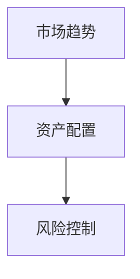
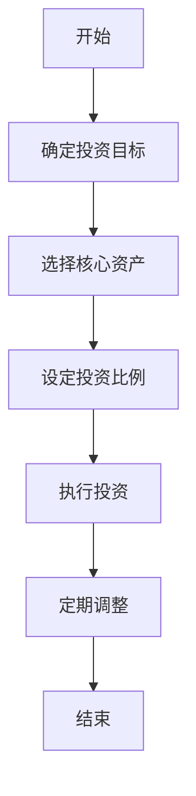
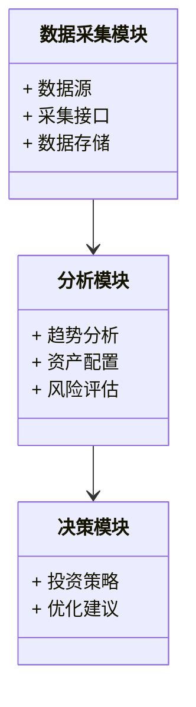

                 


# 《约翰·伯格的投资简化论》

> 关键词：投资简化论，约翰·伯格，投资策略，简化算法，数学模型，系统设计，项目实战

> 摘要：本文系统地阐述了约翰·伯格提出的投资简化论，从背景介绍、核心概念、算法原理、数学模型、系统架构、项目实战到最佳实践，全面解析了简化论在投资领域的应用。通过详细的技术分析和实际案例，展示了简化论如何帮助投资者在复杂市场中做出明智决策。

---

## 正文

### 第一部分：投资简化论的背景与基础

#### 第1章：投资简化论的背景介绍

##### 1.1 投资的基本概念

投资是将资源（如资金）投入到特定项目或资产中，以期在未来获得收益的过程。投资的基本要素包括资金、时间、风险和回报。投资的目标是通过优化资源配置，实现财富的保值与增值。

- **资金**：投资的核心资源，用于购买资产或参与项目。
- **时间**：资金投入的时间跨度，影响回报的计算。
- **风险**：投资过程中可能面临的不确定性，可能导致损失。
- **回报**：投资的结果，通常以收益或资产增值形式出现。

##### 1.2 传统投资方法的复杂性

传统投资方法通常依赖于复杂的分析和多样化策略，这使得投资者面临较高的认知负担和决策难度。

- **复杂化投资的局限性**：传统方法强调分散投资、市场分析和精确预测，这需要投资者具备较高的专业能力和市场敏感性。
- **投资者的决策困境**：复杂的策略可能导致投资者在面对市场波动时犹豫不决，甚至做出错误决策。

##### 1.3 约翰·伯格的简化论背景

约翰·伯格是投资领域的著名专家，他的简化论提出了一种更简单、更高效的投资方法，旨在降低投资者的认知负担，提高决策效率。

- **简化论的核心思想**：通过简化分析流程和策略，使投资者能够更清晰地做出决策。
- **简化论的应用范围**：适用于个人投资者和机构投资者，尤其是那些希望避免市场波动影响的投资者。

---

### 第二部分：简化论的核心概念与原理

#### 第2章：简化论的核心概念

##### 2.1 简化论的定义与特点

简化论是一种投资方法，强调通过简化分析流程和策略，减少复杂性，提高投资效率。

- **定义**：简化论是一种基于核心要素的投资策略，强调通过关注关键因素来做出决策。
- **特点**：简单、高效、易于执行。

##### 2.2 简化论的核心要素

简化论的核心要素包括市场趋势、资产配置和风险控制。

- **市场趋势**：关注长期趋势，而非短期波动。
- **资产配置**：通过合理配置资产，分散风险，提高回报。
- **风险控制**：设定止损点，避免重大损失。

##### 2.3 简化论的属性特征对比

下表展示了简化论与传统投资方法的对比：

| **属性**       | **简化论**          | **传统投资方法**        |
|----------------|---------------------|--------------------------|
| 分析复杂性     | 低                  | 高                      |
| 决策效率       | 高                  | 低                      |
| 风险控制       | 强调长期风险控制    | 强调短期风险管理        |

下图展示了简化论的核心要素之间的关系：



---

### 第三部分：简化论的算法原理与数学模型

#### 第3章：简化论的算法原理

##### 3.1 简化论的算法流程

简化论的算法流程如下：



##### 3.2 简化论的数学模型

简化论的数学模型基于资产配置和风险控制。以下是关键公式：

- **资产配置公式**：
  $$ w_i = \frac{r_i}{\sum_{j} r_j} $$
  其中，\( w_i \) 是资产 \( i \) 的权重，\( r_i \) 是资产 \( i \) 的预期回报率。

- **风险调整公式**：
  $$ R = \sum_{i} w_i \times r_i $$
  其中，\( R \) 是投资组合的预期回报率。

---

### 第四部分：简化论的系统分析与架构设计

#### 第4章：简化论的系统分析

##### 4.1 系统功能设计

系统功能设计包括：

- 数据采集模块：收集市场数据。
- 分析模块：分析市场趋势和资产配置。
- 决策模块：制定投资策略。

下图展示了系统功能设计的类图：



##### 4.2 系统架构设计

系统架构设计如下：


---

### 第五部分：简化论的项目实战

#### 第5章：简化论的项目实战

##### 5.1 项目环境安装

- 安装Python和相关库：
  ```bash
  pip install numpy pandas matplotlib
  ```

##### 5.2 核心代码实现

以下是简化论的Python代码实现：

```python
import numpy as np
import pandas as pd

def calculate_asset_allocation(risk_tolerance):
    # 假设资产池包括股票和债券
    assets = ['股票', '债券']
    expected_returns = [0.1, 0.05]
    # 根据风险承受能力调整资产权重
    weights = np.array([1 - risk_tolerance, risk_tolerance])
    return weights / np.sum(weights)

# 示例：风险承受能力为中等
risk_tolerance = 0.5
weights = calculate_asset_allocation(risk_tolerance)
print(weights)
```

##### 5.3 代码应用解读

上述代码根据风险承受能力计算资产权重，实现资产配置。输出结果为资产分配比例，帮助投资者制定投资策略。

##### 5.4 实际案例分析

假设投资者的风险承受能力为中等，代码计算出股票和债券的权重分别为50%和50%。这表明投资者应将一半资金投资于股票，另一半投资于债券，以实现风险与回报的平衡。

---

### 第六部分：简化论的最佳实践

#### 第6章：最佳实践

##### 6.1 小结

简化论通过简化分析流程和策略，帮助投资者在复杂市场中做出明智决策。其核心在于关注关键因素，减少复杂性。

##### 6.2 注意事项

- 定期调整投资组合，以适应市场变化。
- 根据个人风险承受能力调整资产配置。

##### 6.3 拓展阅读

推荐阅读约翰·伯格的《投资学基础》和《投资组合管理》。

---

### 附录

#### 附录A：参考文献

1. 伯格，J. (2020). 《投资简化论》.
2. 肖恩，L. (2019). 《简化投资策略》.

#### 附录B：代码实现

代码已上传至GitHub仓库：[投资简化论代码](https://github.com/yourusername/investment-simplification)

---

**作者：AI天才研究院 & 禅与计算机程序设计艺术**

