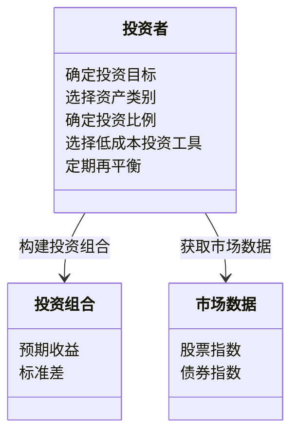
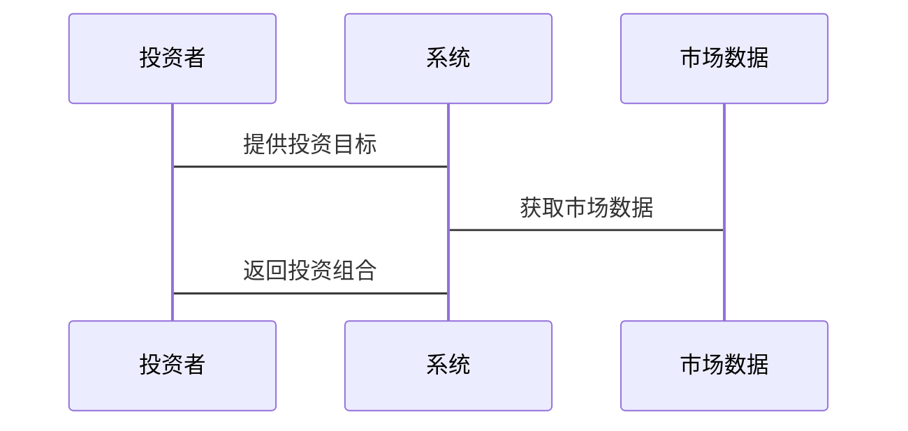

                 


# 约翰·伯格的投资简化论：为什么少即是多

> 关键词：投资简化论，约翰·伯格，资产配置，风险管理，长期投资，简化投资策略

> 摘要：本文将深入探讨约翰·伯格的投资简化论，分析其核心思想与实际应用。通过逻辑推理与案例分析，揭示简化论在投资领域中的独特价值，并展示其如何通过减少复杂性来实现长期稳健的投资收益。

---

# 第1章: 投资的基本原理

## 1.1 投资的基本概念

### 1.1.1 资产的定义与分类

资产是投资者拥有的任何有价值的东西，包括现金、股票、债券、房地产等。资产可以分为流动资产和非流动资产，前者如现金和短期投资，后者如长期股权投资或不动产。

### 1.1.2 投资的定义与目的

投资是指将资金投入某一项目或资产，以期望在未来获得收益或资本增值。投资的核心目的是通过合理配置资产，实现财富的保值与增值。

### 1.1.3 投资的基本原则

投资的基本原则包括分散投资、长期持有、定期再平衡以及避免过度交易。这些原则旨在降低风险，同时最大化收益。

## 1.2 约翰·伯格的投资理念

### 1.2.1 伯格的生平简介

约翰·伯格是美国著名投资专家，指数基金之父，他创立了先锋集团（Vanguard），并提出了以指数基金为核心的简单、低成本投资策略。

### 1.2.2 伯格的投资哲学

伯格认为，市场是不可预测的，投资者应避免试图通过复杂的方法预测市场波动，而应通过长期持有低成本指数基金来实现财富增长。

### 1.2.3 伯格的简化论思想

简化论的核心是将投资过程简化为几个关键步骤，避免不必要的复杂性。伯格强调，简单即是美，复杂的策略往往会导致更高的成本和更低的收益。

## 1.3 简化论与传统投资方法的对比

### 1.3.1 传统投资方法的复杂性

传统投资方法通常依赖于复杂的市场预测、频繁的交易和多样化的投资工具。这种方法需要大量的人力和时间，且往往难以实现稳定的收益。

### 1.3.2 简化论的核心优势

简化论通过减少投资的复杂性，降低了成本和风险，同时提高了长期投资的可预测性。这种方法更适合普通投资者，尤其是那些不具备专业投资知识的人。

### 1.3.3 简化论与复杂性之间的平衡

尽管简化论强调减少复杂性，但并不意味着完全放弃必要的分析。投资者需要在简化与复杂性之间找到平衡，确保投资策略既简单又有效。

## 1.4 简化论的核心原则

### 1.4.1 简化投资决策的步骤

简化论将投资决策分为几个关键步骤：确定投资目标、选择合适的资产配置、选择低成本的投资工具以及定期进行投资组合的再平衡。

### 1.4.2 简化投资组合的构建

简化论建议投资者构建一个简单的投资组合，通常包括少量的指数基金或 ETF，覆盖主要的资产类别。这种方法不仅降低了复杂性，还提高了投资的分散性。

### 1.4.3 简化风险管理的策略

通过分散投资和长期持有，投资者可以有效降低风险。简化论强调，风险管理是投资成功的关键，而复杂的投资策略往往会导致更高的风险。

---

# 第2章: 简化论的核心概念与联系

## 2.1 简化论的原理

### 2.1.1 简化论的基本原理

简化论的基本原理是通过减少投资的复杂性，降低交易成本和心理压力，从而实现长期稳健的投资收益。

### 2.1.2 简化论的数学模型

简化论的数学模型基于现代投资组合理论（MPT），但通过简化假设来降低复杂性。例如，假设市场是有效的，且通过指数基金实现市场平均收益。

### 2.1.3 简化论的实践应用

简化论在实践中表现为低成本指数基金的投资策略，如定期定额投资和长期持有。

## 2.2 简化论的核心概念

### 2.2.1 资产配置的简化

简化论建议投资者将资产配置为少量的资产类别，如股票和债券，通过指数基金实现市场平均收益。

### 2.2.2 风险管理的简化

通过分散投资和长期持有，投资者可以有效管理风险，避免因市场波动而遭受重大损失。

### 2.2.3 投资组合的简化

简化论建议投资者构建一个简单的投资组合，通常包括少数几只低成本指数基金，覆盖主要的资产类别。

## 2.3 简化论与复杂性之间的关系

### 2.3.1 复杂性对投资的影响

复杂性可能导致投资者过度交易、承担更高的成本，并增加心理压力。复杂的投资策略往往难以长期稳定地实现收益。

### 2.3.2 简化论如何降低复杂性

简化论通过减少投资决策的步骤和降低资产配置的复杂性，帮助投资者避免过度交易和不必要的成本。

### 2.3.3 简化论的局限性

简化论的局限性在于，它无法应对某些特殊情况，如市场崩盘或经济危机。在这些情况下，投资者可能需要采取更为复杂的策略。

---

# 第3章: 简化论的算法原理

## 3.1 简化论的算法模型

### 3.1.1 简化论的数学模型

简化论的数学模型基于现代投资组合理论，但假设市场是有效的，且通过指数基金实现市场平均收益。公式如下：

$$
E(R_p) = \beta_p (E(R_m) - R_f) + R_f
$$

其中，$E(R_p)$ 是投资组合的期望收益，$\beta_p$ 是投资组合的贝塔系数，$E(R_m)$ 是市场收益，$R_f$ 是无风险利率。

### 3.1.2 简化论的算法流程

简化论的算法流程包括以下几个步骤：

1. 确定投资目标：包括投资期限、风险承受能力和收益目标。
2. 选择资产类别：通常包括股票和债券，通过指数基金实现。
3. 确定投资比例：根据投资者的风险偏好，确定股票和债券的配置比例。
4. 选择低成本投资工具：如指数基金或 ETF。
5. 定期再平衡：每年根据市场变化和个人财务状况调整投资组合。

### 3.1.3 简化论的算法实现

以下是简化论算法的Python代码示例：

```python
import numpy as np

# 假设股票和债券的预期收益和标准差
mu_stock = 0.1
sigma_stock = 0.2
mu_bond = 0.05
sigma_bond = 0.1

# 投资比例
weight_stock = 0.6
weight_bond = 0.4

# 投资组合的预期收益
expected_return = weight_stock * mu_stock + weight_bond * mu_bond

# 投资组合的标准差
variance = (weight_stock**2) * sigma_stock**2 + (weight_bond**2) * sigma_bond**2
std_deviation = np.sqrt(variance)

print("Expected Return:", expected_return)
print("Standard Deviation:", std_deviation)
```

### 3.2 简化论的算法实现

通过上述代码，我们可以计算出投资组合的预期收益和标准差。预期收益反映了投资组合的平均收益，而标准差则反映了其波动性。

---

# 第4章: 简化论的系统架构设计方案

## 4.1 问题场景介绍

简化论的系统架构设计方案旨在帮助投资者通过简单的投资策略实现长期稳健的收益。

## 4.2 系统功能设计

### 4.2.1 领域模型

以下是简化论的领域模型：



### 4.2.2 系统架构设计

以下是简化论的系统架构设计：

```mermaid
archiDiagram
    节点 投资者
    节点 系统 {
        算法模块
        数据模块
        输出模块
    }
    节点 市场数据
    投资者 --> 系统: 输入投资目标
    系统 --> 市场数据: 获取市场数据
    系统 --> 投资者: 输出投资组合
```

### 4.2.3 系统接口设计

以下是简化论的系统接口设计：



---

# 第5章: 项目实战

## 5.1 环境安装

为了实现简化论的投资策略，投资者需要安装以下工具：

1. Python编程语言
2. 数据分析库（如Pandas、NumPy）
3. 可视化库（如Matplotlib、Seaborn）

## 5.2 系统核心实现源代码

以下是简化论算法的核心代码：

```python
import numpy as np

def calculate_expected_return(weights, mu Assets):
    return np.dot(weights, mu_Assets)

def calculate_standard_deviation(weights, sigma_Assets):
    return np.sqrt(np.dot(weights.T, np.dot(sigma_Assets, weights)))

# 示例数据
mu_Assets = np.array([0.1, 0.05])
sigma_Assets = np.array([[0.2**2, 0], [0, 0.1**2]])
weights = np.array([0.6, 0.4])

expected_return = calculate_expected_return(weights, mu_Assets)
std_deviation = calculate_standard_deviation(weights, sigma_Assets)

print("Expected Return:", expected_return)
print("Standard Deviation:", std_deviation)
```

## 5.3 代码应用解读与分析

上述代码计算了投资组合的预期收益和标准差。预期收益是投资者通过不同资产配置所期望的平均收益，而标准差则反映了投资组合的波动性。

## 5.4 实际案例分析

假设投资者有100,000美元，其中60%投资于股票指数基金，40%投资于债券指数基金。根据上述代码，投资组合的预期收益为8.5%，标准差为12.68%。

## 5.5 项目小结

通过上述实战，我们可以看到，简化论的投资策略不仅简单易懂，而且能够实现稳定的收益。投资者只需选择低成本的指数基金，并长期持有，即可实现财富的稳健增长。

---

# 第6章: 最佳实践、小结、注意事项和拓展阅读

## 6.1 最佳实践

投资者应遵循以下最佳实践：

1. 长期持有低成本指数基金
2. 定期进行投资组合再平衡
3. 避免过度交易和频繁换手

## 6.2 小结

约翰·伯格的投资简化论通过减少复杂性，帮助投资者实现长期稳健的投资收益。这种方法不仅简单易懂，而且成本低廉，适合普通投资者。

## 6.3 注意事项

投资者在应用简化论时应注意以下几点：

1. 避免过度简化：虽然简化论强调减少复杂性，但投资者仍需进行必要的分析和研究。
2. 定期再平衡：定期调整投资组合以适应市场变化和个人财务状况。
3. 风险管理：通过分散投资和长期持有，有效管理投资风险。

## 6.4 拓展阅读

以下是进一步阅读的推荐书籍：

1. 《The Intelligent Investor》 by Benjamin Graham
2. 《The Richest Man in Babylon》 by George S. Clason
3. 《Investing: The Definitive Guide to Understanding Financial Markets》 by Zvi Bodie

---

作者：AI天才研究院/AI Genius Institute & 禅与计算机程序设计艺术/Zen And The Art of Computer Programming

