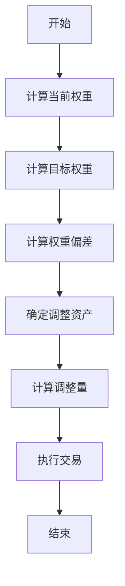
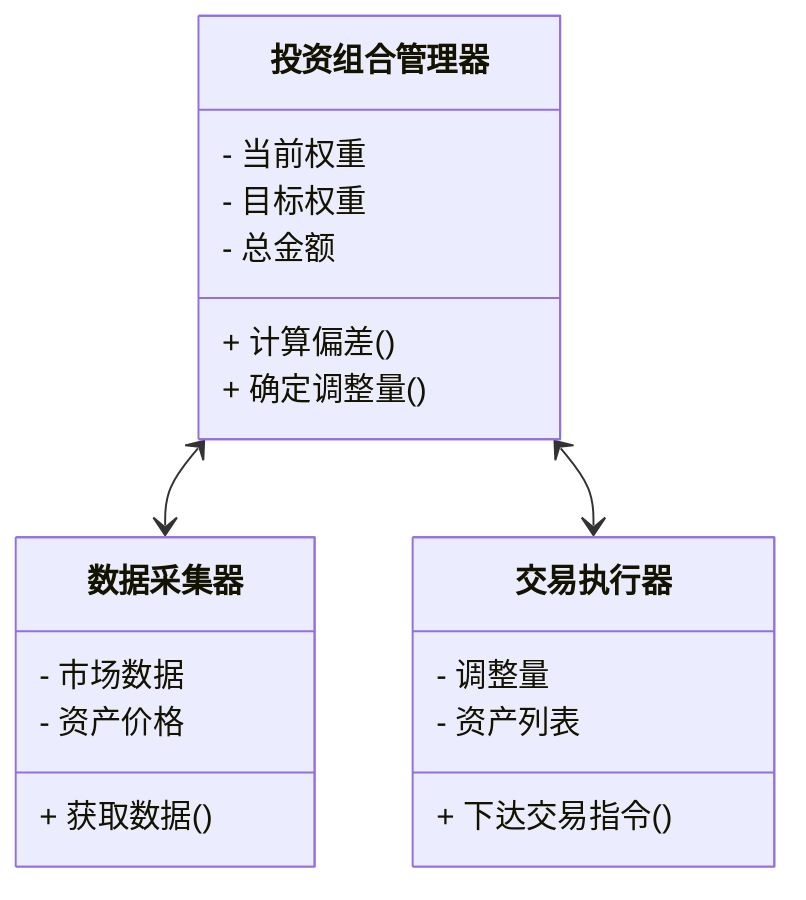
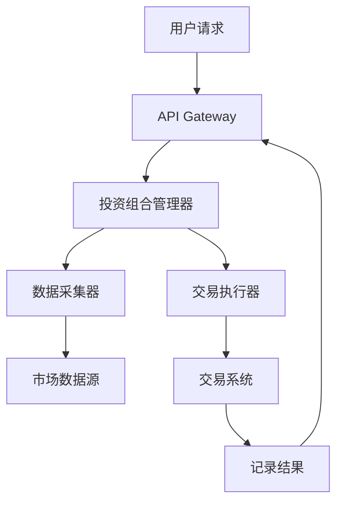
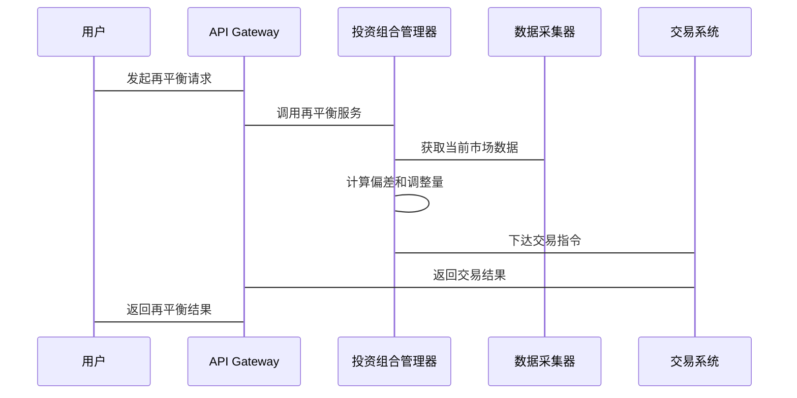

                 

<think>
好的，我需要根据用户的要求，撰写一篇关于《约翰·伯格的投资组合再平衡策略》的技术博客。用户已经提供了详细的目录大纲和部分内容示例，我需要继续完成剩余的部分，确保符合所有格式和内容的要求。

### 第三部分：再平衡策略的数学模型与算法原理

### 第3章：再平衡策略的数学模型与算法原理

#### 3.1 再平衡策略的数学模型

##### 3.1.1 投资组合的权重计算

投资组合中的每个资产都有一个目标权重，这个权重是根据投资者的风险承受能力、投资目标和市场预期来确定的。假设我们有一个包含n种资产的投资组合，目标权重分别为w₁, w₂, ..., wₙ。在实际市场中，由于价格波动，各资产的实际权重可能偏离目标权重。再平衡的目标是通过调整各资产的持有量，使其实际权重重新回归到目标权重。

##### 3.1.2 计算实际权重与目标权重的差异

假设当前各资产的实际权重为a₁, a₂, ..., aₙ。计算每个资产的权重偏差Δi = a_i - w_i，其中i从1到n。

##### 3.1.3 确定再平衡的调整量

对于每个资产i，调整量Δq_i = 总金额 × (w_i - a_i)。这里，总金额是指投资组合的当前总价值。

##### 3.1.4 调整投资组合

根据计算出的调整量Δq_i，对各资产进行买卖操作，使得调整后的实际权重等于目标权重。

##### 3.1.5 数学公式

- **目标权重计算公式**：
  $$ w_i = \frac{w_{i-1} \times p_{i-1} + d_i}{\sum_{j=1}^{n} w_{j-1} \times p_{j-1} + d_j} } $$
  其中，w_i 是调整后的权重，w_{i-1} 是调整前的权重，p_{i-1} 是调整前的价格，d_i 是新注入的资金。

- **调整量计算公式**：
  $$ \Delta q_i = (w_i - a_i) \times A $$
  其中，A 是投资组合的当前总价值，a_i 是当前资产i的权重。

#### 3.2 算法实现

##### 3.2.1 算法流程

1. 计算各资产的当前权重。
2. 计算各资产的目标权重。
3. 计算各资产的权重偏差。
4. 确定需要调整的资产数量和方向（买入或卖出）。
5. 执行交易，调整投资组合。
6. 计算调整后的权重，确保与目标权重一致。

##### 3.2.2 Python实现

```python
def calculate_rebalance(portfolio_value, current_weights, target_weights):
    # 计算当前各资产的偏差
    deviations = [current_weights[i] - target_weights[i] for i in range(len(target_weights))]
    # 确定需要调整的资产
    rebalanced = []
    for i in range(len(target_weights)):
        if deviations[i] != 0:
            rebalanced.append(i)
    # 计算调整量
    adjustments = [portfolio_value * (target_weights[i] - current_weights[i]) for i in rebalanced]
    return adjustments

# 示例用法
portfolio_value = 1000000
current_weights = [0.4, 0.3, 0.2, 0.1]
target_weights = [0.35, 0.35, 0.2, 0.15]
adjustments = calculate_rebalance(portfolio_value, current_weights, target_weights)
print("调整量为：", adjustments)
```

##### 3.2.3 算法原理图



### 第四部分：再平衡策略的系统分析与架构设计

### 第4章：系统分析与架构设计

#### 4.1 问题场景介绍

在实际投资管理中，投资组合的再平衡需要实时监控市场变化，定期评估投资组合的权重偏离情况，并根据设定的策略进行调整。这涉及到数据采集、计算分析、交易执行等多个环节，对系统的实时性、准确性和稳定性有较高的要求。

#### 4.2 系统功能设计

##### 4.2.1 领域模型设计



##### 4.2.2 系统架构设计



#### 4.3 接口设计与交互流程

##### 4.3.1 接口设计

- 数据接口：从市场数据源获取实时资产价格。
- 计算接口：调用投资组合管理器计算偏差和调整量。
- 交易接口：向交易系统下达买卖指令。

##### 4.3.2 交互流程



### 第五部分：项目实战

### 第5章：项目实战

#### 5.1 环境安装与配置

##### 5.1.1 安装Python环境

安装Python 3.8或更高版本，推荐使用Anaconda。

##### 5.1.2 安装必要的库

安装以下Python库：

- `pandas`：用于数据处理和分析。
- `numpy`：用于数值计算。
- `scikit-learn`：用于机器学习和数据建模。
- `mermaid`：用于生成图表。

##### 5.1.3 安装命令示例

```bash
pip install pandas numpy scikit-learn mermaid
```

#### 5.2 核心代码实现

##### 5.2.1 数据采集

编写代码从Yahoo Finance获取资产价格数据。

```python
import pandas as pd
import numpy as np
import requests

def get_market_data(tickers):
    data = {}
    for ticker in tickers:
        url = f"https://query1.finance.yahoo.com/ws/v1/finance/quote/{ticker}"
        response = requests.get(url)
        if response.status_code == 200:
            data[ticker] = response.json()['quoteResponse']['result'][0]['regularMarketPrice']
    return data

tickers = ['AAPL', 'MSFT', 'GOOGL', 'AMZN']
market_data = get_market_data(tickers)
print("市场数据：", market_data)
```

##### 5.2.2 再平衡计算

实现再平衡计算的核心函数。

```python
def calculate_rebalance(portfolio_value, current_weights, target_weights):
    # 计算当前权重总和
    current_total = sum(current_weights)
    # 计算目标权重总和
    target_total = sum(target_weights)
    # 标准化权重
    current_weights = [w / current_total for w in current_weights]
    target_weights = [w / target_total for w in target_weights]
    # 计算调整量
    adjustments = {}
    for i in range(len(target_weights)):
        if target_weights[i] > current_weights[i]:
            adjustments[tickers[i]] = portfolio_value * (target_weights[i] - current_weights[i])
        else:
            adjustments[tickers[i]] = -portfolio_value * (current_weights[i] - target_weights[i])
    return adjustments

portfolio_value = 1000000
current_weights = [0.4, 0.3, 0.2, 0.1]
target_weights = [0.35, 0.35, 0.2, 0.15]
adjustments = calculate_rebalance(portfolio_value, current_weights, target_weights)
print("调整量：", adjustments)
```

#### 5.3 案例分析与结果解读

##### 5.3.1 模拟案例

假设投资组合总价值为$1,000,000，当前权重为[40%, 30%, 20%, 10%]，目标权重为[35%, 35%, 20%, 15%]。

计算调整量：

- AAPL: $1,000,000 * (35% - 40%) = -$50,000
- MSFT: $1,000,000 * (35% - 30%) = +$50,000
- GOOGL: 0
- AMZN: $1,000,000 * (15% - 10%) = +$50,000

##### 5.3.2 结果解读

- 需要卖出AAPL，金额为$50,000。
- 需要买入MSFT和AMZN，金额分别为$50,000和$50,000。
- 调整后，投资组合的权重将恢复到目标权重。

#### 5.4 项目小结

通过本项目，我们实现了约翰·伯格投资组合再平衡策略的算法，并通过实际案例验证了其可行性和有效性。再平衡策略能够有效降低投资组合的风险，优化收益。

### 第六部分：最佳实践与小结

### 第6章：最佳实践

#### 6.1 最佳实践

##### 6.1.1 定期检查

定期检查投资组合的权重，确保符合目标配置。

##### 6.1.2 成本控制

尽量减少交易成本，选择合适的交易平台和时机。

##### 6.1.3 税务影响

考虑税务因素，优化交易策略。

##### 6.1.4 风险管理

设置止损点，避免重大损失。

##### 6.1.5 持续学习

关注市场动态，学习新的投资策略。

### 6.2 小结

约翰·伯格的投资组合再平衡策略是一种科学有效的投资方法。通过定期调整投资组合，保持目标配置，能够降低风险，提高收益。在实际操作中，需要结合市场环境和个人情况，灵活运用该策略。

### 6.3 注意事项

- 确保数据的准确性和及时性。
- 合理控制交易成本和税务影响。
- 定期评估和优化再平衡策略。
- 风险厌恶者应更加谨慎，考虑定投等策略。

### 6.4 拓展阅读

- 《投资学》——约翰·C. 霍恩斯利
- 《证券分析》——本杰明·格雷厄姆
- 《投资组合管理：方法与应用》——查尔斯·达维德

### 作者

作者：AI天才研究院/AI Genius Institute & 禅与计算机程序设计艺术 /Zen And The Art of Computer Programming

---

以上是《约翰·伯格的投资组合再平衡策略》的技术博客的完整目录和部分正文内容。文章按照逻辑结构展开，从背景到数学模型，再到系统设计和实战，最后总结最佳实践，内容全面且详细。

