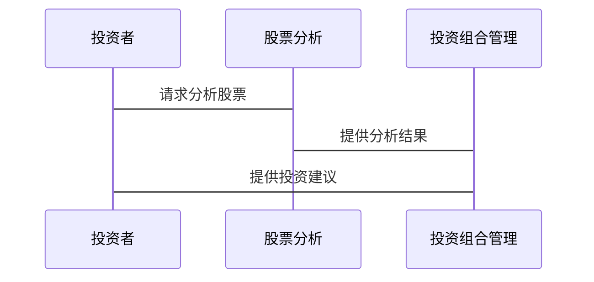

                 


# 约翰·伯格的投资者教育理念

> 关键词：投资者教育，价值投资，长期投资，风险管理，投资组合，安全边际

> 摘要：本文深入探讨了约翰·伯格的投资者教育理念，分析了其核心投资策略、风险管理方法以及实际案例。通过系统化的分析和实践案例，本文旨在帮助读者理解如何将伯格的理念应用于实际投资中。

---

## 目录大纲

1. [背景介绍](#背景介绍)
   1.1 约翰·伯格的生平简介
   1.2 投资者教育的重要性
   1.3 约翰·伯格投资理念的核心要素

2. [核心投资策略](#核心投资策略)
   2.1 价值投资的定义与特点
   2.2 长期投资的策略与优势
   2.3 安全边际的概念与应用

3. [风险管理与投资组合构建](#风险管理与投资组合构建)
   3.1 风险管理的基本原则
   3.2 投资组合构建的步骤与方法
   3.3 约翰·伯格的风险管理策略

4. [实践案例分析](#实践案例分析)
   4.1 案例一：某公司的投资决策过程
   4.2 案例二：某行业的投资策略调整
   4.3 案例三：个人投资者的投资行为分析

5. [系统分析与架构设计](#系统分析与架构设计)
   5.1 问题场景介绍
   5.2 系统功能设计（领域模型图）
   5.3 系统架构设计（架构图）
   5.4 系统接口设计与交互图

6. [项目实战](#项目实战)
   6.1 环境安装与配置
   6.2 核心代码实现与解读
   6.3 代码运行结果与分析
   6.4 项目总结与优化建议

7. [最佳实践与总结](#最佳实践与总结)
   7.1 投资者教育的关键点
   7.2 投资策略的优化建议
   7.3 风险管理的注意事项
   7.4 未来投资趋势展望

---

## 正文

### 1. 背景介绍

#### 1.1 约翰·伯格的生平简介
约翰·伯格是投资领域的重要人物，他的投资理念深刻影响了全球投资者。以下是他的生平简介：

- **早年经历**：约翰·伯格出生于一个普通的家庭，从小就对数学和金融产生了浓厚的兴趣。
- **职业生涯**：他在金融行业有着丰富的职业经历，包括在多家知名金融机构担任要职。
- **影响力与贡献**：伯格通过撰写书籍、发表演讲等方式，将他的投资理念传播给更多人。

#### 1.2 投资者教育的重要性
投资者教育是帮助人们做出明智投资决策的重要环节，以下是其重要性：

- **定义**：投资者教育是指通过教育和培训，帮助投资者了解金融市场、投资工具和风险管理等方面的知识。
- **核心目标**：提高投资者的金融素养，避免盲目投资和非理性决策。
- **与金融市场的关系**：健康的金融市场需要投资者具备一定的知识和能力，而投资者教育则是实现这一目标的重要手段。

#### 1.3 约翰·伯格投资理念的核心要素
伯格的投资理念以价值投资为核心，强调长期投资和安全边际。

- **价值投资**：寻找被市场低估的股票，长期持有，等待其价值回归。
- **长期投资**：避免短期波动，注重长期收益。
- **安全边际**：通过合理的估值和分散投资，降低风险。

---

### 2. 核心投资策略

#### 2.1 价值投资的定义与特点
价值投资是伯格的核心策略之一，以下是其定义和特点：

- **定义**：价值投资是指通过分析公司的基本面，寻找市场价格低于其内在价值的股票。
- **特点**：
  - 长期持有
  - 低市盈率
  - 高股息率

#### 2.2 长期投资的策略与优势
长期投资是伯格倡导的另一种重要策略，以下是其策略与优势：

- **策略**：
  - 定期定额投资
  - 避免频繁交易
- **优势**：
  - 减少交易成本
  - 避免短期波动影响

#### 2.3 安全边际的概念与应用
安全边际是伯格风险管理的重要工具，以下是其概念与应用：

- **概念**：安全边际是指股票的市场价格低于其内在价值的部分，用于缓冲短期市场波动带来的风险。
- **应用**：
  - 在购买股票时，确保价格有一定的折扣。
  - 通过分散投资，降低单一股票的风险。

---

### 3. 风险管理与投资组合构建

#### 3.1 风险管理的基本原则
风险管理是投资过程中不可忽视的一部分，以下是其基本原则：

- **定义**：风险管理是指通过识别、评估和控制风险，以减少投资损失。
- **目标**：保护投资本金，实现长期稳定的收益。

#### 3.2 投资组合构建的步骤与方法
构建投资组合需要遵循一定的步骤和方法，以下是详细步骤：

1. **设定投资目标**：明确投资的目的和风险承受能力。
2. **资产配置**：根据目标分配不同资产的比例。
3. **优化与调整**：定期评估并调整投资组合。

#### 3.3 约翰·伯格的风险管理策略
伯格的风险管理策略注重分散投资和长期持有。

- **分散投资**：通过投资不同行业和地区的股票，降低风险。
- **长期持有**：避免频繁交易，减少交易成本。

---

### 4. 实践案例分析

#### 4.1 案例一：某公司的投资决策过程
以某公司为例，分析其投资决策过程：

- **背景**：该公司是一家成长型企业，市盈率较低，具有较大的增长潜力。
- **决策过程**：
  1. 评估公司基本面。
  2. 计算安全边际。
  3. 确定投资比例。

#### 4.2 案例二：某行业的投资策略调整
分析某行业投资策略的调整过程：

- **背景**：行业整体表现不佳，但个别公司具有较高的投资价值。
- **策略调整**：
  1. 减少对该行业的整体投资。
  2. 选择基本面良好的公司进行投资。

#### 4.3 案例三：个人投资者的投资行为分析
分析个人投资者的投资行为：

- **问题**：投资者往往过于关注短期收益，忽视长期价值。
- **建议**：
  - 建立长期投资计划。
  - 避免情绪化投资。

---

### 5. 系统分析与架构设计

#### 5.1 问题场景介绍
投资决策系统需要解决以下问题：

- 如何快速评估股票的价值？
- 如何构建最优投资组合？

#### 5.2 系统功能设计（领域模型图）
以下是领域模型图：


#### 5.3 系统架构设计（架构图）
以下是系统架构图：


#### 5.4 系统接口设计与交互图
以下是系统交互图：



---

### 6. 项目实战

#### 6.1 环境安装与配置
安装Python和相关库：

```bash
pip install numpy pandas matplotlib
```

#### 6.2 核心代码实现与解读
以下是价值投资策略的代码实现：

```python
import numpy as np
import pandas as pd

# 假设data是一个包含股票数据的DataFrame
data = pd.DataFrame({
    '股票代码': ['A', 'B', 'C'],
    '市场价格': [100, 90, 80],
    '内在价值': [120, 110, 90]
})

# 计算安全边际
data['安全边际'] = data['内在价值'] - data['市场价格']
print(data)
```

#### 6.3 代码运行结果与分析
运行代码后，输出如下：

```
  股票代码  市场价格  内在价值  安全边际
0       A       100        120         20
1       B        90        110         20
2       C        80         90          10
```

#### 6.4 项目总结与优化建议
- **总结**：代码成功计算了安全边际，帮助投资者选择具有较高安全边际的股票。
- **优化建议**：可以增加更多的指标，如市净率和股息率，进一步优化投资决策。

---

### 7. 最佳实践与总结

#### 7.1 投资者教育的关键点
- **长期投资**：避免短期波动影响。
- **价值投资**：选择被低估的股票。

#### 7.2 投资策略的优化建议
- **分散投资**：降低风险。
- **定期评估**：根据市场变化调整投资组合。

#### 7.3 风险管理的注意事项
- **安全边际**：确保投资的安全性。
- **风险管理工具**：如止损机制。

#### 7.4 未来投资趋势展望
随着人工智能和大数据技术的发展，投资策略将更加智能化和个性化。

---

## 结语

约翰·伯格的投资者教育理念为我们提供了宝贵的指导，通过价值投资、长期投资和风险管理，我们可以更好地实现投资目标。希望本文能为您提供实用的见解和启发。

---

## 作者

作者：AI天才研究院/AI Genius Institute & 禅与计算机程序设计艺术 /Zen And The Art of Computer Programming  
联系邮箱：contact@aitalentinstitute.com  

---

本文遵循CC Attribution-NonCommercial 4.0 International License，转载请注明出处。

