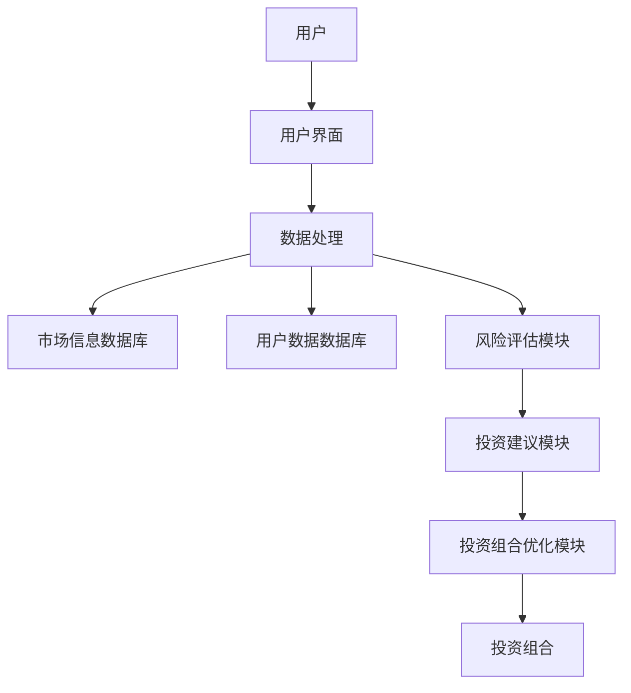
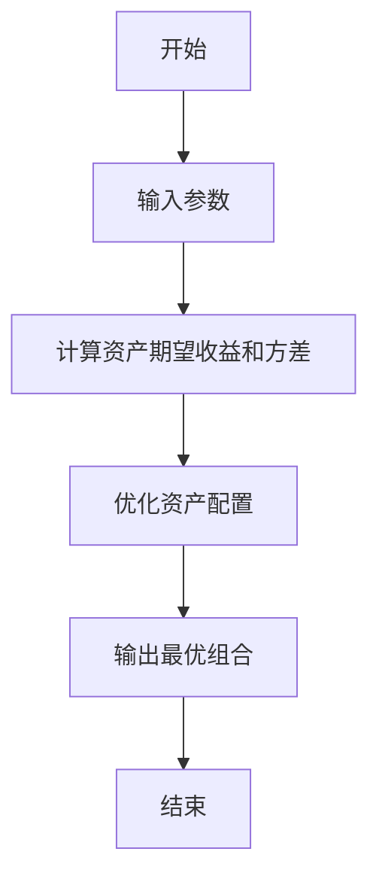
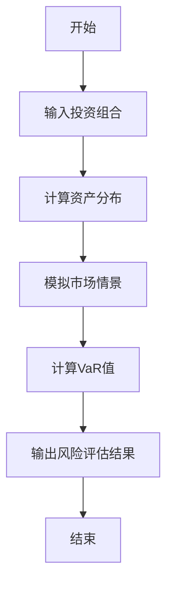

                 


# 《约翰·伯格的投资者教育：普及金融知识的重要性》

## 关键词：投资者教育，金融知识，投资策略，风险管理，约翰·伯格，指数投资，复利计算

## 摘要：  
本文围绕约翰·伯格的投资者教育理念，深入探讨了普及金融知识的重要性。通过系统性地讲解金融基础知识、投资策略、风险管理以及实际案例分析，帮助读者建立科学的投资理念和方法。文章结合数学模型、算法原理和系统架构设计，为读者提供了从理论到实践的全面指导。

---

## 第一章: 投资者教育的背景与意义

### 1.1 什么是投资者教育  
投资者教育是指通过系统化的方式，帮助投资者理解和掌握金融市场的基本知识、投资工具的使用方法以及风险管理的技巧。其核心目标是提升投资者的金融素养，使其能够做出理性的投资决策。  

#### 1.1.1 投资者教育的定义  
投资者教育是指通过教育和培训，帮助个人和机构投资者掌握必要的金融知识，理解投资市场的运作机制，从而做出明智的投资决策。  

#### 1.1.2 投资者教育的核心目标  
1. 提高投资者的金融素养。  
2. 帮助投资者理解投资市场的风险和收益关系。  
3. 培养长期投资的理念，避免短期投机行为。  

#### 1.1.3 投资者教育的必要性  
- 当前金融市场复杂性增加，投资者需要具备基本的金融知识才能应对市场波动。  
- 教育不足可能导致投资者盲目跟风，造成不必要的损失。  
- 长期投资需要科学的决策支持，而教育是实现这一目标的基础。  

### 1.2 投资者教育的现状与挑战  

#### 1.2.1 当前投资者的误区  
- 过度追求短期收益，忽视长期投资价值。  
- 对市场的风险认识不足，容易被市场波动影响。  
- 缺乏系统的金融知识，难以进行理性决策。  

#### 1.2.2 金融市场的复杂性  
- 股票、债券、基金等金融工具的多样性增加了投资者的理解难度。  
- 市场波动受宏观经济、政策变化等多重因素影响。  
- 信息爆炸时代，投资者需要具备筛选和分析信息的能力。  

#### 1.2.3 教育不足带来的风险  
- 投资者可能因为知识不足而做出错误的投资决策。  
- 盲目跟风可能导致资产损失。  
- 缺乏风险管理能力，容易在市场波动中遭受重大损失。  

### 1.3 投资者教育的重要性  

#### 1.3.1 提高投资决策的科学性  
- 通过系统教育，投资者能够更好地理解市场的运作机制。  
- 科学的投资决策需要基于对市场、资产和自身的全面了解。  

#### 1.3.2 避免盲目投资  
- 教育可以帮助投资者避免被市场炒作和虚假信息误导。  
- 帮助投资者建立合理的投资预期，避免过度乐观或悲观。  

#### 1.3.3 培养长期投资理念  
- 长期投资是实现财富增长的有效方式，而教育是实现这一目标的基础。  
- 通过教育，投资者能够理解复利的力量，避免短期波动的影响。  

---

## 第二章: 金融基础知识

### 2.1 财务报表基础  

#### 2.1.1 资产负债表  
- 资产负债表反映了企业在某一特定时点的财务状况。  
- 核心要素包括资产、负债和所有者权益。  

#### 2.1.2 利润表  
- 利润表反映了企业在一定会计期间的经营成果。  
- 核心要素包括收入、费用和利润。  

#### 2.1.3 现金流量表  
- 现金流量表反映了企业在一定会计期间内现金的流入和流出情况。  
- 包括经营活动、投资活动和筹资活动的现金流量。  

### 2.2 财务指标分析  

#### 2.2.1 市盈率  
- 市盈率（P/E）是衡量股票投资价值的重要指标。  
- 公式：$$P/E = \frac{\text{股价}}{\text{每股净利润}}$$  

#### 2.2.2 市净率  
- 市净率（P/B）是衡量股票价值的另一个重要指标。  
- 公式：$$P/B = \frac{\text{股价}}{\text{每股净资产}}$$  

#### 2.2.3 净资产收益率  
- 净资产收益率（ROE）是衡量企业盈利能力的重要指标。  
- 公式：$$ROE = \frac{\text{净利润}}{\text{净资产}}$$  

### 2.3 货币时间价值与复利  

#### 2.3.1 复利的计算公式  
- 复利计算公式：$$A = P \left(1 + \frac{r}{n}\right)^{nt}$$  
  - \(A\)：未来金额  
  - \(P\)：本金  
  - \(r\)：年利率  
  - \(n\)：每年的复利次数  
  - \(t\)：投资年数  

#### 2.3.2 货币的时间价值  
- 货币的时间价值是指货币在不同时间点的购买力差异。  
- 复利是货币时间价值的核心体现。  

#### 2.3.3 投资的未来价值计算  
- 通过复利公式，投资者可以估算出投资的未来价值。  
- 示例：假设本金为10000元，年利率为5%，投资期限为10年。  
  - 未来价值：$$A = 10000 \times (1 + 0.05)^{10} \approx 16288.95$$  

---

## 第三章: 投资策略与风险管理

### 3.1 投资策略的核心要素  

#### 3.1.1 投资目标的设定  

##### 3.1.1.1 投资目标的分类  
- 短期目标：如应急资金储备、短期理财目标。  
- 长期目标：如 retirement planning、财富积累。  

##### 3.1.1.2 投资目标的SMART原则  
- **具体性**：明确投资目标的具体内容。  
- **可衡量性**：设定可量化的财务目标。  
- **可实现性**：确保目标在合理的时间内可实现。  
- **相关性**：目标应与个人财务状况和风险承受能力相匹配。  
- **时间性**：设定明确的时间节点。  

#### 3.1.2 风险承受能力的评估  
- 风险承受能力是投资决策的重要依据。  
- 风险承受能力与年龄、收入、资产状况等因素密切相关。  

### 3.2 投资组合的构建  

#### 3.2.1 资产配置的重要性  
- 资产配置是投资组合的核心要素。  
- 通过合理配置不同资产类别，降低投资风险。  

#### 3.2.2 投资组合的再平衡  
- 定期调整投资组合，以维持既定的资产配置比例。  
- 再平衡有助于应对市场波动，优化投资收益。  

### 3.3 风险管理与控制  

#### 3.3.1 风险的来源  
- 市场风险：市场波动对资产价值的影响。  
- 利率风险：利率变化对债券等固定收益产品的影响。  
- 信用风险：债券发行人违约的风险。  
- 操作风险：投资决策失误或执行不当的风险。  

#### 3.3.2 风险管理的策略  
- **分散投资**：通过配置不同资产类别降低风险。  
- **止损策略**：设定止损点，避免重大损失。  
- **定期评估**：定期审视投资组合，及时调整风险管理策略。  

---

## 第四章: 投资者教育的系统架构与技术实现

### 4.1 投资者教育的系统架构设计  

#### 4.1.1 系统功能模块  
- **用户界面模块**：提供友好的用户交互界面。  
- **数据处理模块**：处理用户的投资数据和市场信息。  
- **风险评估模块**：评估用户的财务状况和风险承受能力。  
- **投资建议模块**：根据用户的财务状况和市场信息，提供个性化的投资建议。  

#### 4.1.2 系统架构图  



### 4.2 投资者教育的技术实现  

#### 4.2.1 系统核心算法  

##### 4.2.1.1 投资组合优化算法  
- 使用均值-方差优化模型，找到最优资产配置。  
- 算法流程图：



##### 4.2.1.2 风险评估算法  
- 使用VaR（Value at Risk）模型评估投资组合的风险。  
- 算法流程图：



### 4.3 项目实战：投资者教育系统实现  

#### 4.3.1 环境安装  
- 安装Python、Pandas、NumPy、Matplotlib等依赖库。  

#### 4.3.2 核心代码实现  

##### 4.3.2.1 资产配置优化  
```python
import numpy as np
import pandas as pd

def portfolio_optimization(returns, weights):
    # 计算协方差矩阵
    covariance = returns.cov()
    # 使用均值-方差优化模型
    from pypfolio import PyPortfolioLab
    p = PyPortfolioLab(returns, weights)
    p.solve()
    return p.portfolio()
```

##### 4.3.2.2 风险评估  
```python
import numpy as np
import pandas as pd

def calculate VaR(returns, confidence_level=0.95):
    returns_sorted = sorted(returns)
    var = returns_sorted[int(len(returns_sorted) * (1 - confidence_level))]
    return var
```

#### 4.3.3 功能解读  
- 资产配置优化：根据输入的收益和权重，计算最优资产配置。  
- 风险评估：使用VaR模型评估投资组合在不同置信水平下的风险。  

---

## 第五章: 总结与展望

### 5.1 总结  
- 投资者教育是提升投资决策能力的重要途径。  
- 通过系统化的金融知识学习，投资者可以更好地理解市场机制，制定科学的投资策略。  

### 5.2 展望  
- 随着金融科技的发展，投资者教育将更加智能化和个性化。  
- 未来，投资者可以通过人工智能技术获得更精准的投资建议和服务。  

### 5.3 最佳实践 Tips  
- 定期审视投资组合，及时调整资产配置。  
- 避免盲目跟风，坚持长期投资理念。  
- 学习和应用风险管理工具，降低投资风险。  

---

## 作者：AI天才研究院/AI Genius Institute & 禅与计算机程序设计艺术 /Zen And The Art of Computer Programming

