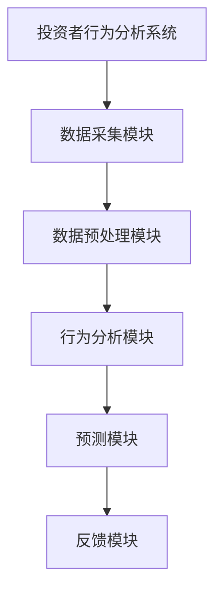

                 


# 约翰·伯格的投资者行为学观点

> 关键词：投资者行为学，约翰·伯格，认知偏差，市场情绪，行为矫正，行为金融学

> 摘要：本文深入探讨了约翰·伯格在投资者行为学领域的观点，分析了投资者的心理、决策过程、行为偏差及其对市场的影响，并结合行为金融学进行详细解读，最后提出了行为矫正策略和实际应用案例。

---

## 第一部分：投资者行为学背景与核心概念

### 第1章：投资者行为学概述

#### 1.1 投资者行为学的定义与研究对象

- **投资者行为学的定义**：研究投资者在不同市场环境中的决策过程、心理活动及其对市场行为影响的学科。
- **研究对象**：投资者的决策、心理、情绪及其对市场价格和波动的影响。
- **与传统金融学的区别**：传统金融学基于理性假设，而投资者行为学关注非理性因素对投资决策的影响。

#### 1.2 约翰·伯格的投资者行为学观点

- **学术背景与贡献**：伯格是行为金融学的先驱，其研究揭示了投资者心理偏差对市场的影响。
- **核心观点**：
  - 投资者决策受认知偏差和情绪影响。
  - 市场价格波动与投资者行为密切相关。
- **实际应用**：伯格的观点被广泛应用于投资策略和风险管理。

#### 1.3 投资者行为学的研究方法

- **定量研究**：通过数据分析揭示投资者行为模式。
- **定性研究**：通过访谈和观察分析投资者心理。
- **实验法与观察法**：在实验室或真实市场环境中测试投资者行为。

### 第2章：投资者心理与决策过程

#### 2.1 投资者心理特征

- **风险偏好**：不同投资者对风险的承受能力不同，影响投资决策。
- **时间偏好**：投资者对收益时间的偏好影响投资选择。
- **个体差异**：性格、经验等因素影响投资者的心理和决策。

#### 2.2 投资者认知偏差

- **确认偏差**：投资者倾向于寻找支持自己观点的信息，忽视反面证据。
- **过度自信偏差**：投资者往往高估自己的判断能力。
- **代表性偏差**：基于有限信息对投资对象进行刻板印象化判断。

#### 2.3 投资者情绪与行为

- **情绪对决策的影响**：贪婪和恐惧主导市场情绪，引发非理性决策。
- **市场情绪周期**：从乐观到恐慌再到乐观的循环。
- **从众行为**：投资者跟随市场趋势，忽视独立分析。

#### 2.4 伯格观点的分析

- **对认知偏差的研究**：伯格强调认知偏差对投资决策的影响。
- **情绪与行为的关系**：伯格指出情绪波动如何影响市场走势。

---

## 第二部分：投资者行为与市场反应

### 第3章：投资者行为对市场价格的影响

#### 3.1 市场参与者的行为特征

- **非理性行为**：投资者的非理性行为导致市场价格波动。
- **市场参与者的互动**：投资者行为相互影响，放大市场波动。

#### 3.2 行为分析模型

- **基于行为学的预测模型**：通过分析投资者心理预测市场走势。
- **伯格行为分析模型**：结合认知偏差和情绪因素构建模型。

#### 3.3 实际案例分析

- **科技股泡沫案例**：投资者过度乐观导致价格虚高。
- **2008年金融危机**：恐慌情绪引发市场崩盘。

### 第4章：投资者决策偏差与行为矫正

#### 4.1 常见决策偏差

- **过度交易偏差**：频繁交易增加成本并降低收益。
- **从众偏差**：盲目跟随市场趋势，忽视独立判断。

#### 4.2 伯格观点的行为矫正启示

- **理性决策的强调**：伯格建议投资者保持冷静，避免情绪驱动决策。
- **建立决策框架**：通过系统化方法减少偏差影响。

#### 4.3 行为矫正策略

- **提高自我认知**：识别和纠正认知偏差。
- **采用逆向思维**：在市场恐慌时寻找机会，乐观时保持警惕。

---

## 第三部分：行为金融学与伯格观点的结合

### 第5章：行为金融学的核心理论

#### 5.1 行为金融学的核心理论

- **基于行为学的金融理论**：结合心理学和经济学，解释市场现象。
- **传统与行为金融学对比**：传统假设理性，行为学强调非理性因素。

#### 5.2 伯格观点在行为金融学中的地位

- **贡献**：伯格的研究为行为金融学奠定了基础。
- **应用**：伯格的观点广泛应用于金融模型和投资策略。

#### 5.3 行为金融学的实际应用

- **投资策略**：基于行为分析调整投资组合。
- **风险管理**：识别市场情绪变化，防范系统性风险。

---

## 第四部分：项目实战与系统分析

### 第6章：系统分析与架构设计

#### 6.1 系统功能设计

- **领域模型**：投资者行为分析模型，包括认知偏差、情绪指标等。
- **系统架构**：模块化设计，数据采集、分析、预测和反馈。

#### 6.2 系统架构图



### 第7章：项目实战

#### 7.1 环境安装

- **工具安装**：安装Python、Pandas、Matplotlib等工具。
- **数据源**：获取历史市场数据和投资者行为数据。

#### 7.2 核心实现源代码

```python
import pandas as pd
import numpy as np
import matplotlib.pyplot as plt

# 数据加载
data = pd.read_csv('market_data.csv')

# 计算情绪指数
def calculate_sentiment(data):
    sentiment = []
    for price in data['price']:
        if price > data['price'].mean():
            sentiment.append(1)
        else:
            sentiment.append(0)
    return sentiment

# 情绪分析结果
sentiment = calculate_sentiment(data)

# 可视化
plt.plot(data['date'], sentiment)
plt.xlabel('Date')
plt.ylabel('Sentiment')
plt.show()
```

---

## 第五部分：总结与展望

### 第8章：总结

- **核心观点**：投资者行为受心理和情绪影响，伯格的观点提供了行为分析的框架。
- **实际应用**：通过行为矫正和系统分析提升投资决策的科学性。

### 第9章：展望

- **未来研究方向**：结合人工智能和大数据，深入分析投资者行为。
- **拓展阅读**：推荐相关书籍和研究论文。

---

作者：AI天才研究院 & 禅与计算机程序设计艺术

---

通过以上结构，文章详细探讨了约翰·伯格的投资者行为学观点，结合理论分析和实际案例，为投资者提供了深刻的洞见和实用的策略。

