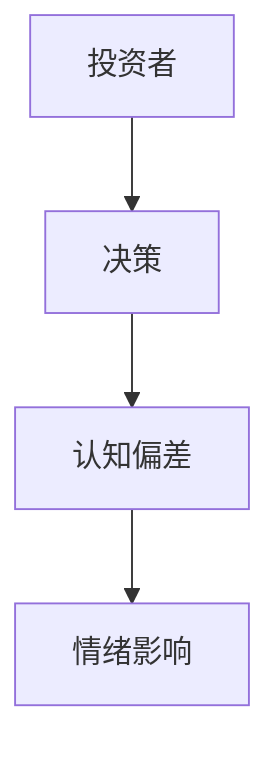
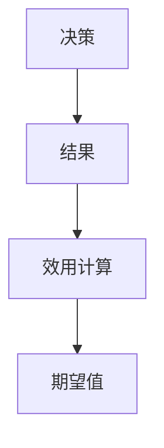
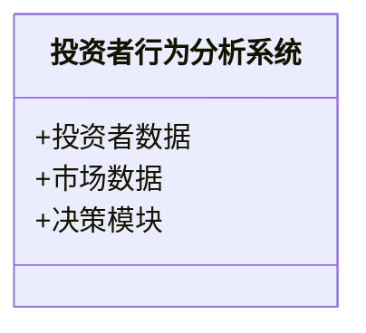
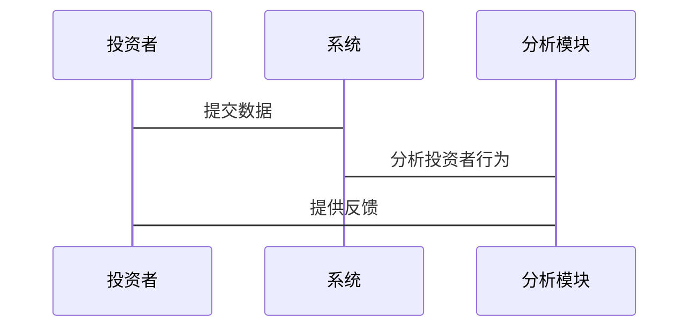

                 


# 约翰·伯格的投资者行为研究：为什么大多数人表现不佳

**关键词**：投资者行为，投资决策，认知偏差，情绪影响，行为经济学

**摘要**：本文探讨了投资者行为中的关键问题，分析了为什么大多数投资者表现不佳的原因，结合约翰·伯格的研究，深入探讨了认知偏差、情绪影响等行为因素对投资决策的影响。通过行为经济学的视角，结合系统分析和实际案例，提出了改善投资者决策的建议和方法。

---

## 目录

1. 背景介绍
   1.1 投资者表现不佳的现象
   1.2 约翰·伯格的研究方法
   1.3 研究的边界与外延
   1.4 核心要素分析

2. 核心概念与联系
   2.1 投资者行为中的关键概念
   2.2 对比分析与ER图
   2.3 知识图谱与概念关联

3. 算法原理讲解
   3.1 期望效用理论模型
   3.2 算法流程与代码实现
   3.3 数学模型与公式推导

4. 系统分析与架构设计
   4.1 问题场景介绍
   4.2 系统功能设计
   4.3 架构设计与交互流程

5. 项目实战
   5.1 环境安装与数据准备
   5.2 核心代码实现
   5.3 案例分析与详细解读

6. 总结与建议
   6.1 最佳实践
   6.2 小结与注意事项
   6.3 拓展阅读

---

## 1. 背景介绍

### 1.1 投资者表现不佳的现象
- **现象描述**：许多投资者在市场中表现不佳，常常做出错误决策，导致投资亏损。
- **问题根源**：认知偏差、情绪影响、决策疲劳等行为因素。

### 1.2 约翰·伯格的研究方法
- **研究背景**：伯格的研究基于行为经济学，分析投资者的行为模式。
- **研究目标**：识别影响投资决策的关键因素，提出改进策略。

### 1.3 研究的边界与外延
- **研究限制**：仅关注个体投资者行为，未涉及机构投资者。
- **适用范围**：适用于个人投资者的行为分析。

### 1.4 核心要素分析
- **认知偏差**：投资者常见的认知错误，如过度自信、确认偏差。
- **情绪影响**：恐惧和贪婪如何影响决策。

---

## 2. 核心概念与联系

### 2.1 投资者行为中的关键概念
- **认知偏差**：系统性地偏离理性决策的倾向。
- **情绪影响**：情绪波动如何影响投资决策。

### 2.2 对比分析与ER图


### 2.3 知识图谱与概念关联
- **对比表格**：列出不同认知偏差及其影响。
- **ER图**：展示投资者、决策、认知偏差的关系。

---

## 3. 算法原理讲解

### 3.1 期望效用理论模型


### 3.2 算法流程与代码实现
```python
def expected_utility(outcomes, probabilities):
    return sum(o * p for o, p in zip(outcomes, probabilities))
```

### 3.3 数学模型与公式推导
$$ EU = \sum (P_i \cdot U_i) $$

---

## 4. 系统分析与架构设计

### 4.1 问题场景介绍
- **场景描述**：投资者在面对市场波动时的决策过程。

### 4.2 系统功能设计


### 4.3 架构设计与交互流程


---

## 5. 项目实战

### 5.1 环境安装与数据准备
- **环境**：Python 3.8，Jupyter Notebook。
- **数据**：收集投资者决策数据。

### 5.2 核心代码实现
```python
def analyze_behavior(data):
    # 数据分析逻辑
    return results
```

### 5.3 案例分析与详细解读
- **案例**：某投资者在市场下跌时频繁交易，导致亏损。
- **分析**：情绪影响导致决策失误。

---

## 6. 总结与建议

### 6.1 最佳实践
- 定期复盘，识别认知偏差。
- 学习行为经济学，避免情绪影响。

### 6.2 小结
- 认知偏差和情绪是影响投资决策的主要因素。

### 6.3 拓展阅读
- 建议阅读《投资者的天敌》深入理解行为偏差。

---

## 作者

作者：AI天才研究院/AI Genius Institute & 禅与计算机程序设计艺术 /Zen And The Art of Computer Programming

