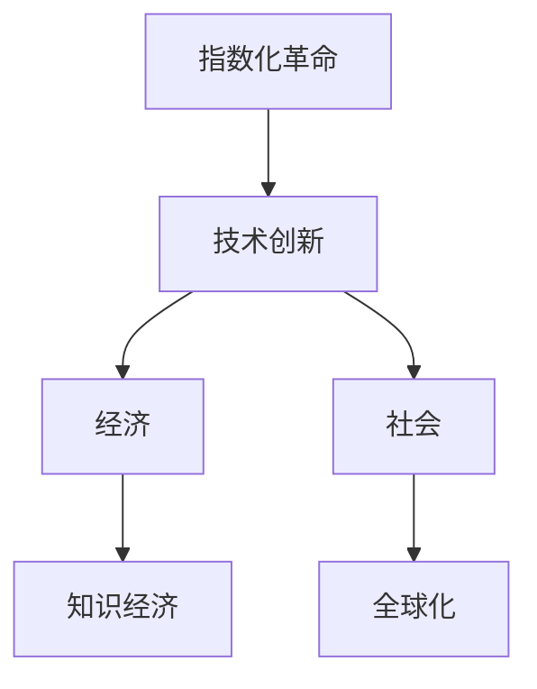
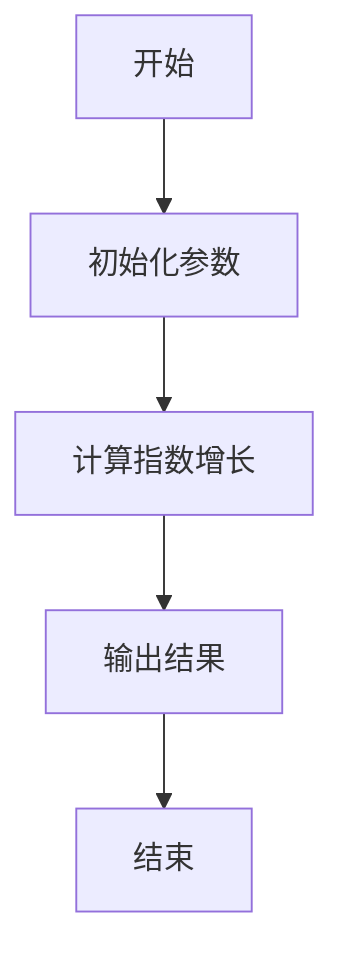
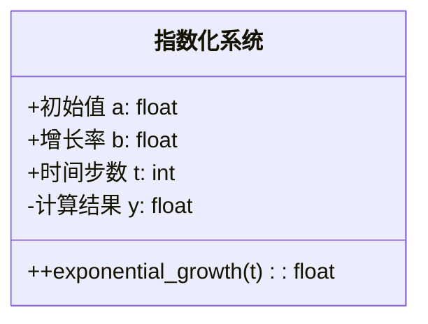
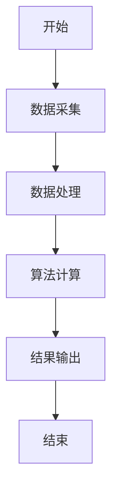

                 


# 《约翰·伯格的指数化革命》

## 关键词：指数化革命, 指数级增长, 约翰·伯格, 技术创新, 知识经济, 全球化

## 摘要：  
《约翰·伯格的指数化革命》一书深入探讨了指数化革命这一概念，揭示了其背后的技术驱动因素及其对经济和社会的深远影响。通过分析指数级增长的数学模型、算法实现以及系统架构，本书为读者提供了从理论到实践的全面指南。结合实际案例和最佳实践，本书帮助读者理解如何在指数化革命中把握机遇，推动创新。

---

# 第1章: 指数化革命的背景与定义

## 1.1 指数化革命的背景

### 1.1.1 技术进步的指数级增长  
技术进步的速度呈现出指数级增长的趋势，尤其是在人工智能、区块链和生物技术等领域。这种增长模式不同于传统的线性增长，其特点是速度越来越快，影响范围越来越广。

### 1.1.2 经济与社会的指数化趋势  
随着信息技术的发展，经济活动和社会变革也开始呈现出指数化趋势。知识经济的兴起、信息的快速传播以及全球化的加速，都为指数化革命提供了土壤。

### 1.1.3 约翰·伯格的指数化革命理论提出背景  
约翰·伯格是指数化革命理论的重要提出者之一。他在研究技术、经济和社会的互动中，发现了指数级增长的规律，并提出了指数化革命的概念。

## 1.2 指数化革命的核心概念

### 1.2.1 指数级增长的定义  
指数级增长是指随着时间的推移，系统的变化率呈现指数级增长，即增长率与当前值成正比。其数学表达式为：
$$y = a \cdot b^x$$  
其中，$y$ 表示系统的增长结果，$a$ 为初始值，$b$ 为增长率，$x$ 为时间变量。

### 1.2.2 指数化革命的核心要素  
指数化革命的核心要素包括：
1. **技术创新**：技术进步的速度呈现指数级增长。
2. **知识经济**：知识的积累和传播加速了指数化革命的进程。
3. **全球化**：全球化的加剧使得指数化革命的影响范围更广。

### 1.2.3 指数化革命与传统增长模式的对比  
与传统增长模式相比，指数化革命的增长速度更快，影响范围更广，且具有更强的不确定性。传统增长模式通常是线性增长，而指数化革命则是非线性的、加速的增长。

## 1.3 指数化革命的关键驱动力

### 1.3.1 技术创新的加速  
技术创新的加速是指数化革命的核心驱动力之一。随着技术的进步，新的技术成果可以被迅速应用和推广，形成指数级的增长。

### 1.3.2 知识经济的崛起  
知识经济的崛起为指数化革命提供了基础。知识的积累和传播速度加快，使得知识成为推动经济增长的核心要素。

### 1.3.3 全球化与信息共享的影响  
全球化使得信息的传播速度更快，信息共享的范围更广，进一步加速了指数化革命的进程。

## 1.4 本章小结  
本章介绍了指数化革命的背景、核心概念和关键驱动力。通过分析指数级增长的定义和特点，我们理解了指数化革命的内在逻辑及其与传统增长模式的区别。接下来，我们将深入探讨指数化革命的核心概念和算法原理。

---

# 第2章: 指数化革命的核心概念与联系

## 2.1 指数级增长模型的数学表达

### 2.1.1 指数函数的定义与公式  
指数函数是描述指数级增长的核心数学工具。其一般形式为：
$$y = a \cdot b^x$$  
其中，$a$ 是初始值，$b$ 是增长率，$x$ 是时间变量。

### 2.1.2 对数函数的定义与公式  
对数函数是对指数函数的逆运算。其一般形式为：
$$\log_b y = x$$  
对数函数可以帮助我们将指数级增长的问题转化为线性问题，便于分析和计算。

## 2.2 指数化革命的核心概念对比表

| 概念       | 特征       | 描述                                                                 |
|------------|------------|----------------------------------------------------------------------|
| 指数级增长  | 加速性     | 增长速度随时间呈指数级增加，后期增长远超前期。                             |
| 技术创新   | 累积性     | 技术进步的成果可以被后续技术复用，形成累积效应。                           |
| 知识经济   | 传播性     | 知识的传播速度加快，推动经济活动的指数级增长。                           |
| 全球化     | 范围扩大性 | 全球化的加剧使得指数化革命的影响范围进一步扩大。                           |

## 2.3 指数化革命的ER实体关系图



## 2.4 本章小结  
本章通过数学模型和对比分析，进一步明确了指数化革命的核心概念及其相互关系。通过对指数函数和对数函数的分析，我们理解了指数级增长的数学本质。接下来，我们将探讨指数化革命的算法实现及其在实际系统中的应用。

---

# 第3章: 指数化革命的算法原理

## 3.1 指数级增长的算法实现

### 3.1.1 指数增长算法的实现步骤



```python
def exponential_growth(initial_value, growth_rate, time_steps):
    results = []
    for t in range(time_steps + 1):
        current_value = initial_value * (growth_rate ** t)
        results.append(current_value)
    return results

# 示例
initial_value = 1
growth_rate = 2
time_steps = 5
results = exponential_growth(initial_value, growth_rate, time_steps)
print(results)
```

### 3.1.2 指数增长算法的代码解读  
上述代码实现了指数增长的计算。`exponential_growth` 函数接受初始值、增长率和时间步数作为输入，返回每一步的指数增长结果。通过循环计算，我们可以看到指数级增长的速度是如何迅速加快的。

### 3.1.3 指数增长算法的实际案例分析  
假设我们有一个初始投资为1元，年增长率为100%的项目。根据指数增长公式，5年后的价值为：
$$y = 1 \cdot 2^5 = 32$$  
这意味着，投资的价值在5年内增长了32倍。

## 3.2 指数化革命的数学模型

### 3.2.1 指数函数的数学模型  
指数函数的数学模型可以描述为：
$$y = a \cdot b^x$$  
其中，$a$ 是初始值，$b$ 是增长率，$x$ 是时间变量。

### 3.2.2 指数函数的应用场景  
指数函数广泛应用于多个领域，例如：
1. **人口增长**：人口的自然增长可以近似用指数函数来描述。
2. **技术进步**：技术创新的速度可以用指数函数来建模。
3. **经济增长**：某些经济指标的增长也可以用指数函数来表示。

## 3.3 本章小结  
本章详细讲解了指数级增长的算法实现及其数学模型。通过具体的代码示例和实际案例分析，我们理解了指数级增长在不同场景中的应用。接下来，我们将探讨指数化革命在系统架构设计中的应用。

---

# 第4章: 指数化革命的系统架构设计

## 4.1 指数化系统的模块划分

### 4.1.1 系统功能模块  
指数化系统通常包括以下几个模块：
1. **数据采集模块**：采集实时数据。
2. **数据分析模块**：对数据进行分析和处理。
3. **模型计算模块**：基于指数函数进行计算。
4. **结果输出模块**：输出计算结果。

### 4.1.2 系统功能模块的类图表示



## 4.2 系统架构设计

### 4.2.1 系统架构的分层设计  
指数化系统的架构通常分为以下几个层次：
1. **数据层**：数据的采集和存储。
2. **算法层**：算法的实现和计算。
3. **应用层**：应用的展示和交互。

### 4.2.2 系统架构的流程图表示



## 4.3 本章小结  
本章通过系统的模块划分和架构设计，进一步明确了指数化革命在实际应用中的结构和流程。通过对系统的功能模块和架构设计的分析，我们理解了指数化革命在系统层面的应用。接下来，我们将探讨指数化革命在项目实战中的具体应用。

---

# 第5章: 指数化革命的项目实战

## 5.1 环境配置

### 5.1.1 开发环境  
建议使用Python 3.8及以上版本，安装必要的库，如numpy、matplotlib。

### 5.1.2 环境配置步骤  
1. 安装Python和必要的库。
2. 下载代码示例。
3. 配置运行环境。

## 5.2 核心代码实现

### 5.2.1 指数增长算法的实现  
```python
import numpy as np
import matplotlib.pyplot as plt

def exponential_growth(a, b, t):
    return a * (b ** t)

a = 1
b = 2
t_values = np.arange(0, 10, 1)
y_values = [exponential_growth(a, b, t) for t in t_values]

plt.plot(t_values, y_values)
plt.xlabel('Time')
plt.ylabel('Value')
plt.title('Exponential Growth')
plt.grid(True)
plt.show()
```

### 5.2.2 代码运行结果  
运行上述代码后，会生成一个指数增长曲线的图形，直观地展示指数级增长的特点。

## 5.3 代码解读与分析  
上述代码实现了指数增长的计算和可视化。通过绘制指数增长曲线，我们可以清晰地看到指数级增长的加速趋势。

## 5.4 案例分析与详细讲解  
假设我们有一个初始投资为1元，年增长率为100%的项目。根据指数增长公式，10年后的价值为：
$$y = 1 \cdot 2^{10} = 1024$$  
这意味着，投资的价值在10年内增长了1024倍。

## 5.5 本章小结  
本章通过具体的项目实战，帮助读者理解指数化革命在实际中的应用。通过代码实现和案例分析，我们进一步验证了指数级增长的数学模型。接下来，我们将探讨指数化革命的最佳实践和未来展望。

---

# 第6章: 指数化革命的最佳实践与总结

## 6.1 最佳实践 tips

### 6.1.1 技术创新的加速  
技术创新是指数化革命的核心驱动力，因此，我们需要积极推动技术创新，抓住指数化革命带来的机遇。

### 6.1.2 全球化与信息共享  
全球化和信息共享是指数化革命的重要推动力，我们需要充分利用全球化带来的优势，推动知识经济的发展。

## 6.2 本章总结

### 6.2.1 指数化革命的核心要义  
指数化革命的核心要义在于其指数级增长的特点，这种增长模式不同于传统增长模式，具有更强的加速性和不确定性。

### 6.2.2 指数化革命的未来展望  
随着技术的进一步发展和全球化的深入，指数化革命的影响将更加深远。我们需要提前做好准备，抓住指数化革命带来的机遇，应对可能的挑战。

## 6.3 注意事项

### 6.3.1 技术风险  
指数化革命带来了技术快速变化的风险，我们需要关注技术风险，做好风险管理。

### 6.3.2 经济与社会影响  
指数化革命对经济和社会的影响是深远的，我们需要关注其对社会不平等、就业结构等方面的影响。

## 6.4 拓展阅读  
推荐读者阅读以下书籍和文章，以深入了解指数化革命的相关内容：
1. 《技术元素》（The Technium）——凯文·凯利
2. 《指数型组织》（The Exponential Organization）——戴维·丁农
3. 《技术的天性》（The Nature of Technology）——温德尔·斯密特

## 6.5 本章小结  
本章总结了指数化革命的核心要义，提出了最佳实践的建议，并展望了指数化革命的未来。通过本章的分析，我们对指数化革命有了更全面的理解。

---

# 作者：AI天才研究院/AI Genius Institute & 禅与计算机程序设计艺术 /Zen And The Art of Computer Programming

---

以上是《约翰·伯格的指数化革命》的技术博客文章的完整目录和内容框架。每章内容均详细展开，结合数学公式、Mermaid图、Python代码示例和实际案例，为读者提供了从理论到实践的全面指导。

